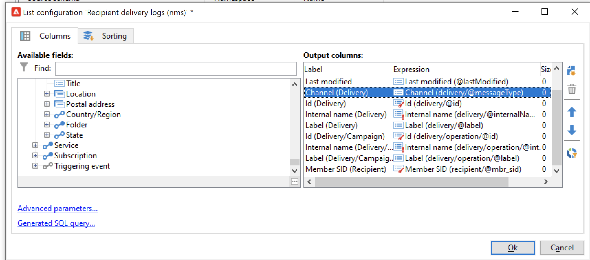
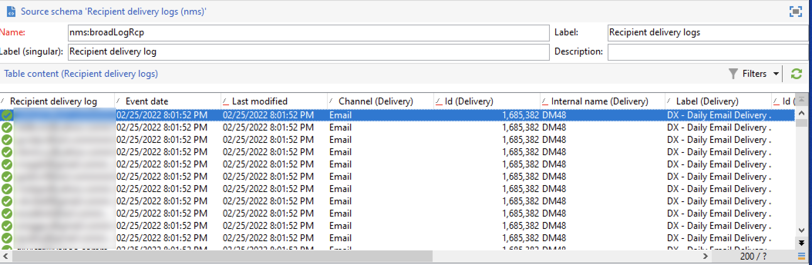

# Adobe Campaign Managed Cloud Services

Adobe Campaign Managed Cloud Services bietet eine verwaltete Plattform für die Gestaltung kanalübergreifender Kundenerlebnisse, die die visuelle Kampagnenorchestrierung, die Echtzeit-Interaktionsverwaltung und die kanalübergreifende Ausführung unterstützt. Weitere Informationen finden Sie in der Dokumentation zu [Adobe Campaign v8](https://experienceleague.adobe.com/docs/campaign/campaign-v8/campaign-home.html?lang=de).

Mit dem Adobe Campaign Managed Cloud Services-Quell-Connector können Sie Versand- und Trackinglog-Daten aus Adobe Campaign v8 in Adobe Experience Platform aufnehmen. Dieser Connector fungiert als Batch-Quelle innerhalb von Platform.

## Voraussetzungen

Bevor Sie eine Quellverbindung erstellen können, um Ihre Campaign v8-Version nach Experience Platform zu bringen, müssen Sie zunächst die folgenden Voraussetzungen erfüllen:

* [Einrichten des Ereignisprotokollimports mithilfe der Adobe Campaign-Client-Konsole](#view-delivery-and-tracking-log-data)
* [Erstellen eines XDM-ExperienceEvent-Schemas](#create-a-schema)
* [Erstellen eines Datensatzes](#create-a-dataset)

### Versand- und Trackinglog-Daten anzeigen {#view-delivery-and-tracking-log-data}

>[!IMPORTANT]
>
>Sie müssen Zugriff auf die Client-Konsole von Adobe Campaign v8 haben, um Ihre Protokolldaten in Campaign anzeigen zu können. In der [Campaign v8-Dokumentation](https://experienceleague.adobe.com/docs/campaign/campaign-v8/deploy/connect.html) finden Sie Informationen zum Herunterladen und Installieren der Client-Konsole.

Melden Sie sich über die Client-Konsole bei Ihrer Campaign v8-Instanz an. Wählen Sie auf der Registerkarte [!DNL Explorer] die Option [!DNL Administration] und dann [!DNL Configuration] aus. Wählen Sie als Nächstes [!DNL Data schemas] aus und wenden Sie dann den `broadLog` auf Namen oder Titel an. Wählen Sie in der angezeigten Liste das Quellschema der Empfänger-Versandlogs mit dem Namen `broadLogRcp` aus.

Wählen Sie als Nächstes die **Daten** aus.

Klicken/klicken Sie mit der rechten Maustaste im Datenbedienfeld, um das Kontextmenü zu öffnen. Wählen Sie hier **Liste konfigurieren…**

Das Listenkonfigurationsfenster wird angezeigt und bietet eine Oberfläche, über die Sie beliebige Felder zu der bereits vorhandenen Liste hinzufügen können, um die Daten im Datenbereich anzuzeigen.

Jetzt können Sie die Versand-Logs Ihrer Empfänger einschließlich der im vorherigen Schritt hinzugefügten Konfigurationsfelder anzeigen.

>[!TIP]
>
>Sie können dieselben Schritte wiederholen, aber nach `tracking` filtern, um Ihre Trackinglog-Daten anzuzeigen.

### Erstellen eines Schemas {#create-a-schema}

Als Nächstes erstellen Sie ein XDM ExperienceEvent-Schema für Versandlogs und Trackinglogs. Sie müssen die Feldergruppe Versandlogs in Campaign auf Ihr Versandlog-Schema und die Feldergruppe Tracking-Logs in Campaign auf Ihr Trackinglog-Schema anwenden. Sie müssen auch das Feld `externalID` als primäre Identität Ihres Schemas definieren.

>[!NOTE]
>
>Ihr XDM ExperienceEvent-Schema muss Profil-aktiviert sein, damit Sie Ihre Campaign-Daten in [!DNL Real-Time Customer Profile] aufnehmen können.

Detaillierte Anweisungen zum Erstellen eines Schemas finden Sie im Handbuch unter [Erstellen eines XDM-Schemas in der Benutzeroberfläche](../../../xdm/tutorials/create-schema-ui.md).

### Erstellen eines Datensatzes {#create-a-dataset}

Schließlich müssen Sie einen Datensatz für Ihre Schemata erstellen. Detaillierte Anweisungen zum Erstellen eines Datensatzes finden Sie im Handbuch unter [Erstellen eines Datensatzes in der Benutzeroberfläche](../../../catalog/datasets/user-guide.md).

## Erwartete Latenz für Adobe Campaign Managed Cloud Services-Quelle {#latency}

Die End-to-End-Latenz von einem Kampagnenereignis bis zur Datenverfügbarkeit in Experience Platform beträgt in der Regel in Standardkonfigurationen 15 bis 30 Minuten (einschließlich 15-minütiger Replikation, Export in Mikro-Batches und einem geplanten Experience Platform-Datenfluss), wobei von normalen Datenvolumen und keinem Rückstand ausgegangen wird. Dies ist ein nahezu in Echtzeit ablaufender Prozess, der durch geplante Synchronisierung von Mikro-Batches erreicht wird (in der Regel in der Größenordnung von zehn Minuten). Es handelt sich jedoch nicht um kontinuierliches Streaming.

| Szenario | Details | Erwartete Latenz |
| --- | --- | --- |
| Das Campaign-Ereignis wird in einer Mid-Sourcing-/Message-Center-Instanz generiert. | Ein Versand- oder Tracking-Ereignis (Senden, Öffnen, Klicken usw.) tritt auf einem Campaign v8-Ausführungsknoten (Mid/Message Center) auf. | Echtzeit innerhalb der Campaign-Laufzeit (derzeit in Experience Platform nicht sichtbar). |
| Replikation von der Laufzeit in die Marketing-Datenbank von Campaign | Ereignisdaten werden vom Mid/Message Center in die Marketing-Datenbank von Campaign repliziert ([!DNL Snowflake] oder [!DNL Postgres], je nach Kundengröße). Standardmäßige Integrationsmuster gehen von einem regulären Replikationsauftrag aus. | ~15 Minuten, basierend auf der standardmäßigen 15-minütigen Replikationskadenz. |
| Export aus der Marketing-Datenbank von Campaign in die Landing Zone (z. B. [!DNL Data Landing Zone], [!DNL Amazon S3] oder [!DNL Azure Blob]) | Ein Export-Workflow (Export-Service) in Campaign wird nach einem Zeitplan ausgeführt, um neue/geänderte Versand- und Trackinglogs zu extrahieren und als Microbatches in eine dateibasierte Landingzone zu schreiben. | Minuten plus das Intervall für den Exportplan. |
| Der Experience Platform-Quelldatenfluss nimmt exportierte Dateien auf | Die Adobe Campaign Managed Cloud Services-Quelle wird in Experience Platform [!DNL Flow Service] als Batch-Datenfluss konfiguriert. Sie scannt regelmäßig die Landing Zone, nimmt neue Dateien auf und schreibt sie in die konfigurierten ExperienceEvent-Datensätze. Bei der Überwachung werden „erfolgreiche Batches“ und „fehlgeschlagene Batches“ angezeigt. | Minuten plus das Zeitplanintervall für den Datenfluss. |
| Verfügbare Daten im Data Lake und Echtzeit-Kundenprofil | Sobald der Batch aufgenommen wurde, werden die Datensätze im Data Lake landen und (wenn der Datensatz profilaktiviert ist) in das Echtzeit-Kundenprofil upsertiert. Es gelten die standardmäßigen Experience Platform-SLAs für die Batch- und Profilaufnahme. | Innerhalb desselben Ausführungsfensters wie der Datenfluss, d. h. kurz nach Abschluss der Batch-Ausführung. Datensätze werden für nachgelagerte Services normalerweise in Minuten verfügbar. |

{style="table-layout:auto"}

## Erstellen einer Adobe Campaign Managed Cloud Services-Quellverbindung mithilfe der Experience Platform-Benutzeroberfläche

Nachdem Sie nun auf Ihre Datenprotokolle in der Client-Konsole von Campaign zugegriffen, ein Schema erstellt und einen Datensatz erstellt haben, können Sie jetzt mit dem Erstellen einer Quellverbindung fortfahren, um Ihre Campaign Managed Services-Daten in Experience Platform zu übertragen.

Detaillierte Anweisungen zum Übertragen Ihrer Versand-Logs und Trackinglog-Daten von Campaign v8 auf Experience Platform finden Sie im Handbuch unter [Erstellen einer Managed Services-Quellverbindung in der Benutzeroberfläche von Campaign](../../tutorials/ui/create/adobe-applications/campaign.md).

>[!IMPORTANT]
>
>Es gibt einen Sonderfall, bei dem die Interaktion eines kürzlich entfernten E-Mail-Empfängers mit einer E-Mail personenbezogene Daten erneut in Experience Platform aufnehmen könnte. In einigen Fällen kann dies das Marketing für diesen Benutzer wieder aktivieren.
>
>* Dieses Szenario ist nur zwischen der Ausführung einer Datenschutzanfrage in Experience Platform und der Ausführung in Adobe Campaign Classic aktiv. Nachdem die Anfrage in Campaign ausgeführt wurde, gibt es eine Prüfung, um sicherzustellen, dass der Datensatz nicht in Campaign exportiert wird. Bitte stellen Sie nach 72 Stunden der Ausführung eine DSGVO-Anfrage erneut, um das Problem zu beheben.
