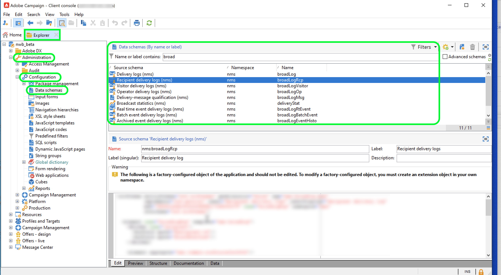

# Adobe Campaign Managed Cloud Services

Adobe Experience Platform ermöglicht die Aufnahme von Daten aus externen Quellen und bietet spezielle Services, mittels derer Sie eingehende Daten strukturieren, beschriften und erweitern können. Daten können aus verschiedensten Quellen aufgenommen werden, darunter etwa Adobe-Programme, Cloud-basierte Datenspeicher und Datenbanken.

Adobe Campaign Managed Cloud Services bietet eine Managed Services-Plattform für die Konzeption kanalübergreifender Kundenerlebnisse und eine Umgebung für die visuelle Kampagnenorchestrierung, Interaktionsverwaltung in Echtzeit und die kanalübergreifende Ausführung. Weitere Informationen finden Sie in der Dokumentation zu [Adobe Campaign v8](https://experienceleague.adobe.com/docs/campaign/campaign-v8/campaign-home.html?lang=de) .

Mit der Adobe Campaign Managed Cloud Services-Quelle können Sie Versandlogs und Trackinglog-Daten aus Adobe Campaign v8 in Adobe Experience Platform importieren.

## Voraussetzungen

Bevor Sie eine Quellverbindung erstellen können, um Ihre Campaign v8 auf Experience Platform zu bringen, müssen Sie zunächst die folgenden Voraussetzungen erfüllen:

* [Richten Sie den Ereignisprotokollimport mithilfe der Adobe Campaign-Clientkonsole ein](#view-delivery-and-tracking-log-data)
* [Erstellen eines XDM ExperienceEvent-Schemas](#create-a-schema)
* [Erstellen eines Datensatzes](#create-a-dataset)

### Anzeigen von Versand- und Trackinglog-Daten {#view-delivery-and-tracking-log-data}

>[!IMPORTANT]
>
>Sie benötigen Zugriff auf die Adobe Campaign v8 Client Console, um Ihre Protokolldaten in Campaign anzeigen zu können. Informationen zum Herunterladen und Installieren der Clientkonsole finden Sie in der Dokumentation zu [Campaign v8](https://experienceleague.adobe.com/docs/campaign/campaign-v8/deploy/connect.html) .

Melden Sie sich über die Client-Konsole bei Ihrer Campaign v8-Instanz an. Wählen Sie auf der Registerkarte [!DNL Explorer] die Option [!DNL Administration] und dann [!DNL Configuration] aus. Wählen Sie als Nächstes [!DNL Data schemas] aus und wenden Sie dann den Filter `broadLog` auf Namen oder Titel an. Wählen Sie in der angezeigten Liste das Quellschema der Versandlogs der Empfänger mit dem Namen `broadLogRcp` aus.

Wählen Sie dann die Registerkarte **Daten** aus.

Klicken Sie mit der rechten Maustaste/Tastenanschlag im Datenbereich, um das Kontextmenü zu öffnen. Wählen Sie hier **Liste konfigurieren..** aus.

Das Listenkonfigurationsfenster wird angezeigt und bietet eine Oberfläche, über die Sie der bereits vorhandenen Liste die gewünschten Felder hinzufügen können, um die Daten im Datenbereich anzuzeigen.

Jetzt können Sie Ihre Versandlogs der Empfänger anzeigen, einschließlich der Konfigurationsfelder, die im vorherigen Schritt hinzugefügt wurden.

>[!TIP]
>
>Sie können dieselben Schritte wiederholen, aber nach `tracking` filtern, um Ihre Trackinglog-Daten anzuzeigen.

### Erstellen eines Schemas {#create-a-schema}

Erstellen Sie anschließend ein XDM ExperienceEvent-Schema für Versandlogs und Trackinglogs. Sie müssen die Feldergruppe Kampagnenversandlogs auf Ihr Versandlog-Schema und die Feldergruppe Kampagnen-Trackinglogs auf Ihr Trackinglog-Schema anwenden. Sie müssen auch das Feld `externalID` als primäre Identität Ihres Schemas definieren.

>[!NOTE]
>
>Ihr XDM ExperienceEvent-Schema muss Profil-fähig sein, damit Ihre Campaign-Daten in [!DNL Real-Time Customer Profile] aufgenommen werden können.

Detaillierte Anweisungen zum Erstellen eines Schemas finden Sie im Handbuch zum Erstellen eines XDM-Schemas in der Benutzeroberfläche ](../../../xdm/tutorials/create-schema-ui.md).[

### Erstellen eines Datensatzes {#create-a-dataset}

Schließlich müssen Sie einen Datensatz für Ihre Schemas erstellen. Detaillierte Anweisungen zum Erstellen eines Datensatzes finden Sie im Handbuch zum Erstellen eines Datensatzes in der Benutzeroberfläche ](../../../catalog/datasets/user-guide.md).[

## Erstellen einer Adobe Campaign Managed Cloud Services-Quellverbindung über die Platform-Benutzeroberfläche

Nachdem Sie nun auf Ihre Datenprotokolle in der Campaign-Clientkonsole zugegriffen, ein Schema und einen Datensatz erstellt haben, können Sie nun eine Quellverbindung erstellen, um Ihre Campaign Managed Services-Daten an Platform zu übertragen.

Detaillierte Anweisungen zum Übertragen Ihrer Campaign v8-Versandlogs und -Trackinglog-Daten zu Experience Platform finden Sie im Handbuch zum Erstellen einer Campaign v8-Quellverbindung in der Benutzeroberfläche ](../../tutorials/ui/create/adobe-applications/campaign.md).[

>[!IMPORTANT]
>
>Es gibt einen Sonderfall, bei dem die Interaktion eines kürzlich entfernten E-Mail-Empfängers mit einer E-Mail personenbezogene Daten erneut in Experience Platform erfassen könnte. In einigen Fällen könnte dies das Marketing für diesen Benutzer erneut aktivieren.
>
>* Dieses Szenario ist nur aktiv zwischen der Ausführung einer Datenschutzanfrage in Experience Platform und der Ausführung in Adobe Campaign Classic. Nachdem die Anfrage in Campaign ausgeführt wurde, wird geprüft, ob der Datensatz nicht nach Campaign exportiert wird. Stellen Sie eine DSGVO-Anfrage nach 72 Stunden Ausführung erneut aus, um dies zu beheben.