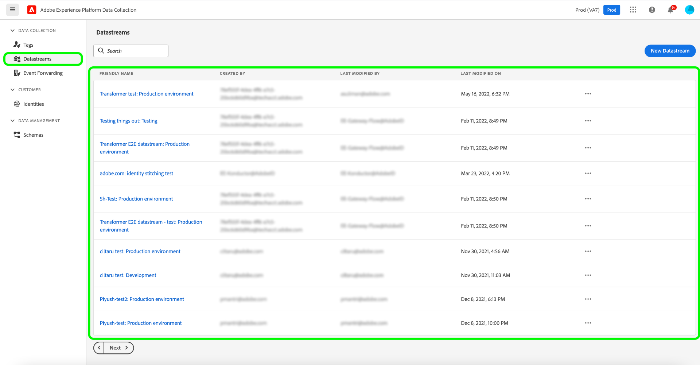

# Adobe Data Collection

Adobe Experience Platform bietet eine Reihe von Technologien, mit denen Sie Kundenerlebnisdaten aus Client-seitigen Quellen erfassen und an das Adobe Experience Platform Edge Network senden können, wo sie in Sekundenschnelle an Adobe oder andere Ziele weitergegeben, transformiert und verteilt werden können.

Durch die Quellenintegration der Datenerfassung von Adobe können Sie über den Quellkatalog auf Ihre Datenerfassungs-Edge-Daten, einschließlich der Datenvorbereitung für die Datenerfassung, sowie auf eine verbesserte Unterstützung für Warnhinweise zugreifen.

## Verwenden des Arbeitsbereichs &quot;Quellen&quot;für den Zugriff auf die Datenerfassung in Adobe

Wählen Sie in der Platform-Benutzeroberfläche die Option **[!UICONTROL Quellen]** in der linken Navigationsleiste, um auf den Arbeitsbereich [!UICONTROL Quellen] zuzugreifen. Die [!UICONTROL Katalog] zeigt eine Vielzahl von Quellen an, mit denen Sie ein Konto erstellen können.

Sie können die gewünschte Kategorie aus dem Katalog auf der linken Bildschirmseite auswählen. Alternativ können Sie die gewünschte Quelle mithilfe der Suchoption finden.

Unter dem [!UICONTROL Adobe Apps] category, select **[!UICONTROL Adobe Data Collection]** und wählen Sie **[!UICONTROL Einrichten]**.

Die Datenerfassungs-Benutzeroberfläche wird auf der **[!UICONTROL Datenspeicher]** Registerkarte.

Ein Datenstrom ist eine Konfiguration, die dem Edge-Netzwerk mitteilt, wohin Ihre Daten gesendet werden sollen. Insbesondere gibt ein Datenstrom an, an welche Experience Cloud-Produkte Sie die Daten senden möchten und wie die Daten in jedem Produkt verarbeitet und gespeichert werden sollen.

Umfassende Schritte zur Verwendung der Datenerfassungs-Benutzeroberfläche finden Sie in der [Übersicht über Ende-zu-Ende-Datenerfassung](../../../collection/e2e.md).

## Nächste Schritte

Durch Lesen dieses Dokuments haben Sie erfahren, wie Sie mithilfe des Arbeitsbereichs &quot;Quellen&quot;auf die Benutzeroberfläche für die Datenerfassung zugreifen können. Weitere Informationen zur Datenerfassung finden Sie unter [Datenerfassung - Übersicht](../../../collection/e2e.md).