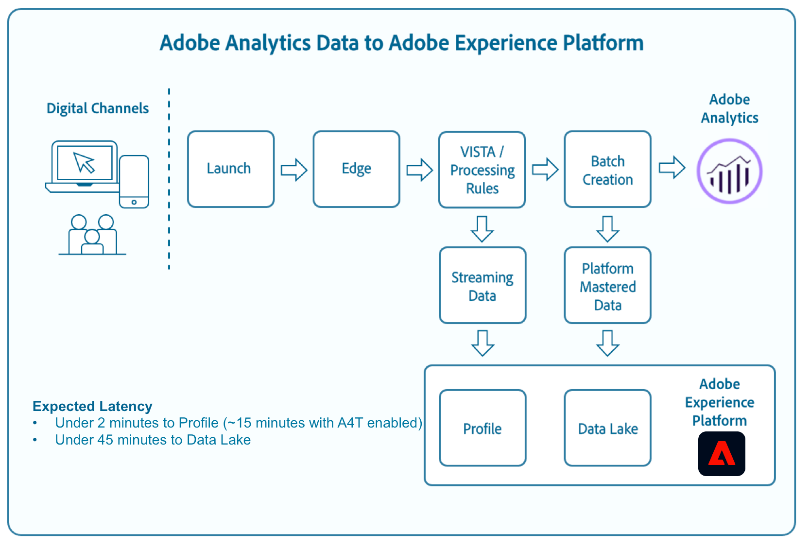

# Analytics-Feldzuordnungen

Mit Adobe Experience Platform können Sie Adobe Analytics-Daten über die Analytics-Quelle aufnehmen. Einige der über ADC aufgenommenen Daten können direkt aus Analytics-Feldern Experience-Datenmodell (XDM)-Feldern zugeordnet werden, während andere Daten Umwandlungen und bestimmte Funktionen erfordern, um erfolgreich zugeordnet zu werden.

## Streaming-Medienparameter

In der folgenden Tabelle finden Sie Informationen zu Streaming-Medienparametern.

| Daten-Feed | XDM-Feldpfad | Datentyp | Beschreibung |
| --- | --- | --- | --- |
| `videoname` | `mediaReporting.sessionDetails.friendlyName` | string | Der benutzerfreundliche (von Menschen lesbare) Name des Videos. |
| `videoaudioauthor` | `mediaReporting.sessionDetails.author` | string | Der Name des Medienautors. |
| `videoaudioartist` | `mediaReporting.sessionDetails.artist` | string | Der Name des Interpreten oder der Gruppe, die die Musikaufnahme oder das Video aufführt. |
| `videoaudioalbum` | `mediaReporting.sessionDetails.album` | string | Der Name des Albums, zu dem die Musikaufnahme oder das Video gehört. |
| `videolength` | `mediaReporting.sessionDetails.length` | integer | Die Länge oder Laufzeit des Videos. |
| `videoshowtype` | `mediaReporting.sessionDetails.showType` | string |  |
| `video` | `mediaReporting.sessionDetails.name` | string | Die ID des Videos. |
| `videoshow` | `mediaReporting.sessionDetails.show` | string | Der Name des Programms oder der Serie. Der Name des Programms/der Serie ist nur erforderlich, wenn die Sendung Teil einer Serie ist. |
| `videostreamtype` | mediaReporting.sessionDetails.streamType | string | Der Typ der Streaming-Medien wie „Video“ oder „Audio“. |
| `videoseason` | `mediaReporting.sessionDetails.season` | string | Die Staffelnummer, zu der die Sendung gehört. Dieser Wert ist nur erforderlich, wenn die Sendung Teil einer Serie ist. |
| `videoepisode` | `mediaReporting.sessionDetails.episode` | string | Die Nummer der Folge. |
| `videogenre` | `mediaReporting.sessionDetails.genreList[]` | Zeichenfolge[] | Das Genre des Videos. |
| `videosessionid` | `mediaReporting.sessionDetails.ID` | string | Eine Kennung für eine Instanz eines Inhalts-Streams, die für eine einzelne Wiedergabe eindeutig ist. |
| `videoplayername` | `mediaReporting.sessionDetails.playerName` | string | Der Name des Video-Players. |
| `videochannel` | `mediaReporting.sessionDetails.channel` | string | Der Verteilungskanal, von dem aus der Inhalt wiedergegeben wurde. |
| `videocontenttype` | `mediaReporting.sessionDetails.contentType` | string | Der Typ der Stream-Bereitstellung, die für den Inhalt verwendet wird. Diese Einstellung wird für alle Videoansichten automatisch auf „Video“ gesetzt. Empfohlene Werte sind: VOD, Live, Linear, UGC, DVOD, Radio, Podcast, Hörbuch und Song. |
| `videonetwork` | `mediaReporting.sessionDetails.network` | string | Der Netzwerk- oder Kanalname. |
| `videofeedtype` | `mediaReporting.sessionDetails.feed` | string | Der Feed-Typ. Dabei kann es sich entweder um tatsächliche Feed-bezogene Daten wie „East HD“ oder „SD“ oder um die Quelle des Feeds wie eine URL handeln. |
| `videosegment` | `mediaReporting.sessionDetails.segment` | string |  |
| `videostart` | `mediaReporting.sessionDetails.isViewed` | boolean | Ein boolescher Wert, der angibt, ob das Video gestartet wurde oder nicht. Dies tritt auf, sobald der/die Benutzende die Wiedergabeschaltfläche auswählt, und zählt auch dann, wenn Pre-Roll-Anzeigen, Pufferung, Fehler usw. vorhanden sind. |
| `videoplay` | `mediaReporting.sessionDetails.isPlayed` | boolean | Ein boolescher Wert, der angibt, ob das erste Medienbild gestartet wurde. Wenn der Benutzer während einer Anzeige- oder Pufferzeit fällt, ist der „Inhaltsstart“ nicht qualifiziert. |
| `videotime` | `mediaReporting.sessionDetails.timePlayed` | integer | Die Dauer (in Sekunden) für alle Ereignisse von `type=PLAY` im Hauptinhalt. |
| `videocomplete` | `mediaReporting.sessionDetails.isCompleted` | boolean | Ein boolescher Wert, der angibt, ob ein zeitgesteuertes Medien-Asset bis zum Ende angesehen wurde. Dieser Wert bedeutet nicht unbedingt, dass der Betrachter das gesamte Video angesehen hat, da dieser Wert nicht berücksichtigt, dass der Betrachter möglicherweise voraus springt. |
| `videototaltime` | `mediaReporting.sessionDetails.totalTimePlayed` | integer | Die Gesamtzeit, die ein Benutzer mit einem bestimmten zeitgesteuerten Medien-Asset verbracht hat, einschließlich der Zeit mit dem Ansehen von Anzeigen. |
| `videouniquetimeplayed` | `mediaReporting.sessionDetails.uniqueTimePlayed` | integer | Die Summe der eindeutigen Intervalle, die ein Benutzer bei einem zeitgesteuerten Medien-Asset gesehen hat. Mit anderen Worten, die Länge der mehrfach angesehenen Wiedergabeintervalle wird nur einmal gezählt. |
| `videoaverageminuteaudience` | `mediaReporting.sessionDetails.averageMinuteAudience` | number | Die durchschnittliche Besuchszeit für Inhalt für ein bestimmtes Medienelement. Mit anderen Worten, die gesamte Besuchszeit für den Inhalt dividiert durch die Länge aller Wiedergabesitzungen. |
| `videoprogress10` | `mediaReporting.sessionDetails.hasProgress10` | boolean | Ein boolescher Wert, der angibt, ob der Abspielkopf eines bestimmten Videos die 10-%-Markierung der gesamten Videolänge überschritten hat. Die Markierung wird nur einmal gezählt, selbst wenn der Benutzer zu einer früheren Abspielposition springt. Springt er zu einer späteren Abspielposition, werden hierbei übersprungene Markierungen nicht gewertet. |
| `videoprogress25` | `mediaReporting.sessionDetails.hasProgress25` | boolean | Ein boolescher Wert, der angibt, ob der Abspielkopf eines bestimmten Videos die 25-%-Markierung der gesamten Videolänge überschritten hat. Die Markierung wird nur einmal gezählt, selbst wenn der Benutzer zu einer früheren Abspielposition springt. Springt er zu einer späteren Abspielposition, werden hierbei übersprungene Markierungen nicht gewertet. |
| `videoprogress50` | `mediaReporting.sessionDetails.hasProgress50` | boolean | Ein boolescher Wert, der angibt, ob der Abspielkopf eines bestimmten Videos die 50-%-Markierung der gesamten Videolänge überschritten hat. Die Markierung wird nur einmal gezählt, selbst wenn der Benutzer zu einer früheren Abspielposition springt. Springt er zu einer späteren Abspielposition, werden hierbei übersprungene Markierungen nicht gewertet. |
| `videoprogress75` | `mediaReporting.sessionDetails.hasProgress75` | boolean | Ein boolescher Wert, der angibt, ob der Abspielkopf eines bestimmten Videos die 75-%-Markierung der gesamten Videolänge überschritten hat. Die Markierung wird nur einmal gezählt, selbst wenn der Benutzer zu einer früheren Abspielposition springt. Springt er zu einer späteren Abspielposition, werden hierbei übersprungene Markierungen nicht gewertet. |
| `videoprogress95` | `mediaReporting.sessionDetails.hasProgress95` | boolean | Ein boolescher Wert, der angibt, ob der Abspielkopf eines bestimmten Videos die 95-%-Markierung der gesamten Videolänge überschritten hat. Die Markierung wird nur einmal gezählt, selbst wenn der Benutzer zu einer früheren Abspielposition springt. Springt er zu einer späteren Abspielposition, werden hierbei übersprungene Markierungen nicht gewertet. |
| `videopause` | `mediaReporting.sessionDetails.hasPauseImpactedStreams` | boolean | Ein boolescher Wert, der angibt, ob während der Wiedergabe eines einzelnen Medienelements eine oder mehrere Pausen aufgetreten sind. |
| `videopausecount` | `mediaReporting.sessionDetails.pauseCount` | integer | Die Anzahl der Pausen, die während der Wiedergabe aufgetreten sind. |
| `videopausetime` | `mediaReporting.sessionDetails.pauseTime` | integer | Die Gesamtdauer (in Sekunden), in der die Wiedergabe von einem Benutzer angehalten wurde. |
| `videomvpd` | `mediaReporting.sessionDetails.mvpd` | string | Eine über die Adobe-Authentifizierung bereitgestellte MVPD-Kennung. |
| `videoauthorized` | `mediaReporting.sessionDetails.authorized` | string | Definiert, dass der Benutzer über die Adobe-Authentifizierung autorisiert wurde. |
| `videodaypart` | `mediaReporting.sessionDetails.dayPart` | Definiert die Tageszeit, zu der der Inhalt gesendet oder wiedergegeben wurde. |  |
| `videoresume` | `mediaReporting.sessionDetails.hasResume` | boolean | Ein boolescher Wert, der jede Wiedergabe kennzeichnet, die nach mehr als 30 Minuten Puffer, Pause oder Anhaltezeit wieder aufgenommen wurde. |
| `videosegmentviews` | `mediaReporting.sessionDetails.hasSegmentView` | boolean | Ein boolescher Wert, der angibt, dass mindestens ein Frame angezeigt wurde. Dieser Frame muss nicht der erste Frame sein. |
| `videoaudiolabel` | `mediaReporting.sessionDetails.label` | string | Der Name der Datensatzkennzeichnung. |
| `videoaudiostation` | `mediaReporting.sessionDetails.station` | string | Der Radiosender oder Name, auf dem das Audio abgespielt wird. |
| `videoaudiopublisher` | `mediaReporting.sessionDetails.publisher` | string | Der Name des Herausgebers des Audioinhalts. |
| `videosecondssincelastcall` | `mediaReporting.sessionDetails.secondsSinceLastCall` | number | Gibt die Zeit (in Sekunden) an, die zwischen der letzten bekannten Interaktion eines Benutzers und dem Zeitpunkt des Schließens der Sitzung vergangen ist. |
| `videoadload` | `mediaReporting.sessionDetails.adLoad` | string | Der Typ der geladenen Anzeige, wie in Ihrer eigenen internen Darstellung definiert. |

{style="table-layout:auto"}

## Advertising-Parameter

In der folgenden Tabelle finden Sie Informationen zu Werbeparametern.

| Daten-Feed | XDM-Feldpfad | Datentyp | Beschreibung |
| --- | --- | --- | --- |
| `videoad` | `mediaReporting.advertisingDetails.name` | string | Der Name der Anzeige. Beim Reporting ist „Anzeigename“ die Klassifizierung und „Anzeigename (Variable)“ die eVar. |
| `videoadinpod` | `mediaReporting.advertisingDetails.podPosition` | integer | Der Index der Anzeige innerhalb des übergeordneten Anzeigenstarts. Beispielsweise hat die erste Anzeige den Index 0 und die zweite Anzeige den Index 1. |
| `videoadlength` | `mediaReporting.advertisingDetails.length` | integer | Die Länge der Videoanzeige in Sekunden. |
| `videoadplayername` | `mediaReporting.advertisingDetails.playerName` | string | Der Name des Players, der zum Rendern der Anzeige verwendet wird. |
| `videoadpod` | `mediaReporting.advertisingPodDetails.ID` | string | Die ID der Werbeunterbrechung. |
| `videoadname` | `mediaReporting.advertisingDetails.friendlyName` | string | Der benutzerfreundliche (von Menschen lesbare) Name der Anzeigenunterbrechung. |
| `videoadadvertiser` | `mediaReporting.advertisingDetails.advertiser` | string | Die Firma oder Marke, deren Produkt in der Anzeige zu sehen ist. |
| `videoadcampaign` | `mediaReporting.advertisingDetails.campaignID` | string | Die ID der Anzeigenkampagne. |
| `videoadstart` | `mediaReporting.advertisingDetails.isStarted` | boolean | Ein boolescher Wert, der angibt, ob die Anzeige gestartet wurde oder nicht. |
| `videoadcomplete` | `mediaReporting.advertisingDetails.isCompleted` | boolean | Ein boolescher Wert, der angibt, ob die Anfrage abgeschlossen wurde oder nicht. |
| `videoadtime` | `mediaReporting.advertisingDetails.timePlayed` | integer | Die Gesamtzeit (in Sekunden), die mit dem Ansehen der Anzeige verbracht wurde. |

{style="table-layout:auto"}

## Kapitelparameter

In der folgenden Tabelle finden Sie Informationen zu Kapitelparametern.

| Daten-Feed | XDM-Feldpfad | Datentyp | Beschreibung |
| --- | --- | --- | --- |
| `videochapter` | `mediaReporting.chapterDetails.ID` | string | Die automatisch generierte ID des Kapitels. |
| `videochapterstart` | `mediaReporting.chapterDetails.isStarted` | boolean | Ein boolescher Wert, der angibt, ob das Kapitel gestartet wurde oder nicht. |
| `videochaptercomplete` | `mediaReporting.chapterDetails.isCompleted` | boolean | Ein boolescher Wert, der angibt, ob das Kapitel abgeschlossen wurde oder nicht. |
| `videochaptertime` | `mediaReporting.chapterDetails.timePlayed` | integer | Die Zeit, gemessen in Sekunden, die mit dem Kapitel verbracht wurde. |

{style="table-layout:auto"}

## Player-Statusparameter

In der folgenden Tabelle finden Sie Informationen zu Player-Statusparametern.

| Daten-Feed | XDM-Feldpfad | Datentyp | Beschreibung |
| --- | --- | --- | --- |
| `videostatefullscreen` | `mediaReporting.states[].isSet` | boolean | Ein boolescher Wert, der angibt, ob der Videostatus auf Vollbild eingestellt ist oder nicht. |
| `videostatefullscreencount` | `mediaReporting.states[].count` | integer | Die Häufigkeit, mit der ein Videostatus auf Vollbild gesetzt wurde. |
| `videostatefullscreentime` | `mediaReporting.states[].time` | integer | Die Gesamtdauer, während der der Videostatus auf Vollbild eingestellt wurde. |
| `videostateclosedcaptioning` | `mediaReporting.states[].isSet` | boolean | Ein boolescher Wert, der angibt, ob Untertitel aktiviert sind. |
| `videostateclosedcaptioningcount` | `mediaReporting.states[].count` | integer | Die Häufigkeit, mit der Untertitel aktiviert wurden. |
| `videostateclosedcaptioningtime` | `mediaReporting.states[].time` | integer | Die Gesamtdauer, in der geschlossene Untertitel aktiviert wurden. |
| `videostatemute` | `mediaReporting.states[].isSet` | boolean | Ein boolescher Wert, der angibt, ob der Videostatus auf Stumm gesetzt wurde. |
| `videostatemutecount` | `mediaReporting.states[].count` | integer | Die Anzahl der Stummschaltungen eines Videos. |
| `videostatemutetime` | `mediaReporting.states[].time` | integer | Die Gesamtdauer des Videos in Stummschaltung. |
| `videostatepictureinpicture` | `mediaReporting.states[].isSet` | boolean | Ein boolescher Wert, der angibt, ob der Bild-im-Bild-Modus aktiviert ist oder nicht. |
| `videostatepictureinpicturecount` | `mediaReporting.states[].count` | integer | Die Häufigkeit, mit der der Bild-in-Bild-Modus aktiviert ist. |
| `videostatepictureinpicturetime` | `mediaReporting.states[].time` | integer | Die Gesamtdauer, während der der Bild-in-Bild-Modus aktiviert war. |
| `videostateinfocus` | `mediaReporting.states[].isSet` | boolean | Ein boolescher Wert, der angibt, ob der Fokusmodus aktiviert ist |
| `videostateinfocuscount` | `mediaReporting.states[].count` | integer | Die Häufigkeit, mit der der Bildmodus aktiviert wurde. |
| `videostateinfocustime` | `mediaReporting.states[].time` | integer | Die Gesamtdauer, während der der Fokusmodus aktiviert war. |

{style="table-layout:auto"}

## Qualitätsparameter

In der folgenden Tabelle finden Sie Informationen zu Qualitätsparametern.

| Daten-Feed | XDM-Feldpfad | Datentyp | Beschreibung |
| --- | --- | --- | --- |
| `videoqoebitrateaverage` | `mediaReporting.qoeDataDetails.bitrateAverage` | number | Die durchschnittliche Bitrate (in kbps, Ganzzahl). Diese Metrik wird als gewichteter Durchschnitt aller Bitratenwerte im Zusammenhang mit der Wiedergabedauer berechnet, die während einer Wiedergabesitzung aufgetreten sind. |
| `videoqoebitratechange` | `mediaReporting.qoeDataDetails.hasBitrateChangeImpactedStreams` | boolean | Ein boolescher Wert, der die Anzahl der Streams angibt, in denen Bitratenänderungen aufgetreten sind. Diese Metrik wird nur dann auf „true“ gesetzt, wenn während einer Wiedergabesitzung mindestens ein Bitratenänderungsereignis aufgetreten ist. |
| `videoqoebitratechangecountevar` | `mediaReporting.qoeDataDetails.bitrateChangeCount` | integer |  |
| `videoqoebitrateaverageevar` | `mediaReporting.qoeDataDetails.bitrateAverageBucket` | string | Die Anzahl der Bitratenänderungen Dieser Wert wird als Summe aller Bitratenänderungsereignisse berechnet, die während einer Wiedergabesitzung aufgetreten sind. |
| `videoqoetimetostartevar` | `mediaReporting.qoeDataDetails.timeToStart` | integer | Die Dauer in Sekunden, die zwischen dem Laden des Videos und dem Start des Videos vergangen ist. |
| `videoqoedroppedframes` | `mediaReporting.qoeDataDetails.hasDroppedFrameImpactedStreams` | boolean | Ein boolescher Wert, der die Anzahl der Streams angibt, in denen Frames verworfen wurden. Diese Metrik wird nur dann auf „true“ gesetzt, wenn während einer Wiedergabesitzung mindestens ein Frame gelöscht wurde. |
| `videoqoedroppedframecountevar` | `mediaReporting.qoeDataDetails.droppedFrames` | integer | Die Anzahl der Frames, die während der Wiedergabe des Hauptinhalts gelöscht wurden. |
| `videoqoebuffercountevar` | `mediaReporting.qoeDataDetails.bufferCount` | integer | Die Anzahl der Pufferereignisse. Diese Metrik wird als Anzahl der verschiedenen Pufferzustände berechnet, die während einer Wiedergabesitzung aufgetreten sind. Dies ist die Anzahl, wie oft der Player aus anderen Zuständen, z. B. Wiedergabe oder Pause, in einen Pufferstatus wechselt. |
| `videoqoebuffertimeevar` | `mediaReporting.qoeDataDetails.bufferTime` | integer | Die Gesamtdauer der Pufferung in Sekunden. Dieser Wert wird als Summe aller Pufferereignisdauern berechnet, die während einer Wiedergabesitzung aufgetreten sind. |
| `videoqoebuffer` | `mediaReporting.qoeDataDetails.hasBufferImpactedStreams` | boolean | Ein boolescher Wert, der die Anzahl der von der Pufferung betroffenen Streams angibt. Diese Metrik wird nur dann auf „true“ gesetzt, wenn während einer Wiedergabesitzung mindestens ein Pufferereignis aufgetreten ist. |
| `videoqoeerror` | `mediaReporting.qoeDataDetails.hasErrorImpactedStreams` | boolean | Ein boolescher Wert, der die Anzahl der Streams angibt, in denen ein Fehlerereignis aufgetreten ist. Wenn beispielsweise trackError während der Wiedergabesitzung aufgerufen wurde und ein Heartbeat-Aufruf vom Typ type=error generiert wurde, Diese Metrik wird nur dann auf „true“ gesetzt, wenn während der Wiedergabe mindestens ein Fehler aufgetreten ist. |
| `videoerrorcountevar` | `mediaReporting.qoeDataDetails.errorCount` | integer | Die Anzahl der aufgetretenen Fehler. Dieser Wert wird als Summe aller Fehlerereignisse berechnet, die während einer Wiedergabesitzung aufgetreten sind. |
| `videoqoeplayersdkerrors` | `mediaReporting.qoeDataDetails.playerSdkErrors` | String-Array | Die vom Player SDK generierten eindeutigen Fehler-IDs. Sie müssen die Fehler-Codes oder IDs zum Zeitpunkt der Implementierung über die bereitgestellten Fehler-APIs angeben. |
| `videoqoeextneralerrors` | `mediaReporting.qoeDataDetails.externalErrors` | String-Array | Die eindeutigen Fehler-IDs aus allen externen Quellen, z. B. CDN-Fehler. Sie müssen die Fehler-Codes oder IDs zum Zeitpunkt der Implementierung über die bereitgestellten Fehler-APIs angeben. |
| `videoqoedropbeforestart` | `mediaReporting.qoeDataDetails.isDroppedBeforeStart` | boolean | Die eindeutigen Fehler-IDs, die von Media SDK während der Wiedergabe generiert wurden. |

{style="table-layout:auto"}

## Veraltete Felder

In diesem Abschnitt finden Sie Informationen zu veralteten Analytics-Zuordnungsfeldern.

### Direkte Zuordnungsfelder

+++Wählen Sie aus, um eine Tabelle veralteter direkter Zuordnungsfelder anzuzeigen

| Daten-Feed | XDM-Feld | XDM-Typ | Beschreibung |
| --- | --- | --- | --- |
| `m_evar1` `[...]` `m_evar250` | `_experience.analytics.customDimensions.` `eVars.eVar1` `[...]` `_experience.analytics.customDimensions.` `eVars.eVar250` | string | Benutzerdefinierte Analytics-eVars. Jede Organisation kann eVars unterschiedlich verwenden. |
| `m_prop1` `[...]` `m_prop75` | `_experience.analytics.customDimensions.` `props.prop1` `[...]` `_experience.analytics.customDimensions.` `props.prop75` | string | Benutzerdefinierte Analytics-Props. Jede Organisation kann Props anders verwenden. |
| `m_browser` | `_experience.analytics.environment.` `browserID` | integer | Zahlenkennung des Browsers. |
| `m_browser_height` | `environment.browserDetails.viewportHeight` | integer | Höhe des Browsers in Pixel. |
| `m_browser_width` | `environment.browserDetails.viewportWidth` | integer | Breite des Browsers in Pixel. |
| `m_campaign` | `marketing.trackingCode` | string | Variable, die in der Dimension „Trackingcode“ verwendet wird. |
| `m_channel` | `web.webPageDetails.siteSection` | string | Variable, die in der Dimension „Site-Bereiche“ verwendet wird. |
| `m_domain` | `environment.domain` | string | Variable, die in der Dimension „Domain“ verwendet wird. Sie basiert auf dem Internet Service Provider (ISP) des Benutzers. |
| `m_geo_city` | `placeContext.geo.city` | string | Name der Stadt des Treffers. Dies basiert auf der IP-Adresse des Treffers. |
| `m_geo_dma` | `placeContext.geo.dmaID` | integer | Numerische Kennung des demografischen Bereichs für den Treffer. Dies basiert auf der IP-Adresse des Treffers. |
| `m_geo_region` | `placeContext.geo.stateProvince` | string | Name des Bundeslands oder der Region des Treffers. Dies basiert auf der IP-Adresse des Treffers. |
| `m_geo_zip` | `placeContext.geo.postalCode` | string | Postleitzahl des Treffers. Dies basiert auf der IP-Adresse des Treffers. |
| `m_keywords` | `search.keywords` | string | Die in der Keyword-Dimension verwendete Variable. |
| `m_os` | `_experience.analytics.environment.` `operatingSystemID` | integer | Numerische Kennung, die das Betriebssystem des Besuchers darstellt. Dieser Wert basiert auf der Spalte „user_agent“. |
| `m_page_url` | `web.webPageDetails.URL` | string | URL des Seitenaufrufs. |
| `m_pagename` | `web.webPageDetails.pageViews.value` | string | Gleich 1 bei Treffern mit einem Seitennamen. Dies ähnelt der Metrik Adobe Analytics-Seitenansichten . |
| `m_referrer` | `web.webReferrer.URL` | string | Seiten-URL der vorherigen Seite. |
| `m_search_page_num` | `search.pageDepth` | integer | Wird von der Dimension „Rangansicht aller Suchseiten“ verwendet. Gibt an, auf welcher Seite der Suchergebnisse Ihre Site angezeigt wurde, ehe der Benutzer sich zu Ihrer Site durchgeklickt hat. |
| `m_state` | `_experience.analytics.customDimensions.` `stateProvince` | string | Statusvariable. |
| `m_user_server` | `web.webPageDetails.server` | string | Variable, die in der Dimension „Server“ verwendet wird. |
| `m_zip` | `_experience.analytics.customDimensions.` `postalCode` | string | Variable, die zum Ausfüllen der Dimension „Postleitzahl“ dient. |
| `accept_language` | `environment.browserDetails.acceptLanguage` | string | Liste aller zulässigen Sprachen, wie in der HTTP-Kopfzeile „Accept-Language“ angegeben. |
| `homepage` | `web.webPageDetails.isHomePage` | boolean | Wird nicht mehr verwendet. Wird angezeigt, wenn die aktuelle URL die Browser-Startseite ist. |
| `ipv6` | `environment.ipV6` | string |  |
| `j_jscript` | `environment.browserDetails.javaScriptVersion` | string | Die vom Browser unterstützte Version von JavaScript. |
| `user_agent` | `environment.browserDetails.userAgent` | string | Die in der HTTP-Kopfzeile gesendete Benutzeragenten-Zeichenfolge. |
| `mobileappid` | `application.name` | string | Die App-ID, die im folgenden Format gespeichert wird: `[AppName][BundleVersion]`. |
| `mobiledevice` | `device.model` | string | Der Name des Mobilgeräts. Unter iOS als kommagetrennte 2-Ziffern-Zeichenfolge gespeichert. Die erste Ziffer steht für die Gerätegeneration; die zweite weist die Version der Gerätefamilie aus. |
| `pointofinterest` | `placeContext.POIinteraction.POIDetail.` `name` | string | Wird von Mobile Services verwendet. Stellt den Zielpunkt dar. |
| `pointofinterestdistance` | `placeContext.POIinteraction.POIDetail.` `geoInteractionDetails.distanceToCenter` | number | Wird von Mobile Services verwendet. Stellt den Abstand zum Zielpunkt dar. |
| `mobileplaceaccuracy` | `placeContext.POIinteraction.POIDetail.` `geoInteractionDetails.deviceGeoAccuracy` | number | Erfasst mit der Kontextdatenvariablen a.loc.acc. Gibt die Genauigkeit des GPS in Metern zum Erfassungszeitpunkt an. |
| `mobileplacecategory` | `placeContext.POIinteraction.POIDetail.` `category` | string | Wird mit der Kontextdatenvariablen a.loc.category erfasst. Beschreibt die Kategorie eines bestimmten Orts. |
| `mobileplaceid` | `placeContext.POIinteraction.POIDetail.` `POIID` | string | Erfasst mit der Kontextdatenvariablen a.loc.id. Kennung für einen bestimmten Zielpunkt. |
| `videoadpod` | `advertising.adAssetViewDetails.adBreak._id` | string | |
| `mobilebeaconmajor` | `placeContext.POIinteraction.POIDetail.` `beaconInteractionDetails.beaconMajor` | number | Mobile Services – Haupt-Beacon. |
| `mobilebeaconminor` | `placeContext.POIinteraction.POIDetail.` `beaconInteractionDetails.beaconMinor` | number | Mobile Services – Neben-Beacon. |
| `mobilebeaconuuid` | `placeContext.POIinteraction.POIDetail.` `beaconInteractionDetails.proximityUUID` | string | Mobile Services-Beacon UUID. |
| `mobileinstalls` | `application.firstLaunches` | Objekt | Dies wird beim ersten Ausführen nach der Installation oder Neuinstallation ausgelöst `{id (string), value (number)}` |
| `mobileupgrades` | `application.upgrades` | Objekt | Gibt die Zahl der App-Upgrades an. Trigger bei der ersten Ausführung nach dem Upgrade oder wenn sich die Versionsnummer ändert. `{id (string), value (number)}` |
| `mobilelaunches` | `application.launches` | Objekt | Die Häufigkeit, mit der die App gestartet wurde.  `{id (string), value (number)}` |
| `mobilecrashes` | `application.crashes` | Objekt | `{id (string), value (number)}` |
| `mobilemessageclicks` | `directMarketing.clicks` | Objekt | `{id (string), value (number)}` |
| `mobileplaceentry` | `placeContext.POIinteraction.poiEntries` | Objekt | `{id (string), value (number)}` |
| `mobileplaceexit` | `placeContext.POIinteraction.poiExits` | Objekt | `{id (string), value (number)}` |
| `videoqoetimetostart` | `media.mediaTimed.primaryAssetViewDetails.` `qoe.timeToStart` | Objekt | Die Zeit bis zum Start der Videoqualität `{id (string), value (number)}` |
| `videoqoedropbeforestart` | `media.mediaTimed.dropBeforeStarts` | Objekt | `{id (string), value (number)}` |
| `videoqoebuffercount` | `media.mediaTimed.primaryAssetViewDetails.` `qoe.buffers` | Objekt | Puffer-Anzahl der Videoqualität `{id (string), value (number)}` |
| `videoqoebuffertime` | `media.mediaTimed.primaryAssetViewDetails.` `qoe.bufferTime` | Objekt | Pufferzeit für Videoqualität `{id (string), value (number)}` |
| `videoqoebitratechangecount` | `media.mediaTimed.primaryAssetViewDetails.` `qoe.bitrateChanges` | Objekt | Anzahl der Änderungen der Videoqualität `{id (string), value (number)}` |
| `videoqoebitrateaverage` | `media.mediaTimed.primaryAssetViewDetails.` `qoe.bitrateAverage` | Objekt | Durchschnittliche Bitrate der Videoqualität `{id (string), value (number)}` |
| `videoqoeerrorcount` | `media.mediaTimed.primaryAssetViewDetails.` `qoe.errors` | Objekt | Anzahl der Fehler in der Videoqualität `{id (string), value (number)}` |
| `videoqoedroppedframecount` | `media.mediaTimed.primaryAssetViewDetails.` `qoe.droppedFrames` | Objekt | `{id (string), value (number)}` |

{style="table-layout:auto"}

+++

## Generierte Zuordnungsfelder

Ausgewählte Felder aus dem ADC müssen transformiert werden, sodass in XDM Logiken generiert werden müssen, die über eine direkte Kopie aus Adobe Analytics hinausgehen.

+++Auswählen, um eine Tabelle veralteter generierter Zuordnungsfelder anzuzeigen

| Daten-Feed | XDM-Feld | XDM-Typ | Beschreibung |
| --- | --- | --- | --- |
| `m_prop1` `[...]` `m_prop75` | `_experience.analytics.customDimensions` `.listprops.prop1` `[...]` `_experience.analytics.customDimensions.` `listprops.prop75` | Objekt | Benutzerdefinierte Analytics-Props, konfiguriert als Listen-Props. Sie enthält eine durch Trennzeichen getrennte Liste von Werten. `{}` |
| `m_hier1` `[...]` `m_hier5` | `_experience.analytics.customDimensions.` `hierarchies.hier1` `[...]` `_experience.analytics.customDimensions.` `hierarchies.hier5` | Objekt | Wird von Hierarchievariablen verwendet. Sie enthält eine durch Trennzeichen getrennte Liste von Werten. `{values (array), delimiter (string)}` |
| `m_mvvar1` `[...]` `m_mvvar3` | `_experience.analytics.customDimensions.` `lists.list1.list[]` `[...]` `_experience.analytics.customDimensions.` `lists.list3.list[]` | array | Benutzerdefinierte Analytics-Listenvariablen. Enthält eine durch Trennzeichen getrennte Liste von Werten.  `{value (string), key (string)}` |
| `m_color` | `device.colorDepth` | integer | Die Farbtiefe-ID, die auf dem Wert der Spalte c_color basiert. |
| `m_cookies` | `environment.browserDetails.cookiesEnabled` | boolean | Variable, die in der Dimension „Cookie-Unterstützung“ verwendet wird. |
| `m_event_list` | `commerce.purchases`, `commerce.productViews`, `commerce.productListOpens`, `commerce.checkouts`, `commerce.productListAdds`, `commerce.productListRemovals`, `commerce.productListViews` | Objekt | Beim Treffer ausgelöste Standard-Commerce-Ereignisse. `{id (string), value (number)}` |
| `m_event_list` | `_experience.analytics.event1to100.event1` `[...]` `_experience.analytics.event901to1000.event1000` | Objekt | Benutzerdefinierte Ereignisse, die beim Treffer ausgelöst werden. `{id (Object), value (Object)}` |
| `m_geo_country` | `placeContext.geo.countryCode` | string | Abkürzung für das Land, aus dem der Treffer stammt, basierend auf der IP. |
| `m_geo_latitude` | `placeContext.geo._schema.latitude` | number | |
| `m_geo_longitude` | `placeContext.geo._schema.longitude` | number | |
| `m_java_enabled` | `environment.browserDetails.javaEnabled` | boolean | Ein Flag, das angibt, ob Java™ aktiviert ist. |
| `m_latitude` | `placeContext.geo._schema.latitude` | number | |
| `m_longitude` | `placeContext.geo._schema.longitude` | number | |
| `m_page_event_var1` | `web.webInteraction.URL` | string | Variable, die nur in Bildanforderungen zum Linktracking verwendet wird. Die Variable enthält die URL des angeklickten Downloadlinks, Exitlinks oder benutzerspezifischen Links. |
| `m_page_event_var2` | `web.webInteraction.name` | string | Variable, die nur in Bildanforderungen zum Linktracking verwendet wird. Damit wird der benutzerdefinierte Name des Links aufgeführt, sofern angegeben. |
| `m_page_type` | `web.webPageDetails.isErrorPage` | boolean | Variable, die zum Ausfüllen der Dimension „Seiten nicht gefunden“ dient. Diese Variable sollte entweder leer sein oder „ErrorPage“ enthalten. |
| `m_pagename_no_url` | `web.webPageDetails.name` | number | Der Name der Seite (wenn festgelegt). Wenn keine Seite angegeben wird, bleibt dieser Wert leer. |
| `m_paid_search` | `search.isPaid` | boolean | Markierung, die gesetzt wird, wenn der Treffer mit der Paid Search-Erkennung übereinstimmt. |
| `m_product_list` | `productListItems[].items` | array | Die Produktliste, wie sie durch die Variable „products“ übergeben wurde. `{SKU (string), quantity (integer), priceTotal (number)}` |
| `m_ref_type` | `web.webReferrer.type` | string | Eine numerische ID, die den Typ des Verweises für den Treffer darstellt. `1`: Innerhalb Ihrer Website `2`: Andere Websites `3`: Suchmaschinen `4`: Festplatte `5`: USENET `6`: Eingegeben/Mit Lesezeichen versehen (kein Referrer) `7`: E-Mail `8`: Kein JavaScript `9`: Social Networks |
| `m_search_engine` | `search.searchEngine` | string | Numerische Kennung, die die Suchmaschine darstellt, die den Besucher auf Ihre Site verwiesen hat. |
| `post_currency` | `commerce.order.currencyCode` | string | Der während der Transaktion verwendete Währungscode. |
| `post_cust_hit_time_gmt` | `timestamp` | string | Dieser Wert wird nur in für Zeitstempel aktivierten Datensätzen verwendet. Dies ist der Zeitstempel, der mit dem Treffer gesendet wird, basierend auf der UNIX®-Zeit. |
| `post_cust_visid` | `identityMap` | Objekt | Die Besucher-ID des Kunden. |
| `post_cust_visid` | `endUserIDs._experience.aacustomid.primary` | boolean | Die Besucher-ID des Kunden. |
| `post_cust_visid` | `endUserIDs._experience.aacustomid.namespace.code` | string | Die Besucher-ID des Kunden. |
| `post_visid_high` + `visid_low` | `identityMap` | Objekt | Eindeutige Kennung für einen Besuch. |
| `post_visid_high` + `visid_low` | `endUserIDs._experience.aaid.id` | string | Eindeutige Kennung für einen Besuch. |
| `post_visid_high` | `endUserIDs._experience.aaid.primary` | boolean | Wird mit `visid_low` verwendet, um einen Besuch eindeutig zu identifizieren. |
| `post_visid_high` | `endUserIDs._experience.aaid.namespace.code` | string | Wird mit `visid_low` verwendet, um einen Besuch eindeutig zu identifizieren. |
| `post_visid_low` | `identityMap` | Objekt | Wird mit visid_high verwendet, um einen Besuch eindeutig zu identifizieren. |
| `hit_time_gmt` | `receivedTimestamp` | string | Der Zeitstempel des Treffers, basierend auf der UNIX®-Zeit. |
| `hitid_high` + `hitid_low` | `_id` | string | Eindeutige Kennung zur Identifizierung eines Treffers. |
| `hitid_low` | `_id` | string | Wird mit hitid_high verwendet, um einen Treffer eindeutig zu identifizieren. |
| `ip` | `environment.ipV4` | string | IP-Adresse basierend auf der HTTP-Kopfzeile der Bildanforderung. |
| `j_jscript` | `environment.browserDetails.javaScriptEnabled` | boolean | Die verwendete JavaScript-Version. |
| `mcvisid_high` + `mcvisid_low` | identityMap | Objekt | Die Experience Cloud-Besucher-ID. |
| `mcvisid_high` + `mcvisid_low` | endUserIDs._experience.mcid.id | string | Die Experience Cloud ID (ECID) wird auch als MCID bezeichnet und manchmal in Namespaces verwendet. |
| `mcvisid_high` | `endUserIDs._experience.mcid.primary` | boolean | Die Experience Cloud ID (ECID) wird auch als MCID bezeichnet und manchmal in Namespaces verwendet. |
| `mcvisid_high` | `endUserIDs._experience.mcid.namespace.code` | string | Die Experience Cloud ID (ECID) wird auch als MCID bezeichnet und manchmal in Namespaces verwendet. |
| `mcvisid_low` | `identityMap` | Objekt | Die Experience Cloud-Besucher-ID. |
| `sdid_high` + `sdid_low` | `_experience.target.supplementalDataID` | string | Trefferzusammenfügungs-ID. Die Analytics-Felder sdid_high und sdid_low sind die ergänzenden Daten-IDs, mit denen zwei (oder mehr) eingehende Treffer zusammengefügt werden. |
| `mobilebeaconproximity` | `placeContext.POIinteraction.POIDetail.` `beaconInteractionDetails.proximity` | string | Mobile Services – Beacon-Nähe. |

{style="table-layout:auto"}

+++

## Aufspaltung von Zuordnungsfeldern

Diese Felder verfügen über eine einzige Quelle, sind aber **mehreren** XDM-Positionen zugeordnet.

+++Wählen Sie diese Option aus, um eine Tabelle veralteter Aufspaltungs-Zuordnungsfelder anzuzeigen

| Daten-Feed | XDM-Feld | XDM-Typ | Beschreibung |
| --- | --- | --- | --- |
| `s_resolution` | `device.screenWidth`, `device.screenHeight` | integer | Numerische ID, die die Auflösung des Bildschirms darstellt. |
| `mobileosversion` | `environment.operatingSystem`, `environment.operatingSystemVersion` | string | Version des mobilen Betriebssystems. |

{style="table-layout:auto"}

+++

## Erweiterte Zuordnungsfelder

Ausgewählte Felder (so genannte „Post-Werte„) enthalten Daten, nachdem Adobe ihre Werte mithilfe von Verarbeitungsregeln, VISTA-Regeln und Lookup-Tabellen angepasst hat. Die meisten Nachbearbeitungswerte haben ein vorverarbeitetes Gegenstück.

Der Analytics-Quell-Connector sendet vorverarbeitete Daten in einen Datensatz in Experience Platform. Sie können diese Daten mithilfe von Transformationen in ihre nachbearbeiteten Gegenstücke umwandeln. Weitere Informationen zum Ausführen dieser Umwandlungen mit dem Abfrage-Service finden Sie unter [Adobe-definierte &#x200B;](/help/query-service/sql/adobe-defined-functions.md) im Benutzerhandbuch zum Abfrage-Service.

Weitere Informationen zum Ausführen dieser Umwandlungen mit dem Abfrage-Service finden Sie unter [Adobe-definierte &#x200B;](/help/query-service/sql/adobe-defined-functions.md) im Benutzerhandbuch zum Abfrage-Service.

+++Wählen Sie aus, um eine Tabelle veralteter erweiterter Zuordnungsfelder anzuzeigen

| Datenfeed | XDM-Feld | XDM-Typ | Beschreibung |
| — | — | — | — |
| `post_evar1` `[...]` `post_evar250` | `_experience.analytics.customDimensions.` `eVars.eVar1` `[...]` `_experience.analytics.customDimensions.` `eVars.eVar250` | Zeichenfolge | Benutzerdefinierte Analytics-eVars. Jede Organisation kann eVars unterschiedlich verwenden. |
| `post_prop1` `[...]` `post_prop75` | `_experience.analytics.customDimensions.` `props.prop1` `[...]` `_experience.analytics.customDimensions.` `props.prop75` | Zeichenfolge | Benutzerdefinierte Analytics-Eigenschaften. Jede Organisation kann Props anders verwenden. |
| `post_browser_height` | `environment.browserDetails.viewportHeight` | Ganzzahl | Die Höhe des Browsers in Pixel. |
| `post_browser_width` | `environment.browserDetails.viewportWidth` | Ganzzahl | Die Breite des Browsers in Pixel. |
| `post_campaign` | `marketing.trackingCode` | String | Die in der Trackingcode-Dimension verwendete Variable. |
| `post_channel` | `web.webPageDetails.siteSection` | Zeichenfolge | Die Variable, die in der Dimension Site-Bereiche verwendet wird. |
| `post_cust_visid` | `endUserIDs._experience.aacustomid.id` | Zeichenfolge | Die benutzerdefinierte Besucher-ID, falls festgelegt. |
| `post_first_hit_page_url` | `_experience.analytics.endUser.` `firstWeb.webPageDetails.URL` | Zeichenfolge | Die URL der ersten Seite, die der Besucher erreicht. |
| `post_first_hit_pagename` | `_experience.analytics.endUser.` `firstWeb.webPageDetails.name` | Zeichenfolge | Eine Variable, die in der ursprünglichen Dimension der Einstiegsseite verwendet wird. Der Seitenname der Einstiegsseite des Besuchers. |
| `post_keywords` | `search.keywords` | Zeichenfolge | Die Schlüsselwörter, die für den Treffer erfasst wurden. |
| `post_page_url` | `web.webPageDetails.URL` | Zeichenfolge | Die URL des Seitentreffers. |
| `post_pagename` | `web.webPageDetails.pageViews.value` | Zeichenfolge | Gleich 1 bei Treffern mit einem Seitennamen. Dies ähnelt der Metrik Adobe Analytics-Seitenansichten . |
| `post_purchaseid` | `commerce.order.purchaseID` | Zeichenfolge | Variable, mit der Käufe eindeutig identifiziert werden. |
| `post_referrer` | `web.webReferrer.URL` | Zeichenfolge | Die URL der vorherigen Seite. |
| `post_state` | `_experience.analytics.customDimensions.` `stateProvince` | string | state-Variable. |
| `post_user_server` | `web.webPageDetails.server` | String | Eine Variable, die in der Dimension Server verwendet wird. |
| `post_zip` | `_experience.analytics.customDimensions.` `postalCode` | Zeichenfolge | Eine Variable, mit der die Dimension Postleitzahl ausgefüllt wird. |
| `browser` | `_experience.analytics.environment.` `browserID` | Ganzzahl | Die numerische ID des Browsers. |
| `domain` | `environment.domain` | String | Die in der Dimension Domain verwendete Variable. Sie basiert auf dem Internet Service Provider (ISP) des Benutzers. |
| `first_hit_referrer` | `_experience.analytics.endUser.` `firstWeb.webReferrer.URL` | Zeichenfolge | Die erste verweisende URL für den Besucher. |
| `geo_city` | `placeContext.geo.city` | Zeichenfolge | Der Name der Stadt des Treffers. Dies basiert auf der IP-Adresse des Treffers. |
| `geo_dma` | `placeContext.geo.dmaID` | Ganzzahl | Die numerische ID des demografischen Bereichs für den Treffer. Dies basiert auf der IP-Adresse des Treffers. |
| `geo_region` | `placeContext.geo.stateProvince` | Zeichenfolge | Der Name des Bundeslandes oder der Region des Treffers. Dies basiert auf der IP-Adresse des Treffers. |
| `geo_zip` | `placeContext.geo.postalCode` | Zeichenfolge | Die Postleitzahl des Treffers. Dies basiert auf der IP-Adresse des Treffers. |
| `os` | `_experience.analytics.environment.` `operatingSystemID` | Ganzzahl | Die numerische ID, die das Betriebssystem des Besuchers darstellt. Diese basiert auf der Spalte user_agent . |
| `search_page_num` | `search.pageDepth` | Ganzzahl | Diese Variable wird von der Dimension „Rang aller Suchseiten“ verwendet und gibt an, auf welcher Seite mit Suchergebnissen Ihre Site angezeigt wurde, bevor der Benutzer auf Ihre Site geklickt hat. |
| `visit_keywords` | `_experience.analytics.session.` `search.keywords` | String | Eine Variable, die in der Suchbegriffdimension verwendet wird. |
| `visit_num` | `_experience.analytics.session.` `num` | Ganzzahl | Eine Variable, die in der Besuchszahldimension verwendet wird. Dieser beginnt bei 1 und erhöht sich jedes Mal, wenn ein neuer Besuch beginnt (pro Benutzerin bzw. Benutzer). |
| `visit_page_num` | `_experience.analytics.session.` `depth` | Integer | Eine Variable, die in der Dimension Treffertiefe verwendet wird. Dieser Wert erhöht sich für jeden Treffer, den der Benutzer generiert, um 1 und wird nach jedem Besuch zurückgesetzt. |
| `visit_referrer` | `_experience.analytics.session.` `web.webReferrer.URL` | Zeichenfolge | Der erste Referrer des Besuchs. |
| `visit_search_page_num` | `_experience.analytics.session.` `search.pageDepth` | Ganzzahl | Der erste Seitenname des Besuchs. |
| `post_prop1` `[...]` `post_prop75` | `_experience.analytics.customDimensions.` `listprops.prop1` `[...]` `_experience.analytics.customDimensions.` `listprops.prop75` | Objekt | Benutzerdefinierte Analytics-Eigenschaften, konfiguriert als Listen-Eigenschaften. Sie enthält eine durch Trennzeichen getrennte Liste von Werten. |
| `post_hier1` `[...]` `post_hier5` | `_experience.analytics.customDimensions.` `hierarchies.hier1` `[...]` `_experience.analytics.customDimensions.` `hierarchies.hier5` | Objekt | Wird von Hierarchievariablen verwendet und enthält eine durch Trennzeichen getrennte Liste von Werten. | {values (array), delimiter (string)} |
| `post_mvvar1` `[...]` `post_mvvar3` | `_experience.analytics.customDimensions.` `lists.list1.list[]` `[...]` `_experience.analytics.customDimensions.` `lists.list3.list[]` | Array | Eine Liste der Variablenwerte. Enthält eine durch Trennzeichen getrennte Liste benutzerdefinierter Werte, je nach Implementierung. | {value (String), key (String)} |
| `post_cookies` | `environment.browserDetails.cookiesEnabled` | Boolescher Wert | Variable, die in der Dimension „Cookie-Unterstützung“ verwendet wird. |
| `post_event_list` | `commerce.purchases`, `commerce.productViews`, `commerce.productListOpens`, `commerce.checkouts`, `commerce.productListAdds`, `commerce.productListRemovals`, `commerce.productListViews` | Objekt | Beim Treffer ausgelöste Standard-Commerce-Ereignisse. | {id (Zeichenfolge), Wert (Zahl)} |
| `post_event_list` | `_experience.analytics.event1to100.event1` `[...]` `_experience.analytics.event901to1000.event1000` | Objekt | Benutzerdefinierte Ereignisse, die beim Treffer ausgelöst werden.| {id (Object), value (Object)} |
| `post_java_enabled` | `environment.browserDetails.javaEnabled` | boolean | Ein Flag, das angibt, ob Java™ aktiviert ist. |
| `post_latitude` | `placeContext.geo._schema.latitude` | Zahl |   |
| `post_longitude` | `placeContext.geo._schema.longitude` | Zahl |   |
| `post_page_event` | `web.webInteraction.type` | Zeichenfolge | Der Treffertyp, der in der Bildanforderung gesendet wird (Standardtreffer, Downloadlink, Exitlink oder benutzerdefinierter Link, auf den geklickt wurde). |
| `post_page_event` | `web.webInteraction.linkClicks.value` | Zahl | ist gleich 1, wenn der Treffer ein Link-Klick ist. Dies ähnelt der Metrik Seitenereignisse in Adobe Analytics. |
| `post_page_event_var1` | `web.webInteraction.URL` | Zeichenfolge | Diese Variable wird nur bei Bildanforderungen zum Linktracking verwendet. Dies ist die URL des Downloadlinks, des Exitlinks oder des angeklickten benutzerspezifischen Links. |
| `post_page_event_var2` | `web.webInteraction.name` | Zeichenfolge | Diese Variable wird nur bei Bildanforderungen zum Linktracking verwendet. Es ist der benutzerdefinierte Name des Links. |
| `post_page_type` | `web.webPageDetails.isErrorPage` | Boolescher Wert | Wird verwendet, um die Dimension „Seiten nicht gefunden“ zu füllen. Diese Variable sollte entweder leer sein oder „ErrorPage“ enthalten |
| `post_pagename_no_url` | `web.webPageDetails.name` | Zahl | Der Name der Seite (falls festgelegt). Wenn keine Seite angegeben wird, bleibt dieser Wert leer. |
| `post_product_list` | `productListItems[].items` | Array | Die Produktliste, wie sie durch die Variable „products“ übergeben wurde. | {SKU (Zeichenfolge), Menge (Ganzzahl), PreisTotal (Zahl)} |
| `post_search_engine` | `search.searchEngine` | Zeichenfolge | Die numerische ID für die Suchmaschine, die den Besucher auf Ihre Site verwiesen hat. |
| `mvvar1_instances` | `.list.items[]` | Objekt | Liste der Variablenwerte Enthält eine durch Trennzeichen getrennte Liste benutzerdefinierter Werte, je nach Implementierung. |
| `mvvar2_instances` | `.list.items[]` | Objekt | Liste der Variablenwerte Enthält eine durch Trennzeichen getrennte Liste benutzerdefinierter Werte, je nach Implementierung. |
| `mvvar3_instances` | `.list.items[]` | Objekt | Liste der Variablenwerte Enthält eine durch Trennzeichen getrennte Liste benutzerdefinierter Werte, je nach Implementierung. |
| `color` | `device.colorDepth` | Ganzzahl | Farbtiefe-ID, basierend auf dem Wert der Spalte c_color. |
| `first_hit_ref_type` | `_experience.analytics.endUser.` `firstWeb.webReferrer.type` | Zeichenfolge | Die numerische ID, die den Referrer-Typ des ersten Referrers des Besuchers darstellt. |
| `first_hit_time_gmt` | `_experience.analytics.endUser.` `firstTimestamp` | Ganzzahl | Zeitstempel des ersten Treffers des Besuchers in der UNIX®-Zeit. |
| `geo_country` | `placeContext.geo.countryCode` | Zeichenfolge | Abkürzung des Landes, aus dem der Treffer stammt, basierend auf der IP. |
| `geo_latitude` | `placeContext.geo._schema.latitude` | Zahl | |
| `geo_longitude` | `placeContext.geo._schema.longitude` | Zahl | |
| `paid_search` | `search.isPaid` | Boolescher Wert | Ein Flag, das gesetzt wird, wenn der Treffer mit der Erkennung der Paid Search übereinstimmt. |
| `ref_type` | `web.webReferrer.type` | Zeichenfolge | Eine numerische ID, die den Verweistyp für den Treffer darstellt. |
| `visit_paid_search` | `_experience.analytics.session.` `search.isPaid` | Boolescher Wert | Eine Markierung (1=bezahlt, 0=nicht bezahlt), die angibt, ob der erste Treffer des Besuchs von einem Paid-Search-Treffer stammt. |
| `visit_ref_type` | `_experience.analytics.session.` `web.webReferrer.type` | Zeichenfolge | Numerische ID, die den Referrer-Typ des ersten Referrers des Besuchs darstellt. |
| `visit_search_engine` | `_experience.analytics.session.` `search.searchEngine` | Zeichenfolge | Numerische ID der ersten Suchmaschine des Besuchs. |
| `visit_start_time_gmt` | `_experience.analytics.session.` `timestamp` | Ganzzahl | Zeitstempel des ersten Treffers des Besuchs in UNIX®-Zeit. |

+++
