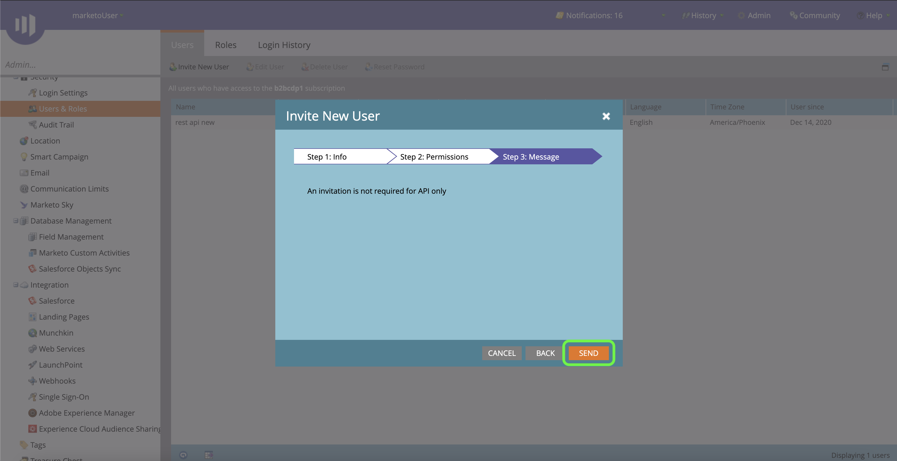

# Authentifizieren Sie Ihre [!DNL Marketo Engage] Quell-Connector

Bevor Sie eine [!DNL Marketo Engage] (nachstehend &quot;genannt)[!DNL Marketo]&quot;) Quell-Connector müssen Sie zunächst einen benutzerdefinierten Dienst über die [!DNL Marketo] -Schnittstelle sowie Werte für Ihre Munchkin-ID, Client-ID und das Client-Geheimnis abrufen.

In der folgenden Dokumentation wird beschrieben, wie Sie Authentifizierungsberechtigungen erfassen, um eine [!DNL Marketo] Quell-Connector.

## Einrichten einer neuen Rolle

Der erste Schritt beim Erwerb Ihrer Authentifizierungsberechtigungen besteht darin, eine neue Rolle über die [[!DNL Marketo]](https://app-sjint.marketo.com/#MM0A1) -Schnittstelle.

Anmelden bei [!DNL Marketo] und wählen Sie **[!DNL Admin]** über die Navigationsleiste am oberen Bildschirmrand.

Die *[!DNL Users & Role]s* Seite enthält Informationen zu Benutzern, Rollen und Anmeldeverlauf. Um eine neue Rolle zu erstellen, wählen Sie **[!DNL Roles]** aus der oberen Kopfzeile und wählen Sie **[!DNL New Role]**.

Das Dialogfeld **[!DNL Create New Role]** wird angezeigt. Geben Sie einen Namen und eine Beschreibung ein und wählen Sie dann die Berechtigungen aus, die Sie für diese Rolle gewähren möchten. Berechtigungen sind auf bestimmte Arbeitsbereiche beschränkt und Benutzer können nur Aktionen in Arbeitsbereichen durchführen, für die sie über Berechtigungen verfügen.

Nachdem Sie die Berechtigungen ausgewählt haben, die Sie gewähren möchten, wählen Sie **[!DNL Create]**.

Sie können eingeschränkte Berechtigungen für die API verwalten, wenn Sie Rollen mit [!DNL Marketo]. Anstatt &quot;Access API&quot;auszuwählen, können Sie eine Rolle mit dem Mindestmaß an Zugriff bereitstellen, indem Sie die folgenden Berechtigungen auswählen:

* [!DNL Read-Only Activity]
* [!DNL Read-Only Assets]
* [!DNL Read-Only Campaign]
* [!DNL Read-Only Company]
* [!DNL Read-Only Custom Object]
* [!DNL Read-Only Custom Object Type]
* [!DNL Read-Only Named Account]
* [!DNL Read-Only Named Account List]
* [!DNL Read-Only Opportunity]
* [!DNL Read-Only Person]
* [!DNL Read-Only Sales Person]

## Einrichten eines neuen Benutzers

Ähnlich wie Rollen können Sie einen neuen Benutzer über die **[!DNL Users & Roles]** Seite. Die **[!DNL Users]** -Seite enthält eine Liste aktiver Benutzer, die derzeit in Marketo bereitgestellt werden. Auswählen **[!DNL Invite New User]** , um einen neuen Benutzer bereitzustellen.

Ein Popover-Dialogfeld wird angezeigt. Geben Sie die entsprechenden Informationen für Ihre E-Mail-Adresse, Vorname, Nachname und Grund an. In diesem Schritt können Sie auch ein Ablaufdatum für den Zugriff auf das neue Benutzerkonto festlegen, das Sie einladen. Wenn Sie fertig sind, wählen Sie **[!DNL Next]** aus.

>[!IMPORTANT]
>
>Beim Einrichten eines neuen Benutzers müssen Sie den Zugriff einem Benutzer zuweisen, der ausschließlich für den von Ihnen erstellten benutzerdefinierten Dienst vorgesehen ist.

Wählen Sie die entsprechenden Felder im **[!DNL Permissions]** und wählen Sie dann **[!DNL API Only]** aktivieren, um dem neuen Benutzer eine API-Rolle bereitzustellen. Auswählen **[!DNL Next]** um fortzufahren.

Um den Prozess abzuschließen, wählen Sie **[!DNL Send]**.

## Einrichten eines benutzerdefinierten Dienstes

Nachdem Sie einen neuen Benutzer eingerichtet haben, können Sie einen benutzerdefinierten Dienst einrichten, um Ihre neuen Anmeldedaten abzurufen. Wählen Sie auf der Admin-Seite **[!DNL LaunchPoint]**.

Die **[!DNL Installed services]** Seite enthält eine Liste der vorhandenen Dienste, um einen neuen benutzerdefinierten Dienst zu erstellen, wählen Sie **[!DNL New]** und wählen Sie **[!DNL New Service]**.

Geben Sie Ihrem neuen Dienst einen beschreibenden Anzeigenamen und wählen Sie **[!DNL Custom]** von **[!DNL Service]** Dropdown-Menü. Geben Sie eine entsprechende Beschreibung ein und wählen Sie dann den Benutzer aus, den Sie bereitstellen möchten, aus dem **[!DNL API Only User]** Dropdown-Menü. Nachdem Sie die erforderlichen Details ausgefüllt haben, wählen Sie **[!DNL Create]** , um Ihren neuen benutzerdefinierten Dienst zu erstellen.

## Abrufen Ihrer Client-ID und des Client-Geheimnisses

Mit einem neuen benutzerdefinierten Dienst können Sie jetzt Werte für Ihre Client-ID und Ihr Client-Geheimnis abrufen. Aus dem **[!DNL Installed Services]** , suchen Sie den benutzerdefinierten Dienst, auf den Sie zugreifen möchten, und wählen Sie **[!DNL View Details]**.

Es wird ein Dialogfeld mit Ihrer Client-ID und dem Client-Geheimnis angezeigt.

## Munchkin-ID abrufen

Der letzte Schritt, den Sie zum Authentifizieren Ihrer [!DNL Marketo] -Quell-Connector zum Abrufen Ihrer Munchkin-ID. Wählen Sie auf der Admin-Seite **[!DNL Munchkin]** unter **[!DNL Integration]** Bereich.

Die *[!DNL Munchkin]* angezeigt, wobei Ihre eindeutige Munchkin-ID oben im Bedienfeld aufgelistet ist.

In Kombination mit Ihrer Client-ID und dem Client-Geheimnis können Sie Ihre Munchkin-ID verwenden, um ein neues Konto zu konfigurieren und [eine neue [!DNL Marketo] Quellverbindung](../../../tutorials/ui/create/adobe-applications/marketo.md) auf Experience Platform.
