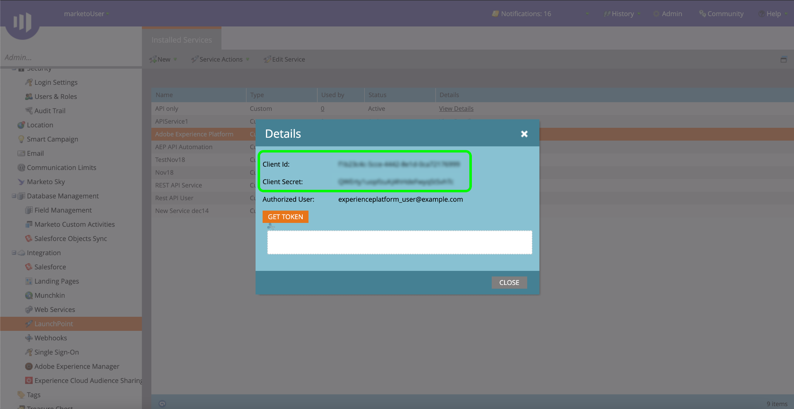

# (Beta) Quellanschluss [!DNL Marketo Engage] authentifizieren

>[!IMPORTANT]
>
>Die Quelle [!DNL Marketo Engage] in Adobe Experience Platform befindet sich derzeit in der Betaversion. Dokumentation und Funktionalität können sich ändern.

Bevor Sie einen Quell-Connector vom Typ [!DNL Marketo Engage] (nachfolgend als &quot;[!DNL Marketo]&quot;bezeichnet) erstellen können, müssen Sie zunächst einen benutzerdefinierten Dienst über die [!DNL Marketo]-Schnittstelle einrichten und Werte für Ihre Munchkin-ID, Client-ID und das Client-Geheimnis abrufen.

In der folgenden Dokumentation finden Sie Schritte zum Erwerb von Authentifizierungsberechtigungen, um einen [!DNL Marketo]-Quell-Connector zu erstellen.

## Einrichten einer neuen Rolle

Der erste Schritt beim Erwerb Ihrer Authentifizierungsberechtigungen besteht darin, über die [[!DNL Marketo]](https://app-sjint.marketo.com/#MM0A1)-Schnittstelle eine neue Rolle einzurichten.

Melden Sie sich bei [!DNL Marketo] an und wählen Sie **[!DNL Admin]** in der oberen Navigationsleiste aus.

Die Seite *[!DNL Users & Role]s* enthält Informationen zu Benutzern, Rollen und Anmeldungsverläufen. Um eine neue Rolle zu erstellen, wählen Sie **[!DNL Roles]** in der oberen Kopfzeile und dann **[!DNL New Role]** aus.

Das Dialogfeld **[!DNL Create New Role]** wird angezeigt. Geben Sie einen Namen und eine Beschreibung ein und wählen Sie dann die Berechtigungen aus, die Sie für diese Rolle gewähren möchten. Berechtigungen sind auf bestimmte Arbeitsbereiche beschränkt und Benutzer können nur Aktionen in Arbeitsbereichen durchführen, für die sie über Berechtigungen verfügen.

Nachdem Sie die Berechtigungen ausgewählt haben, die Sie gewähren möchten, wählen Sie **[!DNL Create]** aus.

Beim Erstellen von Rollen mit [!DNL Marketo] können Sie eingeschränkte Berechtigungen für die API verwalten. Anstatt &quot;Access API&quot;auszuwählen, können Sie eine Rolle mit dem Mindestmaß an Zugriff bereitstellen, indem Sie die folgenden Berechtigungen auswählen:

* [!DNL Read-Only Activity]
* [!DNL Read-Only Assets]
* [!DNL Read-Only Campaign]
* [!DNL Read-Only Company]
* [!DNL Read-Only Custom Object]
* [!DNL Read-Only Custom Object Type]
* [!DNL Read-Only Named Account]
* [!DNL Read-Only Named Account List]
* [!DNL Read-Only Opportunity]
* [!DNL Read-Only Person]
* [!DNL Read-Only Sales Person]

## Einrichten eines neuen Benutzers

Ähnlich wie Rollen können Sie einen neuen Benutzer über die Seite **[!DNL Users & Roles]** einrichten. Die Seite **[!DNL Users]** enthält eine Liste der aktiven Benutzer, die derzeit in Marketo bereitgestellt werden. Wählen Sie **[!DNL Invite New User]** aus, um einen neuen Benutzer bereitzustellen.

Ein Popover-Dialogfeld wird angezeigt. Geben Sie die entsprechenden Informationen für Ihre E-Mail-Adresse, Vorname, Nachname und Grund an. In diesem Schritt können Sie auch ein Ablaufdatum für den Zugriff auf das neue Benutzerkonto festlegen, das Sie einladen. Wenn Sie fertig sind, wählen Sie **[!DNL Next]** aus.

>[!IMPORTANT]
>
>Beim Einrichten eines neuen Benutzers müssen Sie den Zugriff einem Benutzer zuweisen, der ausschließlich für den von Ihnen erstellten benutzerdefinierten Dienst vorgesehen ist.

Wählen Sie die entsprechenden Felder im Schritt **[!DNL Permissions]** aus und aktivieren Sie dann das Kontrollkästchen **[!DNL API Only]** , um dem neuen Benutzer eine API-Rolle bereitzustellen. Wählen Sie **[!DNL Next]** aus, um fortzufahren.

Um den Prozess abzuschließen, wählen Sie **[!DNL Send]** aus.

## Einrichten eines benutzerdefinierten Dienstes

Nachdem Sie einen neuen Benutzer eingerichtet haben, können Sie einen benutzerdefinierten Dienst einrichten, um Ihre neuen Anmeldedaten abzurufen. Wählen Sie auf der Admin-Seite **[!DNL LaunchPoint]** aus.

Die Seite **[!DNL Installed services]** enthält eine Liste der vorhandenen Dienste. Um einen neuen benutzerdefinierten Dienst zu erstellen, wählen Sie **[!DNL New]** und dann **[!DNL New Service]** aus.

Geben Sie Ihrem neuen Dienst einen beschreibenden Anzeigenamen und wählen Sie dann **[!DNL Custom]** aus dem Dropdown-Menü **[!DNL Service]** aus. Geben Sie eine entsprechende Beschreibung ein und wählen Sie dann den Benutzer aus dem Dropdown-Menü **[!DNL API Only User]** aus, den Sie bereitstellen möchten. Nachdem Sie die erforderlichen Details ausgefüllt haben, wählen Sie **[!DNL Create]** aus, um Ihren neuen benutzerdefinierten Dienst zu erstellen.

## Abrufen Ihrer Client-ID und des Client-Geheimnisses

Mit einem neuen benutzerdefinierten Dienst können Sie jetzt Werte für Ihre Client-ID und Ihr Client-Geheimnis abrufen. Suchen Sie im Menü **[!DNL Installed Services]** den benutzerdefinierten Dienst, auf den Sie zugreifen möchten, und wählen Sie dann **[!DNL View Details]** aus.

Es wird ein Dialogfeld mit Ihrer Client-ID und dem Client-Geheimnis angezeigt.

## Munchkin-ID abrufen

Der letzte Schritt, den Sie zum Authentifizieren Ihres [!DNL Marketo] Quell-Connectors durchführen müssen, besteht darin, Ihre Munchkin-ID abzurufen. Wählen Sie auf der Admin-Seite **[!DNL Munchkin]** unter dem Bedienfeld **[!DNL Integration]** aus.

Die Seite *[!DNL Munchkin]* wird angezeigt, wobei Ihre eindeutige Munchkin-ID oben im Bedienfeld aufgelistet ist.

In Kombination mit Ihrer Client-ID und dem Client-Geheimnis können Sie Ihre Munchkin-ID verwenden, um ein neues Konto zu konfigurieren, und [eine neue [!DNL Marketo] Quellverbindung](../../../tutorials/ui/create/adobe-applications/marketo.md) auf der Experience Platform erstellen.
