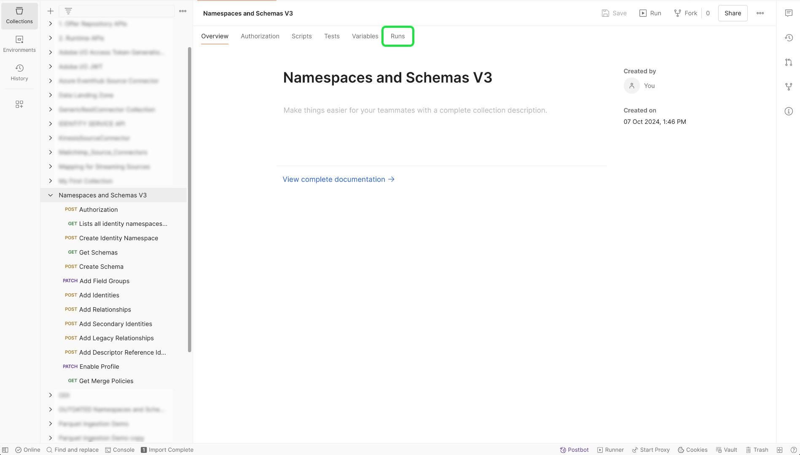

# B2B-Namespaces und -Schemata

>[!AVAILABILITY]
>
>Sie müssen Zugriff auf [Adobe Real-time Customer Data Platform B2B edition](../../../../rtcdp/b2b-overview.md) haben, damit Ihre B2B-Schemas in [Echtzeit-Kundenprofil](../../../../profile/home.md) qualifiziert sind.

>[!NOTE]
>
>Sie können Vorlagen in der Adobe Experience Platform-Benutzeroberfläche verwenden, um die Asset-Erstellung für B2B- und B2C-Daten zu beschleunigen. Weitere Informationen finden Sie im Handbuch zum Verwenden von Vorlagen in der Platform-Benutzeroberfläche ](../../../tutorials/ui/templates.md).[

In diesem Dokument finden Sie Informationen zum zugrunde liegenden Setup für Namespaces und Schemas, die mit B2B-Quellen verwendet werden sollen. In diesem Dokument finden Sie außerdem Informationen zum Einrichten Ihres Automatisierungsdienstprogramms für Postman, das zum Generieren von B2B-Namespaces und -Schemas erforderlich ist.

## Einrichten von B2B-Namespaces und des Dienstprogramm zur automatischen Schemaerstellung

>[!IMPORTANT]
>
>Die Anmeldedaten für Dienstkonten (JWT) werden nicht mehr unterstützt. Sie müssen sicherstellen, dass Sie Ihre Anwendung oder Integration vor dem 27. Januar 2025 in die neue OAuth-Server-zu-Server-Berechtigung migrieren. In der folgenden Dokumentation finden Sie ausführliche Schritte zum [Migrieren Ihrer JWT-Berechtigung zu OAuth-Server-zu-Server-Anmeldedaten](https://developer.adobe.com/developer-console/docs/guides/authentication/ServerToServerAuthentication/migration/).

Informationen zur Einrichtung Ihrer [!DNL Postman] -Umgebung zur Unterstützung des B2B-Namespace und des Dienstprogramm zur automatischen Schemaerstellung finden Sie in der folgenden Dokumentation .

- Sie können die Sammlung und Umgebung des Dienstprogramms für die automatische Generierung von Namespace- und Schemas von diesem [GitHub-Repository](https://github.com/adobe/experience-platform-postman-samples/tree/master/Postman%20Collections/CDP%20Namespaces%20and%20Schemas%20Utility) herunterladen.
- Informationen zur Verwendung von Platform-APIs, einschließlich Details zum Sammeln von Werten für erforderliche Kopfzeilen und zum Lesen von Beispiel-API-Aufrufen, finden Sie im Leitfaden zu den ersten Schritten mit Platform-APIs ](../../../../landing/api-guide.md).[
- Informationen zum Generieren Ihrer Anmeldeinformationen für Platform-APIs finden Sie im Tutorial zum [Authentifizieren und Zugreifen auf Experience Platform-APIs](../../../../landing/api-authentication.md).
- Informationen zum Einrichten von [!DNL Postman] für Platform-APIs finden Sie im Tutorial zum [Einrichten der Entwicklerkonsole und  [!DNL Postman]](../../../../landing/postman.md).

Mit der Einrichtung einer Platform-Entwicklerkonsole und [!DNL Postman] können Sie jetzt mit der Anwendung der entsprechenden Umgebungswerte auf Ihre [!DNL Postman] -Umgebung beginnen.

Die folgende Tabelle enthält Beispielwerte sowie zusätzliche Informationen zum Ausfüllen Ihrer [!DNL Postman] -Umgebung:

| Variable | Beschreibung | Beispiel |
| --- | --- | --- |
| `CLIENT_SECRET` | Eine eindeutige Kennung, mit der Ihr `{ACCESS_TOKEN}` generiert wird. Informationen zum Abrufen Ihrer `{CLIENT_SECRET}` finden Sie im Tutorial zum [Authentifizieren und Zugreifen auf Experience Platform-APIs](../../../../landing/api-authentication.md) . | `{CLIENT_SECRET}` |
| `API_KEY` | Eine eindeutige Kennung, mit der Aufrufe an Experience Platform-APIs authentifiziert werden. Informationen zum Abrufen Ihrer `{API_KEY}` finden Sie im Tutorial zum [Authentifizieren und Zugreifen auf Experience Platform-APIs](../../../../landing/api-authentication.md) . | `c8d9a2f5c1e03789bd22e8efdd1bdc1b` |
| `ACCESS_TOKEN` | Das Autorisierungstoken, das zum Abschließen von Aufrufen an Experience Platform-APIs erforderlich ist. Informationen zum Abrufen Ihrer `{ACCESS_TOKEN}` finden Sie im Tutorial zum [Authentifizieren und Zugreifen auf Experience Platform-APIs](../../../../landing/api-authentication.md) . | `Bearer {ACCESS_TOKEN}` |
| `META_SCOPE` | In Bezug auf [!DNL Marketo] ist dieser Wert fest festgelegt und immer auf: `ent_dataservices_sdk` festgelegt. | `ent_dataservices_sdk` |
| `CONTAINER_ID` | Der `global` -Container enthält alle vom Experience Platform-Partner bereitgestellten Standardklassen, Schemafeldgruppen, Datentypen und Schemata. In Bezug auf [!DNL Marketo] ist dieser Wert festgelegt und immer auf `global` gesetzt. | `global` |
| `TECHNICAL_ACCOUNT_ID` | Eine Berechtigung zur Integration in Adobe I/O. | `D42AEVJZTTJC6LZADUBVPA15@techacct.adobe.com` |
| `IMS` | Das Identity Management-System (IMS) stellt das Framework für die Authentifizierung bei Adobe-Diensten bereit. In Bezug auf [!DNL Marketo] ist dieser Wert festgelegt und immer auf: `ims-na1.adobelogin.com` festgelegt. | `ims-na1.adobelogin.com` |
| `IMS_ORG` | Eine Unternehmenseinheit, die Produkte und Dienste besitzen oder lizenzieren und Zugriff auf ihre Mitglieder gewähren kann. Anweisungen zum Abrufen Ihrer `{ORG_ID}` -Informationen finden Sie im Tutorial zum Einrichten der Entwicklerkonsole mit [und  [!DNL Postman]](../../../../landing/postman.md) . | `ABCEH0D9KX6A7WA7ATQE0TE@adobeOrg` |
| `SANDBOX_NAME` | Der Name der verwendeten virtuellen Sandbox-Partition. | `prod` |
| `TENANT_ID` | Eine ID, mit der sichergestellt wird, dass die von Ihnen erstellten Ressourcen den richtigen Namespace aufweisen und in Ihrem Unternehmen enthalten sind. | `b2bcdpproductiontest` |
| `PLATFORM_URL` | Der URL-Endpunkt, an den Sie API-Aufrufe durchführen. Dieser Wert ist fest und immer auf `http://platform.adobe.io/` festgelegt. | `http://platform.adobe.io/` |

{style="table-layout:auto"}

### Scripts ausführen

Nachdem Sie die [!DNL Postman] -Sammlung und -Umgebung eingerichtet haben, können Sie das Skript jetzt über die [!DNL Postman] -Oberfläche ausführen.

Wählen Sie in der Benutzeroberfläche von [!DNL Postman] den Stammordner des Autogenerator-Dienstprogramms aus und wählen Sie dann **[!DNL Run]** aus der oberen Kopfzeile aus.

Die Oberfläche [!DNL Runner] wird angezeigt. Stellen Sie von hier aus sicher, dass alle Kontrollkästchen aktiviert sind, und wählen Sie dann **[!DNL Run Namespaces and Schemas Autogeneration Utility]** aus.

Eine erfolgreiche Anfrage erstellt die für B2B erforderlichen Namespaces und Schemas.

## B2B-Namespaces

Identitäts-Namespaces sind eine Komponente von [[!DNL Identity Service]](../../../../identity-service/home.md) , die dazu dient, den Kontext einer Identität zu unterscheiden. Eine voll qualifizierte Identität umfasst einen Identitätswert und einen Namespace. Weitere Informationen finden Sie in der [Namespaces - Übersicht](../../../../identity-service/features/namespaces.md) .

B2B-Namespaces werden in der primären Identität der Entität verwendet.

Die folgende Tabelle enthält Informationen zum zugrunde liegenden Setup für B2B-Namespaces.

>[!NOTE]
>
>Bitte scrollen Sie nach links/rechts, um den gesamten Tabelleninhalt anzuzeigen.

| Anzeigename | Identitätssymbol | Identitätstyp |
| --- | --- | --- |
| B2B Person | `b2b_person` | `CROSS_DEVICE` |
| B2B-Konto | `b2b_account` | `B2B_ACCOUNT` |
| B2B-Opportunity | `b2b_opportunity` | `B2B_OPPORTUNITY` |
| B2B Opportunity-Personenbeziehung | `b2b_opportunity_person_relation` | `B2B_OPPORTUNITY_PERSON` |
| B2B-Kampagne | `b2b_campaign` | `B2B_CAMPAIGN` |
| B2B-Kampagnenmitglied | `b2b_campaign_member` | `B2B_CAMPAIGN_MEMBER` |
| B2B-Marketing-Liste | `b2b_marketing_list` | `B2B_MARKETING_LIST` |
| B2B-Marketing-Listenmitglied | `b2b_marketing_list_member` | `B2B_MARKETING_LIST_MEMBER` |
| B2B-Konto-Personenbeziehung | `b2b_account_person_relation` | `B2B_ACCOUNT_PERSON` |

{style="table-layout:auto"}

## B2B-Schemata

Schemata dienen in Experience Platform zur konsistenten und wiederverwendbaren Beschreibung der Struktur von Daten. Durch die systemübergreifende einheitliche Definition von Daten wird es einfacher, deren Bedeutung beizubehalten und somit Wert aus Daten zu ziehen.

Bevor Daten in Platform aufgenommen werden können, muss ein Schema erstellt werden, das die Datenstruktur beschreibt und den Datentyp entsprechend des jeweiligen Feldes einschränkt. Schemata bestehen aus einer Basisklasse und keiner oder mehreren Schema-Feldergruppen.

Weitere Informationen zum Schemaaufbaumodell, einschließlich Planungsgrundsätzen und Best Practices, finden Sie in den [Grundlagen des Schemaaufbaus](../../../../xdm/schema/composition.md).

Die folgende Tabelle enthält Informationen zur zugrunde liegenden Einrichtung von B2B-Schemas.

>[!NOTE]
>
>Bitte scrollen Sie nach links/rechts, um den gesamten Tabelleninhalt anzuzeigen.

| Schemaname | Basisklasse | Feldergruppen | [!DNL Profile] im Schema | Primäre Identität | Primärer Identity-Namespace | Sekundäre Identität | Sekundärer Identitäts-Namespace | Beziehung | Anmerkungen |
| --- | --- | --- | --- | --- | --- | --- | --- | --- | --- |
| B2B-Konto | [XDM-Geschäftskonto](../../../../xdm/classes/b2b/business-account.md) | Details zum XDM Business-Konto | Aktiviert | `accountKey.sourceKey` in der Basisklasse | B2B-Konto | `extSourceSystemAudit.externalKey.sourceKey` in der Basisklasse | B2B-Konto | <ul><li>`accountParentKey.sourceKey` in der Feldergruppe &quot;XDM-Geschäftskontodetails&quot;</li><li>Ziel-Eigenschaft: `/accountKey/sourceKey`</li><li>Typ: 1:1</li><li>Referenzschema: B2B-Konto</li><li>Namespace: B2B-Konto</li></ul> |
| B2B Person | [Individuelles XDM-Profil](../../../../xdm/classes/individual-profile.md) | <ul><li>XDM-Geschäftspersonendetails</li><li>XDM-Geschäftspersonenkomponenten</li><li>IdentityMap</li><li>Details zu Einverständnis und Voreinstellungen</li></ul> | Aktiviert | `b2b.personKey.sourceKey` in der Feldergruppe &quot;XDM Business Person Details&quot; | B2B Person | <ol><li>`extSourceSystemAudit.externalKey.sourceKey` der Feldergruppe &quot;XDM Business Person Details&quot;</li><li>`workEmail.address` der Feldergruppe &quot;XDM Business Person Details&quot;</ol></li> | <ol><li>B2B Person</li><li>E-Mail</li></ol> | <ul><li>`personComponents.sourceAccountKey.sourceKey` der Feldergruppe &quot;XDM Business Person Components&quot;</li><li>Typ: Viele-zu-eins</li><li>Referenzschema: B2B-Konto</li><li>Namespace: B2B-Konto</li><li>Ziel-Eigenschaft: accountKey.sourceKey</li><li>Beziehungsname aus dem aktuellen Schema: Konto</li><li>Beziehungsname aus Referenzschema: Personen</li></ul> |
| B2B-Opportunity | [XDM-Geschäftschancen](../../../../xdm/classes/b2b/business-opportunity.md) | XDM Business-Opportunity-Details | Aktiviert | `opportunityKey.sourceKey` in der Basisklasse | B2B-Opportunity | `extSourceSystemAudit.externalKey.sourceKey` in der Basisklasse | B2B-Opportunity | <ul><li>`accountKey.sourceKey` in der Basisklasse</li><li>Typ: Viele-zu-eins</li><li>Referenzschema: B2B-Konto</li><li>Namespace: B2B-Konto</li><li>Ziel-Eigenschaft: `accountKey.sourceKey`</li><li>Beziehungsname aus dem aktuellen Schema: Konto</li><li>Beziehungsname aus Referenzschema: Chancen</li></ul> |
| B2B Opportunity-Personenbeziehung | [XDM Business Opportunity Person Relation](../../../../xdm/classes/b2b/business-opportunity-person-relation.md) | Keine | Aktiviert | `opportunityPersonKey.sourceKey` in der Basisklasse | B2B Opportunity-Personenbeziehung | `extSourceSystemAudit.externalKey.sourceKey` in der Basisklasse | B2B Opportunity-Personenbeziehung | **Erste Beziehung**<ul><li>`personKey.sourceKey` in der Basisklasse</li><li>Typ: Viele-zu-eins</li><li>Referenzschema: B2B Person</li><li>Namespace: B2B Person</li><li>Ziel-Eigenschaft: b2b.personKey.sourceKey</li><li>Beziehungsname aus dem aktuellen Schema: Person</li><li>Beziehungsname aus Referenzschema: Chancen</li></ul>**Zweite Beziehung**<ul><li>`opportunityKey.sourceKey` in der Basisklasse</li><li>Typ: Viele-zu-eins</li><li>Referenzschema: B2B-Chancen </li><li>Namespace: B2B-Chancen </li><li>Ziel-Eigenschaft: `opportunityKey.sourceKey`</li><li>Beziehungsname aus aktuellem Schema: Chancen</li><li>Beziehungsname aus Referenzschema: Personen</li></ul> |
| B2B-Kampagne | [XDM-Geschäftskampagne](../../../../xdm/classes/b2b/business-campaign.md) | XDM Business Campaign-Details | Aktiviert | `campaignKey.sourceKey` in der Basisklasse | B2B-Kampagne | `extSourceSystemAudit.externalKey.sourceKey` in der Basisklasse | B2B-Kampagne |
| B2B-Kampagnenmitglied | [XDM-Geschäftskampagnenmitglieder](../../../../xdm/classes/b2b/business-campaign-members.md) | Abonnentendetails zur XDM Business-Kampagne | Aktiviert | `ccampaignMemberKey.sourceKey` in der Basisklasse | B2B-Kampagnenmitglied | `extSourceSystemAudit.externalKey.sourceKey` in der Basisklasse | B2B-Kampagnenmitglied | **Erste Beziehung**<ul><li>`personKey.sourceKey` in der Basisklasse</li><li>Typ: Viele-zu-eins</li><li>Referenzschema: B2B Person</li><li>Namespace: B2B Person</li><li>Ziel-Eigenschaft: `b2b.personKey.sourceKey`</li><li>Beziehungsname aus dem aktuellen Schema: Person</li><li>Beziehungsname aus Referenzschema: Kampagnen</li></ul>**Zweite Beziehung**<ul><li>`campaignKey.sourceKey` in der Basisklasse</li><li>Typ: Viele-zu-eins</li><li>Referenzschema: B2B-Kampagne</li><li>Namespace: B2B-Kampagne</li><li>Ziel-Eigenschaft: `campaignKey.sourceKey`</li><li>Beziehungsname aus dem aktuellen Schema: Kampagne</li><li>Beziehungsname aus Referenzschema: Personen</li></ul> |
| B2B-Marketing-Liste | [XDM Business Marketing List](../../../../xdm/classes/b2b/business-marketing-list.md) | Keine | Aktiviert | `marketingListKey.sourceKey` in der Basisklasse | B2B-Marketing-Liste | Keine | Keine | Keine | Statische Liste wird nicht mit [!DNL Salesforce] synchronisiert und hat daher keine sekundäre Identität. |
| B2B-Marketing-Listenmitglied | [XDM Business Marketing List Members](../../../../xdm/classes/b2b/business-marketing-list-members.md) | Keine | Aktiviert | `marketingListMemberKey.sourceKey` in der Basisklasse | B2B-Marketing-Listenmitglied | Keine | Keine | **Erste Beziehung**<ul><li>`PersonKey.sourceKey` in der Basisklasse</li><li>Typ: Viele-zu-eins</li><li>Referenzschema: B2B Person</li><li>Namespace: B2B Person</li><li>Ziel-Eigenschaft: `b2b.personKey.sourceKey`</li><li>Beziehungsname aus dem aktuellen Schema: Person</li><li>Beziehungsname aus dem Referenzschema: Marketinglisten</li></ul>**Zweite Beziehung**<ul><li>`marketingListKey.sourceKey` in der Basisklasse</li><li>Typ: Viele-zu-eins</li><li>Referenzschema: B2B Marketing List</li><li>Namespace: B2B-Marketingliste</li><li>Ziel-Eigenschaft: `marketingListKey.sourceKey`</li><li>Beziehungsname aus dem aktuellen Schema: Marketingliste</li><li>Beziehungsname aus Referenzschema: Personen</li></ul> | Statisches Listenelement wird nicht mit [!DNL Salesforce] synchronisiert und hat daher keine sekundäre Identität. |
| B2B-Aktivität | [XDM ExperienceEvent](../../../../xdm/classes/experienceevent.md) | <ul><li>Website besuchen</li><li>Neuer Lead</li><li>Lead konvertieren</li><li>Zur Liste hinzufügen</li><li>Von Liste entfernen</li><li>Zur Opportunity hinzufügen</li><li>Aus der Opportunity entfernen</li><li>Formular ausgefüllt</li><li>Link-Klicks</li><li>E-Mail zugestellt</li><li>E-Mail geöffnet</li><li>E-Mail angeklickt</li><li>E-Mail gebounct</li><li>E-Mail nicht zugestellt (Soft-Bounce)</li><li>E-Mail abbestellt</li><li>Bewertung wurde geändert</li><li>Opportunity aktualisiert</li><li>Status in Kampagnenfortschritt geändert</li><li>Personenkennung</li><li>Marketo Web URL</li><li>Interessanter Moment</li><li>Webhook aufrufen</li><li>Kampagnenkadenz ändern</li><li>Umsatzschritt geändert</li><li>Leads zusammenführen</li><li>E-Mail gesendet</li><li>Kampagnen-Stream ändern</li><li>Zu Campaign hinzufügen</li></ul> | Aktiviert | `personKey.sourceKey` der Feldergruppe &quot;Personen-ID&quot; | B2B Person | Keine | Keine | **Erste Beziehung**<ul><li>Feld `listOperations.listKey.sourceKey`</li><li>Typ: 1:1</li><li>Referenzschema: B2B Marketing List</li><li>Namespace: B2B-Marketingliste</li></ul>**Zweite Beziehung**<ul><li>Feld `opportunityEvent.opportunityKey.sourceKey`</li><li>Typ: 1:1</li><li>Referenzschema: B2B-Chancen</li><li>Namespace: B2B-Chancen</li></ul>**Dritte Beziehung**<ul><li>Feld `leadOperation.campaignProgression.campaignKey.sourceKey`</li><li>Typ: 1:1</li><li>Referenzschema: B2B-Kampagne</li><li>Namespace: B2B-Kampagne</li></ul> | `ExperienceEvent` unterscheidet sich von Entitäten. Die Identität des Erlebnisereignisses ist die Person, die die Aktivität durchgeführt hat. |
| B2B-Konto-Personenbeziehung | [XDM Business Account Person Relation](../../../../xdm/classes/b2b/business-account-person-relation.md) | Identitätszuordnung | Aktiviert | `accountPersonKey.sourceKey` in der Basisklasse | B2B-Konto-Personenbeziehung | Keine | Keine | **Erste Beziehung**<ul><li>`personKey.sourceKey` in der Basisklasse</li><li>Typ: Viele-zu-eins</li><li>Referenzschema: B2B Person</li><li>Namespace: B2B Person</li><li>Ziel-Eigenschaft: `b2b.personKey.SourceKey`</li><li>Beziehungsname aus dem aktuellen Schema: Personen</li><li>Beziehungsname aus dem Referenzschema: Konto</li></ul>**Zweite Beziehung**<ul><li>`accountKey.sourceKey` in der Basisklasse</li><li>Typ: Viele-zu-eins</li><li>Referenzschema: B2B-Konto</li><li>Namespace: B2B-Konto</li><li>Ziel-Eigenschaft: `accountKey.sourceKey`</li><li>Beziehungsname aus dem aktuellen Schema: Konto</li><li>Beziehungsname aus Referenzschema: Personen</li></ul> |

{style="table-layout:auto"}

## Nächste Schritte

Informationen zum Verbinden Ihrer [!DNL Marketo] -Daten mit Platform finden Sie im Tutorial zum Erstellen eines Marketo-Quell-Connectors in der Benutzeroberfläche ](../../../tutorials/ui/create/adobe-applications/marketo.md).[
