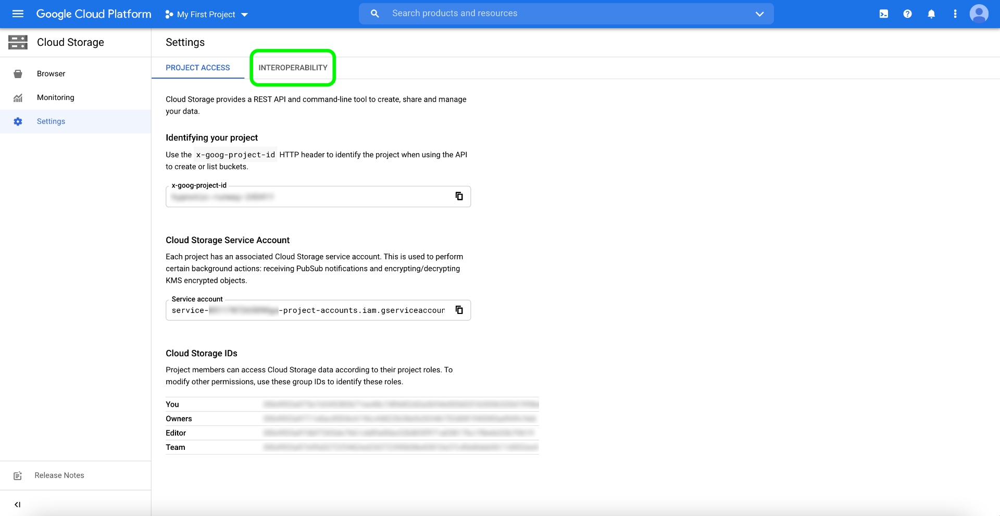

# Google Cloud-Datenspeicherung-Connector

Adobe Experience Platform bietet native Konnektivität für Cloud-Anbieter wie AWS [!DNL Google Cloud Platform]und [!DNL Azure]ermöglicht es Ihnen, Ihre Daten von diesen Systemen zu übertragen.

Cloud storage sources can bring your own data into [!DNL Platform] without the need to download, format, or upload. Ingetierte Daten können als XDM-JSON-, XDM-Parkett oder als Trennzeichen formatiert werden. Jeder Schritt des Prozesses ist in den Sources-Workflow integriert. [!DNL Platform] ermöglicht Ihnen, Daten aus [!DNL Google Cloud Storage] Stapeln einzubringen.

## Zulassungsliste der IP-Adresse

Die folgenden IP-Adressen müssen einer Zulassungsliste hinzugefügt werden, bevor Sie mit Quellschnittstellen arbeiten können. Wenn Sie Ihre regionsspezifischen IP-Adressen nicht zu Ihrer Zulassungsliste hinzufügen, kann dies bei der Verwendung von Quellen zu Fehlern oder Leistungseinbußen führen.

### Ost-USA-Region

- `20.41.2.0/23`
- `20.41.4.0/26`
- `20.44.17.80/28`
- `20.49.102.16/29`
- `40.70.148.160/28`
- `52.167.107.224/28`

### Westeuropa

- `13.69.67.192/28`
- `13.69.107.112/28`
- `13.69.112.128/28`
- `40.74.24.192/26`
- `40.74.26.0/23`
- `40.113.176.232/29`
- `52.236.187.112/28`

### Australien Osten

- `13.70.74.144/28`
- `20.37.193.0/25`
- `20.37.193.128/26`
- `20.37.198.224/29`
- `40.79.163.80/28`
- `40.79.171.160/28`

## Voraussetzungen für die Verbindung mit Ihrem [!DNL Google Cloud Storage] Konto

Um eine Verbindung herzustellen, müssen Sie zunächst die Interoperabilität für Ihr [!DNL Platform][!DNL Google Cloud Storage] Konto aktivieren. Um auf die Interoperabilitätseinstellung zuzugreifen, öffnen [!DNL Google Cloud Platform] und wählen Sie im Navigationsbereich unter der Option &quot; **[!UICONTROL Datenspeicherung]** &quot;die Option &quot; **[!UICONTROL Einstellungen]** &quot;aus.

Die Seite **[!UICONTROL Einstellungen]** wird angezeigt. Von hier aus können Sie Informationen zu Ihrer [!DNL Google] Projekt-ID und Details zu Ihrem [!DNL Google Cloud Storage] Konto sehen. Um auf die Interoperabilitätseinstellungen zuzugreifen, wählen Sie in der oberen Kopfzeile die Option &quot; **[!UICONTROL Interoperabilität]** &quot;aus.

Die Seite &quot; **[!UICONTROL Interoperabilität]** &quot;enthält Informationen zur Authentifizierung, zu Zugriffsschlüsseln und zum Standardprojekt, das mit Ihrem Benutzerkonto verknüpft ist. Wenn Sie noch kein Standardprojekt für den interoperablen Zugriff eingerichtet haben, können Sie eines im Abschnitt *[!UICONTROL &quot;Standard&quot;für den interoperablen Zugriff]* einrichten. Wenn bereits ein Standardprojekt eingerichtet wurde, wird im Abschnitt eine Bestätigung angezeigt, dass ein Projekt als Standard festgelegt wurde.

Um eine neue Zugriffsschlüssel-ID und einen geheimen Zugriffsschlüssel für Ihr Benutzerkonto zu erstellen, wählen Sie &quot;Schlüssel **[!UICONTROL erstellen&quot;]**.

Sie können Ihre neu generierte Zugriffsschlüssel-ID und den geheimen Zugriffsschlüssel verwenden, um Ihr [!DNL Google Cloud Storage] Konto mit Ihrem Konto zu verbinden [!DNL Platform].

## Verbinden [!DNL Google Cloud Storage] mit [!DNL Platform]

Die nachstehende Dokumentation enthält Informationen zum Herstellen einer Verbindung [!DNL Google Cloud Storage] mit [!DNL Platform] APIs oder der Benutzeroberfläche:

### APIs verwenden

- [Erstellen eines Google Cloud-Datenspeicherung-Connectors mithilfe der Flow Service API](../../tutorials/api/create/cloud-storage/google.md)
- [Kennenlernen eines Cloud-Datenspeicherung-Systems mithilfe der Flow Service API](../../tutorials/api/explore/cloud-storage.md)
- [Erfassen von Cloud-Datenspeicherung-Daten mithilfe der Flow Service API](../../tutorials/api/collect/cloud-storage.md)

### Verwenden der UI

- [Erstellen eines Quell-Connectors für Google Cloud Storage über die Benutzeroberfläche](../../tutorials/ui/create/cloud-storage/google-cloud-storage.md)
- [Konfigurieren eines Datenflusses für einen Cloud-Datenspeicherung-Connector in der Benutzeroberfläche](../../tutorials/ui/dataflow/batch/cloud-storage.md)