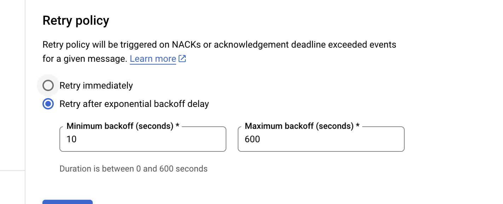

# [!DNL Google PubSub] source

>[!IMPORTANT]
>
>Die [!DNL Google PubSub] -Quelle ist im Quellkatalog für Benutzer verfügbar, die Real-time Customer Data Platform Ultimate erworben haben.

Adobe Experience Platform bietet native Konnektivität für Cloud-Anbieter wie [!DNL AWS], [!DNL Google Cloud Platform] und [!DNL Azure], sodass Sie Daten aus diesen Systemen zur Verwendung in nachgelagerten Services und Zielen in Platform importieren können.

Cloud-Speicher sind eine Quelle, von der Sie Ihre Daten in Platform übertragen können, ohne diese herunterladen, formatieren oder hochladen zu müssen. Aufgenommene Daten können als XDM JSON, XDM Parquet oder mit Trennzeichen formatiert werden. Jeder Schritt des Prozesses wird in den Quell-Workflow integriert. Mit Platform können Sie Daten aus [!DNL Google PubSub] in Echtzeit importieren.

## Voraussetzungen {#prerequisites}

In diesem Abschnitt werden die erforderlichen Einstellungen beschrieben, die Sie vor dem Verbinden Ihrer [!DNL Google PubSub] -Konto auf Experience Platform.

### Dienstkonto erstellen {#create-service-account}

A **Dienstkonto** ist eine Art Konto, das häufig von einer Anwendung oder einem Compute-Workflow verwendet wird, anstatt von einer Person. Ein Dienstkonto wird durch seine E-Mail-Adresse identifiziert, die für das Konto eindeutig ist.

* Zum einen sind Dienstkonten **Prinzipale** - Sie können Dienstkonten Zugriff gewähren auf [!DNL Google Cloud] Ressourcen. Sie können beispielsweise einem Dienstkonto die Rolle &quot;Compute Admin&quot;zuweisen `(roles/compute.admin)` für ein bestimmtes Projekt. Dadurch kann das Dienstkonto dann die Ressourcen des Compute Engine in diesem bestimmten Projekt verwalten.
* Andererseits sind Dienstkonten auch Ressourcen. Sie können anderen Prinzipalen Zugriff auf das Dienstkonto gewähren. Sie können beispielsweise einem Benutzer die Benutzerrolle &quot;Dienstkonto-Benutzer&quot;zuweisen `(roles/iam.serviceAccountUser)` in einem Dienstkonto, damit der Benutzer dieses Dienstkonto an Ressourcen anhängen kann. Alternativ können Sie einem Benutzer die Rolle &quot;Dienstkontoadministrator&quot;zuweisen `(roles/iam.serviceAccountAdmin)` , damit der Benutzer Aufgaben wie das Anzeigen, Bearbeiten, Deaktivieren und Löschen des Dienstkontos erledigen kann.

Weiterführende Informationen zur Bestimmung des richtigen Authentifizierungstyps für Ihren Anwendungsfall finden Sie im Abschnitt [[!DNL Google] Handbuch zu Authentifizierungsmethoden](https://cloud.google.com/docs/authentication).

Gehen Sie wie folgt vor, um ein Dienstkonto zu erstellen:

Navigieren Sie zunächst zum [!DNL IAM] der [!DNL Google Developer Console] und wählen Sie **[!DNL Create Service Account]**.

Geben Sie als Nächstes einen Anzeigenamen und eine ID für Ihr Dienstkonto ein und wählen Sie **[!DNL Create and Continue]**.

### Generieren von Dienstkontoschlüsseln {#generate-service-account-keys}

Um Schlüssel für Ihr Dienstkonto zu generieren, wählen Sie auf der Seite Dienstkonten die Kopfzeile Schlüssel aus. Wählen Sie dort die Option **[!DNL Add key]** und wählen Sie **[!DNL Create new key]** aus dem Dropdown-Menü aus. Sie können dieses Bedienfeld auch verwenden, um einen vorhandenen Schlüssel hochzuladen.

Bei erfolgreicher Ausführung erhalten Sie eine Nachricht, die angibt, dass der private Schlüssel auf Ihrem Computer gespeichert wurde und eine Datei heruntergeladen wird. Sie können dann den Inhalt dieser Datei als Anmeldeinformationen verwenden, wenn Sie Ihre [!DNL Google PubSub] -Konto auf Experience Platform.

### Gewähren von Berechtigungen auf Themen- und Abonnementebene {#grant-permissions}

Um Berechtigungen auf Themen- und Abonnementebene zu erteilen, navigieren Sie zur Seite &quot;Themenkonsole&quot;und wählen Sie dann **[!DNL Show info panel]**. Als Nächstes wird unter dem [!DNL Permissions] Registerkarte auswählen [!DNL Add Principal] und fügen Sie dann den Prinzipal des Dienstkontos zusammen mit den Berechtigungen hinzu.

## Konfigurationen für optimale [!DNL Google PubSub usage] {#optimal-configurations}

In diesem Abschnitt werden die Konfigurationen beschrieben, die Sie vornehmen sollten, um Ihre Nutzung der [!DNL Google PubSub] -Quelle auf Experience Platform.

### Abonnementeigenschaften {#subscription-properties}

Verwenden Sie die [!DNL Google Developer Console] nach **Anhebung der Frist für die Bestätigung**. Dies ermöglicht die [!DNL Google Publisher] , um entsprechend der von Ihnen konfigurierten Zeit zu warten, bevor Sie die Nachricht erneut senden. Diese Verzögerung trägt dazu bei, unnötige Auslastung auf Abonnentenebene zu verringern.

Aktivieren **[!DNL exactly one delivery]**. Diese Konfiguration informiert die [!DNL Google Publisher] , um sicherzustellen, dass Nachrichten, die an das Abonnement gesendet werden, nicht vor Ablauf der Bestätigungsfrist erneut gesendet werden. Sie können diese Einstellung verwenden, um sicherzustellen, dass Bestätigungsnachrichten nicht an das Abonnement zurückgesendet werden.

Sie können **[!DNL Retry after exponential backoff delay]** , um das Risiko einer weiteren Überlastung des Servers zu verringern. Sie können diese Konfiguration im [!DNL Google Developer Console] , um vorübergehende Fehler (temporäre Fehler, die sich normalerweise selbst beheben) besser zu beheben, indem dem System mehr Zeit für die Wiederherstellung zur Verfügung gestellt wird, bevor eine andere Verbindung hergestellt wird.

Sie müssen **Legen Sie die Aufbewahrungsdauer Ihrer Abonnementnachricht auf mindestens 24 Stunden fest.** um sicherzustellen, dass nicht bestätigte Daten bei Spitzenbelastungen nicht verloren gehen. Zusätzlich **Dead-Brief-Thema aktivieren** um sicherzustellen, dass Datenverluste auch in seltenen Edge-Fällen nicht auftreten.

>[!IMPORTANT]
>
>Pro Quelldatensatz kann nur ein Datenfluss erstellt werden. [!DNL Google PubSub] Abonnement. Die Wiederverwendung eines Abonnements, auch über Sandboxes hinweg, führt zum Datenverlust.

## Verbinden [!DNL Google PubSub] auf Experience Platform

Die folgende Dokumentation enthält Informationen dazu, wie Sie [!DNL Google PubSub] mithilfe von APIs oder der Benutzeroberfläche mit Platform verbinden können:

### Verwenden von APIs

* [Erstellen einer Google PubSub-Quellverbindung mit der Flow Service-API](../../tutorials/api/create/cloud-storage/google-pubsub.md)
* [Erfassen von Streaming-Daten mit der Flow Service-API](../../tutorials/api/collect/streaming.md)

### Verwenden der Benutzeroberfläche

* [Erstellen einer Quellverbindung für Google PubSub über die Benutzeroberfläche](../../tutorials/ui/create/cloud-storage/google-pubsub.md)
* [Konfigurieren eines Datenflusses für eine Cloud-Speicherverbindung über die Benutzeroberfläche](../../tutorials/ui/dataflow/streaming/cloud-storage-streaming.md)
