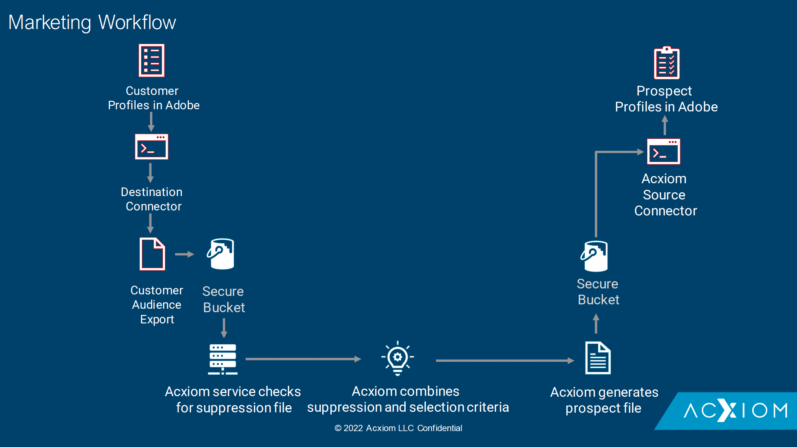

# [!DNL Acxiom Prospecting Data Import]

>[!NOTE]
>
>Die [!DNL Acxiom Prospecting Data Import]-Quelle befindet sich in der Beta-Phase. Weitere Informationen zur Verwendung von Beta-beschrifteten Quellen finden Sie in der [Quellenübersicht](../../home.md#terms-and-conditions) .

Adobe Experience Platform unterstützt die Aufnahme von Daten aus einer Datenpartner-Anwendung. Die Unterstützung für Daten- und Identitätspartner umfasst [!DNL Acxiom Prospecting Data Import].

[!DNL Acxiom]&#39;s Prospecting Data Import for Adobe Real-time Customer Data Platform ist ein Prozess, der die produktivsten potenziellen Zielgruppen bereitstellt. [!DNL Acxiom] nutzt Erstanbieterdaten aus Real-Time CDP über einen sicheren Export und führt diese Daten über ein preisgekröntes Hygiene- und Identitätsauflösungssystem aus. Es wird eine Datendatei erstellt, die als Unterdrückungsliste verwendet werden kann. Diese Datendatei wird dann mit der [!DNL Acxiom Global] -Datenbank abgeglichen, wodurch die Interessentenlisten für den Import angepasst werden können.

Sie können die [!DNL Acxiom]-Quelle verwenden, um Antworten aus dem [!DNL Acxiom] Prospektdienst abzurufen und zuzuordnen, indem Sie [!DNL Amazon S3] als Ablagepunkt verwenden.

Im folgenden Dokument erfahren Sie, wie Sie Ihr [!DNL Acxiom Prospecting Data Import] -Quellkonto einrichten können.

## Voraussetzungen

Um auf Ihren Bucket auf dem Experience Platform zuzugreifen, müssen Sie gültige Werte für die folgenden Anmeldedaten angeben:

| Anmeldedaten | Beschreibung |
| --- | --- |
| [!DNL Acxiom] Authentifizierungsschlüssel | Der Authentifizierungsschlüssel. Sie können diesen Wert vom [!DNL Acxiom]-Team abrufen. |
| [!DNL Amazon S3] Zugriffsschlüssel | Die Zugriffsschlüssel-ID für Ihren Behälter. Sie können diesen Wert vom [!DNL Acxiom]-Team abrufen. |
| Geheimer [!DNL Amazon S3]-Schlüssel | Die geheime Schlüssel-ID für Ihren Bucket. Sie können diesen Wert vom [!DNL Acxiom]-Team abrufen. |
| Behältername | Dies ist Ihr Bucket, in dem Dateien freigegeben werden. Sie können diesen Wert vom [!DNL Acxiom]-Team abrufen. |

## IP-Adressen-Zulassungsliste

Vor der Arbeit mit Quell-Connectoren muss einer Zulassungsliste eine Liste von IP-Adressen hinzugefügt werden. Wenn Sie Ihre regionsspezifischen IP-Adressen nicht zu Ihrer Zulassungsliste hinzufügen, kann dies bei der Verwendung von Quellen zu Fehlern oder Performance-Einbußen führen. Weitere Information finden Sie unter [IP-Adressen-Zulassungsliste](../../ip-address-allow-list.md).

### Berechtigungen auf Experience Platform konfigurieren

Sie müssen sowohl über die Berechtigung **[!UICONTROL Quellen anzeigen]** als auch über die Berechtigung **[!UICONTROL Quellen verwalten]** für Ihr Konto verfügen, um Ihr [!DNL Acxiom Prospecting Data Import]-Konto mit Experience Platform zu verbinden. Wenden Sie sich an Ihren Produktadministrator, um die erforderlichen Berechtigungen zu erhalten. Weitere Informationen finden Sie im Benutzerhandbuch zur Zugriffskontrolle [.](../../../access-control/abac/ui/permissions.md)

## Namensbeschränkungen für Dateien und Verzeichnisse

Die unten aufgeführten Einschränkungen müssen bei der Benennung Ihrer Cloud-Speicherdatei oder des -Ordners berücksichtigt werden:

- Die Namen von Verzeichnis- und Dateikomponenten dürfen nicht länger als 255 Zeichen sein.
- Verzeichnis- und Dateinamen dürfen nicht mit einem Schrägstrich (`/`) enden. Wenn angegeben, wird er automatisch entfernt.
- Die folgenden Zeichen der reservierten URL müssen ordnungsgemäß maskiert sein: `! ' ( ) ; @ & = + $ , % # [ ]`
- Die folgenden Zeichen sind nicht zulässig: `" \ / : | < > * ?`.
- Unzulässige URL-Pfadzeichen sind nicht zulässig. Code-Punkte wie `\uE000` sind zwar in NTFS-Dateinamen gültig, aber keine gültigen Unicode-Zeichen. Darüber hinaus sind einige ASCII- oder Unicode-Zeichen wie Steuerzeichen (0x00 bis 0x1F, \u0081 usw.) ebenfalls nicht zulässig. Regeln für Unicode-Zeichenfolgen in HTTP/1.1 finden Sie unter [RFC 2616, Abschnitt 2.2: Grundregeln](https://www.ietf.org/rfc/rfc2616.txt) und [RFC 3987](https://www.ietf.org/rfc/rfc3987.txt).
- Die folgenden Dateinamen sind nicht zulässig: LPT1, LPT2, LPT3, LPT4, LPT5, LPT6, LPT7, LPT8, LPT9, COM1, COM2, COM3, COM4, COM5, COM6, COM7, COM8, COM9, PRN, AUX, NUL, CON, CLOCK$, Punktzeichen (.) und zwei Punktzeichen (..).

## Nächste Schritte

Durch Lesen dieses Dokuments haben Sie die erforderliche Einrichtung abgeschlossen, um Daten von Ihrem [!DNL Acxiom]-Konto an Experience Platform zu übertragen. Sie können jetzt mit dem Handbuch zum Verbinden von [1}mit dem Experience Platform über die Benutzeroberfläche](../../tutorials/ui/create/data-partners/acxiom-prospecting-data-import.md) fortfahren. [!DNL Acxiom Prospecting Data Import] 
