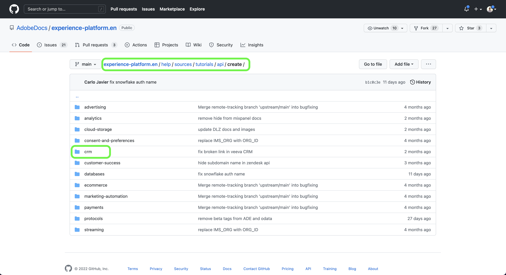

# Verwenden der GitHub-Web-Oberfläche zum Erstellen einer Quelldokumentationsseite

In diesem Dokument wird beschrieben, wie Sie mit der GitHub-Web-Oberfläche eine Dokumentation erstellen und eine Pull Request (PR) senden können.

>[!TIP]
>
>Die folgenden Dokumente aus dem Adobe Contributing Guide können verwendet werden, um Ihren Dokumentationsprozess weiter zu unterstützen: <ul><li>[Installieren von Git- und Markdown-Authoring-Tools](https://experienceleague.adobe.com/docs/contributor/contributor-guide/setup/install-tools.html?lang=de)</li><li>[Richten Sie das Git-Repository zur Dokumentation lokal ein](https://experienceleague.adobe.com/docs/contributor/contributor-guide/setup/local-repo.html?lang=de)</li><li>[GitHub-Beitrags-Workflow für wichtige Änderungen](https://experienceleague.adobe.com/docs/contributor/contributor-guide/setup/full-workflow.html?lang=de)</li></ul>

## Einrichten der GitHub-Umgebung

Der erste Schritt beim Einrichten Ihrer GitHub-Umgebung besteht darin, zum [Adobe Experience Platform GitHub-Repository zu ](https://github.com/AdobeDocs/experience-platform.en).

Wählen Sie als Nächstes **Verzweigung**.

Wenn die Verzweigung abgeschlossen ist, wählen **Master** und geben Sie im angezeigten Dropdown-Menü einen Namen für die neue Verzweigung ein. Stellen Sie sicher, dass Sie einen beschreibenden Namen für Ihre Verzweigung angeben, da dieser zur Einbindung Ihrer Arbeit verwendet wird, und wählen Sie dann **Verzweigung erstellen**.

Navigieren Sie in der GitHub-Ordnerstruktur Ihres abgespalteten Repositorys zu [`experience-platform.en/help/sources/tutorials/api/create/`](https://github.com/AdobeDocs/experience-platform.en/tree/main/help/sources/tutorials/api/create) und wählen Sie dann die entsprechende Kategorie für Ihre Quelle aus der Liste aus. Wenn Sie beispielsweise die Dokumentation für eine neue CRM-Quelle erstellen, wählen Sie **crm** aus.

>[!TIP]
>
>Wenn Sie Dokumentation für die Benutzeroberfläche erstellen, navigieren Sie zu [`experience-platform.en/help/sources/tutorials/ui/create/`](https://github.com/AdobeDocs/experience-platform.en/tree/main/help/sources/tutorials/ui/create) und wählen Sie die entsprechende Kategorie für Ihre Quelle aus. Um Ihre Bilder hinzuzufügen, navigieren Sie zu [`experience-platform.en/help/sources/images/tutorials/create/sdk`](https://github.com/AdobeDocs/experience-platform.en/tree/main/help/sources/images/tutorials/create) und fügen Sie dann Ihre Screenshots zum Ordner `sdk` hinzu.

Ein Ordner mit vorhandenen CRM-Quellen wird angezeigt. Um Dokumentation für eine neue Quelle hinzuzufügen, wählen Sie **Datei hinzufügen** und wählen Sie dann **Neue Datei erstellen** aus dem angezeigten Dropdown-Menü aus.

Benennen Sie Ihre Quelldatei `YOURSOURCE.md` wobei IHRE QUELLE der Name Ihrer Quelle in Experience Platform ist. Wenn Ihr Unternehmen beispielsweise ACME CRM ist, sollte Ihr Dateiname `acme-crm.md` sein.

## Erstellen der Dokumentationsseite für Ihre Quelle

Um mit der Dokumentation Ihrer neuen Quelle zu beginnen, fügen Sie den Inhalt der [Quelldokumentationsvorlage](./template.md) in den GitHub-Web-Editor ein. Sie können auch die Vorlage ([) ](../assets/api-template.zip).

Nachdem die Vorlage in die GitHub-Web-Editor-Oberfläche kopiert wurde, folgen Sie den Anweisungen in der Vorlage und bearbeiten Sie die Werte mit relevanten Informationen für Ihre Quelle.

Wenn Sie fertig sind, übertragen Sie die Datei in Ihrer Verzweigung.

## Reichen Sie Ihre Dokumentation zur Überprüfung ein

Sobald für Ihre Datei ein Commit ausgeführt wurde, können Sie eine Pull-Anfrage (PR) öffnen, um Ihre Arbeitsverzweigung mit der Hauptverzweigung des Adobe-Dokumentations-Repositorys zusammenzuführen. Vergewissern Sie sich, dass die Verzweigung, an der Sie gearbeitet haben, ausgewählt ist, und wählen Sie dann **Vergleichs- und Pull-Anfrage**.

Stellen Sie sicher, dass die Basis- und Vergleichsverzweigungen korrekt sind. Fügen Sie der PR einen Hinweis hinzu, der Ihre Aktualisierung beschreibt, und wählen Sie dann **Pull-Anfrage erstellen** aus. Dadurch wird ein PR geöffnet, in dem der Arbeitszweig Ihrer Arbeit mit dem Hauptzweig des Adobe-Repositorys zusammengeführt wird.

>[!TIP]
>
>Lassen Sie das **Bearbeitung durch Betreuer zulassen** aktiviert, um sicherzustellen, dass das Dokumentations-Team von Adobe Änderungen am PR vornehmen kann.

An dieser Stelle wird eine Benachrichtigung angezeigt, die Sie auffordert, die Adobe Contributor License Agreement (CLA) zu unterzeichnen. Dies ist ein obligatorischer Schritt. Nachdem Sie die CLA signiert haben, aktualisieren Sie die PR-Seite und senden Sie die Pull-Anfrage.

Sie können bestätigen, dass die Pull-Anforderung gesendet wurde, indem Sie die Registerkarte Pull-Anforderungen in https://github.com/AdobeDocs/experience-platform.en überprüfen.

