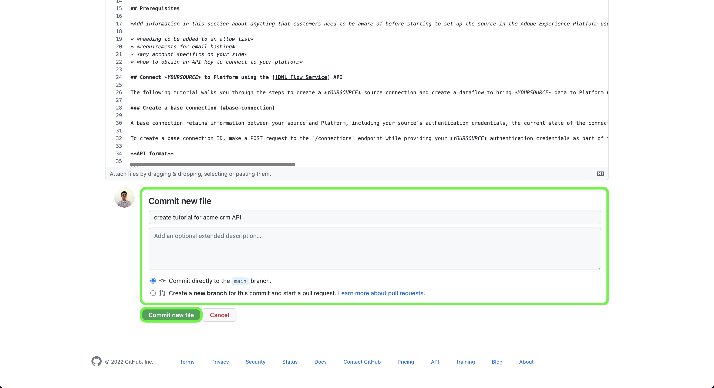
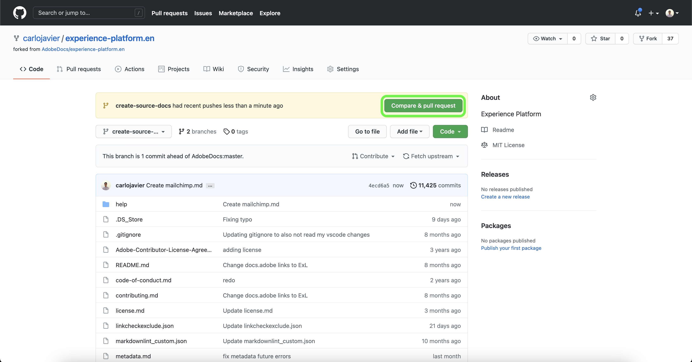

# Verwenden Sie die GitHub-Web-Oberfläche, um eine Quelldokumentationsseite zu erstellen

In diesem Dokument erfahren Sie, wie Sie mit der GitHub-Web-Oberfläche die Dokumentation erstellen und eine Pull-Anforderung (PA) senden können.

>[!TIP]
>
>Die folgenden Dokumente aus dem Adobe Contributing Guide können zur weiteren Unterstützung Ihres Dokumentationsprozesses verwendet werden: <ul><li>[Git- und Markdown-Bearbeitungswerkzeuge installieren](https://experienceleague.adobe.com/docs/contributor/contributor-guide/setup/install-tools.html)</li><li>[ Git-Repository lokal für Dokumentation einrichten](https://experienceleague.adobe.com/docs/contributor/contributor-guide/setup/local-repo.html)</li><li>[Arbeitsablauf für GitHub-Beiträge für umfangreiche Änderungen](https://experienceleague.adobe.com/docs/contributor/contributor-guide/setup/full-workflow.html)</li></ul>

## GitHub-Umgebung einrichten

Der erste Schritt beim Einrichten Ihrer GitHub-Umgebung besteht darin, zum [GitHub-Repository von Adobe Experience Platform](https://github.com/AdobeDocs/experience-platform.en) zu navigieren.

Wählen Sie als Nächstes **Verzweigung** aus.

Nachdem die Verzweigung abgeschlossen ist, wählen Sie **master** aus und geben Sie im angezeigten Dropdown-Menü einen Namen für den neuen Zweig ein. Stellen Sie sicher, dass Sie einen beschreibenden Namen für Ihre Verzweigung angeben, da dieser für Ihre Arbeit verwendet wird, und wählen Sie dann **Verzweigung erstellen**.

Navigieren Sie in der GitHub-Ordnerstruktur Ihres abgespalteten Repositorys zu &quot;[`experience-platform.en/help/sources/tutorials/api/create/`](https://github.com/AdobeDocs/experience-platform.en/tree/main/help/sources/tutorials/api/create)&quot;und wählen Sie dann die entsprechende Kategorie für Ihre Quelle aus der Liste aus. Wenn Sie beispielsweise die Dokumentation für eine neue CRM-Quelle erstellen, wählen Sie **crm** aus.

>[!TIP]
>
>Wenn Sie die Dokumentation für die Benutzeroberfläche erstellen, navigieren Sie zu [`experience-platform.en/help/sources/tutorials/ui/create/`](https://github.com/AdobeDocs/experience-platform.en/tree/main/help/sources/tutorials/ui/create) und wählen Sie die entsprechende Kategorie für Ihre Quelle aus. Um Ihre Bilder hinzuzufügen, navigieren Sie zu [`experience-platform.en/help/sources/images/tutorials/create/sdk`](https://github.com/AdobeDocs/experience-platform.en/tree/main/help/sources/images/tutorials/create) und fügen Sie dann Ihre Screenshots zum Ordner `sdk` hinzu.

Ein Ordner mit vorhandenen CRM-Quellen wird angezeigt. Um die Dokumentation für eine neue Quelle hinzuzufügen, wählen Sie **Datei hinzufügen** und dann **Neue Datei erstellen** aus dem angezeigten Dropdown-Menü.

Nennen Sie Ihre Quelldatei mit &quot;`YOURSOURCE.md`&quot;, wobei YOURSOURCE der Name Ihrer Quelle in Platform ist. Wenn Ihr Unternehmen beispielsweise ACME CRM ist, sollte Ihr Dateiname `acme-crm.md` lauten.

## Erstellen Sie die Dokumentationsseite für Ihre Quelle.

Um mit der Dokumentation der neuen Quelle zu beginnen, fügen Sie den Inhalt der [Vorlage für die Quelldokumentation](./template.md) in den GitHub-Web-Editor ein. Sie können die Vorlage [hier](../assets/api-template.zip) auch herunterladen.

Nachdem die Vorlage in die GitHub-Web-Editor-Oberfläche kopiert wurde, befolgen Sie die in der Vorlage beschriebenen Anweisungen und bearbeiten Sie die Werte, die relevante Informationen für Ihre Quelle enthalten.

Bestätigen Sie nach Abschluss des Vorgangs die Datei in Ihrer Verzweigung.

## Übermitteln der Dokumentation zur Überprüfung

Nachdem die Datei übertragen wurde, können Sie eine Pull-Anfrage (PA) öffnen, um Ihre Arbeitsverzweigung mit der Masterverzweigung des Adobe-Dokumentations-Repositorys zusammenzuführen. Stellen Sie sicher, dass die Verzweigung, an der Sie gearbeitet haben, ausgewählt ist, und wählen Sie dann **Vergleichen und Pull-Anforderung** aus.

Stellen Sie sicher, dass die Basis- und Vergleichsverzweigungen korrekt sind. Fügen Sie der PA einen Hinweis hinzu, beschreiben Sie Ihre Aktualisierung und wählen Sie dann **Pull-Anforderung erstellen** aus. Dadurch wird ein PR-Vorgang zum Zusammenführen der Arbeitsverzweigung Ihrer Arbeit mit der Masterverzweigung des Adobe-Repositorys geöffnet.

>[!TIP]
>
>Lassen Sie das Kontrollkästchen **Änderungen durch Betreuer zulassen** aktiviert, um sicherzustellen, dass das Adobe-Dokumentationsteam Änderungen an der PA vornehmen kann.

An dieser Stelle wird eine Benachrichtigung angezeigt, in der Sie aufgefordert werden, die Lizenzvereinbarung für Adobe Contributor License Agreement (CLA) zu unterzeichnen. Dies ist ein notwendiger Schritt. Nachdem Sie die CLA signiert haben, aktualisieren Sie die PR-Seite und senden Sie die Pull-Anforderung.

Sie können bestätigen, dass die Pull-Anforderung gesendet wurde, indem Sie die Registerkarte &quot;Pull Requests&quot;in https://github.com/AdobeDocs/experience-platform.en überprüfen.

