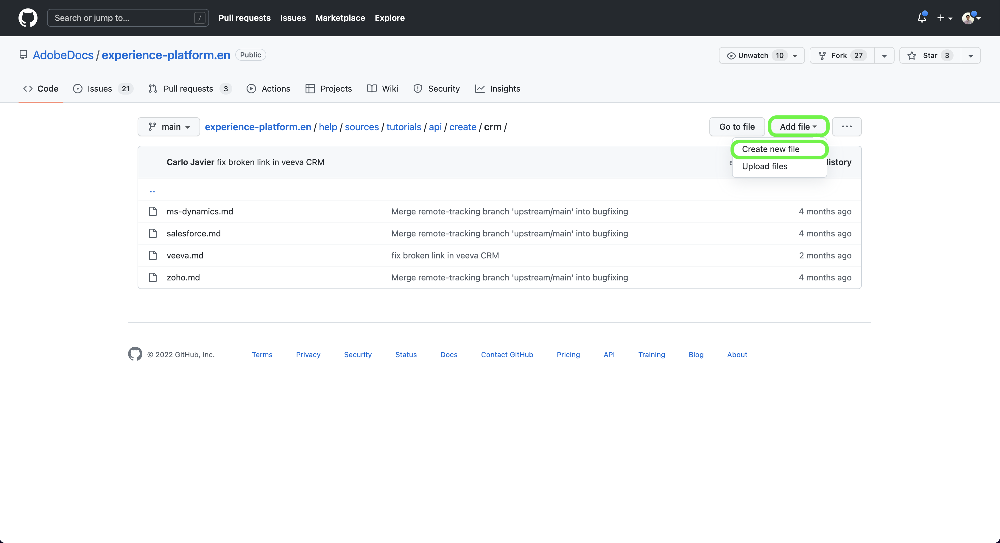
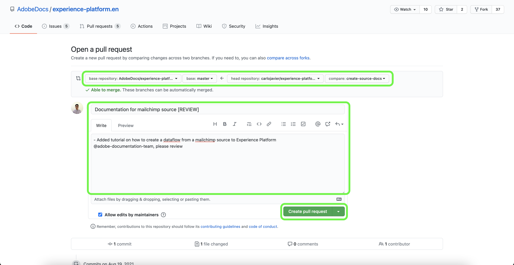

# Verwenden Sie die GitHub-Web-Oberfläche, um eine Quelldokumentationsseite zu erstellen

In diesem Dokument erfahren Sie, wie Sie mit der GitHub-Web-Oberfläche die Dokumentation erstellen und eine Pull-Anforderung (PA) senden können.

>[!TIP]
>
>Die folgenden Dokumente aus dem Beitragsleitfaden der Adobe können zur weiteren Unterstützung Ihres Dokumentationsprozesses verwendet werden: <ul><li>[Git- und Markdown-Bearbeitungswerkzeuge installieren](https://experienceleague.adobe.com/docs/contributor/contributor-guide/setup/install-tools.html?lang=en)</li><li>[Lokales Git-Repository für Dokumentation einrichten](https://experienceleague.adobe.com/docs/contributor/contributor-guide/setup/local-repo.html?lang=en)</li><li>[GitHub-Beitragsarbeitsablauf für umfangreiche Änderungen](https://experienceleague.adobe.com/docs/contributor/contributor-guide/setup/full-workflow.html?lang=en)</li></ul>

## GitHub-Umgebung einrichten

Der erste Schritt bei der Einrichtung Ihrer GitHub-Umgebung besteht darin, zur [Adobe Experience Platform GitHub-Repository](https://github.com/AdobeDocs/experience-platform.en).

Wählen Sie als Nächstes **Verzweigung**.

Nachdem die Verzweigung abgeschlossen ist, wählen Sie **Übergeordnet** und geben Sie im angezeigten Dropdown-Menü einen Namen für die neue Verzweigung ein. Stellen Sie sicher, dass Sie einen beschreibenden Namen für Ihre Verzweigung angeben, da dieser für Ihre Arbeit verwendet wird, und wählen Sie dann **Zweig erstellen**.

Navigieren Sie in der GitHub-Ordnerstruktur Ihres abgespalteten Repositorys zu `experience-platform.en/help/sources/tutorials/api/create/` und wählen Sie dann die gewünschte Kategorie für Ihre Quelle aus der Liste aus. Wenn Sie beispielsweise die Dokumentation für eine neue Cloud-Speicherquelle erstellen, wählen Sie **Cloud-Speicher**.

Ein Ordner mit vorhandenen Cloud-Speicherquellen wird angezeigt. Um die Dokumentation für eine neue Quelle hinzuzufügen, wählen Sie **Datei hinzufügen** und wählen Sie **Neue Datei erstellen** aus dem Dropdown-Menü, das angezeigt wird.

Benennen Sie die Quelldatei. `YOURSOURCE.md` wobei YOURSOURCE der Name Ihrer Quelle in Platform ist. Wenn Ihr Unternehmen beispielsweise [!DNL Mailchimp], sollte Ihr Dateiname `mailchimp.md`.

## Erstellen Sie die Dokumentationsseite für Ihre Quelle.

Fügen Sie den Inhalt der [Quelldokumentationsvorlage](./template.md) in den GitHub-Web-Editor. Sie können auch die Vorlage herunterladen [here](../assets/template.zip).

Nachdem die Vorlage in die GitHub-Web-Editor-Oberfläche kopiert wurde, befolgen Sie die in der Vorlage beschriebenen Anweisungen und bearbeiten Sie die Werte, die relevante Informationen für Ihre Quelle enthalten.

Bestätigen Sie nach Abschluss des Vorgangs die Datei in Ihrer Verzweigung.

## Übermitteln der Dokumentation zur Überprüfung

Nachdem die Datei übertragen wurde, können Sie eine Pull-Anfrage (PA) öffnen, um Ihre Arbeitsverzweigung in die Übergeordnete Verzweigung des Adobe-Dokumentations-Repositorys zusammenzuführen. Vergewissern Sie sich, dass die Verzweigung, an der Sie gearbeitet haben, ausgewählt ist, und wählen Sie dann **Vergleich und Pull-Anforderung**.

Stellen Sie sicher, dass die Basis- und Vergleichsverzweigungen korrekt sind. Fügen Sie einen Hinweis zur PR hinzu, beschreiben Sie Ihr Update und wählen Sie dann **Pull-Anforderung erstellen**. Dadurch wird ein PR-Vorgang zum Zusammenführen der Arbeitsverzweigung Ihrer Arbeit mit der Übergeordneten Verzweigung des Adobe-Repositorys geöffnet.

>[!TIP]
>
>Lassen Sie die **Zulassen von Änderungen durch Maintainer** aktivieren, um sicherzustellen, dass das Adobe-Dokumentationsteam die PR bearbeiten kann.

An dieser Stelle wird eine Benachrichtigung angezeigt, in der Sie aufgefordert werden, die Adobe Contributor License Agreement (CLA) zu unterzeichnen. Dies ist ein notwendiger Schritt. Nachdem Sie die CLA signiert haben, aktualisieren Sie die PR-Seite und senden Sie die Pull-Anforderung.

Sie können bestätigen, dass die Pull-Anforderung gesendet wurde, indem Sie die Registerkarte &quot;Pull Requests&quot;in https://github.com/AdobeDocs/experience-platform.en überprüfen.

