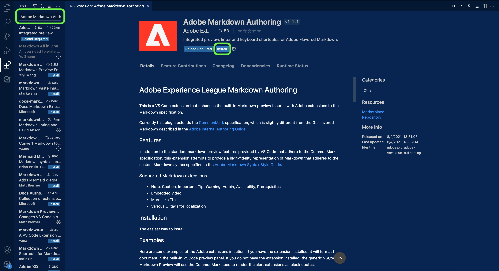

# Verwenden eines Texteditors in Ihrer lokalen Umgebung, um die Seite mit der Quellendokumentation zu erstellen.

In diesem Dokument erfahren Sie, wie Sie mit Ihrer lokalen Umgebung die Dokumentation für Ihre Quelle erstellen und eine Pull-Anforderung (PA) senden können.

>[!TIP]
>
>Die folgenden Dokumente aus dem Beitragsleitfaden der Adobe können zur weiteren Unterstützung Ihres Dokumentationsprozesses verwendet werden: <ul><li>[Git- und Markdown-Bearbeitungswerkzeuge installieren](https://experienceleague.adobe.com/docs/contributor/contributor-guide/setup/install-tools.html?lang=en)</li><li>[Lokales Git-Repository für Dokumentation einrichten](https://experienceleague.adobe.com/docs/contributor/contributor-guide/setup/local-repo.html?lang=en)</li><li>[GitHub-Beitragsarbeitsablauf für umfangreiche Änderungen](https://experienceleague.adobe.com/docs/contributor/contributor-guide/setup/full-workflow.html?lang=en)</li></ul>

## Voraussetzungen

Für das folgende Tutorial muss GitHub Desktop auf Ihrem lokalen Computer installiert sein. Wenn Sie nicht über GitHub Desktop verfügen, können Sie die Anwendung herunterladen [here](https://desktop.github.com/).

## Stellen Sie eine Verbindung zu GitHub her und richten Sie Ihre lokale Authoring-Umgebung ein.

Der erste Schritt bei der Einrichtung Ihrer lokalen Authoring-Umgebung besteht darin, zur [Adobe Experience Platform GitHub-Repository](https://github.com/AdobeDocs/experience-platform.en).

Wählen Sie auf der Hauptseite des Platform GitHub-Repositorys die Option **Verzweigung**.

Um das Repository auf Ihrem lokalen Computer zu klonen, wählen Sie **Code**. Wählen Sie im angezeigten Dropdown-Menü die Option **HTTPS** und wählen Sie dann **Öffnen mit GitHub Desktop**.

>[!TIP]
>
>Weitere Informationen finden Sie im Tutorial zu [Lokales Einrichten des Git-Repositorys zur Dokumentation](https://experienceleague.adobe.com/docs/contributor/contributor-guide/setup/local-repo.html?lang=en#create-a-local-clone-of-the-repository).

Lassen Sie als Nächstes einige Augenblicke zu, bis GitHub Desktop die `experience-platform.en` Repository.

Sobald der Klonprozess abgeschlossen ist, wechseln Sie zu GitHub Desktop , um eine neue Verzweigung zu erstellen. Auswählen **Übergeordnet** aus der oberen Navigation und wählen Sie dann **Neuer Zweig**

Geben Sie im angezeigten Popover-Bedienfeld einen beschreibenden Namen für die Verzweigung ein und wählen Sie dann **Zweig erstellen**.

Wählen Sie als Nächstes **Veröffentlichungsverzweigung**.

## Erstellen Sie die Dokumentationsseite für Ihre Quelle.

Nachdem das Repository auf Ihrem lokalen Computer geklont und eine neue Verzweigung erstellt wurde, können Sie jetzt mit der Erstellung der Dokumentationsseite für Ihre neue Quelle über die [Texteditor Ihrer Wahl](https://experienceleague.adobe.com/docs/contributor/contributor-guide/setup/install-tools.html?lang=en#understand-markdown-editors).

Adobe empfiehlt die Verwendung von [Visual Studio-Code](https://code.visualstudio.com/) und dass Sie die Adobe Markdown Authoring-Erweiterung installieren. Um die Erweiterung zu installieren, starten Sie Visual Studio Code und wählen Sie dann die **Erweiterungen** im linken Navigationsbereich.

Geben Sie als Nächstes ein `Adobe Markdown Authoring` in die Suchleiste ein und wählen Sie dann **Installieren** von der angezeigten Seite aus.

Laden Sie die [Quelldokumentationsvorlage](../assets/api-template.zip) und extrahieren Sie die Datei in `experience-platform.en/help/sources/tutorials/api/create/...` mit [`...`] die Kategorie Ihrer Wahl. Wenn Sie beispielsweise eine Datenbankquelle erstellen, wählen Sie den Datenbankordner aus.

Befolgen Sie abschließend die in der Vorlage beschriebenen Anweisungen und bearbeiten Sie die Vorlage mit den entsprechenden Informationen zu Ihrer Quelle.

## Übermitteln der Dokumentation zur Überprüfung

Um eine Pull-Anforderung (PA) zu erstellen und Ihre Dokumentation zur Überprüfung einzureichen, speichern Sie zunächst Ihre Arbeit in [!DNL Visual Studio Code] (oder Ihres ausgewählten Texteditors). Geben Sie als Nächstes mithilfe von GitHub Desktop eine Commit-Meldung ein und wählen Sie **Commit to create-source-documentation**.

Wählen Sie als Nächstes **Push-Ursprung** , um Ihre Arbeit in den Remote-Zweig hochzuladen.

Um eine Pull-Anforderung zu erstellen, wählen Sie **Pull-Anfrage erstellen**.

Stellen Sie sicher, dass die Basis- und Vergleichsverzweigungen korrekt sind. Fügen Sie einen Hinweis zur PR hinzu, beschreiben Sie Ihr Update und wählen Sie dann **Pull-Anforderung erstellen**. Dadurch wird ein PR-Vorgang zum Zusammenführen der Arbeitsverzweigung Ihrer Arbeit mit der Übergeordneten Verzweigung des Adobe-Repositorys geöffnet.

>[!TIP]
>
>Lassen Sie die **Zulassen von Änderungen durch Maintainer** aktivieren, um sicherzustellen, dass das Adobe-Dokumentationsteam die PR bearbeiten kann.

Sie können bestätigen, dass die Pull-Anforderung gesendet wurde, indem Sie die Registerkarte &quot;Pull Requests&quot;in https://github.com/AdobeDocs/experience-platform.en überprüfen.

