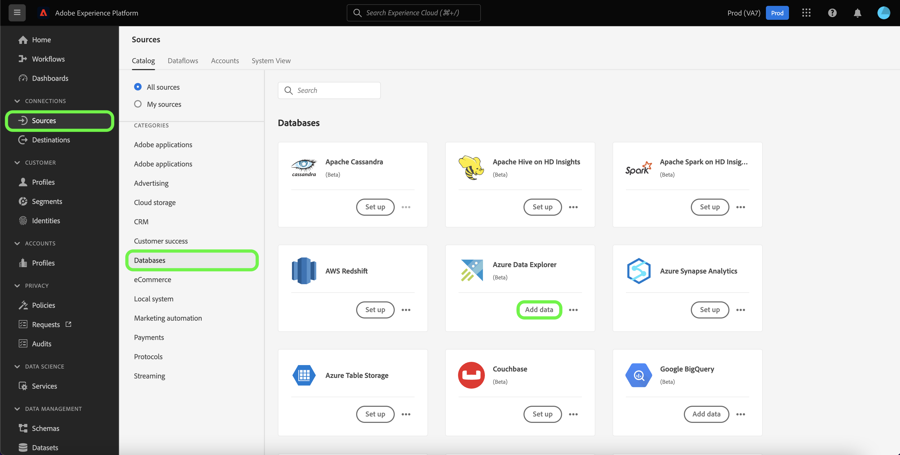

# Erstellen Sie eine *YOURSOURCE* Quellverbindung in der Benutzeroberfläche

*Wenn Sie diese Vorlage durchlaufen, ersetzen oder löschen Sie alle kursiv gedruckten Absätze (beginnend mit dieser).*

*Aktualisieren Sie zunächst die Metadaten (Titel und Beschreibung) oben auf der Seite. Bitte ignorieren Sie alle UICONTROL Instanzen auf dieser Seite. Dies ist ein Tag, das unseren maschinellen Übersetzungsprozessen hilft, die Seite korrekt in die verschiedenen Sprachen zu übersetzen, die wir unterstützen. Wir fügen Ihrer Dokumentation Tags hinzu, nachdem Sie sie gesendet haben.*

In diesem Tutorial werden Schritte zum Erstellen eines *YOURSOURCE* Quell-Connector über die Platform-Benutzeroberfläche.

## Übersicht

*Geben Sie einen kurzen Überblick über Ihr Unternehmen, einschließlich des Nutzens, den es für Kunden bietet. Fügen Sie einen Link zu Ihrer Homepage für die Produktdokumentation hinzu, um ihn weiter zu lesen.*

>[!IMPORTANT]
>
>Diese Quell-Connector- und Dokumentationsseite wird von der *YourSource* Team. Bei Fragen oder Aktualisierungsanfragen wenden Sie sich bitte direkt an *Link oder E-Mail-Adresse einfügen, an die Sie zur Aktualisierung gelangen können*.

## Voraussetzungen

*Fügen Sie in diesem Abschnitt Informationen zu allen Elementen hinzu, die Kunden kennen müssen, bevor sie mit der Einrichtung der Quelle in der Adobe Experience Platform-Benutzeroberfläche beginnen. Dabei kann es sich um Folgendes handeln:*

* *einer Zulassungsliste hinzugefügt werden müssen*
* *Anforderungen für das E-Mail-Hashing*
* *alle Kontospezifikationen auf Ihrer Seite*
* *Abrufen der Authentifizierungsberechtigungen für die Verbindung mit Ihrer Plattform*

### Sammeln erforderlicher Anmeldeinformationen

Um eine Verbindung herzustellen *YOURSOURCE* in Platform angeben, müssen Sie Werte für die folgenden Verbindungseigenschaften angeben:

| Anmeldedaten | Beschreibung | Beispiel |
| --- | --- | --- |
| *Berechtigung eins* | *Fügen Sie hier eine kurze Beschreibung zu den Authentifizierungsberechtigungen Ihrer Quelle hinzu.* | *Fügen Sie hier ein Beispiel für die Authentifizierungsberechtigung Ihrer Quelle hinzu.* |
| *Berechtigung zwei* | *Fügen Sie hier eine kurze Beschreibung zu den Authentifizierungsberechtigungen Ihrer Quelle hinzu.* | *Fügen Sie hier ein Beispiel für die Authentifizierungsberechtigung Ihrer Quelle hinzu.* |
| *Berechtigung drei* | *Fügen Sie hier eine kurze Beschreibung zu den Authentifizierungsberechtigungen Ihrer Quelle hinzu.* | *Fügen Sie hier ein Beispiel für die Authentifizierungsberechtigung Ihrer Quelle hinzu.* |

Weitere Informationen zu diesen Anmeldedaten finden Sie im Abschnitt *YOURSOURCE* Authentifizierungsdokumentation. *Fügen Sie hier einen Link zur Authentifizierungsdokumentation Ihrer Plattform hinzu.*.

## Verbinden Sie *YOURSOURCE* account

Wählen Sie in der Platform-Benutzeroberfläche die Option **[!UICONTROL Quellen]** in der linken Navigationsleiste, um auf den Arbeitsbereich [!UICONTROL Quellen] zuzugreifen. Die [!UICONTROL Katalog] zeigt eine Vielzahl von Quellen an, mit denen Sie ein Konto erstellen können.

Sie können die gewünschte Kategorie aus dem Katalog auf der linken Bildschirmseite auswählen. Alternativ können Sie die gewünschte Quelle mithilfe der Suchoption finden.

Unter dem *KATEGORIE IHRER QUELLE* category, select *YOURSOURCE* und wählen Sie **[!UICONTROL Daten hinzufügen]**.

>[!TIP]
>
>Die folgenden Screenshots sind Beispiele. Ersetzen Sie bei der Erstellung Ihrer Dokumentation die Bilder durch Screenshots Ihrer eigentlichen Quelle. Sie können dasselbe Markierungsmuster und dieselbe Farbe sowie dieselben Dateinamen verwenden. Stellen Sie sicher, dass Ihr Screenshot den gesamten Bildschirm der Platform-Benutzeroberfläche erfasst. Informationen zum Hochladen Ihrer Screenshots finden Sie im Handbuch unter [Übermitteln der Dokumentation zur Überprüfung](./github.md).

Die **[!UICONTROL YOURSOURSOURCE-Konto verbinden]** angezeigt. Auf dieser Seite können Sie entweder neue oder vorhandene Anmeldedaten verwenden.

### Vorhandenes Konto

Um ein vorhandenes Konto zu verwenden, wählen Sie die *YOURSOURCE* Konto, mit dem Sie einen neuen Datenfluss erstellen möchten, wählen Sie **[!UICONTROL Nächste]** um fortzufahren.

### Neues Konto

Wenn Sie ein neues Konto erstellen, wählen Sie **[!UICONTROL Neues Konto]** und geben Sie dann einen Namen, eine optionale Beschreibung und Ihre -Anmeldedaten an. Wenn Sie fertig sind, wählen Sie **[!UICONTROL Mit Quelle verbinden]** und warten Sie, bis die neue Verbindung hergestellt ist.

## Nächste Schritte

*Workflows für die verbleibenden Schritte zum Erstellen eines Datenflusses werden modularisiert. Wenn Sie bestimmte Abfragen bezüglich Ihrer Quelle vornehmen möchten, lesen Sie bitte den Abschnitt mit zusätzlichen Ressourcen unten.*

In diesem Tutorial haben Sie eine Verbindung zu Ihrer *YOURSOURCE* -Konto. Sie können jetzt mit dem nächsten Tutorial fortfahren und einen [Datenfluss konfigurieren, um Daten in Platform zu importieren](https://experienceleague.adobe.com/docs/experience-platform/sources/ui-tutorials/dataflow/crm.html).

## Zusätzliche Ressourcen

*Dies ist ein optionaler Abschnitt, in dem Sie weitere Links zu Ihrer Produktdokumentation oder anderen Schritten, Screenshots und Nuancen bereitstellen können, die Sie als wichtig für den Erfolg des Kunden betrachten. Sie können diesen Abschnitt verwenden, um Informationen oder Tipps zum gesamten Workflow Ihrer Quelle hinzuzufügen, insbesondere wenn es bestimmte &quot;Fallstricke&quot;gibt, auf die ein Endbenutzer stoßen kann.*
