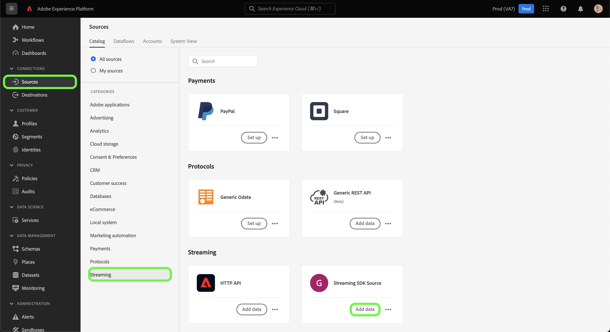

# Erstellen einer Quellverbindung und eines zu streamen Datenflusses *YOURSOURCE* Daten über die Benutzeroberfläche

*Wenn Sie diese Vorlage durchlaufen, ersetzen oder löschen Sie alle kursiv gedruckten Absätze (beginnend mit dieser).*

*Aktualisieren Sie zunächst die Metadaten (Titel und Beschreibung) oben auf der Seite. Bitte ignorieren Sie alle UICONTROL Instanzen auf dieser Seite. Dies ist ein Tag, das unseren maschinellen Übersetzungsprozessen hilft, die Seite korrekt in die verschiedenen Sprachen zu übersetzen, die wir unterstützen. Wir fügen Ihrer Dokumentation Tags hinzu, nachdem Sie sie gesendet haben.*

In diesem Tutorial werden Schritte zum Erstellen eines *YOURSOURCE* Quell-Connector über die Platform-Benutzeroberfläche.

## Übersicht

*Geben Sie einen kurzen Überblick über Ihr Unternehmen, einschließlich des Nutzens, den es für Kunden bietet. Fügen Sie einen Link zu Ihrer Homepage für die Produktdokumentation hinzu, um ihn weiter zu lesen.*

>[!IMPORTANT]
>
>Diese Quell-Connector- und Dokumentationsseite wird von der *YOURSOURCE* Team. Bei Fragen oder Aktualisierungsanfragen wenden Sie sich bitte direkt an *Link oder E-Mail-Adresse einfügen, an die Sie zur Aktualisierung gelangen können*.

## Voraussetzungen

*Fügen Sie in diesem Abschnitt Informationen zu allen Elementen hinzu, die Kunden kennen müssen, bevor sie mit der Einrichtung der Quelle in der Adobe Experience Platform-Benutzeroberfläche beginnen. Dabei kann es sich um Folgendes handeln:*

* *einer Zulassungsliste hinzugefügt werden müssen*
* *Anforderungen für das E-Mail-Hashing*
* *alle Kontospezifikationen auf Ihrer Seite*
* *Abrufen der Authentifizierungsberechtigungen für die Verbindung mit Ihrer Plattform*

### Sammeln erforderlicher Anmeldeinformationen

Um eine Verbindung herzustellen *YOURSOURCE* in Platform angeben, müssen Sie Werte für die folgenden Verbindungseigenschaften angeben:

| Anmeldedaten | Beschreibung | Beispiel |
| --- | --- | --- |
| *Berechtigung eins* | *Fügen Sie hier eine kurze Beschreibung zu den Authentifizierungsberechtigungen Ihrer Quelle hinzu.* | *Fügen Sie hier ein Beispiel für die Authentifizierungsberechtigung Ihrer Quelle hinzu.* |
| *Berechtigung zwei* | *Fügen Sie hier eine kurze Beschreibung zu den Authentifizierungsberechtigungen Ihrer Quelle hinzu.* | *Fügen Sie hier ein Beispiel für die Authentifizierungsberechtigung Ihrer Quelle hinzu.* |
| *Berechtigung drei* | *Fügen Sie hier eine kurze Beschreibung zu den Authentifizierungsberechtigungen Ihrer Quelle hinzu.* | *Fügen Sie hier ein Beispiel für die Authentifizierungsberechtigung Ihrer Quelle hinzu.* |

Weitere Informationen zu diesen Anmeldedaten finden Sie im Abschnitt *YOURSOURCE* Authentifizierungsdokumentation. *Fügen Sie hier einen Link zur Authentifizierungsdokumentation Ihrer Plattform hinzu.*.

### Integrieren *YOURSOURCE* mit Ihrem Webhook

*Das Streaming-SDK erfordert, dass Ihre Quelle Webhooks unterstützen kann, um mit Experience Platform kommunizieren zu können. In diesem Abschnitt müssen Sie die Schritte angeben, die Ihre Benutzer ausführen müssen, um YOURSOURCE mit einem Webhook zu integrieren.*

## Verbinden Sie *YOURSOURCE* account

Wählen Sie in der Platform-Benutzeroberfläche die Option **[!UICONTROL Quellen]** in der linken Navigationsleiste, um auf den Arbeitsbereich [!UICONTROL Quellen] zuzugreifen. Die [!UICONTROL Katalog] zeigt eine Vielzahl von Quellen an, mit denen Sie ein Konto erstellen können.

Sie können die gewünschte Kategorie aus dem Katalog auf der linken Bildschirmseite auswählen. Alternativ können Sie die gewünschte Quelle mithilfe der Suchoption finden.

Unter dem **Streaming** category, select *YOURSOURCE* und wählen Sie **[!UICONTROL Daten hinzufügen]**.

>[!TIP]
>
>Die folgenden Screenshots sind Beispiele. Ersetzen Sie bei der Erstellung Ihrer Dokumentation die Bilder durch Screenshots Ihrer eigentlichen Quelle. Sie können dasselbe Markierungsmuster und dieselbe Farbe sowie dieselben Dateinamen verwenden. Stellen Sie sicher, dass Ihr Screenshot den gesamten Bildschirm der Platform-Benutzeroberfläche erfasst. Informationen zum Hochladen Ihrer Screenshots finden Sie im Handbuch unter [Übermitteln der Dokumentation zur Überprüfung](../documentation/github.md).

## Daten auswählen

Die **[!UICONTROL Daten auswählen]** angezeigt, um eine Oberfläche zur Auswahl der Daten bereitzustellen, die Sie in Platform importieren.

* Der linke Teil der Benutzeroberfläche ist ein Browser, mit dem Sie die verfügbaren Datenströme in Ihrem Konto anzeigen können.
* Im rechten Bereich der Benutzeroberfläche können Sie eine Vorschau von bis zu 100 Zeilen mit Daten aus einer JSON-Datei anzeigen.

Auswählen **[!UICONTROL Dateien hochladen]** , um eine JSON-Datei von Ihrem lokalen System hochzuladen. Alternativ können Sie die hochzuladende JSON-Datei per Drag-and-Drop in die [!UICONTROL Dateien per Drag &amp; Drop verschieben] Bedienfeld.

Nach dem Hochladen Ihrer Datei wird die Vorschau-Oberfläche aktualisiert, um eine Vorschau des hochgeladenen Schemas anzuzeigen. Über die Vorschau-Oberfläche können Sie den Inhalt und die Struktur einer Datei überprüfen. Sie können auch die [!UICONTROL Suchfeld] -Dienstprogramm zum Zugreifen auf bestimmte Elemente aus Ihrem Schema.

Wenn Sie fertig sind, klicken Sie auf die Schaltfläche **[!UICONTROL Weiter]**.

## Datenflussdetails

Die **Datenflussdetails** -Schritt angezeigt, der Ihnen Optionen zur Verwendung eines vorhandenen Datensatzes oder zur Einrichtung eines neuen Datensatzes für Ihren Datenfluss sowie die Möglichkeit bietet, einen Namen und eine Beschreibung für Ihren Datenfluss bereitzustellen. In diesem Schritt können Sie auch Einstellungen für die Profilerfassung, Fehlerdiagnose, partielle Erfassung und Warnhinweise konfigurieren.

Wenn Sie fertig sind, klicken Sie auf die Schaltfläche **[!UICONTROL Weiter]**.

## Zuordnung

Es erfolgt der Schritt der [!UICONTROL Zuordnung], in dem Ihnen eine Schnittstelle zum Zuordnen der Quellfelder aus Ihrem Quellschema zu den entsprechenden XDM-Zielfeldern im Zielschema bereitgestellt wird.

Platform bietet intelligente Empfehlungen für automatisch zugeordnete Felder, die auf dem ausgewählten Zielschema oder Datensatz basieren. Sie können die Zuordnungsregeln manuell an Ihre Anwendungsfälle anpassen. Je nach Bedarf können Sie wahlweise Felder direkt zuordnen oder mithilfe von Datenvorbereitungsfunktionen Quelldaten transformieren, um berechnete oder anderweitig ermittelte Werte abzuleiten. Umfassende Schritte zur Verwendung der Mapper-Oberfläche und der berechneten Felder finden Sie im Abschnitt [Handbuch zur Datenvorbereitung-Benutzeroberfläche](https://experienceleague.adobe.com/docs/experience-platform/data-prep/ui/mapping.html).

Nachdem die Quelldaten erfolgreich zugeordnet wurden, wählen Sie **[!UICONTROL Nächste]**.

## Überprüfung

Der Schritt **[!UICONTROL Überprüfung]** wird angezeigt, sodass Sie Ihren neuen Datenfluss überprüfen können, bevor er hergestellt wird. Die Details lassen sich wie folgt kategorisieren:

* **[!UICONTROL Verbindung]**: Zeigt den Quelltyp, den relevanten Pfad der ausgewählten Quelldatei und die Anzahl der Spalten innerhalb dieser Quelldatei an.
* **[!UICONTROL Datensatz- und Zuordnungsfelder zuweisen]**: Zeigt an, in welchen Datensatz die Quelldaten aufgenommen werden, einschließlich des Schemas, dem der Datensatz entspricht.

Nachdem Sie Ihren Datenfluss überprüft haben, klicken Sie auf **[!UICONTROL Beenden]** und lassen Sie etwas Zeit für die Erstellung des Datenflusses zu.

## Abrufen der Streaming-Endpunkt-URL

Mit dem erstellten Streaming-Datenfluss können Sie jetzt Ihre Streaming-Endpunkt-URL abrufen. Dieser Endpunkt wird zum Abonnieren Ihres Webhooks verwendet, sodass Ihre Streaming-Quelle mit Experience Platform kommunizieren kann.

Um Ihren Streaming-Endpunkt abzurufen, navigieren Sie zum [!UICONTROL Datenfluss-Aktivität] Seite des soeben erstellten Datenflusses und kopieren Sie den Endpunkt vom unteren Rand des [!UICONTROL Eigenschaften] Bedienfeld.

## Nächste Schritte

*Workflows für die verbleibenden Schritte zum Erstellen eines Datenflusses werden modularisiert. Wenn Sie bestimmte Abfragen bezüglich Ihrer Quelle vornehmen möchten, lesen Sie bitte den Abschnitt mit zusätzlichen Ressourcen unten.*

In diesem Tutorial haben Sie eine Verbindung zu Ihrer *YOURSOURCE* -Konto. Sie können jetzt mit dem nächsten Tutorial fortfahren und einen [Datenfluss konfigurieren, um Daten in Platform zu importieren](https://experienceleague.adobe.com/docs/experience-platform/sources/ui-tutorials/dataflow/crm.html).

## Zusätzliche Ressourcen

*Dies ist ein optionaler Abschnitt, in dem Sie weitere Links zu Ihrer Produktdokumentation oder anderen Schritten, Screenshots und Nuancen bereitstellen können, die Sie als wichtig für den Erfolg des Kunden betrachten. Sie können diesen Abschnitt verwenden, um Informationen oder Tipps zum gesamten Workflow Ihrer Quelle hinzuzufügen, insbesondere wenn es bestimmte &quot;Fallstricke&quot;gibt, auf die ein Endbenutzer stoßen kann.*
