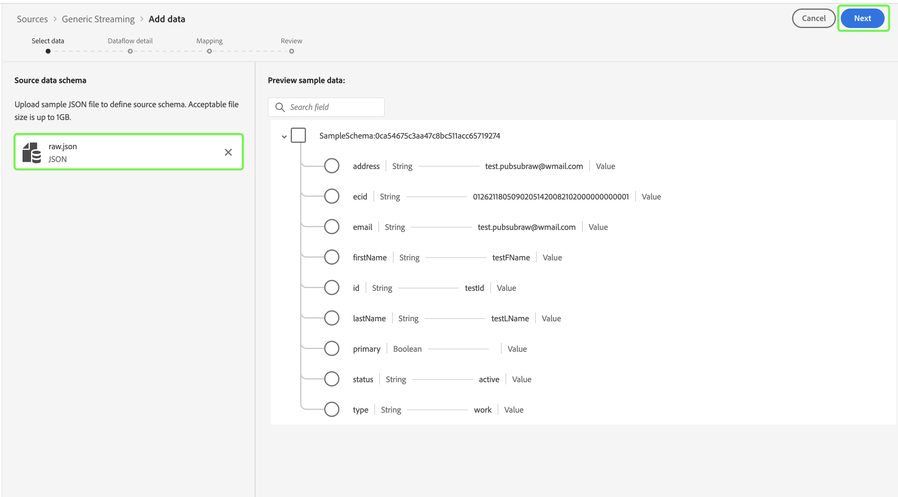

# Testen und Senden der Quelle

Die letzten Schritte zur Integration Ihrer neuen Quelle in Adobe Experience Platform mithilfe von Self-Serve-Quellen (Streaming-SDK) sind das Testen und Senden Ihrer neuen Quelle. Nachdem Sie Ihre Verbindungsspezifikation abgeschlossen und die Streaming-Flussspezifikation aktualisiert haben, können Sie die Funktionalität Ihrer Quelle entweder über die API oder die Benutzeroberfläche testen. Nach erfolgreichem Abschluss können Sie Ihre neue Quelle senden, indem Sie sich an Ihren Adobe-Support-Mitarbeiter wenden.

Das folgende Dokument enthält Schritte zum Testen und Debuggen der Quelle mit dem [[!DNL Flow Service] API](https://www.adobe.io/experience-platform-apis/references/flow-service/).

## Erste Schritte

* Informationen darüber, wie Sie Platform-APIs erfolgreich aufrufen können, finden Sie im Handbuch unter [Erste Schritte mit Platform-APIs](../../../landing/api-guide.md).
* Informationen zum Generieren Ihrer Anmeldeinformationen für Platform-APIs finden Sie im Tutorial zu [Authentifizierung und Zugriff auf Experience Platform-APIs](../../../landing/api-authentication.md).
* Informationen zur Einrichtung von [!DNL Postman] Informationen zu Platform-APIs finden Sie im Tutorial zu [Einrichten der Entwicklerkonsole und [!DNL Postman]](../../../landing/postman.md).
* Laden Sie die [Erfassung und Umgebung der Verifizierung von Self-Serve-Quellen](../assets/sdk-verification.zip) und folgen Sie den unten beschriebenen Schritten.

## Testen der Quelle mit der API

Um Ihre Quelle mithilfe der API zu testen, müssen Sie die [Erfassung und Umgebung der Verifizierung von Self-Serve-Quellen](../assets/sdk-verification.zip) on [!DNL Postman] , während Sie die entsprechenden Umgebungsvariablen für Ihre Quelle angeben.

Um mit dem Testen zu beginnen, müssen Sie zunächst die Sammlung und die Umgebung in [!DNL Postman]. Geben Sie als Nächstes die Verbindungsspezifikations-ID an, die Sie testen möchten.

>[!NOTE]
>
>Alle folgenden Beispielvariablen sind Platzhalterwerte, die Sie aktualisieren müssen, mit Ausnahme von `flowSpecificationId` und `targetConnectionSpecId`, die feste Werte sind.

| Parameter | Beschreibung | Beispiel |
| --- | --- | --- |
| `x-api-key` | Eine eindeutige Kennung, mit der Aufrufe an Experience Platform-APIs authentifiziert werden. Siehe Tutorial zu [Authentifizierung und Zugriff auf Experience Platform-APIs](../../../landing/api-authentication.md) für Informationen zum Abrufen Ihrer `x-api-key`. | `c8d9a2f5c1e03789bd22e8efdd1bdc1b` |
| `x-gw-ims-org-id` | Eine Unternehmenseinheit, die Produkte und Dienste besitzen oder lizenzieren und Zugriff auf ihre Mitglieder gewähren kann. Siehe Tutorial zu [Einrichten der Entwicklerkonsole und [!DNL Postman]](../../../landing/postman.md) Anweisungen zum Abrufen Ihrer `x-gw-ims-org-id` Informationen. | `ABCEH0D9KX6A7WA7ATQE0TE@adobeOrg` |
| `authorizationToken` | Das Autorisierungstoken, das zum Abschließen von Aufrufen an Experience Platform-APIs erforderlich ist. Siehe Tutorial zu [Authentifizierung und Zugriff auf Experience Platform-APIs](../../../landing/api-authentication.md) für Informationen zum Abrufen Ihrer `authorizationToken`. | `Bearer authorizationToken` |
| `schemaId` | Damit die Quelldaten in Platform verwendet werden können, muss ein Zielschema erstellt werden, das die Quelldaten entsprechend Ihren Anforderungen strukturiert. Ausführliche Schritte zum Erstellen eines XDM-Zielschemas finden Sie im Tutorial zum [Erstellen eines Schemas mithilfe der API](../../../xdm/api/schemas.md). | `https://ns.adobe.com/{TENANT_ID}.schemas.0ef4ce0d390f0809fad490802f53d30b` |
| `schemaVersion` | Die eindeutige Version, die Ihrem Schema entspricht. | `application/vnd.adobe.xed-full-notext+json; version=1` |
| `schemaAltId` | Die `meta:altId` wird zusammen mit der  `schemaId` beim Erstellen eines neuen Schemas. | `_{TENANT_ID}.schemas.0ef4ce0d390f0809fad490802f53d30b` |
| `dataSetId` | Ausführliche Anweisungen zum Erstellen eines Zieldatensatzes finden Sie im Tutorial zu [Erstellen eines Datensatzes mithilfe der API](../../../catalog/api/create-dataset.md). | `5f3c3cedb2805c194ff0b69a` |
| `mappings` | Mit Zuordnungssätzen lässt sich definieren, wie Daten in einem Quellschema den Daten eines Zielschemas zugeordnet werden sollen. Ausführliche Anweisungen zum Erstellen einer Zuordnung finden Sie im Tutorial zu [Erstellen eines Zuordnungssatzes mithilfe der API](../../../data-prep/api/mapping-set.md). | `[{"destinationXdmPath":"person.name.firstName","sourceAttribute":"email.email_id","identity":false,"version":0},{"destinationXdmPath":"person.name.lastName","sourceAttribute":"email.activity.action","identity":false,"version":0}]` |
| `mappingId` | Die eindeutige ID, die Ihrem Zuordnungssatz entspricht. | `bf5286a9c1ad4266baca76ba3adc9366` |
| `connectionSpecId` | Die Verbindungsspezifikations-ID, die Ihrer Quelle entspricht. Dies ist die ID, die Sie nach [Erstellen einer neuen Verbindungsspezifikation](./create.md). | `2e8580db-6489-4726-96de-e33f5f60295f` |
| `flowSpecificationId` | Die Flussspezifikations-ID `GenericStreamingAEP`. **Dies ist ein fester Wert**. | `e77fde5a-22a8-11ed-861d-0242ac120002` |
| `targetConnectionSpecId` | Die Zielverbindungs-ID des Data Lake, in dem die erfassten Daten landen. **Dies ist ein fester Wert**. | `c604ff05-7f1a-43c0-8e18-33bf874cb11c` |
| `verifyWatTimeInSecond` | Das festgelegte Zeitintervall, das bei der Überprüfung auf den Abschluss eines Flusslaufs eingehalten werden soll. | `40` |
| `startTime` | Die vorgesehene Startzeit für Ihren Datenfluss. Die Startzeit muss in Unix-Zeit formatiert sein. | `1597784298` |

Nachdem Sie alle Umgebungsvariablen bereitgestellt haben, können Sie mit der Ausführung der Sammlung mit der [!DNL Postman] -Schnittstelle. Im [!DNL Postman] -Benutzeroberfläche die Auslassungszeichen (**...**) neben [!DNL Sources SSSs Verification Collection] und wählen Sie **Ausführen von Sammlungen**.

Die [!DNL Runner] -Schnittstelle angezeigt, über die Sie die Ausführungsreihenfolge Ihres Datenflusses konfigurieren können. Auswählen **Ausführen der SSS-Verification-Sammlung** , um die Sammlung auszuführen.

>[!NOTE]
>
>Sie können **Fluss löschen** über die Checkliste für die Ausführungsreihenfolge , wenn Sie das Dashboard für die Quellenüberwachung in der Platform-Benutzeroberfläche bevorzugen. Sobald Sie jedoch mit dem Test fertig sind, müssen Sie sicherstellen, dass Ihre Testflüsse gelöscht werden.

## Testen der Quelle über die Benutzeroberfläche

Um Ihre Quelle in der Benutzeroberfläche zu testen, navigieren Sie in der Platform-Benutzeroberfläche zum Quellkatalog der Sandbox Ihres Unternehmens. Von hier aus sollte Ihre neue Quelle unter der *Streaming* Kategorie.

Da Ihre neue Quelle jetzt in Ihrer Sandbox verfügbar ist, müssen Sie den Ursprungs-Workflow befolgen, um die Funktionen zu testen. Wählen Sie zunächst **[!UICONTROL Einrichten]**.

Der Schritt [!UICONTROL Daten hinzufügen] wird angezeigt. Um zu testen, ob Ihre Quelle Daten streamen kann, verwenden Sie die linke Seite der Benutzeroberfläche zum Hochladen [Beispiel-JSON-Daten](../assets/testing/raw.json.zip). Nach dem Hochladen Ihrer Daten wird die rechte Seite der Benutzeroberfläche in einer Vorschau der Dateihierarchie Ihrer Daten aktualisiert. Klicken Sie auf **[!UICONTROL Weiter]**, um fortzufahren.

Auf der Seite [!UICONTROL Datenflussdetails] können Sie auswählen, ob Sie einen vorhandenen Datensatz oder einen neuen Datensatz verwenden möchten. Während dieses Prozesses können Sie auch Ihre Daten für die Aufnahme in das Profil konfigurieren und Einstellungen wie [!UICONTROL Fehlerdiagnose] und [!UICONTROL Partielle Erfassung].

Wählen Sie zum Testen **[!UICONTROL Neuer Datensatz]** und geben Sie einen Namen für den Ausgabedatensatz an. Während dieses Schritts können Sie auch eine optionale Beschreibung bereitstellen, um Ihrem Datensatz weitere Informationen hinzuzufügen. Wählen Sie als Nächstes mithilfe der Option [!UICONTROL Erweiterte Suche] oder durch Scrollen durch die Liste der vorhandenen Schemata im Dropdown-Menü ein Schema zum Zuordnen aus. Nachdem Sie ein Schema ausgewählt haben, geben Sie einen Namen und eine Beschreibung für Ihren Datenfluss ein.

Wenn Sie fertig sind, klicken Sie auf die Schaltfläche **[!UICONTROL Weiter]**.

Es erfolgt der Schritt der [!UICONTROL Zuordnung], in dem Ihnen eine Schnittstelle zum Zuordnen der Quellfelder aus Ihrem Quellschema zu den entsprechenden XDM-Zielfeldern im Zielschema bereitgestellt wird.

Platform bietet intelligente Empfehlungen für automatisch zugeordnete Felder, die auf dem ausgewählten Zielschema oder Datensatz basieren. Sie können die Zuordnungsregeln manuell an Ihre Anwendungsfälle anpassen. Je nach Bedarf können Sie wahlweise Felder direkt zuordnen oder mithilfe von Datenvorbereitungsfunktionen Quelldaten transformieren, um berechnete oder anderweitig ermittelte Werte abzuleiten. Umfassende Schritte zur Verwendung der Mapper-Oberfläche und der berechneten Felder finden Sie im Abschnitt [Handbuch zur Datenvorbereitung-Benutzeroberfläche](../../../data-prep/ui/mapping.md)

Nachdem die Quelldaten erfolgreich zugeordnet wurden, wählen Sie **[!UICONTROL Nächste]**.

Der Schritt **[!UICONTROL Überprüfung]** wird angezeigt, sodass Sie Ihren neuen Datenfluss überprüfen können, bevor er hergestellt wird. Die Details lassen sich wie folgt kategorisieren:

* **[!UICONTROL Verbindung]**: Zeigt Ihren Kontonamen, den Typ der Quelle und andere spezifische Informationen zur verwendeten Streaming-Cloud-Speicherquelle an.
* **[!UICONTROL Datensatz- und Zuordnungsfelder zuweisen]**: Zeigt den Zieldatensatz und das Schema an, die Sie für Ihren Datenfluss verwenden.

Nachdem Sie Ihren Datenfluss überprüft haben, klicken Sie auf **[!UICONTROL Beenden]** und gewähren Sie etwas Zeit für die Erstellung des Datenflusses.

Schließlich müssen Sie den Streaming-Endpunkt Ihres Datenflusses abrufen. Dieser Endpunkt wird zum Abonnieren Ihres Webhooks verwendet, sodass Ihre Streaming-Quelle mit Experience Platform kommunizieren kann. Um Ihren Streaming-Endpunkt abzurufen, navigieren Sie zum [!UICONTROL Datenfluss-Aktivität] Seite des soeben erstellten Datenflusses und kopieren Sie den Endpunkt vom unteren Rand des [!UICONTROL Eigenschaften] Bedienfeld.

## Übermitteln Ihrer Quelle

Sobald Ihre Quelle den gesamten Workflow abschließen kann, können Sie sich an Ihren Adobe-Support-Mitarbeiter wenden und Ihre Quelle zur Integration in andere Experience Platform-Organisationen übermitteln.
