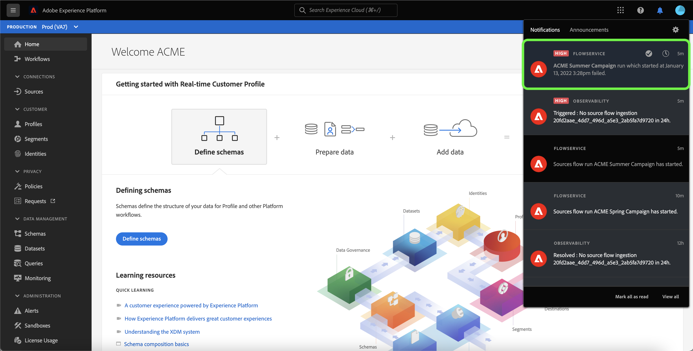

# Warnhinweise für Datenflüsse zu Quellen in der Benutzeroberfläche abonnieren

>[!NOTE]
>
>Warnhinweise werden in Nicht-Produktions-Sandboxes nicht unterstützt. Um Warnhinweise abonnieren zu können, müssen Sie sicherstellen, dass Sie eine Produktions-Sandbox verwenden.

Mit Adobe Experience Platform können Sie ereignisbasierte Warnhinweise zu Adobe Experience Platform-Aktivitäten abonnieren. Warnhinweise verringern oder beseitigen die Notwendigkeit, die [[!DNL Observability Insights] API](../../../observability/api/overview.md) abzufragen, um zu überprüfen, ob ein Auftrag abgeschlossen wurde, ob ein bestimmter Meilenstein innerhalb eines Arbeitsablaufs erreicht wurde oder ob Fehler aufgetreten sind.

Sie können jetzt beim Erstellen eines Ziel-Datenflusses Warnhinweise abonnieren, um Benachrichtigungen zum Status, Erfolg oder Misserfolg Ihres Datenflusses zu erhalten.

In diesem Dokument erfahren Sie, wie Sie Warnhinweise für Ihren Datenfluss zu Quellen abonnieren.

## Erste Schritte

Dieses Dokument setzt ein Verständnis der folgenden Komponenten von Adobe Experience Platform voraus:

* [Quellen](../../home.md): [!DNL Experience Platform] ermöglicht die Aufnahme von Daten aus verschiedenen Quellen und bietet Ihnen die Möglichkeit, die eingehenden Daten mithilfe von [!DNL Platform]-Services zu strukturieren, zu kennzeichnen und anzureichern.
* [Mit Observability können Sie Platform-Aktivitäten mithilfe von statistischen Metriken und Ereignisbenachrichtigungen überwachen.](../../../observability/home.md)[!DNL Observability Insights]
   * [Warnhinweise](../../../observability/alerts/overview.md): Wenn bestimmte Bedingungen in Ihren Platform-Vorgängen erfüllt sind (z. B. ein potenzielles Problem, wenn das System einen Schwellenwert überschreitet), kann Platform allen Benutzern in Ihrer Organisation, die sich für sie angemeldet haben, Warnhinweise bereitstellen.

## Abonnieren von Warnhinweisen in der Benutzeroberfläche {#subscribe-sources-alerts}

>[!CONTEXTUALHELP]
>id="platform_sources_alerts_subscribe"
>title="Abonnieren von Warnmeldungen für Quellen"
>abstract="Warnhinweise ermöglichen den Empfang von Benachrichtigungen zum Status Ihrer Quell-Datenflüsse. Sie können die Warnhinweise so einrichten, dass Sie Aktualisierungen erhalten, wenn Ihr Datenfluss gestartet wurde, erfolgreich war, fehlgeschlagen ist oder keine Daten aufgenommen hat."
>text="Learn more in documentation"

>[!IMPORTANT]
>
>Sie müssen sofortige Benachrichtigungen von E-Mails für Ihr Platform-Konto aktivieren, um E-Mail-basierte Warnhinweise für Ihre Datenflüsse zu erhalten.

Sie können Warnhinweise für Ihre Datenflüsse während der [!UICONTROL Datenflussdetails] Schritt des Ursprungs-Workflows im Arbeitsbereich &quot;Quellen&quot;.

Die verfügbaren Warnhinweise für Datenflüsse zu Quellen sind:

>[!NOTE]
>
>Streaming-Quellen werden derzeit nicht von Warnhinweisen unterstützt. Sie können nur Benachrichtigungen für Batch-Quellen abonnieren.

| Warnhinweise | Beschreibung |
| --- | --- |
| Anfang der Ausführung eines Quellflusses | Dieser Warnhinweis sendet Ihnen eine Nachricht, wenn Ihr Quelldatensatz gestartet wurde. |
| Erfolgreiche Ausführung des Quellflusses | Dieser Warnhinweis sendet Ihnen eine Nachricht, wenn Daten aus Ihrer Quelle erfolgreich in Platform erfasst wurden. |
| Fehler beim Ausführen des Quellflusses | Dieser Warnhinweis sendet Ihnen eine Nachricht, wenn in Ihrem Datenfluss ein Fehler auftritt. |

Wählen Sie die Warnhinweise aus, die Sie abonnieren möchten, und wählen Sie dann **[!UICONTROL Nächste]** , um Ihren Datenfluss zu überprüfen und abzuschließen.

Detaillierte Schritte zum Erstellen eines Datenflusses für Quellen in der Benutzeroberfläche finden Sie in den folgenden Handbüchern:

* [Werbung](./dataflow/advertising.md)
* [Cloud-Speicherplatz](./dataflow/batch/cloud-storage.md)
* [CRM](./dataflow/crm.md)
* [Datenbank](./dataflow/databases.md)
* [E-Commerce](./dataflow/ecommerce.md)
* [Lokale Dateien](./create/local-system/local-file-upload.md)
* [Marketing-Automatisierung](./dataflow/marketing-automation.md)
* [Zahlungen](./dataflow/payments.md)
* [Protokolle](./dataflow/protocols.md)

## Warnungen empfangen

Sobald Ihr Datenfluss ausgeführt wird, können Sie Warnhinweise über die Benutzeroberfläche oder per E-Mail erhalten.

### In der Benutzeroberfläche

Warnhinweise werden in der Benutzeroberfläche durch ein Benachrichtigungssymbol in der oberen Kopfzeile der Platform-Benutzeroberfläche dargestellt. Wählen Sie das Benachrichtigungssymbol aus, um Warnhinweise zu Ihren Datenflüssen anzuzeigen.

Das Fenster &quot;Benachrichtigungen&quot;wird mit einer Liste von Statusaktualisierungen für den von Ihnen erstellten Datenfluss angezeigt.

Sie können den Mauszeiger auf eine Warnmeldung bewegen, um sie als gelesen zu kennzeichnen, oder Sie können das Uhrensymbol auswählen, um zukünftige Erinnerungen zum Status Ihres Datenflusses festzulegen.

Wählen Sie die Warnmeldung aus, um spezifische Informationen zu Ihrem Datenfluss anzuzeigen.

Die [!UICONTROL Übersicht über Datenfluss] angezeigt. In der oberen Hälfte des Bildschirms wird ein Überblick über Ihren Datenfluss angezeigt, einschließlich Informationen zu seinen Attributen, der zugehörigen Datenfluss-Ausführungskennung und einer allgemeinen Fehlerzusammenfassung.

In der unteren Hälfte der Seite werden alle [!UICONTROL Fehler bei Datenfluss-Ausführung] , die während der Datenfluss-Ausführungsphase aufgetreten sind. Hier können Sie eine Vorschau der Fehlerdiagnose anzeigen oder die [[!DNL Data Access] API](https://www.adobe.io/experience-platform-apis/references/data-access/) um die Fehlerdiagnose oder das Dateimanifest herunterzuladen, das Ihrem Datenfluss entspricht.

Weitere Informationen zur Verarbeitung von Datenflug-Fehlern finden Sie im Handbuch unter [Überwachen von Datenflüssen aus Quellen in der Benutzeroberfläche](../../../dataflows/ui/monitor-sources.md).

### Nach E-Mail

Warnhinweise für Ihre Datenflüsse werden Ihnen auch per E-Mail zugestellt. Wählen Sie den Namen des Datenflusses im E-Mail-Textkörper aus, um weitere Informationen zu Ihrem Datenfluss anzuzeigen.

Ähnlich wie bei der UI-Warnung wird die [!UICONTROL Übersicht über Datenfluss] angezeigt werden. Sie erhalten eine Oberfläche, über die Sie alle mit Ihrem Datenfluss verbundenen Fehler untersuchen können.

## Warnungen abonnieren und abmelden

Sie können weitere Warnhinweise abonnieren oder sich von etablierten Warnhinweisen für einen vorhandenen Datenfluss im [!UICONTROL Datenflüsse] Seite. Suchen Sie den erstellten Datenfluss aus der Liste und wählen Sie dann die Auslassungspunkte (`...`), um ein Dropdown-Menü mit Optionen anzuzeigen. Wählen Sie als Nächstes **[!UICONTROL Warnhinweise abonnieren]** , um die Warnhinweiseinstellungen Ihres Datenflusses zu ändern.

Es wird ein Popup-Fenster mit einer Liste von Warnungen zu Quellen angezeigt. Wählen Sie alle Warnhinweise aus, die Sie abonnieren möchten, oder heben Sie die Auswahl für Warnhinweise auf, von denen Sie sich abmelden möchten. Klicken Sie abschließend auf **[!UICONTROL Speichern]**.

## Nächste Schritte

Dieses Dokument enthält eine schrittweise Anleitung zum Abonnieren von kontextbezogenen Warnhinweisen für Ihre Datenflüsse für Quellen. Weitere Informationen finden Sie unter [Warnhinweis-UI-Handbuch](../../../observability/alerts/ui.md).