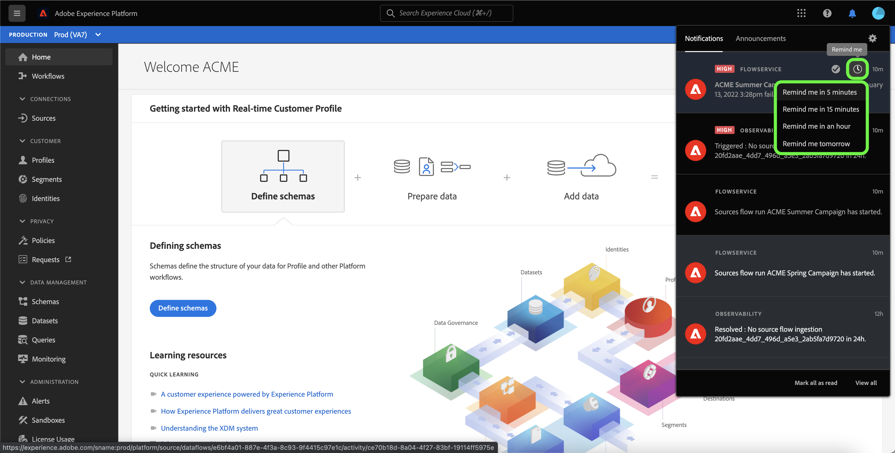

# Abonnieren von Warnhinweisen für Datenflüsse zu Quellen über die Benutzeroberfläche

>[!NOTE]
>
>Warnhinweise werden in Nicht-Produktions-Sandboxes nicht unterstützt. Um Warnhinweise zu abonnieren, müssen Sie sicherstellen, dass Sie eine Produktions-Sandbox verwenden.

Mit Adobe Experience Platform können Sie ereignisbasierte Warnhinweise zu Adobe Experience Platform-Aktivitäten abonnieren. Warnhinweise verringern oder beseitigen die Notwendigkeit, die [[!DNL Observability Insights] API](../../../observability/api/overview.md) abzufragen, um zu überprüfen, ob ein Auftrag abgeschlossen wurde, ob ein bestimmter Meilenstein innerhalb eines Arbeitsablaufs erreicht wurde oder ob Fehler aufgetreten sind.

Sie können beim Erstellen eines Datenflusses Warnhinweise abonnieren, um Benachrichtigungen zum Status, Erfolg oder Misserfolg Ihres Datenflusses zu erhalten.

In diesem Dokument wird beschrieben, wie Sie Warnhinweise für Ihre Quellen-Datenflüsse abonnieren und empfangen können.

## Erste Schritte

Dieses Dokument setzt ein Verständnis der folgenden Komponenten von Adobe Experience Platform voraus:

* [Quellen](../../home.md): [!DNL Experience Platform] ermöglicht die Aufnahme von Daten aus verschiedenen Quellen und bietet Ihnen die Möglichkeit, die eingehenden Daten mithilfe von [!DNL Platform]-Services zu strukturieren, zu kennzeichnen und anzureichern.
* [Observability](../../../observability/home.md): [!DNL Observability Insights] ermöglicht Ihnen die Überwachung von Platform-Aktivitäten mithilfe von statistischen Metriken und Ereignisbenachrichtigungen.
   * [Warnhinweise](../../../observability/alerts/overview.md): Wenn bestimmte Bedingungen in Ihren Platform-Vorgängen erfüllt sind (z. B. ein potenzielles Problem, wenn das System einen Schwellenwert überschreitet), kann Platform allen Benutzern in Ihrer Organisation, die sich dafür angemeldet haben, Warnhinweise senden.

## Abonnieren von Warnhinweisen in der Benutzeroberfläche {#subscribe-sources-alerts}

>[!CONTEXTUALHELP]
>id="platform_sources_alerts_subscribe"
>title="Abonnieren von Warnmeldungen für Quellen"
>abstract="Warnhinweise ermöglichen den Empfang von Benachrichtigungen zum Status Ihrer Quell-Datenflüsse. Sie können die Warnhinweise so einrichten, dass Sie Aktualisierungen erhalten, wenn Ihr Datenfluss gestartet wurde, erfolgreich war, fehlgeschlagen ist oder keine Daten aufgenommen hat."
>text="Learn more in documentation"

>[!IMPORTANT]
>
>Sie müssen sofortige E-Mail-Benachrichtigungen für Ihr Platform-Konto aktivieren, um E-Mail-basierte Warnhinweise für Ihre Datenflüsse zu erhalten.

Sie können Warnhinweise für Ihre Datenflüsse während des Schritts [!UICONTROL Datenflussdetails] des Workflows Quellen im Arbeitsbereich Quellen aktivieren.

Die verfügbaren Warnhinweise für Datenflüsse aus Quellen sind:

>[!NOTE]
>
>Streaming-Quellen werden derzeit nicht von Warnhinweisen unterstützt. Warnhinweise können nur für Batch-Quellen abonniert werden.

| Warnhinweise | Beschreibung |
| --- | --- |
| Anfang der Ausführung eines Quellflusses | Dieser Warnhinweis sendet Ihnen eine Nachricht, wenn Ihr Quelldatenfluss gestartet wurde. |
| Erfolgreiche Ausführung des Quellflusses | Dieser Warnhinweis sendet Ihnen eine Nachricht, wenn Daten aus Ihrer Quelle erfolgreich in Platform aufgenommen wurden. |
| Fehler beim Ausführen des Quellflusses | Dieser Warnhinweis sendet Ihnen eine Meldung, wenn in Ihrem Datenfluss ein Fehler auftritt. |

Wählen Sie die Warnhinweise aus, die Sie abonnieren möchten, und wählen Sie dann **[!UICONTROL Weiter]**, um Ihren Datenfluss zu überprüfen und abzuschließen.

In den folgenden Handbüchern finden Sie ausführliche Schritte zum Erstellen eines Datenflusses zu Quellen in der Benutzeroberfläche:

* [Werbung](./dataflow/advertising.md)
* [Cloud-Speicherplatz](./dataflow/batch/cloud-storage.md)
* [CRM](./dataflow/crm.md)
* [Datenbank](./dataflow/databases.md)
* [E-Commerce](./dataflow/ecommerce.md)
* [Lokale Dateien](./create/local-system/local-file-upload.md)
* [Marketing-Automatisierung](./dataflow/marketing-automation.md)
* [Zahlungen](./dataflow/payments.md)
* [Protokolle](./dataflow/protocols.md)

## Warnungen empfangen

Sobald Ihr Datenfluss ausgeführt wird, können Sie Warnhinweise über die Benutzeroberfläche oder per E-Mail erhalten.

### In der Benutzeroberfläche

Warnhinweise werden in der Benutzeroberfläche durch ein Benachrichtigungssymbol in der oberen Kopfzeile der Platform-Benutzeroberfläche dargestellt. Wählen Sie das Benachrichtigungssymbol aus, um spezifische Warnmeldungen zu Ihren Datenflüssen anzuzeigen.

Das Benachrichtigungsfenster wird mit einer Liste von Statusaktualisierungen zu dem von Ihnen erstellten Datenfluss angezeigt.

Sie können den Mauszeiger über eine Warnmeldung bewegen, um sie als gelesen zu markieren, oder auf das Uhrensymbol klicken, um zukünftige Erinnerungen an den Status Ihres Datenflusses festzulegen.

Wählen Sie die Warnmeldung aus, um spezifische Informationen zu Ihrem Datenfluss anzuzeigen.

Die [!UICONTROL  „Übersicht über die Datenflussausführung] wird angezeigt. In der oberen Hälfte des Bildschirms wird ein Überblick über Ihren Datenfluss angezeigt, einschließlich Informationen zu den Attributen, der entsprechenden Datenflussausführungs-ID und der allgemeinen Fehlerzusammenfassung.

In der unteren Hälfte der Seite werden alle [!UICONTROL Datenflussausführungsfehler) angezeigt] die während der Datenflussausführungsstufe aufgetreten sind. Von hier aus können Sie eine Vorschau der Fehlerdiagnose anzeigen oder die [[!DNL Data Access] API](https://www.adobe.io/experience-platform-apis/references/data-access/) verwenden, um Fehlerdiagnosen oder das Dateimanifest herunterzuladen, das Ihrem Datenfluss entspricht.

Weitere Informationen zum Umgang mit Datenflussfehlern finden Sie im Handbuch [Überwachen von Datenflüssen aus Quellen in der Benutzeroberfläche](../../../dataflows/ui/monitor-sources.md).

### Per E-Mail

Warnhinweise für Ihre Datenflüsse werden Ihnen auch per E-Mail zugestellt. Wählen Sie den Namen des Datenflusses im E-Mail-Textkörper aus, um weitere Informationen zu Ihrem Datenfluss anzuzeigen.

Ähnlich wie beim Warnhinweis in der Benutzeroberfläche wird die Seite [!UICONTROL Übersicht über die Datenflussausführung] angezeigt, auf der Sie eine Oberfläche zur Untersuchung von Fehlern erhalten, die mit Ihrem Datenfluss verbunden sind.

## Warnungen abonnieren und abmelden

Sie können auf der Seite „Datenflüsse“ weitere Warnhinweise abonnieren oder sich von eingerichteten Warnhinweisen für [!UICONTROL  vorhandenen Datenfluss ]. Suchen Sie den von Ihnen erstellten Datenfluss aus der Liste und wählen Sie dann die Auslassungszeichen (`...`) aus, um ein Dropdown-Menü mit Optionen anzuzeigen. Wählen Sie als Nächstes **[!UICONTROL Warnhinweise abonnieren]**, um die Warnhinweiseinstellungen Ihres Datenflusses zu ändern.

Es wird ein Popup-Fenster mit einer Liste von Warnhinweisen für Quellen angezeigt. Wählen Sie alle Warnhinweise aus, die Sie abonnieren möchten, oder heben Sie die Auswahl der Warnhinweise auf, die Sie kündigen möchten. Klicken Sie abschließend auf **[!UICONTROL Speichern]**.

## Nächste Schritte

Dieses Dokument enthält eine Schritt-für-Schritt-Anleitung zum Abonnieren von kontextbezogenen Warnhinweisen für Ihre Quellen-Datenflüsse. Weitere Informationen finden Sie im [Handbuch zur Warnhinweis-Benutzeroberfläche](../../../observability/alerts/ui.md).