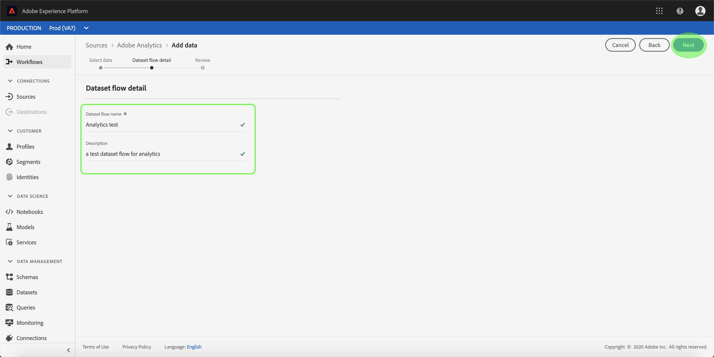
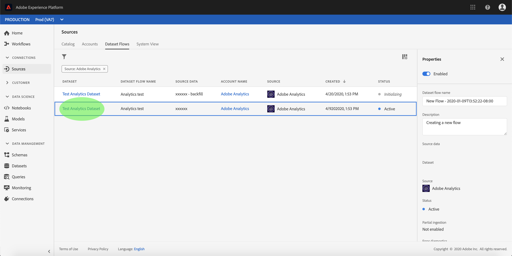
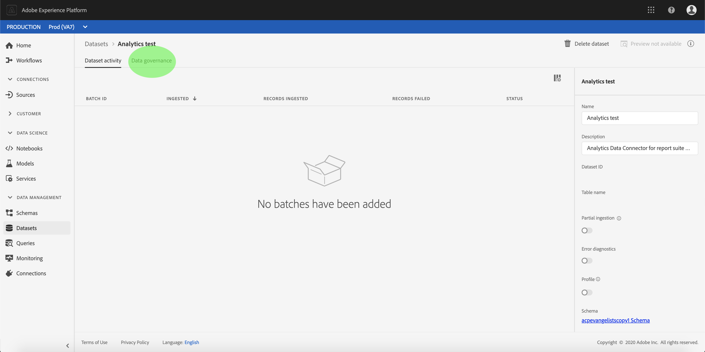

# Erstellen eines Quell-Connectors für Adobe Analytics über die Benutzeroberfläche

In diesem Lernprogramm werden Schritte zum Erstellen eines Adobe Analytics-Quell-Connectors in der Benutzeroberfläche beschrieben, um Verbraucherdaten in Adobe Experience Platform zu importieren.

## Erste Schritte

Dieses Tutorial setzt ein Grundverständnis der folgenden Komponenten von Adobe Experience Platform voraus:

* [Experience-Datenmodell (XDM)-System](../../../../../xdm/home.md): Das standardisierte Framework, mit dem Experience Platform Kundenerlebnisdaten organisiert.
* [Echtzeit-Kundenprofil](../../../../../profile/home.md): Bietet ein einheitliches Echtzeit-Kundenprofil, das auf aggregierten Daten aus verschiedenen Quellen basiert.
* [Sandboxes](../../../../../sandboxes/home.md): Experience Platform bietet virtuelle Sandboxes, die eine einzelne Platform-Instanz in separate virtuelle Umgebungen unterteilen, damit Sie Anwendungen für digitale Erlebnisse entwickeln und weiterentwickeln können.

## Erstellen einer Quellverbindung mit Adobe Analytics

Melden Sie sich bei [Adobe Experience Platform](https://platform.adobe.com) an und wählen Sie dann in der linken Navigationsleiste die Option &quot; **[!UICONTROL Quellen]** &quot;, um auf den Quellarbeitsbereich zuzugreifen. Im Anzeigebereich &quot; *Katalog* &quot;werden verfügbare Quellen zum Erstellen von eingehenden Verbindungen angezeigt. Jede Quelle zeigt die Anzahl der vorhandenen Konten und Datenströme, die ihnen zugeordnet sind.

Sie können die entsprechende Kategorie im Katalog auf der linken Seite des Bildschirms auswählen. Alternativ können Sie die gewünschte Quelle mit der Suchoption finden.

Wählen Sie unter der Kategorie **[!UICONTROL Adobe Applications]** die Option **[!UICONTROL Adobe Analytics]** , um eine Informationsleiste auf der rechten Seite Ihres Bildschirms anzuzeigen. Die Informationsleiste enthält eine kurze Beschreibung der ausgewählten Quelle sowie Optionen zum Herstellen einer Verbindung zur Quelle oder Ansicht der zugehörigen Dokumentation. Um vorhandene Konten Ansicht, wählen Sie **[!UICONTROL Konten]**.

### Daten auswählen

Der **[!UICONTROL Adobe Analytics]** -Schritt wird angezeigt. In diesem Anzeigebereich werden zuvor eingerichtete Datenflüsse für Analytics aufgeführt. Sie können einen neuen Datenfluss erstellen, indem Sie auf Daten **[!UICONTROL auswählen]** klicken.

>[!NOTE]
>
>Es können mehrere eingehende Verbindungen zu einer Quelle hergestellt werden, um verschiedene Daten einzubringen.

<!---Analytics report suites can be configured for one sandbox at a time. To import the same report suite into a different sandbox, the dataset flow will have to be deleted and instantiated again via configuration for a different sandbox.--->

Wählen Sie in der Liste der verfügbaren Report Suites die Report Suites aus, die Sie in die Plattform aufnehmen möchten, und klicken Sie auf **[!UICONTROL Weiter]**.

### Benennen des Datenflusses

Der Schritt für die Details **[!UICONTROL des]** Datenflusses wird angezeigt, in dem Sie einen Namen und eine optionale Beschreibung für den Datenfluss angeben müssen. Select **[!UICONTROL Next]** when finished.

### Überprüfen des Datenflusses

Der **[!UICONTROL Review]** -Schritt wird angezeigt, mit dem Sie Ihren neuen Analytics-In-bound-Datenfluss überprüfen können, bevor er erstellt wird. Die Verbindungsdetails werden nach Kategorien gruppiert, darunter:

* **[!UICONTROL Verbindung]**: Zeigt den Typ der Quellverbindung und die ausgewählte Report Suite an.
* **[!UICONTROL Zuweisen von Dataset- und Zuordnungsfeldern]**: Beim Erstellen anderer Quell-Connectors zeigt dieser Container, in welchen Datensatz die Quelldaten aufgenommen werden, einschließlich des Schemas, das der Datensatz einhält. Das Schema und der Datensatz für die Ausgabe werden automatisch für Analytics-Dataset-Datenflüsse konfiguriert.

### Überwachen des Datenflusses

Nachdem Sie den Datenfluss erstellt haben, können Sie die Daten überwachen, die über den Dataset aufgenommen werden. Wählen Sie im Anzeigebereich &quot; **[!UICONTROL Katalog]** &quot;die Option &quot; **[!UICONTROL Datenfluss]** zur Ansicht einer Liste der mit Ihrem Analytics-Konto verknüpften etablierten Datenströme&quot;.

Der Bildschirm &quot; *Datenfluss* &quot;wird angezeigt. Auf dieser Seite finden Sie eine Reihe von Datenströmen, einschließlich Informationen zu ihrem Namen, ihren Quelldaten, ihrer Erstellungszeit und ihrem Status.

Der Connector instanziiert zwei Datenströme. Ein Fluss stellt Aufstockungsdaten dar, der andere für Live-Daten. Aufstockungsdaten werden nicht zum Profil konfiguriert, sondern für analytische und datenwissenschaftliche Anwendungsfälle an den Datensee gesendet.

Weitere Informationen zur Aufstockung, zu Live-Daten und ihren jeweiligen Latenzen finden Sie in der [Analytics Data Connector-Übersicht](../../../../connectors/adobe-applications/analytics.md).

Wählen Sie aus der Liste den Datenfluss aus, der Ansicht werden soll.

Die Seite *Aktivität* des Datensatzes wird angezeigt. Diese Seite zeigt die Rate der Nachrichten an, die in Form eines Diagramms konsumiert werden. Wählen Sie *Datenverwaltung* in der oberen Kopfzeile, um auf die Beschriftungsfelder zuzugreifen.

Sie können die geerbten Beschriftungen eines Dataset-Flusses im Anzeigebereich &quot; *Datenverwaltung* &quot;Ansicht werden. Um auf bestimmte Beschriftungen zuzugreifen, klicken Sie oben rechts auf die Schaltfläche &quot;Bearbeiten&quot;.

Das Bedienfeld *Governance-Bezeichnungen* bearbeiten wird angezeigt. In diesem Anzeigebereich können Sie auf die Verträge, Identitäten und vertraulichen Beschriftungen eines Datasets zugreifen und diese bearbeiten.

Weitere Informationen zur Beschriftung von Daten aus Analytics finden Sie im Handbuch [zur Datenverwendung](../../../../../data-governance/labels/user-guide.md).

## Nächste Schritte und zusätzliche Ressourcen

Nachdem die Verbindung erstellt wurde, wird automatisch ein Zielgruppe-Schema und ein Datenfluss erstellt, der die eingehenden Daten enthält. Darüber hinaus werden bis zu 13 Monate historischer Daten aufgefüllt und erfasst. Nach Abschluss der anfänglichen Erfassung werden Analytics-Daten verwendet und von nachgeschalteten Plattformdiensten wie dem Echtzeit-Kundendienst und dem Segmentierungsdienst verwendet. Weitere Informationen finden Sie in den folgenden Dokumenten:

* [Übersicht über das Echtzeit-Kundenprofil](../../../../../profile/home.md)
* [Übersicht über den Segmentierungsdienst](../../../../../segmentation/home.md)
* [Übersicht über den Data Science Workspace](../../../../../data-science-workspace/home.md)
* [Query Service – Übersicht](../../../../../query-service/home.md)

Das folgende Video soll Ihnen beim Erfassen von Daten mithilfe des Adobe Analytics Source Connectors helfen:

>[!WARNING]
>
> Die im folgenden Video dargestellte [!DNL Platform] Benutzeroberfläche ist veraltet. Die neuesten Screenshots und Funktionen der Benutzeroberfläche finden Sie in der obigen Dokumentation.

>[!VIDEO](https://video.tv.adobe.com/v/29687?quality=12&learn=on)

