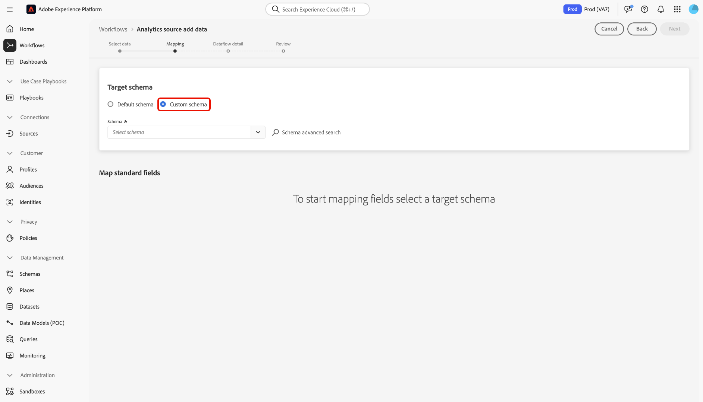
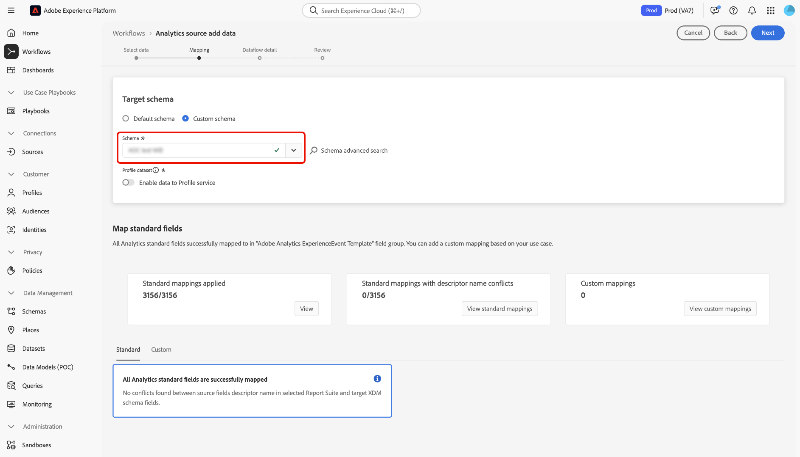
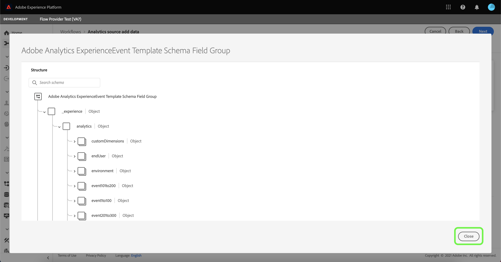
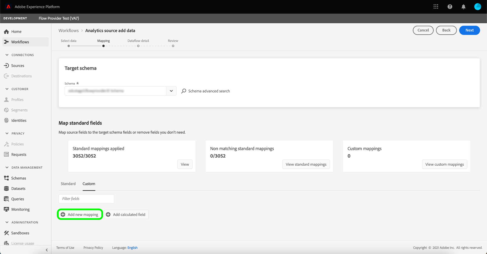
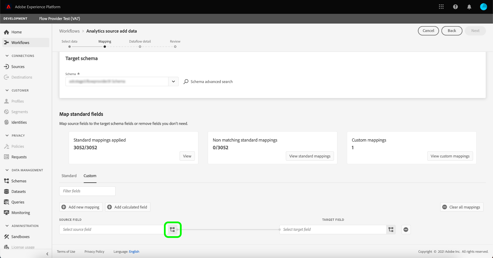
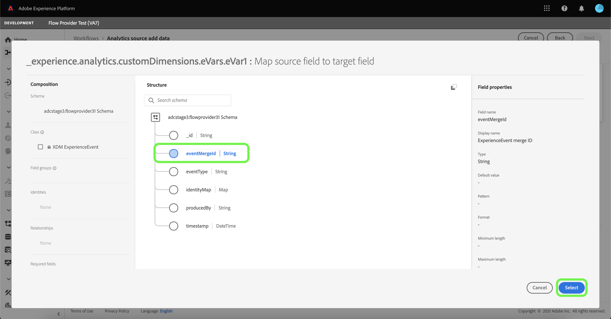
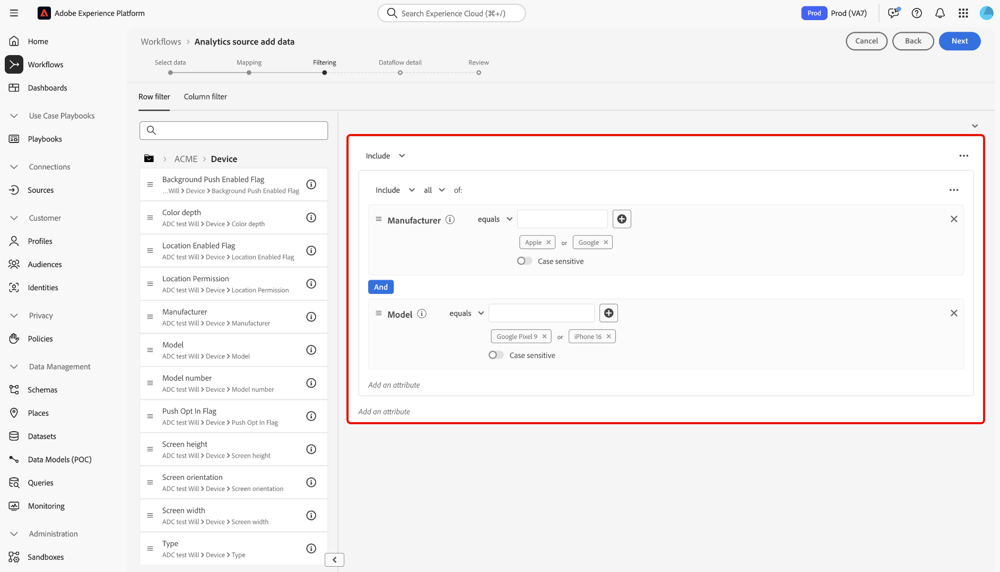

# Erstellen einer Adobe Analytics-Quellverbindung über die Benutzeroberfläche

In diesem Tutorial erfahren Sie, wie Sie in der Benutzeroberfläche eine Adobe Analytics-Quellverbindung erstellen, um Adobe Analytics-Report Suite-Daten in Adobe Experience Platform zu importieren.

## Erste Schritte

Dieses Tutorial setzt ein Grundverständnis der folgenden Komponenten von Experience Platform voraus:

* [Experience-Datenmodell (XDM)-System](../../../../../xdm/home.md): Das standardisierte Framework, mit dem Experience Platform Kundenerlebnisdaten organisiert.
* [Echtzeit-Kundenprofil](../../../../../profile/home.md): Bietet ein einheitliches Echtzeit-Kundenprofil, das auf aggregierten Daten aus verschiedenen Quellen basiert.
* [Sandboxes](../../../../../sandboxes/home.md): Experience Platform bietet virtuelle Sandboxes, die eine einzelne Platform-Instanz in separate virtuelle Umgebungen unterteilen, damit Sie Programme für digitale Erlebnisse entwickeln und weiterentwickeln können.

### Wichtige Terminologie

Es ist wichtig, die folgenden Schlüsselbegriffe zu verstehen, die in diesem Dokument verwendet werden:

* **Standardattribut**: Standardattribute sind alle Attribute, die von Adobe vordefiniert wurden. Sie haben dieselbe Bedeutung für alle Kunden und sind in den [!DNL Analytics]-Quelldaten und [!DNL Analytics]-Schemafeldergruppen verfügbar.
* **Benutzerdefiniertes Attribut**: Benutzerdefinierte Attribute sind alle Attribute in der Hierarchie der benutzerdefinierten Variablen in [!DNL Analytics]. Benutzerdefinierte Attribute werden innerhalb einer Adobe Analytics-Implementierung verwendet, um bestimmte Informationen in einer Report Suite zu erfassen. Sie können sich bei ihrer Verwendung von Report Suite zu Report Suite unterscheiden. Zu den benutzerdefinierten Attributen gehören eVars, Eigenschaften und Listen. In der folgenden [[!DNL Analytics] Dokumentation zu Konversionsvariablen](https://experienceleague.adobe.com/docs/analytics/admin/admin-tools/conversion-variables/conversion-var-admin.html) finden Sie weitere Informationen zu eVars.
* **Attribute in benutzerdefinierten Feldgruppen**: Attribute, die aus von Kunden erstellten Feldgruppen stammen, sind alle benutzerdefiniert und gelten weder als Standard- noch als benutzerdefinierte Attribute.
* **Anzeigenamen**: Anzeigenamen sind von Benutzern bereitgestellte Bezeichnungen für benutzerdefinierte Variablen in einer [!DNL Analytics]-Implementierung. In der folgenden [[!DNL Analytics] Dokumentation zu Konversionsvariablen](https://experienceleague.adobe.com/docs/analytics/admin/admin-tools/conversion-variables/conversion-var-admin.html) finden Sie weitere Informationen zu Anzeigenamen.

## Erstellen einer Quellverbindung mit Adobe Analytics

>[!NOTE]
>
>Wenn Sie einen Analytics-Quell-Datenfluss in einer Produktions-Sandbox erstellen, werden zwei Datenflüsse erstellt:
>
>* Ein Datenfluss, der eine 13-monatige Aufstockung historischer Report Suite-Daten in den Data Lake ausführt. Dieser Datenfluss endet, wenn die Aufstockung abgeschlossen ist.
>* Ein Datenfluss, der Live-Daten an den Daten-See und an [!DNL Real-Time Customer Profile]. Dieser Datenfluss wird kontinuierlich ausgeführt.

Wählen Sie in der Platform-Benutzeroberfläche in der linken Navigationsleiste die Option **[!UICONTROL Quellen]**, um auf den Arbeitsbereich [!UICONTROL Quellen] zuzugreifen. Der Bildschirm [!UICONTROL Katalog] zeigt eine Vielzahl von Quellen an, mit denen Sie ein Konto erstellen können.

Sie können die gewünschte Kategorie aus dem Katalog auf der linken Bildschirmseite auswählen. Sie können auch die Suchleiste verwenden, um die angezeigten Quellen einzugrenzen.

Wählen Sie unter der Kategorie **[!UICONTROL Adobe-Programme]** das Programm **[!UICONTROL Adobe Analytics]** und dann **[!UICONTROL Daten hinzufügen]** aus.

### Auswählen von Daten

>[!IMPORTANT]
>
>Die auf dem Bildschirm aufgelisteten Report Suites können aus verschiedenen Regionen stammen. Sie sind dafür verantwortlich, die Einschränkungen und Pflichten Ihrer Daten zu verstehen und zu verstehen, wie Sie diese Daten in Adobe Experience Platform regionsübergreifend verwenden. Bitte stellen Sie sicher, dass dies von Ihrer Firma erlaubt ist.

Die **[!UICONTROL Analytics-Quelle - Daten hinzufügen]** -Schritt bietet Ihnen eine Liste von [!DNL Analytics] Report Suite-Daten, mit denen eine Quellverbindung hergestellt werden soll.

Eine Report Suite ist ein Datencontainer, der die Grundlage für [!DNL Analytics] Berichterstellung. Eine Organisation kann über viele Report Suites verfügen, die jeweils unterschiedliche Datensätze enthalten.

Sie können Report Suites aus einer beliebigen Region (USA, Großbritannien oder Singapur) erfassen, sofern sie derselben Organisation wie die Experience Platform-Sandbox-Instanz zugeordnet sind, in der die Quellverbindung erstellt wird. Eine Report Suite kann nur mit einem einzigen aktiven Datenfluss erfasst werden. Eine Report Suite, die nicht auswählbar ist, wurde bereits aufgenommen, entweder in der von Ihnen verwendeten Sandbox oder in einer anderen Sandbox.

Es können mehrere eingehende Verbindungen hergestellt werden, um mehrere Report Suites in dieselbe Sandbox zu bringen. Wenn die Report Suites unterschiedliche Schemas für Variablen haben (z. B. eVars oder Ereignisse), sollten sie bestimmten Feldern in den benutzerdefinierten Feldergruppen zugeordnet werden, um Datenkonflikte bei der Verwendung von [Datenvorbereitung](../../../../../data-prep/ui/mapping.md). Report Suites können nur zu einer einzelnen Sandbox hinzugefügt werden.

>[!NOTE]
>
>Daten aus mehreren Report Suites können nur dann für das Echtzeit-Kundenprofil aktiviert werden, wenn keine Datenkonflikte bestehen, z. B. zwei benutzerdefinierte Eigenschaften (eVars, Listen und Props) mit unterschiedlicher Bedeutung.

So erstellen Sie eine [!DNL Analytics] Quellverbindung, wählen Sie eine Report Suite aus und klicken Sie auf **[!UICONTROL Nächste]** um fortzufahren.

&lt;!—Analytics Report Suites können für jeweils eine Sandbox konfiguriert werden. Um dieselbe Report Suite in eine andere Sandbox zu importieren, muss der Datensatzfluss gelöscht und über die Konfiguration für eine andere Sandbox erneut instanziiert werden.—>

### Zuordnung

>[!IMPORTANT]
>
>Datenvorbereitung-Transformationen können zum Datenfluss insgesamt Latenzzeiten hinzufügen. Die zusätzliche Latenz variiert je nach Komplexität der Umwandlungslogik.

Bevor Sie Ihre [!DNL Analytics]-Daten einem Ziel-XDM-Schema zuordnen können, müssen Sie zunächst auswählen, ob Sie ein Standardschema oder ein benutzerdefiniertes Schema verwenden.

Ein Standardschema erstellt in Ihrem Namen ein neues Schema, das die [!DNL Adobe Analytics ExperienceEvent Template]-Feldgruppe enthält. Um ein Standardschema zu verwenden, wählen Sie **[!UICONTROL Standardschema]** aus.

Mit einem benutzerdefinierten Schema können Sie jedes verfügbare Schema für Ihre [!DNL Analytics]-Daten auswählen, sofern dieses Schema die [!DNL Adobe Analytics ExperienceEvent Template]-Feldgruppe enthält. Um ein benutzerdefiniertes Schema zu verwenden, wählen Sie **[!UICONTROL Benutzerdefiniertes Schema]** aus.

Die Seite [!UICONTROL Zuordnung] bietet eine Benutzeroberfläche zur Zuordnung von Quellfeldern zu den entsprechenden Zielschemafeldern. Hier können Sie benutzerdefinierte Variablen neuen Schemafeldergruppen zuordnen und Berechnungen anwenden, die von der Datenvorbereitung unterstützt werden. Wählen Sie ein Zielschema aus, um den Zuordnungsprozess zu starten.

>[!TIP]
>
>Nur Schemata mit der [!DNL Adobe Analytics ExperienceEvent Template]-Feldergruppen werden im Menü zur Schemaauswahl angezeigt. Andere Schemata werden weggelassen. Wenn für Ihre Report Suite-Daten keine geeigneten Schemata verfügbar sind, müssen Sie ein neues Schema erstellen. Ausführliche Schritte zum Erstellen von Schemata finden Sie im Handbuch zum [Erstellen und Bearbeiten von Schemata in der Benutzeroberfläche](../../../../../xdm/ui/resources/schemas.md).

Der Abschnitt [!UICONTROL Standardfelder zuordnen] zeigt Bedienfelder für [!UICONTROL Angewandte Standard-Zuordnungen], [!UICONTROL Nicht übereinstimmende Standard-Zuordnungen] und [!UICONTROL Benutzerdefinierte Zuordnungen]. In der folgenden Tabelle finden Sie spezifische Informationen zu den einzelnen Kategorien:

| Standardfelder zuordnen | Beschreibung |
| --- | --- |
| [!UICONTROL Angewandte Standard-Zuordnungen] | Das Bedienfeld [!UICONTROL Angewandte Standard-Zuordnungen] zeigt die Gesamtzahl der zugeordneten Attribute an. Standardzuordnungen beziehen sich auf Zuordnungssätze zwischen allen Attributen in den [!DNL Analytics]-Quelldaten und entsprechenden Attributen in der [!DNL Analytics]-Feldgruppe. Diese sind vorab zugeordnet und können nicht bearbeitet werden. |
| [!UICONTROL Nicht übereinstimmende Standardzuordnungen] | Das Bedienfeld [!UICONTROL Nicht übereinstimmende Standardzuordnungen] bezieht sich auf die Anzahl der zugeordneten Attribute, die Konflikte mit benutzerfreundlichen Namen enthalten. Diese Konflikte treten auf, wenn Sie ein Schema wiederverwenden, das bereits über einen befüllten Satz von Felddeskriptoren aus einer anderen Report Suite verfügt. Sie können mit Ihrem [!DNL Analytics]-Datenfluss auch bei Konflikten mit benutzerfreundlichen Namen fortfahren. |
| [!UICONTROL Benutzerdefinierte Zuordnungen] | Das Bedienfeld [!UICONTROL Benutzerdefinierte Zuordnungen] zeigt die Anzahl der zugeordneten benutzerdefinierten Attribute an, einschließlich eVars, Props und Listen. Benutzerdefinierte Zuordnungen beziehen sich auf Zuordnungssätze zwischen benutzerdefinierten Attributen in den [!DNL Analytics]-Quelldaten und Attribute in benutzerdefinierten Feldgruppen, die im ausgewählten Schema enthalten sind. |

Um eine Vorschau der [!DNL Analytics]-Feldgruppe des ExperienceEvent-Vorlagenschemas anzuzeigen, wählen Sie **[!UICONTROL Ansicht]** im Bedienfeld [!UICONTROL Angewandte Standardzuordnungen].

Die Seite [!UICONTROL Adobe Analytics ExperienceEvent-Vorlagenfeldergruppe] bietet eine Benutzeroberfläche zum Prüfen der Struktur Ihres Schemas. Wenn Sie fertig sind, klicken Sie auf **[!UICONTROL Schließen]**.

Platform erkennt Ihre Zuordnungssätze automatisch für Konflikte mit benutzerfreundlichen Namen. Wenn keine Konflikte mit Ihren Zuordnungssätzen auftreten, klicken Sie auf **[!UICONTROL Weiter]**, um fortzufahren.

>[!TIP]
>
>Wenn es Konflikte mit benutzerfreundlichen Namen zwischen Ihrer Quell-Report Suite und dem ausgewählten Schema gibt, können Sie trotzdem mit Ihrem [!DNL Analytics]-Datenfluss fortfahren, allerdings unter Berücksichtigung der Tatsache, dass die Felddeskriptoren nicht geändert werden. Alternativ können Sie auch ein neues Schema mit einem leeren Satz von Deskriptoren erstellen.

#### Benutzerdefinierte Zuordnungen

Sie können Datenvorgangsfunktionen verwenden, um neue benutzerdefinierte Mapping- oder berechnete Felder für benutzerdefinierte Attribute hinzuzufügen. Um benutzerdefinierte Zuordnungen hinzuzufügen, wählen Sie **[!UICONTROL Benutzerdefiniert]**.

Je nach Bedarf können Sie entweder **[!UICONTROL Neues Mapping hinzufügen]** oder **[!UICONTROL Berechnetes Feld hinzufügen]** und fahren Sie mit dem Erstellen benutzerdefinierter Zuordnungen für Ihre benutzerdefinierten Attribute fort. Umfassende Schritte zur Verwendung der Datenvorgangsfunktionen finden Sie in der [Handbuch zur Datenvorbereitung-Benutzeroberfläche](../../../../../data-prep/ui/mapping.md).

Die folgende Dokumentation enthält weitere Ressourcen zum Verständnis von Datenvorbereitung, berechneten Feldern und Zuordnungsfunktionen:

* [Datenvorbereitung – Übersicht](../../../../../data-prep/home.md)
* [Funktionen zur Datenvorbereitung](../../../../../data-prep/functions.md)
* [Hinzufügen von berechneten Feldern](../../../../../data-prep/ui/mapping.md#calculated-fields)

<!-- 
To use Data Prep functions and add new mapping or calculated fields for custom attributes, select **[!UICONTROL View custom mappings]**.

Next, select **[!UICONTROL Add new mapping]**.

Depending on your needs, you can select either **[!UICONTROL Add new mapping]** or **[!UICONTROL Add calculated field]** from the options that appear. 

An empty mapping set appears. Select the mapping icon to add a source field.

You can use the interface to navigate through the source schema structure and identify the new source field that you want to use. Once you have selected the source field that you want to map, select **[!UICONTROL Select]**.

Next, select the mapping icon under [!UICONTROL Target Field] to map your selected source field to its appropriate target field.

Similar to the source schema, you can use the interface to navigate through the target schema structure and select the target field you want to map to. Once you have selected the appropriate target field, select **[!UICONTROL Select]**.

With your custom mapping set completed, select **[!UICONTROL Next]** to proceed.

 -->

## Filtern nach Echtzeit-Kundenprofil {#filtering-for-profile}

>[!CONTEXTUALHELP]
>id="platform_data_prep_analytics_filtering"
>title="Erstellen von Filterregeln"
>abstract="Definieren Sie beim Senden von Daten an das Echtzeit-Kundenprofil Filterregeln auf Zeilen- und Spaltenebene. Verwenden Sie die Filterung auf Zeilenebene, um Bedingungen anzuwenden und festzulegen, welche Daten **in die Profilaufnahme** eingeschlossen werden sollen. Verwenden Sie die Filterung auf Spaltenebene, um die Datenspalten auszuwählen, die **bei der Profilaufnahme** ausgeschlossen werden sollen. Die Filterregeln gelten nicht für Daten, die an den Data Lake gesendet werden."

Nachdem Sie die Zuordnungen für Ihre [!DNL Analytics] Report Suite-Daten können Sie Filterregeln und -bedingungen anwenden, um Daten selektiv in das Echtzeit-Kundenprofil ein- oder auszuschließen. Filterunterstützung ist nur verfügbar für [!DNL Analytics] Daten und Daten werden nur vor der Eingabe gefiltert [!DNL Profile.] Alle Daten werden in den Daten-Pool aufgenommen.

>[!BEGINSHADEBOX]

**Zusätzliche Informationen zur Datenvorbereitung und Filterung von Analytics-Daten für Echtzeit-Kundenprofil**

* Sie können die Filterfunktion für Daten verwenden, die an das Profil gesendet werden, nicht aber für Daten, die an Data Lake gesendet werden.
* Sie können die Filterung für Live-Daten verwenden, Sie können aber keine Aufstockungsdaten filtern.
   * Die [!DNL Analytics] -Quelle füllt keine Daten in Profil auf.
* Wenn Sie während der ersten Einrichtung eines [!DNL Analytics] -Fluss, werden diese Änderungen auch auf die automatische 13-monatige Aufstockung angewendet.
   * Dies ist jedoch nicht der Fall für die Filterung, da die Filterung nur für Live-Daten reserviert ist.
* Die Datenvorbereitung wird sowohl auf Streaming- als auch auf Batch-Erfassungspfade angewendet. Wenn Sie eine vorhandene Datenvorbereitung ändern, werden diese Änderungen auf neue eingehende Daten über Streaming- und Batch-Erfassungswege hinweg angewendet.
   * Datenvorbereitung-Konfigurationen gelten jedoch nicht für Daten, die bereits in Experience Platform erfasst wurden, unabhängig davon, ob es sich um Streaming- oder Batch-Daten handelt.
* Standardattribute aus Analytics werden immer automatisch zugeordnet. Daher können Sie keine Transformationen auf Standardattribute anwenden.
   * Sie können jedoch Standardattribute herausfiltern, solange sie in Identity Service oder Profil nicht benötigt werden.
* Sie können die Filterung auf Spaltenebene nicht verwenden, um erforderliche Felder und Identitätsfelder zu filtern.
* Sie können zwar sekundäre Identitäten herausfiltern, insbesondere &quot;AAID&quot;und &quot;AACustomID&quot;, aber Sie können die ECID nicht herausfiltern.
* Wenn ein Transformationsfehler auftritt, wird in der entsprechenden Spalte NULL angezeigt.

>[!ENDSHADEBOX]

### Filterung auf Zeilenebene

>[!IMPORTANT]
>
>Verwenden Sie die Filterung auf Zeilenebene, um Bedingungen anzuwenden und festzulegen, welche Daten **in die Profilaufnahme** eingeschlossen werden sollen. Verwenden Sie Filter auf Spaltenebene, um die Datenspalten auszuwählen, die Sie verwenden möchten **zur Profilaufnahme ausschließen**.

Sie können Daten nach [!DNL Profile] Aufnahme auf Zeilen- und Spaltenebene. Mit der Filterung auf Zeilenebene können Sie Kriterien definieren, z. B. Zeichenfolge enthält, gleich, beginnt oder endet mit. Sie können auch die Filterung auf Zeilenebene verwenden, um Join-Bedingungen mithilfe von `AND` sowie `OR`, und umgekehrt Bedingungen mithilfe von `NOT`.

So filtern Sie [!DNL Analytics] Daten auf Zeilenebene auswählen **[!UICONTROL Zeilenfilter]**.

Verwenden Sie die linke Leiste, um durch die Schemahierarchie zu navigieren, und wählen Sie das von Ihnen ausgewählte Schemaattribut aus, um ein bestimmtes Schema weiter aufzuschlüsseln.

Nachdem Sie das Attribut identifiziert haben, das Sie konfigurieren möchten, wählen Sie es aus der linken Leiste aus und ziehen Sie es in das Filterfeld.

Um verschiedene Bedingungen zu konfigurieren, wählen Sie **[!UICONTROL gleich]** und wählen Sie dann eine Bedingung aus dem angezeigten Dropdown-Fenster aus.

Die Liste der konfigurierbaren Bedingungen umfasst:

* [!UICONTROL gleich]
* [!UICONTROL ist nicht gleich]
* [!UICONTROL beginnt mit]
* [!UICONTROL endet mit]
* [!UICONTROL endet nicht mit]
* [!UICONTROL contains]
* [!UICONTROL enthält nicht]
* [!UICONTROL exists]
* [!UICONTROL nicht vorhanden]

Geben Sie anschließend die Werte ein, die Sie basierend auf dem von Ihnen ausgewählten Attribut aufnehmen möchten. Im folgenden Beispiel: [!DNL Apple] und [!DNL Google] zur Aufnahme als Teil der **[!UICONTROL Hersteller]** -Attribut.

Um Ihre Filterbedingungen weiter zu spezifizieren, fügen Sie ein weiteres Attribut aus dem Schema hinzu und fügen Sie dann Werte hinzu, die auf diesem Attribut basieren. Im folgenden Beispiel wird die Variable **[!UICONTROL Modell]** hinzugefügt und Modelle wie das [!DNL iPhone 13] und [!DNL Google Pixel 6] zur Aufnahme gefiltert werden.

Um einen neuen Container hinzuzufügen, wählen Sie die Auslassungszeichen (`...`) oben rechts in der Filteroberfläche und wählen Sie dann **[!UICONTROL Container hinzufügen]**.

Nachdem ein neuer Container hinzugefügt wurde, wählen Sie **[!UICONTROL Einschließen]** und wählen Sie **[!UICONTROL Ausschließen]** aus dem Dropdown-Fenster, das angezeigt wird.

Schließen Sie den gleichen Prozess ab, indem Sie Schemaattribute ziehen und die entsprechenden Werte hinzufügen, die Sie aus der Filterung ausschließen möchten. Im folgenden Beispiel wird die Variable [!DNL iPhone 12], [!DNL iPhone 12 mini], und [!DNL Google Pixel 5] werden alle aus dem Ausschluss aus dem **[!UICONTROL Modell]** -Attribut, ist Querformat von der **[!UICONTROL Bildschirmausrichtung]**, und Modellnummer [!DNL A1633] ist ausgeschlossen von **[!UICONTROL Modellnummer]**.

Wenn Sie fertig sind, klicken Sie auf die Schaltfläche **[!UICONTROL Weiter]**.

### Filterung auf Spaltenebene

Auswählen **[!UICONTROL Spaltenfilter]** aus der Kopfzeile, um die Filterung auf Spaltenebene anzuwenden.

Die Seite wird in eine interaktive Schemastruktur aktualisiert und zeigt Ihre Schemaattribute auf Spaltenebene an. Von hier aus können Sie die Datenspalten auswählen, aus denen Sie ausschließen möchten [!DNL Profile] Aufnahme. Alternativ können Sie eine Spalte erweitern und bestimmte Attribute zum Ausschließen auswählen.

Standardmäßig werden alle [!DNL Analytics] gehen Sie zu [!DNL Profile] und dieser Prozess ermöglicht, dass Verzweigungen von XDM-Daten ausgeschlossen werden. [!DNL Profile] Aufnahme.

Wenn Sie fertig sind, klicken Sie auf die Schaltfläche **[!UICONTROL Weiter]**.

### Sekundäre Identitäten filtern

Verwenden Sie einen Spaltenfilter, um sekundäre Identitäten von der Profilaufnahme auszuschließen. Um sekundäre Identitäten zu filtern, wählen Sie **[!UICONTROL Spaltenfilter]** und wählen Sie **[!UICONTROL _identities]**.

Der Filter gilt nur, wenn eine Identität als sekundär markiert ist. Wenn Identitäten ausgewählt sind, aber ein Ereignis mit einer der als primär markierten Identitäten eintritt, werden diese nicht herausgefiltert.

### Angeben von Datenflussdetails

Der Schritt **[!UICONTROL Datenflussdetails]** wird angezeigt, in dem Sie einen Namen und eine optionale Beschreibung für den Datenfluss angeben müssen. Klicken Sie auf **[!UICONTROL Weiter]**, wenn Sie fertig sind.

### Überprüfung

Der Schritt [!UICONTROL Überprüfen] wird angezeigt, in dem Sie Ihren neuen Analytics-Datenfluss überprüfen können, bevor er erstellt wird. Details der Verbindung werden nach Kategorien gruppiert, darunter:

* [!UICONTROL Verbindung]: Zeigt die Quellplattform der Verbindung an.
* [!UICONTROL Datentyp]: Zeigt die ausgewählte Report Suite und die zugehörige Report Suite-ID an.

## Überwachen Ihres Datenflusses {#monitor-your-dataflow}

Nachdem der Datenfluss abgeschlossen ist, wählen Sie **[!UICONTROL Datenflüsse]** im Quellkatalog, um die Aktivität und den Status Ihrer Daten zu überwachen.

Eine Liste der vorhandenen Analytics-Datenflüsse in Ihrer Organisation wird angezeigt. Wählen Sie von hier aus einen Zieldatensatz aus, um die entsprechende Erfassungsaktivität anzuzeigen.

Die [!UICONTROL Datensatzaktivität] -Seite enthält Informationen zum Fortschritt der Daten, die von Analytics an Experience Platform gesendet werden. Die Benutzeroberfläche zeigt Metriken wie die Anzahl der aufgenommenen Datensätze, die Anzahl der aufgenommenen Batches und die Anzahl der fehlgeschlagenen Batches an.

Die Quelle instanziiert zwei Datensatzflüsse. Ein Fluss stellt Aufstockungsdaten dar, der andere ist für Live-Daten. Aufstockungsdaten sind nicht für die Aufnahme in das Echtzeit-Kundenprofil konfiguriert, werden jedoch für analytische und datenwissenschaftliche Anwendungsfälle an den Data Lake gesendet.

Weitere Informationen zur Aufstockung, zu Live-Daten und ihren jeweiligen Latenzen finden Sie in der [Übersicht über die Analytics-Quelle](../../../../connectors/adobe-applications/analytics.md).

+++Anzeigen einzelner Batches über die veraltete Überwachungsschnittstelle

Auf der Seite mit der Datensatzaktivität wird keine Liste einzelner Batches angezeigt. Um eine Liste einzelner Batches anzuzeigen, wählen Sie ein Diagramm in der Oberfläche für die Datensatzaktivität aus.

Sie gelangen zum Monitoring-Dashboard. Wählen Sie als Nächstes **[!UICONTROL NUR FEHLER ERFASSEN: JA]** , um den Filter zu löschen und eine Liste der einzelnen Batches anzuzeigen.

Die Benutzeroberfläche aktualisiert eine Liste einzelner Batches, einschließlich Informationen zu den jeweiligen Metriken.

| Metriken | Beschreibung |
| --- | --- |
| Batch-Kennung | Die Kennung eines bestimmten Batches. Dieser Wert wird intern generiert. |
| Datensatzname | Der Name eines bestimmten Datensatzes, der für Analytics-Daten verwendet wird. |
| Quelle | Die Quelle der aufgenommenen Daten. |
| Aktualisiert | Das Datum der letzten Durchlaufdurchlauf-Iteration. |
| Datensätze in Datensätzen | Die Gesamtzahl der Datensätze im Datensatz. **Hinweis**: Dieser Parameter zeigt gelegentlich den Status von `in-progress`. Dieser Status zeigt an, dass der Aufnahmevorgang für Datensätze noch nicht abgeschlossen ist. |
| Neue Profilfragmente | Die Gesamtanzahl der neuen Profilfragmente, die erfasst wurden. |
| Vorhandene Profilfragmente | Die Gesamtanzahl vorhandener Profilfragmente. |
| Zugewiesene Identitätsdatensätze | Die Gesamtzahl der Identitätsdatensätze, die nach der Erfassung zusammengeführt wurden. |
| Datensätze in Profil | Die Gesamtzahl der Datensätze, die in das Echtzeit-Kundenprofil aufgenommen wurden. |

{style="table-layout:auto"}

+++

## Nächste Schritte und zusätzliche Ressourcen

Nach der Erstellung der Verbindung wird der Datenfluss automatisch erstellt, um die eingehenden Daten zu enthalten und einen Datensatz mit Ihrem ausgewählten Schema zu füllen. Darüber hinaus werden bis zu 13 Monate historischer Daten aufgefüllt und aufgenommen. Wenn die anfängliche Aufnahme abgeschlossen ist, werden die [!DNL Analytics]-Daten von nachgelagerten Platform-Services wie [!DNL Real-Time Customer Profile] und dem Segmentierungs-Service verwendet. Weiterführende Informationen finden Sie in folgenden Dokumenten:

* [[!DNL Real-Time Customer Profile] – Übersicht](../../../../../profile/home.md)
* [[!DNL Segmentation Service] – Übersicht](../../../../../segmentation/home.md)
* [[!DNL Data Science Workspace] – Übersicht](../../../../../data-science-workspace/home.md)
* [[!DNL Query Service] – Übersicht](../../../../../query-service/home.md)

Das folgende Video soll Ihnen helfen, das Aufnehmen von Daten mithilfe des Adobe Analytics-Quell-Connectors zu verstehen:

>[!WARNING]
>
> Die im folgenden Video angezeigte [!DNL Platform]-Benutzeroberfläche ist veraltet. Die neuesten Screenshots und Funktionen der Benutzeroberfläche finden Sie in der obigen Dokumentation.

>[!VIDEO](https://video.tv.adobe.com/v/29687?quality=12&learn=on)
