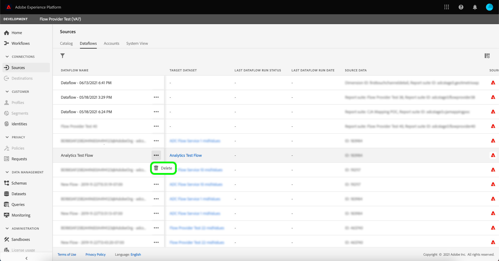

# Erstellen einer Adobe Analytics-Quellverbindung über die Benutzeroberfläche

In diesem Tutorial werden Schritte zum Erstellen einer Quellverbindung für Adobe Analytics über die Benutzeroberfläche beschrieben, um [!DNL Analytics]-Report Suite-Daten in Adobe Experience Platform zu importieren.

## Erste Schritte

Dieses Tutorial setzt ein Grundverständnis der folgenden Komponenten von Adobe Experience Platform voraus:

* [Experience-Datenmodell (XDM)-System](../../../../../xdm/home.md): Das standardisierte Framework, mit dem Experience Platform Kundenerlebnisdaten organisiert.
* [Echtzeit-Kundenprofil](../../../../../profile/home.md): Bietet ein einheitliches Echtzeit-Kundenprofil, das auf aggregierten Daten aus verschiedenen Quellen basiert.
* [Sandboxes](../../../../../sandboxes/home.md): Experience Platform bietet virtuelle Sandboxes, die eine einzelne Platform-Instanz in separate virtuelle Umgebungen unterteilen, damit Sie Programme für digitale Erlebnisse entwickeln und weiterentwickeln können.

### Wichtige Terminologie

Es ist wichtig, die folgenden Schlüsselbegriffe zu verstehen, die in diesem Dokument verwendet werden:

* **Standardattribut**: Standardattribute sind alle Attribute, die von Adobe vordefiniert wurden. Sie haben dieselbe Bedeutung für alle Kunden und sind in den [!DNL Analytics]-Quelldaten und [!DNL Analytics]-Schemafeldergruppen verfügbar.
* **Benutzerdefiniertes Attribut**: Benutzerdefinierte Attribute sind alle Attribute in der Hierarchie der benutzerdefinierten Variablen in [!DNL Analytics]. Benutzerdefinierte Attribute werden innerhalb einer Adobe Analytics-Implementierung verwendet, um bestimmte Informationen in einer Report Suite zu erfassen. Ihre Verwendung kann sich von Report Suite zu Report Suite unterscheiden. Zu den benutzerdefinierten Attributen gehören eVars, Eigenschaften und Listen. In der folgenden [[!DNL Analytics] Dokumentation zu Konversionsvariablen](https://experienceleague.adobe.com/docs/analytics/admin/admin-tools/conversion-variables/conversion-var-admin.html?lang=de) finden Sie weitere Informationen zu eVars.
* **Attribute in benutzerdefinierten Feldgruppen**: Attribute, die aus von Kunden erstellten Feldgruppen stammen, sind alle benutzerdefiniert und gelten weder als Standard- noch als benutzerdefinierte Attribute.
* **Anzeigenamen**: Anzeigenamen sind von Benutzern bereitgestellte Bezeichnungen für benutzerdefinierte Variablen in einer [!DNL Analytics]-Implementierung. In der folgenden [[!DNL Analytics] Dokumentation zu Konversionsvariablen](https://experienceleague.adobe.com/docs/analytics/admin/admin-tools/conversion-variables/conversion-var-admin.html?lang=de) finden Sie weitere Informationen zu Anzeigenamen.

## Erstellen einer Quellverbindung mit Adobe Analytics

Wählen Sie in der Platform-Benutzeroberfläche in der linken Navigationsleiste die Option **[!UICONTROL Quellen]**, um auf den Arbeitsbereich [!UICONTROL Quellen] zuzugreifen. Der Bildschirm [!UICONTROL Katalog] zeigt eine Vielzahl von Quellen an, mit denen Sie ein Konto erstellen können.

Sie können die gewünschte Kategorie aus dem Katalog auf der linken Bildschirmseite auswählen. Sie können auch die Suchleiste verwenden, um die angezeigten Quellen einzugrenzen.

Wählen Sie unter der Kategorie **[!UICONTROL Adobe-Programme]** das Programm **[!UICONTROL Adobe Analytics]** und dann **[!UICONTROL Daten hinzufügen]** aus.

### Auswählen von Daten

Der Schritt **[!UICONTROL Analytics-Quelle – Daten hinzufügen]** wird angezeigt. Wählen Sie **[!UICONTROL Report Suite]** aus, um eine Quellverbindung für Analytics-Report Suite-Daten zu erstellen, und wählen Sie dann die Report Suite aus, die Sie aufnehmen möchten. Report Suites, die nicht auswählbar sind, wurden bereits aufgenommen, entweder in dieser Sandbox oder in einer anderen Sandbox. Wählen Sie **[!UICONTROL Weiter]** aus, um fortzufahren.

>[!NOTE]
>
>Es können mehrere eingehende Verbindungen hergestellt werden, um mehrere Report Suites einzubinden. Es kann jedoch jeweils nur eine Report Suite mit Real-time Customer Data Platform verwendet werden.

<!---Analytics Report Suites can be configured for one sandbox at a time. To import the same Report Suite into a different sandbox, the dataset flow will have to be deleted and instantiated again via configuration for a different sandbox.--->

### Zuordnung

>[!IMPORTANT]
>
>Unterstützung für die Datenvorbereitung für die [!DNL Analytics]-Quelle befindet sich derzeit in der Beta-Version. Die Funktion und die Dokumentation können sich ändern.

Bevor Sie Ihre [!DNL Analytics]-Daten einem Ziel-XDM-Schema zuordnen können, müssen Sie zunächst auswählen, ob Sie ein Standardschema oder ein benutzerdefiniertes Schema verwenden.

Ein Standardschema erstellt in Ihrem Namen ein neues Schema, das die [!DNL Adobe Analytics ExperienceEvent Template]-Feldgruppe enthält. Um ein Standardschema zu verwenden, wählen Sie **[!UICONTROL Standardschema]** aus.

Mit einem benutzerdefinierten Schema können Sie jedes verfügbare Schema für Ihre [!DNL Analytics]-Daten auswählen, sofern dieses Schema die [!DNL Adobe Analytics ExperienceEvent Template]-Feldgruppe enthält. Um ein benutzerdefiniertes Schema zu verwenden, wählen Sie **[!UICONTROL Benutzerdefiniertes Schema]** aus.

Die Seite [!UICONTROL Zuordnung] bietet eine Benutzeroberfläche zur Zuordnung von Quellfeldern zu den entsprechenden Zielschemafeldern. Hier können Sie benutzerdefinierte Variablen neuen Schemafeldergruppen zuordnen und Berechnungen anwenden, die von der Datenvorbereitung unterstützt werden. Wählen Sie ein Zielschema aus, um den Zuordnungsprozess zu starten.

>[!TIP]
>
>Nur Schemas mit der [!DNL Adobe Analytics ExperienceEvent Template]-Feldergruppen werden im Menü zur Schemaauswahl angezeigt. Andere Schemata werden weggelassen. Wenn für Ihre Report Suite-Daten keine geeigneten Schemata verfügbar sind, müssen Sie ein neues Schema erstellen. Ausführliche Schritte zum Erstellen von Schemata finden Sie im Handbuch zum [Erstellen und Bearbeiten von Schemata in der Benutzeroberfläche](../../../../../xdm/ui/resources/schemas.md).

Der Abschnitt [!UICONTROL Standardfelder zuordnen] zeigt Bedienfelder für [!UICONTROL Angewandte Standard-Zuordnungen], [!UICONTROL Nicht übereinstimmende Standard-Zuordnungen] und [!UICONTROL Benutzerdefinierte Zuordnungen]. In der folgenden Tabelle finden Sie spezifische Informationen zu den einzelnen Kategorien:

| Standardfelder zuordnen | Beschreibung |
| --- | --- |
| [!UICONTROL Angewandte Standard-Zuordnungen] | Das Bedienfeld [!UICONTROL Angewandte Standard-Zuordnungen] zeigt die Gesamtzahl der zugeordneten Attribute an. Standardzuordnungen beziehen sich auf Zuordnungssätze zwischen allen Attributen in den [!DNL Analytics]-Quelldaten und entsprechenden Attributen in der [!DNL Analytics]-Feldgruppe. Diese sind vorab zugeordnet und können nicht bearbeitet werden. |
| [!UICONTROL Nicht übereinstimmende Standardzuordnungen] | Das Bedienfeld [!UICONTROL Nicht übereinstimmende Standardzuordnungen] bezieht sich auf die Anzahl der zugeordneten Attribute, die Konflikte mit benutzerfreundlichen Namen enthalten. Diese Konflikte treten auf, wenn Sie ein Schema wiederverwenden, das bereits über einen befüllten Satz von Felddeskriptoren aus einer anderen Report Suite verfügt. Sie können mit Ihrem [!DNL Analytics]-Datenfluss auch bei Konflikten mit benutzerfreundlichen Namen fortfahren. |
| [!UICONTROL Benutzerdefinierte Zuordnungen] | Das Bedienfeld [!UICONTROL Benutzerdefinierte Zuordnungen] zeigt die Anzahl der zugeordneten benutzerdefinierten Attribute an, einschließlich eVars, Props und Listen. Benutzerdefinierte Zuordnungen beziehen sich auf Zuordnungssätze zwischen benutzerdefinierten Attributen in den [!DNL Analytics]-Quelldaten und Attribute in benutzerdefinierten Feldgruppen, die im ausgewählten Schema enthalten sind. |

Um eine Vorschau der [!DNL Analytics]-Feldgruppe des ExperienceEvent-Vorlagenschemas anzuzeigen, wählen Sie **[!UICONTROL Ansicht]** im Bedienfeld [!UICONTROL Angewandte Standardzuordnungen].

Die Seite [!UICONTROL Adobe Analytics ExperienceEvent-Vorlagenfeldergruppe] bietet eine Benutzeroberfläche zum Prüfen der Struktur Ihres Schemas. Wenn Sie fertig sind, klicken Sie auf **[!UICONTROL Schließen]**.

Platform erkennt Ihre Zuordnungssätze automatisch für Konflikte mit benutzerfreundlichen Namen. Wenn keine Konflikte mit Ihren Zuordnungssätzen auftreten, klicken Sie auf **[!UICONTROL Weiter]**, um fortzufahren.

Wenn es Konflikte mit benutzerfreundlichen Namen zwischen Ihrer Quell-Report Suite und dem ausgewählten Schema gibt, können Sie trotzdem mit Ihrem [!DNL Analytics]-Datenfluss fortfahren, allerdings unter Berücksichtigung der Tatsache, dass die Felddeskriptoren nicht geändert werden. Alternativ können Sie auch ein neues Schema mit einem leeren Satz von Deskriptoren erstellen.

Klicken Sie auf **[!UICONTROL Weiter]**, um fortzufahren.

#### Benutzerdefinierte Zuordnungen

Um Datenvorbereitungs-Funktionen zu verwenden und neue Zuordnungsfelder oder berechnete Felder für benutzerdefinierte Attribute hinzuzufügen, wählen Sie **[!UICONTROL Benutzerdefinierte Zuordnungen anzeigen]**.

Wählen Sie als Nächstes **[!UICONTROL Neue Zuordnung hinzufügen]**.

Je nach Bedarf können Sie aus den angezeigten Optionen entweder **[!UICONTROL Neue Zuordnung hinzufügen]** oder **[!UICONTROL Berechnetes Feld hinzufügen]** wählen.

Ein leerer Zuordnungssatz wird angezeigt. Wählen Sie das Zuordnungssymbol aus, um ein Quellfeld hinzuzufügen.

Sie können die Benutzeroberfläche verwenden, um durch die Struktur des Quellschemas zu navigieren und das neue Quellfeld zu identifizieren, das Sie verwenden möchten. Nachdem Sie das Quellfeld ausgewählt haben, das Sie zuordnen möchten, klicken Sie auf **[!UICONTROL Auswählen]**.

Wählen Sie als Nächstes das Zuordnungssymbol unter [!UICONTROL Zielfeld] aus, um das ausgewählte Quellfeld seinem entsprechenden Zielfeld zuzuordnen.

Ähnlich wie beim Quellschema können Sie über die Benutzeroberfläche durch die Zielschemastruktur navigieren und das Zielfeld auswählen, dem Sie zuordnen möchten. Nachdem Sie das entsprechende Zielfeld ausgewählt haben, klicken Sie auf **[!UICONTROL Auswählen]**.

Nachdem Sie den benutzerdefinierten Zuordnungssatz abgeschlossen haben, klicken Sie auf **[!UICONTROL Weiter]**, um fortzufahren.

Die folgende Dokumentation enthält weitere Ressourcen zum Verständnis von Datenvorbereitung, berechneten Feldern und Zuordnungsfunktionen:

* [Datenvorbereitung – Übersicht](../../../../../data-prep/home.md)
* [Funktionen zur Datenvorbereitung](../../../../../data-prep/functions.md)
* [Hinzufügen von berechneten Feldern](../../../../../data-prep/ui/mapping.md#calculated-fields)

### Angeben von Datenflussdetails

Der Schritt **[!UICONTROL Datenflussdetails]** wird angezeigt, in dem Sie einen Namen und eine optionale Beschreibung für den Datenfluss angeben müssen. Klicken Sie auf **[!UICONTROL Weiter]**, wenn Sie fertig sind.

### Überprüfung

Der Schritt [!UICONTROL Überprüfen] wird angezeigt, in dem Sie Ihren neuen Analytics-Datenfluss überprüfen können, bevor er erstellt wird. Details der Verbindung werden nach Kategorien gruppiert, darunter:

* [!UICONTROL Verbindung]: Zeigt die Quellplattform der Verbindung an.
* [!UICONTROL Datentyp]: Zeigt die ausgewählte Report Suite und die zugehörige Report Suite-ID an.

### Überwachen Ihres Datenflusses

Nachdem Ihr Datenfluss erstellt wurde, können Sie die Daten überwachen, die über ihn aufgenommen werden. Wählen Sie auf dem Bildschirm [!UICONTROL Katalog] die Option **[!UICONTROL Datenflüsse]**, um eine Liste der eingerichteten Datenflüsse anzuzeigen, die mit Ihrem Analytics-Konto verbunden sind.

Der Bildschirm **Datenflüsse** wird angezeigt. Auf dieser Seite finden Sie ein Paar von Datensatzflüssen, einschließlich Informationen zu ihrem Namen, Quelldaten, Erstellungszeit und Status.

Der Connector instanziiert zwei Datensatzflüsse. Ein Fluss stellt Aufstockungsdaten dar, der andere ist für Live-Daten. Aufstockungsdaten werden nicht für Profile konfiguriert, sondern für analytische und datenwissenschaftliche Anwendungsfälle an den Data Lake gesendet.

Weitere Informationen zur Aufstockung, zu Live-Daten und ihren jeweiligen Latenzen finden Sie unter [Analytics-Daten-Connector – Übersicht](../../../../connectors/adobe-applications/analytics.md).

Wählen Sie in der Liste den gewünschten Datensatzfluss aus.

Die Seite **[!UICONTROL Datensatzaktivität]** wird angezeigt. Auf dieser Seite wird die Rate der verwendeten Nachrichten in Form eines Diagramms angezeigt. Wählen Sie **[!UICONTROL Data Governance]** in der oberen Kopfzeile, um auf die Beschriftungsfelder zuzugreifen.

Sie können die geerbten Bezeichnungen eines Datensatzflusses auf dem Bildschirm [!UICONTROL Data Governance] einsehen. Weitere Informationen zum Kennzeichnen von Daten aus Analytics finden Sie im [Handbuch zu Datennutzungsbezeichnungen](../../../../../data-governance/labels/user-guide.md).

Um einen Datenfluss zu löschen, gehen Sie auf die Seite [!UICONTROL Datenflüsse], wählen Sie die Auslassungspunkte (`...`) neben dem Namen des Datenflusses und klicken Sie auf [!UICONTROL Löschen].

## Nächste Schritte und zusätzliche Ressourcen

Nach der Erstellung der Verbindung wird der Datenfluss automatisch erstellt, um die eingehenden Daten zu enthalten und einen Datensatz mit Ihrem ausgewählten Schema zu füllen. Darüber hinaus werden bis zu 13 Monate historischer Daten aufgefüllt und aufgenommen. Wenn die anfängliche Aufnahme abgeschlossen ist, werden die [!DNL Analytics]-Daten von nachgelagerten Platform-Services wie [!DNL Real-time Customer Profile] und dem Segmentierungs-Service verwendet. Weiterführende Informationen finden Sie in folgenden Dokumenten:

* [[!DNL Real-time Customer Profile] – Übersicht](../../../../../profile/home.md)
* [[!DNL Segmentation Service] – Übersicht](../../../../../segmentation/home.md)
* [[!DNL Data Science Workspace] – Übersicht](../../../../../data-science-workspace/home.md)
* [[!DNL Query Service] – Übersicht](../../../../../query-service/home.md)

Das folgende Video soll Ihnen helfen, das Aufnehmen von Daten mithilfe des Adobe Analytics-Quell-Connectors zu verstehen:

>[!WARNING]
>
> Die im folgenden Video angezeigte [!DNL Platform]-Benutzeroberfläche ist veraltet. Die neuesten Screenshots und Funktionen der Benutzeroberfläche finden Sie in der obigen Dokumentation.

>[!VIDEO](https://video.tv.adobe.com/v/29687?quality=12&learn=on)
