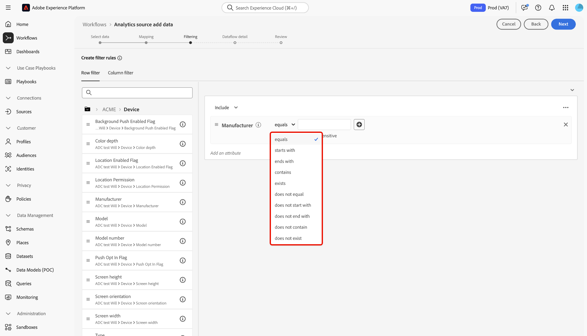

# Adobe Analytics mit Experience Platform verbinden

Lesen Sie dieses Handbuch, um zu erfahren, wie Sie mit der Adobe Analytics-Quelle Ihre Analytics-Report-Suite-Daten in Adobe Experience Platform aufnehmen können.

## Erste Schritte

Dieses Tutorial setzt ein Grundverständnis der folgenden Komponenten von Experience Platform voraus:

* [Experience-Datenmodell (XDM)-System](../../../../../xdm/home.md): Das standardisierte Framework, mit dem Experience Platform Kundenerlebnisdaten organisiert.
* [Echtzeit-Kundenprofil](../../../../../profile/home.md): Bietet ein einheitliches Echtzeit-Kundenprofil, das auf aggregierten Daten aus verschiedenen Quellen basiert.
* [Sandboxes](../../../../../sandboxes/home.md): Experience Platform bietet virtuelle Sandboxes, die eine einzelne Experience Platform-Instanz in separate virtuelle Umgebungen unterteilen, damit Sie Programme für digitale Erlebnisse besser entwickeln und weiterentwickeln können.

### Wichtige Terminologie

Es ist wichtig, die folgenden Schlüsselbegriffe zu verstehen, die in diesem Dokument verwendet werden:

* **Standardattribut**: Standardattribute sind alle Attribute, die von Adobe vordefiniert wurden. Sie haben dieselbe Bedeutung für alle Kunden und sind in den Analytics-Quelldaten und Analytics-Schemafeldergruppen verfügbar.
* **Benutzerdefiniertes Attribut**: Benutzerdefinierte Attribute sind alle Attribute in der Hierarchie der benutzerdefinierten Variablen in Analytics. Benutzerdefinierte Attribute werden innerhalb einer Adobe Analytics-Implementierung verwendet, um bestimmte Informationen in einer Report Suite zu erfassen. Ihre Verwendung kann sich von Report Suite zu Report Suite unterscheiden. Zu den benutzerdefinierten Attributen gehören eVars, Eigenschaften und Listen. Weitere Informationen zu eVars finden [ in der folgenden ](https://experienceleague.adobe.com/docs/analytics/admin/admin-tools/conversion-variables/conversion-var-admin.html)Analytics-Dokumentation zu Konversionsvariablen).
* **Attribute in benutzerdefinierten Feldgruppen**: Attribute, die aus von Kunden erstellten Feldgruppen stammen, sind alle benutzerdefiniert und gelten weder als Standard- noch als benutzerdefinierte Attribute.

## Navigieren im Quellkatalog

>[!NOTE]
>
>Beim Erstellen eines Analytics-Quell-Datenflusses in einer Produktions-Sandbox werden zwei Datenflüsse erstellt:
>
>* Ein Datenfluss, der eine 13-monatige Aufstockung historischer Report Suite-Daten in den Data Lake durchführt. Dieser Datenfluss endet, wenn die Aufstockung abgeschlossen ist.
>* Ein Datenfluss, der Live-Daten an den Data Lake und an [!DNL Real-Time Customer Profile] sendet. Dieser Datenfluss läuft kontinuierlich.

Wählen Sie in der Benutzeroberfläche von Experience Platform in der linken Navigationsleiste die Option **[!UICONTROL Sources]** , um auf den [!UICONTROL Sources] Arbeitsbereich zuzugreifen. Wählen Sie in der Kategorie *[!UICONTROL Adobe applications]* die Karte Adobe Analytics und dann **[!UICONTROL Add data]** aus.

## Daten auswählen

>[!IMPORTANT]
>
>* Die auf dem Bildschirm aufgelisteten Report Suites können aus verschiedenen Regionen stammen. Sie sind dafür verantwortlich, sich über die Einschränkungen und Pflichten Ihrer Daten und deren regionenübergreifende Verwendung in Adobe Experience Platform zu informieren. Bitte stellen Sie sicher, dass dies von Ihrer Firma erlaubt ist.
>* Daten aus mehreren Report Suites können nur dann für das Echtzeit-Kundenprofil aktiviert werden, wenn keine Datenkonflikte vorliegen, z. B. zwei benutzerdefinierte Eigenschaften (eVars, Listen und Props), die eine andere Bedeutung haben.

Eine Report Suite ist ein Container mit Daten, die die Grundlage für das Analytics-Reporting bilden. Eine Organisation kann über viele Report Suites verfügen, die jeweils unterschiedliche Datensätze enthalten.

Sie können Report Suites aus jeder Region (Vereinigte Staaten, Vereinigtes Königreich oder Singapur) aufnehmen, sofern sie derselben Organisation zugeordnet sind wie die Experience Platform-Sandbox-Instanz, in der die Quellverbindung erstellt wird. Eine Report Suite kann nur mit einem einzigen aktiven Datenfluss aufgenommen werden. Wenn eine Report Suite grau ist und nicht ausgewählt werden kann, wurde sie bereits aufgenommen, entweder in der verwendeten Sandbox oder in einer anderen Sandbox.

Es können mehrere eingehende Verbindungen hergestellt werden, um mehrere Report Suites in dieselbe Sandbox zu bringen. Wenn die Report Suites unterschiedliche Schemata für Variablen aufweisen (z. B. eVars oder Ereignisse), sollten sie bestimmten Feldern in den benutzerdefinierten Feldergruppen zugeordnet werden, um Datenkonflikte mithilfe der [Datenvorbereitung](../../../../../data-prep/ui/mapping.md) zu vermeiden. Report Suites können nur zu einer einzigen Sandbox hinzugefügt werden.

Wählen Sie **[!UICONTROL Report suite]** aus und verwenden Sie dann die *[!UICONTROL Analytics source add data]*, um durch die Liste zu navigieren und die Analytics-Report Suite zu identifizieren, die Sie in Experience Platform aufnehmen möchten. Wählen Sie **[!UICONTROL Next]** aus, um fortzufahren.

&lt;!- Analytics-Report Suites können für jeweils eine Sandbox konfiguriert werden. Um dieselbe Report Suite in eine andere Sandbox zu importieren, muss der Datensatzfluss gelöscht und über die Konfiguration für eine andere Sandbox erneut instanziiert werden.—>

## Zuordnung {#mapping}

>[!IMPORTANT]
>
>Umwandlungen der Datenvorbereitung können zu einer Latenz im gesamten Datenfluss führen. Die zusätzliche Latenz hängt von der Komplexität der Umwandlungslogik ab.

Bevor Sie Ihre Analytics-Daten einem Ziel-XDM-Schema zuordnen können, müssen Sie zunächst feststellen, ob Sie ein Standardschema oder ein benutzerdefiniertes Schema verwenden.

>[!BEGINTABS]

>[!TAB Standardschema]

Ein Standardschema erstellt in Ihrem Auftrag ein neues Schema. Dieses neu erstellte Schema enthält die [!DNL Adobe Analytics ExperienceEvent Template] Feldergruppe. Um ein Standardschema zu verwenden, wählen Sie **[!UICONTROL Default schema]** aus.

>[!TAB Benutzerdefiniertes Schema]

Mit einem benutzerdefinierten Schema können Sie jedes verfügbare Schema für Ihre Analytics-Daten auswählen, sofern dieses Schema die [!DNL Adobe Analytics ExperienceEvent Template] Feldergruppe enthält. Um ein benutzerdefiniertes Schema zu verwenden, wählen Sie **[!UICONTROL Custom schema]** aus.

>[!ENDTABS]

Verwenden Sie die *[!UICONTROL Mapping]*, um Quellfelder ihren entsprechenden Zielschemafeldern zuzuordnen. Sie können neue Schemafeldgruppen benutzerdefinierte Variablen zuordnen und Berechnungen anwenden, die von der Datenvorbereitung unterstützt werden. Wählen Sie ein Zielschema aus, um den Zuordnungsprozess zu starten.

>[!TIP]
>
>Nur Schemata mit der [!DNL Adobe Analytics ExperienceEvent Template]-Feldergruppen werden im Menü zur Schemaauswahl angezeigt. Andere Schemata werden weggelassen. Wenn für Ihre Report Suite-Daten keine geeigneten Schemata verfügbar sind, müssen Sie ein neues Schema erstellen. Ausführliche Schritte zum Erstellen von Schemata finden Sie im Handbuch zum [Erstellen und Bearbeiten von Schemata in der Benutzeroberfläche](../../../../../xdm/ui/resources/schemas.md).

Im Bedienfeld [!UICONTROL Map standard fields] finden Sie Metriken zu Ihren [!UICONTROL Standard mappings applied]. [!UICONTROL Standard mappings with descriptor name conflicts] und [!DNL Custom mappings].

| Standardfelder zuordnen | Beschreibung |
| --- | --- |
| [!UICONTROL Standard mappings applied] | Im Bedienfeld [!UICONTROL Standard mappings applied] wird die Gesamtzahl der zugeordneten Attribute angezeigt. Standardzuordnungen beziehen sich auf Zuordnungen zwischen allen Attributen in den Analytics-Quelldaten und entsprechenden Attributen in der Analytics-Feldgruppe. Diese sind vorab zugeordnet und können nicht bearbeitet werden. |
| [!UICONTROL Standard mappings with descriptor name conflicts] | Das [!UICONTROL Standard mappings with descriptor name conflicts]-Bedienfeld bezieht sich auf die Anzahl der zugeordneten Attribute, die Namenskonflikte enthalten. Diese Konflikte treten auf, wenn Sie ein Schema wiederverwenden, das bereits über einen ausgefüllten Satz von Felddeskriptoren aus einer anderen Report Suite verfügt. Sie können mit Ihrem Analytics-Datenfluss auch bei Namenskonflikten fortfahren. |
| [!UICONTROL Custom mappings] | Das Bedienfeld [!UICONTROL Custom mappings] zeigt die Anzahl der zugeordneten benutzerdefinierten Attribute an, einschließlich eVars, Props und Listen. Benutzerdefinierte Zuordnungen beziehen sich auf die Zuordnung zwischen benutzerdefinierten Attributen in den Analytics-Quelldaten und Attributen in benutzerdefinierten Feldergruppen, die im ausgewählten Schema enthalten sind. |

### Standardzuordnungen {#standard-mappings}

Experience Platform erkennt Ihre Zuordnung automatisch für Namenskonflikte. Wenn keine Konflikte mit Ihren Zuordnungen auftreten, wählen Sie **[!UICONTROL Next]** aus, um fortzufahren.

>[!TIP]
>
>Wenn Namenskonflikte zwischen Ihrer Quell-Report Suite und dem ausgewählten Schema auftreten, können Sie trotzdem mit Ihrem Analytics-Datenfluss fortfahren, allerdings unter Berücksichtigung der Tatsache, dass die Felddeskriptoren nicht geändert werden. Alternativ können Sie auch ein neues Schema mit einem leeren Satz von Deskriptoren erstellen.

## Benutzerdefinierte Zuordnungen {#custom-mappings}

Mit Datenvorbereitungsfunktionen können Sie neue benutzerdefinierte Zuordnungen oder berechnete Felder für benutzerdefinierte Attribute hinzufügen. Um benutzerdefinierte Zuordnungen hinzuzufügen, wählen Sie **[!UICONTROL Custom]** aus.

* **[!UICONTROL Filter fields]**: Verwenden Sie die [!UICONTROL Filter fields] Texteingabe, um nach bestimmten Zuordnungsfeldern in Ihren Zuordnungen zu filtern.
* **[!UICONTROL Add new mapping]**: Um ein neues Quellfeld und eine neue Zielfeld-Zuordnung hinzuzufügen, wählen Sie **[!UICONTROL Add new mapping]** aus.
* **[!UICONTROL Add calculated field]**: Bei Bedarf können Sie **[!UICONTROL Add calculated field]** auswählen, um ein neues berechnetes Feld für Ihre Zuordnungen zu erstellen.
* **[!UICONTROL Import mapping]**: Sie können die manuelle Konfigurationszeit Ihres Datenaufnahmevorgangs reduzieren und Fehler begrenzen, indem Sie die Funktion „Mapping importieren“ der Datenvorbereitung verwenden. Wählen Sie **[!UICONTROL Import mapping]** aus, um Zuordnungen aus einem vorhandenen Fluss oder aus einer exportierten Datei zu importieren. Weitere Informationen finden Sie [Handbuch zum Importieren und Exportieren von Zuordnungen](../../../../../data-prep/ui/mapping.md#import-mapping).
* **[!UICONTROL Download template]**: Sie können auch eine CSV-Kopie Ihrer Zuordnungen herunterladen und Ihre Zuordnungen auf Ihrem lokalen Gerät konfigurieren. Wählen Sie **[!UICONTROL Download template]** aus, um eine CSV-Kopie Ihrer Zuordnungen herunterzuladen. Sie müssen sicherstellen, dass Sie nur die Felder verwenden, die in Ihrer Quelldatei und im Zielschema bereitgestellt werden.

Weitere Informationen zur Datenvorbereitung finden Sie in der folgenden Dokumentation.

* [Datenvorbereitung – Übersicht](../../../../../data-prep/home.md)
* [Funktionen zur Datenvorbereitung](../../../../../data-prep/functions.md)
* [Hinzufügen von berechneten Feldern](../../../../../data-prep/ui/mapping.md#calculated-fields)

<!-- 
To use Data Prep functions and add new mapping or calculated fields for custom attributes, select **[!UICONTROL View custom mappings]**.

Next, select **[!UICONTROL Add new mapping]**.

Depending on your needs, you can select either **[!UICONTROL Add new mapping]** or **[!UICONTROL Add calculated field]** from the options that appear. 

An empty mapping set appears. Select the mapping icon to add a source field.

You can use the interface to navigate through the source schema structure and identify the new source field that you want to use. Once you have selected the source field that you want to map, select **[!UICONTROL Select]**.

Next, select the mapping icon under [!UICONTROL Target Field] to map your selected source field to its appropriate target field.

Similar to the source schema, you can use the interface to navigate through the target schema structure and select the target field you want to map to. Once you have selected the appropriate target field, select **[!UICONTROL Select]**.

With your custom mapping set completed, select **[!UICONTROL Next]** to proceed.

 -->

## Filtern nach Echtzeit-Kundenprofil {#filtering-for-profile}

>[!CONTEXTUALHELP]
>id="platform_data_prep_analytics_filtering"
>title="Erstellen von Filterregeln"
>abstract="Definieren Sie beim Senden von Daten an das Echtzeit-Kundenprofil Filterregeln auf Zeilen- und Spaltenebene. Verwenden Sie die Filterung auf Zeilenebene, um Bedingungen anzuwenden und festzulegen, welche Daten **in die Profilaufnahme** eingeschlossen werden sollen. Verwenden Sie die Filterung auf Spaltenebene, um die Datenspalten auszuwählen, die **bei der Profilaufnahme** ausgeschlossen werden sollen. Die Filterregeln gelten nicht für Daten, die an den Data Lake gesendet werden."

Nachdem Sie die Zuordnungen für Ihre Analytics Report Suite-Daten abgeschlossen haben, können Sie Filterregeln und -bedingungen anwenden, um Daten selektiv in das Echtzeit-Kundenprofil ein- oder auszuschließen. Die Unterstützung für die Filterung ist nur für Analytics-Daten verfügbar und Daten werden nur vor der Eingabe gefiltert [!DNL Profile.] Alle Daten werden in den Data Lake aufgenommen.

>[!BEGINSHADEBOX]

**Zusätzliche Informationen zur Datenvorbereitung und zum Filtern von Analytics-Daten für das Echtzeit-Kundenprofil**

* Sie können die Filterfunktion für Daten verwenden, die an das Profil gesendet werden, aber nicht für Daten, die an den Data Lake gesendet werden.
* Sie können die Filterung nach Live-Daten verwenden, aber keine Aufstockungsdaten filtern.
   * Die Analytics-Quelle füllt Daten nicht in Profile auf.
* Wenn Sie Datenvorbereitungs-Konfigurationen während der Ersteinrichtung eines Analytics-Flusses verwenden, werden diese Änderungen auch auf die automatische 13-monatige Aufstockung angewendet.
   * Dies ist jedoch nicht der Fall für die Filterung, da die Filterung nur für Live-Daten reserviert ist.
* Die Datenvorbereitung wird sowohl auf Streaming- als auch auf Batch-Aufnahmepfade angewendet. Wenn Sie eine vorhandene Datenvorbereitungskonfiguration ändern, werden diese Änderungen auf neue eingehende Daten über Streaming- und Batch-Erfassungswege hinweg angewendet.
   * Datenvorbereitungskonfigurationen gelten jedoch nicht für Daten, die bereits in Experience Platform aufgenommen wurden, unabhängig davon, ob es sich um Streaming- oder Batch-Daten handelt.
* Standardattribute von Analytics werden immer automatisch zugeordnet. Daher können Sie keine Umwandlungen auf Standardattribute anwenden.
   * Sie können jedoch Standardattribute herausfiltern, solange sie nicht in Identity Service oder Profil erforderlich sind.
* Zum Filtern von erforderlichen Feldern und Identitätsfeldern kann keine Filterung auf Spaltenebene verwendet werden.
* Sie können zwar sekundäre Identitäten herausfiltern, insbesondere AAID und AACustomID, aber keine ECID herausfiltern.
* Wenn ein Umwandlungsfehler auftritt, führt die entsprechende Spalte zu NULL.

>[!ENDSHADEBOX]

### Filterung auf Zeilenebene

>[!IMPORTANT]
>
>Verwenden Sie die Filterung auf Zeilenebene, um Bedingungen anzuwenden und festzulegen, welche Daten **in die Profilaufnahme** eingeschlossen werden sollen. Verwenden Sie die Filterung auf Spaltenebene, um die Datenspalten auszuwählen, die Sie (für **Profilaufnahme)** möchten.

Sie können Daten für die Profilaufnahme auf Zeilen- und Spaltenebene filtern. Verwenden Sie die Filterung auf Zeilenebene, um Kriterien wie Zeichenfolgen zu definieren, die enthalten, gleich, beginnt oder endet mit. Sie können auch eine Filterung auf Zeilenebene verwenden, um Bedingungen mithilfe von `AND` und `OR` zu verknüpfen und Bedingungen mithilfe von `NOT` zu negieren.

Um Ihre Analytics-Daten auf Zeilenebene zu filtern, wählen Sie **[!UICONTROL Row filter]** aus und verwenden Sie die linke Leiste, um durch die Schemahierarchie zu navigieren und das Schemaattribut zu identifizieren, das Sie auswählen möchten.

Nachdem Sie das Attribut identifiziert haben, das Sie konfigurieren möchten, wählen Sie das Attribut aus und ziehen Sie es aus der linken Leiste in das Filterbedienfeld.

Um verschiedene Bedingungen zu konfigurieren, wählen Sie **[!UICONTROL equals]** und dann im angezeigten Dropdown-Fenster eine Bedingung aus.

Die Liste der konfigurierbaren Bedingungen umfasst:

* [!UICONTROL equals]
* [!UICONTROL does not equal]
* [!UICONTROL starts with]
* [!UICONTROL ends with]
* [!UICONTROL does not end with]
* [!UICONTROL contains]
* [!UICONTROL does not contain]
* [!UICONTROL exists]
* [!UICONTROL does not exist]

Geben Sie als Nächstes die Werte ein, die Sie basierend auf dem ausgewählten Attribut einbeziehen möchten. Im folgenden Beispiel werden [!DNL Apple] und [!DNL Google] als Teil des **[!UICONTROL Manufacturer]**-Attributs für die Aufnahme ausgewählt.

Um Ihre Filterbedingungen weiter zu spezifizieren, fügen Sie ein weiteres Attribut aus dem Schema hinzu und fügen Sie dann Werte hinzu, die auf diesem Attribut basieren. Im folgenden Beispiel wird das Attribut **[!UICONTROL Model]** hinzugefügt und Modelle wie die [!DNL iPhone 16] und [!DNL Google Pixel 9] werden zur Aufnahme gefiltert.

Um einen neuen Container hinzuzufügen, wählen Sie oben rechts in der Filterschnittstelle die Auslassungspunkte (`...`) und dann **[!UICONTROL Add container]** aus.

Nachdem ein neuer Container hinzugefügt wurde, wählen Sie **[!UICONTROL Include]** und dann **[!UICONTROL Exclude]** aus dem Dropdown-Menü aus. Fügen Sie die Attribute und Werte hinzu, die Sie ausschließen möchten, und wählen Sie anschließend **[!UICONTROL Next]** aus.

### Filterung auf Spaltenebene

Wählen Sie **[!UICONTROL Column filter]** aus der Kopfzeile aus, um die Filterung auf Spaltenebene anzuwenden.

Die Seite wird in eine interaktive Schemastruktur aktualisiert, wobei Ihre Schemaattribute auf Spaltenebene angezeigt werden. Hier können Sie die Datenspalten auswählen, die bei der Profilaufnahme ausgeschlossen werden sollen. Alternativ können Sie eine Spalte erweitern und bestimmte Attribute für den Ausschluss auswählen.

Standardmäßig gehen alle Analytics-Daten an das Profil . Dieser Prozess ermöglicht es, Verzweigungen von XDM-Daten von der Profilaufnahme auszuschließen.

### Sekundäre Identitäten filtern

Verwenden Sie einen Spaltenfilter, um sekundäre Identitäten von der Profilaufnahme auszuschließen. Um sekundäre Identitäten zu filtern, wählen Sie **[!UICONTROL Column filter]** und dann **[!UICONTROL _identities]** aus.

Der Filter gilt nur, wenn eine Identität als sekundär markiert ist. Wenn Identitäten ausgewählt sind, aber ein Ereignis mit einer der als primär markierten Identitäten eintrifft, werden diese nicht herausgefiltert.

### Angeben von Datenflussdetails

Der Schritt **[!UICONTROL Dataflow detail]** wird angezeigt, in dem Sie einen Namen und eine optionale Beschreibung für den Datenfluss angeben müssen. Wählen Sie **[!UICONTROL Next]** aus, wenn Sie fertig sind.

### Überprüfung

Der Schritt [!UICONTROL Review] wird angezeigt, in dem Sie Ihren neuen Analytics-Datenfluss überprüfen können, bevor er erstellt wird. Details der Verbindung werden nach Kategorien gruppiert, darunter:

* [!UICONTROL Connection]: Zeigt die Quellplattform der Verbindung an.
* [!UICONTROL Data type]: Zeigt die ausgewählte Report Suite und die zugehörige Report Suite-ID an.

>[!TIP]
>
>Befolgen Sie diese Best Practices, um zu vermeiden, dass Ihre Lizenzberechtigungen überschritten werden und Ihre Metriken für Speicher und Datenreichhaltigkeit insgesamt überfordert werden:
>
>* Richten Sie zu Beginn die TTL (Time-to-Live) für die Aufbewahrung von Erlebnisereignissen ein, um die Verwaltung des Datenlebenszyklus und die Speichereffizienz zu optimieren. Weitere Informationen finden Sie in der Anleitung zum [Verwalten der Datensatzaufbewahrung für Erlebnisereignisse im Data Lake mithilfe von TTL](../../../../../catalog/datasets/experience-event-dataset-retention-ttl-guide.md).
>
>* Wenn Sie einen Analytics-Quell-Datenfluss erstellen, konfigurieren Sie zunächst den Connector so, dass nur Daten in den Data Lake aufgenommen werden. Nachdem Sie bestätigt haben, dass der Datenfluss funktioniert, können Sie die Profilaufnahme für den Datensatz aktivieren. Dieser Ansatz funktioniert am besten, wenn Zeilen- und Spaltenfilter das Datenvolumen effektiv reduzieren.

## Überwachen Ihres Datenflusses {#monitor-your-dataflow}

Sobald Ihr Datenfluss abgeschlossen ist, können Sie die *[!UICONTROL Dataflows]* verwenden, um den Status Ihres Analytics-Datenflusses zu überwachen.

Verwenden Sie die [!UICONTROL Dataset activity], um Informationen zum Fortschritt der Daten zu erhalten, die von Analytics an Experience Platform gesendet werden. Die Benutzeroberfläche zeigt Metriken wie die Gesamtzahl der Datensätze im vorherigen Monat, die Gesamtzahl der in den letzten sieben Tagen aufgenommenen Datensätze und die Datengröße im vorherigen Monat an.

Die -Quelle instanziiert zwei Datensatzflüsse. Ein Fluss stellt Aufstockungsdaten dar, der andere ist für Live-Daten. Aufstockungsdaten werden nicht für die Aufnahme in das Echtzeit-Kundenprofil konfiguriert, sondern für analytische und datenwissenschaftliche Anwendungsfälle an den Data Lake gesendet.

Weitere Informationen zur Aufstockung, zu Live-Daten und ihren jeweiligen Latenzen finden Sie unter [Analytics-Quelle - Übersicht](../../../../connectors/adobe-applications/analytics.md).

>[!NOTE]
>
>Auf der Seite „Datensatzaktivität“ werden keine Informationen zu Batches angezeigt, da der Analytics-Quell-Connector vollständig von Adobe verwaltet wird. Sie können den Datenfluss überwachen, indem Sie sich die Metriken um die aufgenommenen Datensätze ansehen.

## Löschen des Datenflusses {#delete-dataflow}

>[!NOTE]
>
>Sie können einen Analytics-Datenfluss nicht deaktivieren. Um den Fluss der Analytics-Daten zu stoppen, müssen Sie **Datenfluss** löschen.

Um Ihren Analytics-Datenfluss zu löschen, wählen Sie **[!UICONTROL Dataflows]** in der oberen Kopfzeile des Arbeitsbereichs Quellen aus. Suchen Sie auf der Seite Datenflüsse den Analytics-Datenfluss, den Sie löschen möchten, und wählen Sie dann die Auslassungspunkte (`...`) daneben aus. Verwenden Sie anschließend das Dropdown-Menü und wählen Sie **[!UICONTROL Delete]** aus.

* Durch das Löschen des Live Analytics-Datenflusses wird auch der zugrunde liegende Datensatz gelöscht.
* Durch das Löschen des Analytics-Datenflusses zur Aufstockung wird nicht der zugrunde liegende Datensatz gelöscht, sondern der Aufstockungsprozess für die entsprechende Report Suite gestoppt. Wenn Sie den Aufstockungs-Datenfluss löschen, können aufgenommene Daten weiterhin über den Datensatz angezeigt werden.

## Nächste Schritte und zusätzliche Ressourcen

Nach der Erstellung der Verbindung wird der Datenfluss automatisch erstellt, um die eingehenden Daten zu enthalten und einen Datensatz mit Ihrem ausgewählten Schema zu füllen. Darüber hinaus werden bis zu 13 Monate historischer Daten aufgefüllt und aufgenommen. Wenn die anfängliche Aufnahme abgeschlossen ist, werden die Analytics-Daten von nachgelagerten Experience Platform-Services wie [!DNL Real-Time Customer Profile] und Segmentierungs-Service verwendet. Weiterführende Informationen finden Sie in folgenden Dokumenten:

* [[!DNL Real-Time Customer Profile] – Übersicht](../../../../../profile/home.md)
* [[!DNL Segmentation Service] – Übersicht](../../../../../segmentation/home.md)
* [[!DNL Data Science Workspace] – Übersicht](../../../../../data-science-workspace/home.md)
* [[!DNL Query Service] – Übersicht](../../../../../query-service/home.md)

Das folgende Video soll Ihnen helfen, das Aufnehmen von Daten mithilfe des Adobe Analytics-Quell-Connectors zu verstehen:

>[!WARNING]
>
> Die im folgenden Video angezeigte [!DNL Experience Platform]-Benutzeroberfläche ist veraltet. Die neuesten Screenshots und Funktionen der Benutzeroberfläche finden Sie in der obigen Dokumentation.

>[!VIDEO](https://video.tv.adobe.com/v/29687?quality=12&learn=on)

