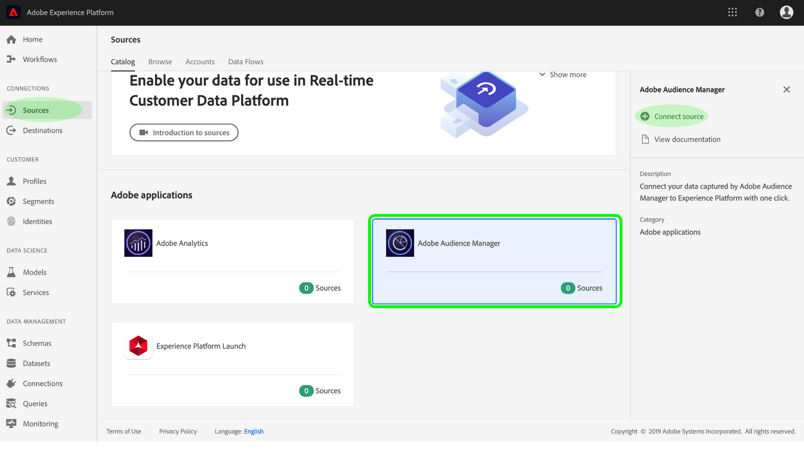
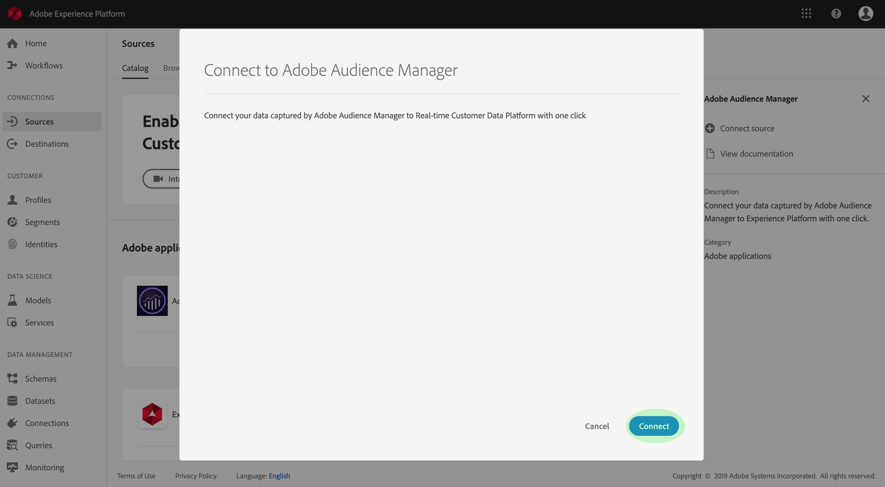

# Erstellen eines Adobe Audience Manager-Quellconnectors in der Benutzeroberfläche

Dieses Lernprogramm führt Sie durch die Schritte zum Erstellen von Quell-Connectors für Adobe Audience Manager, um mithilfe der Benutzeroberfläche Consumer Experience Ereignis-Daten in Platform einzubringen.

## Erstellen einer Quellverbindung mit Adobe Audience Manager

Melden Sie sich bei <a href="https://platform.adobe.com" target="_blank">Adobe Experience Platform</a> an und wählen Sie dann in der linken Navigationsleiste die Option &quot; **Quellen** &quot;, um auf den Quellarbeitsbereich zuzugreifen. Im Anzeigebereich &quot; *Katalog* &quot;werden verschiedene Quellen angezeigt, mit denen Sie Quellverbindungen erstellen können. Jede Quelle zeigt die Anzahl der vorhandenen Verbindungen an, die mit ihnen verbunden sind.

Wählen Sie unter der Kategorie *Adobe-Anwendungen* die Option **Adobe Audience Manager** , um eine Informationsleiste auf der rechten Seite des Bildschirms anzuzeigen. Die Informationsleiste enthält eine kurze Beschreibung der ausgewählten Quelle sowie Optionen zur Ansicht der Dokumentation oder zur Verbindung mit der Quelle.

Um einen neuen Quell-Connector für Adobe Audience Manager zu erstellen, klicken Sie auf Quelle **verbinden**.

Das folgende Dialogfeld wird angezeigt. Klicken Sie auf **Verbinden** , um die Verbindung zu erstellen.

Wenn eine Quellverbindung mit Adobe Audience Manager hergestellt wurde, wird die Seite &quot; *Quellcode-Aktivität* &quot;für Audience Manager-Connector angezeigt.

Wenn Sie eingehende Audiencen-Manager-Daten anhalten möchten, können Sie dies tun, indem Sie auf die Dataflow-Liste klicken und deren *Status* in der rechten *Eigenschaftenspalte* umschalten.

## Nächste Schritte

Während ein Audience Manager-Datendurchlauf aktiv ist, werden eingehende Daten automatisch in Echtzeit-Kundendaten erfasst. Sie können diese eingehenden Daten jetzt nutzen und mit dem Plattformsegmentierungsdienst Audiencen erstellen. Weitere Informationen finden Sie in den folgenden Dokumenten:

- [Übersicht über das Echtzeit-Kundenprofil](../../../../../profile/home.md)
- [Übersicht über den Segmentierungsdienst](../../../../../segmentation/home.md)