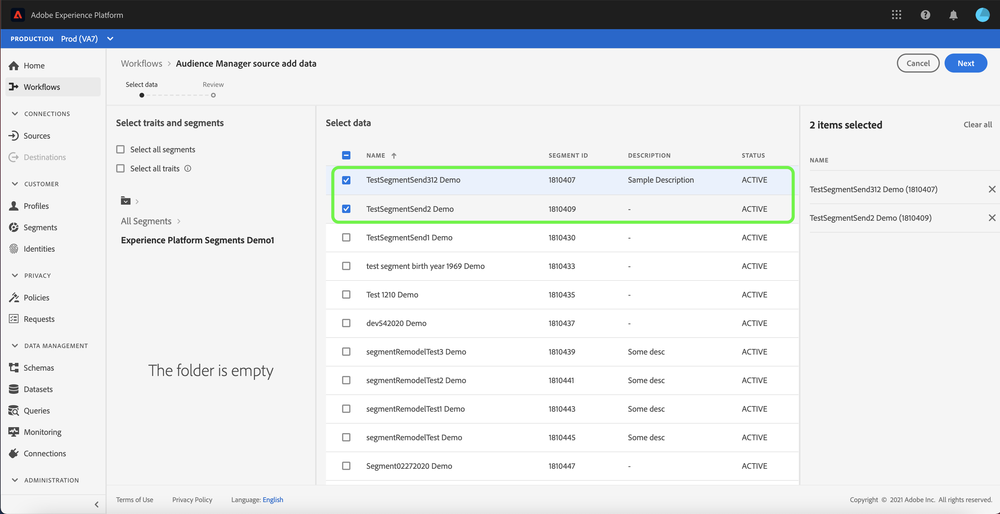

# Erstellen einer Adobe Audience Manager-Quellverbindung in der Benutzeroberfläche

In diesem Tutorial werden Sie durch die Schritte geführt, die zum Erstellen eines Quell-Connectors für Adobe Audience Manager erforderlich sind, um Verbrauchererlebnisereignisdaten über die Benutzeroberfläche in Platform einzubringen.

## Erstellen einer Quellverbindung mit Adobe Audience Manager

Melden Sie sich bei [Adobe Experience Platform](https://platform.adobe.com) an und wählen Sie dann **[!UICONTROL Quellen]** aus der linken Navigationsleiste aus, um auf den Arbeitsbereich [!UICONTROL Quellen] zuzugreifen. Der Bildschirm [!UICONTROL Katalog] enthält eine Vielzahl von Quellen, für die Sie ein Konto erstellen können.

Wählen Sie unter der Kategorie [!UICONTROL Adobe Applications] die Option **[!UICONTROL Adobe Audience Manager]** und klicken Sie dann auf **[!UICONTROL Konfigurieren]**.

Der Schritt [!UICONTROL Eigenschaften und Segmente auswählen] wird angezeigt und bietet eine interaktive Oberfläche, über die Sie Ihre Eigenschaften, Segmente und Daten untersuchen und auswählen können.

* Das linke Bedienfeld der Benutzeroberfläche enthält die Optionen [!UICONTROL Eigenschaften und Segmente auswählen] sowie ein hierarchisches Verzeichnis aller für Sie verfügbaren Segmente.
* In der rechten Hälfte der Benutzeroberfläche können Sie mit ausgewählten Segmenten interagieren und bestimmte Daten auswählen, die Sie verwenden möchten.

Um durch verfügbare Segmente zu navigieren, wählen Sie den Ordner, auf den Sie zugreifen möchten, aus dem Bedienfeld [!UICONTROL Alle Segmente] aus. Durch die Auswahl eines Ordners können Sie die Hierarchie eines Ordners durchlaufen und erhalten eine Liste von Segmenten, nach denen gefiltert werden soll.

Nachdem Sie die gewünschten Segmente identifiziert und ausgewählt haben, wird rechts ein neues Bedienfeld mit Ihrer Liste der ausgewählten Elemente angezeigt. Sie können weiterhin auf verschiedene Ordner zugreifen und verschiedene Segmente für Ihre Verbindung auswählen. Wenn Sie weitere Segmente auswählen, wird das Bedienfeld auf der rechten Seite aktualisiert.

Alternativ können Sie die Felder **[!UICONTROL Alle Segmente]** und **[!UICONTROL Alle Eigenschaften]** auswählen. Wenn Sie alle Audience Manager auswählen, gelangen die Segmentsegmente in Platform. Bei Auswahl aller Eigenschaften werden alle Erstanbietereigenschaften aus dem Audience Manager aktiviert.

Nachdem Sie fertig sind, wählen Sie **[!UICONTROL Weiter]** aus.

Der Schritt [!UICONTROL Überprüfen] wird angezeigt, sodass Sie Ihre ausgewählten Eigenschaften und Segmente überprüfen können, bevor sie mit Platform verbunden sind. Details werden in die folgenden Kategorien eingeteilt:

* **[!UICONTROL Verbindung]**: Zeigt die Quellplattform und den Status der Verbindung an.
* **[!UICONTROL Ausgewählte Daten]**: Zeigt die Anzahl der ausgewählten Segmente und aktivierten Eigenschaften an.

Nachdem Sie Ihren Datenfluss überprüft haben, wählen Sie **[!UICONTROL Beenden]** aus und lassen Sie einige Zeit für die Erstellung des Datenflusses zu.

## Nächste Schritte

Während ein Audience Manager-Datenfluss aktiv ist, werden eingehende Daten automatisch in Echtzeit-Kundenprofile aufgenommen. Sie können diese eingehenden Daten jetzt verwenden und Zielgruppensegmente mithilfe des Segmentierungsdienstes von Platform erstellen. Weitere Informationen finden Sie in den folgenden Dokumenten:

* [Übersicht über das Echtzeit-Kundenprofil](../../../../../profile/home.md)
* [Übersicht über den Segmentierungsdienst](../../../../../segmentation/home.md)
