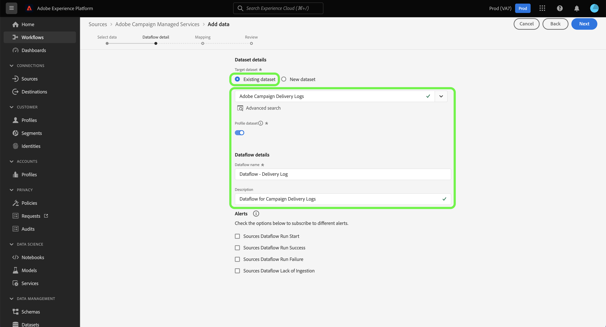

# Erstellen einer Adobe Campaign Managed Cloud Services-Quellverbindung über die Platform-Benutzeroberfläche

In diesem Tutorial erfahren Sie, wie Sie eine Quellverbindung erstellen, um Ihre Adobe Campaign Managed Cloud Services-Daten an Adobe Experience Platform zu übertragen.

## Erste Schritte

Dieses Handbuch setzt ein Verständnis der folgenden Komponenten von Experience Platform voraus:

* [Quellen](../../../../home.md): Platform ermöglicht die Aufnahme von Daten aus verschiedenen Quellen und bietet Ihnen die Möglichkeit, die eingehenden Daten mithilfe von Platform-Services zu strukturieren, zu kennzeichnen und anzureichern.
* [[!DNL Experience Data Model (XDM)] System](../../../../../xdm/home.md): Das standardisierte Framework, mit dem Experience Platform Kundenerlebnisdaten organisiert.
   * [Grundlagen der Schemakomposition](../../../../../xdm/schema/composition.md): Machen Sie sich mit den grundlegenden Bausteinen von XDM-Schemas vertraut, einschließlich der wichtigsten Prinzipien und Best Practices bei der Schemaerstellung.
   * [Tutorial zum Schema-Editor](../../../../../xdm/tutorials/create-schema-ui.md): Erfahren Sie, wie Sie benutzerdefinierte Schemas mithilfe der Benutzeroberfläche des Schema-Editors erstellen können.
* [Sandboxes](../../../../../sandboxes/home.md): Platform bietet virtuelle Sandboxes, die eine einzelne Platform-Instanz in separate virtuelle Umgebungen unterteilen, damit Sie Programme für digitale Erlebnisse besser entwickeln und weiterentwickeln können.

## Verbinden von Adobe Campaign Managed Cloud Services mit Platform

Wählen Sie in der Platform-Benutzeroberfläche in der linken Navigationsleiste die Option **[!UICONTROL Quellen]**, um auf den Arbeitsbereich [!UICONTROL Quellen] zuzugreifen. Der Bildschirm [!UICONTROL Katalog] zeigt eine Vielzahl von Quellen an, mit denen Sie ein Konto erstellen können.

Sie können die gewünschte Kategorie aus dem Katalog auf der linken Bildschirmseite auswählen. Sie können auch die Suchleiste verwenden, um die angezeigten Quellen einzugrenzen.

Unter dem **[!UICONTROL Adobe-Anwendungen]** category, select **[!UICONTROL Adobe Campaign Managed Cloud Services]** und wählen Sie **[!UICONTROL Daten hinzufügen]**.

### Daten auswählen {#select-data}

>[!CONTEXTUALHELP]
>id="platform_sources_campaign_instance"
>title="Adobe Campaign-Umgebungsinstanz"
>abstract="Der Name der Adobe Campaign-Umgebung, die Sie verwenden möchten."
>text="Learn more in documentation"

>[!CONTEXTUALHELP]
>id="platform_sources_campaign_mapping"
>title="Zielgruppenzuordnung"
>abstract="Zielgruppenzuordnungen sind technische Objekte, die von Campaign zum Versand von Nachrichten verwendet werden und alle technischen Einstellungen enthalten, die für den Versand erforderlich sind (Adressen, Telefonnummern, Opt-in-Indikatoren, zusätzliche Kennungen usw.)."
>text="Learn more in documentation"

>[!CONTEXTUALHELP]
>id="platform_sources_campaign_schema"
>title="Schemaname"
>abstract="Der Name der in der Adobe Campaign-Datenbank definierten Entität."
>text="Learn more in documentation"

Die [!UICONTROL Daten auswählen] -Schritt angezeigt wird und Ihnen eine Oberfläche zur Konfiguration Ihrer [!UICONTROL Adobe Campaign-Instanz], [!UICONTROL Zielgruppen-Mapping], und [!UICONTROL Schemaname].

| Eigenschaft | Beschreibung |
| --- | --- |
| Adobe Campaign-Instanz | Der Name der von Ihnen verwendeten Adobe Campaign-Umgebungsinstanz. |
| Zielgruppenzuordnung | Die technischen Objekte, die von Campaign zum Versand von Nachrichten verwendet werden, und enthalten alle technischen Parameter, die für den Versand benötigt werden. |
| Schemaname | Der Name der Schemaentität, die Sie an Platform übermitteln. Zu den Optionen gehören Versandprotokoll und Trackingprotokoll. |

Sobald Sie Werte für Ihre Campaign-Instanz, Zielgruppen-Mapping und den Schemanamen angegeben haben, wird der Bildschirm aktualisiert, um eine Vorschau Ihres Schemas sowie einen Beispieldatensatz anzuzeigen. Wenn Sie fertig sind, klicken Sie auf die Schaltfläche **[!UICONTROL Weiter]**.

### Verwenden eines vorhandenen Datensatzes

Die [!UICONTROL Datenflussdetails] -Seite können Sie auswählen, ob Sie einen vorhandenen Datensatz verwenden oder einen neuen Datensatz für Ihren Datenfluss konfigurieren möchten.

Um einen vorhandenen Datensatz zu verwenden, wählen Sie **[!UICONTROL Vorhandener Datensatz]**. Sie können einen vorhandenen Datensatz entweder über die Option [!UICONTROL Erweiterte Suche] oder durch Scrollen durch die Liste der vorhandenen Datensätze im Dropdown-Menü abrufen.

Wenn Sie einen Datensatz ausgewählt haben, geben Sie einen Namen für Ihren Datenfluss und eine optionale Beschreibung an.

### Verwenden eines neuen Datensatzes

Um einen neuen Datensatz zu verwenden, wählen Sie **[!UICONTROL Neuer Datensatz]** und geben Sie dann einen Namen für den Ausgabedatensatz und eine optionale Beschreibung an. Wählen Sie als Nächstes mithilfe der Option [!UICONTROL Erweiterte Suche] oder durch Scrollen durch die Liste der vorhandenen Schemata im Dropdown-Menü ein Schema zum Zuordnen aus. Wenn Sie fertig sind, klicken Sie auf die Schaltfläche **[!UICONTROL Weiter]**.

### Aktivieren von Warnhinweisen

Sie können Warnhinweise aktivieren, um Benachrichtigungen zum Status Ihres Datenflusses zu erhalten. Wählen Sie einen Warnhinweis aus der Liste aus, um Benachrichtigungen zum Status Ihres Datenflusses zu abonnieren und zu erhalten. Weitere Informationen zu Warnhinweisen finden Sie im Handbuch zum [Abonnieren von Warnhinweisen zu Quellen über die Benutzeroberfläche](../../alerts.md).

Wenn Sie mit dem Eingeben der Details für Ihren Datenfluss fertig sind, klicken Sie auf **[!UICONTROL Weiter]**.

### Zuordnen von Datenfeldern zu einem XDM-Schema

Es erfolgt der Schritt der [!UICONTROL Zuordnung], in dem Ihnen eine Schnittstelle zum Zuordnen der Quellfelder aus Ihrem Quellschema zu den entsprechenden XDM-Zielfeldern im Zielschema bereitgestellt wird.

Platform bietet intelligente Empfehlungen für automatisch zugeordnete Felder, die auf dem ausgewählten Zielschema oder Datensatz basieren. Sie können die Zuordnungsregeln manuell an Ihre Anwendungsfälle anpassen. Je nach Bedarf können Sie wahlweise Felder direkt zuordnen oder mithilfe von Datenvorbereitungsfunktionen Quelldaten transformieren, um berechnete oder anderweitig ermittelte Werte abzuleiten. Umfassende Schritte zur Verwendung der Mapper-Oberfläche und der berechneten Felder finden Sie im Abschnitt [Handbuch zur Datenvorbereitung-Benutzeroberfläche](../../../../../data-prep/ui/mapping.md).

>[!IMPORTANT]
>
>Beim Zuordnen Ihrer Quellfelder zu XDM-Zielfeldern müssen Sie sicherstellen, dass Sie Ihr dafür vorgesehenes primäres Identitätsfeld dem entsprechenden XDM-Zielfeld zuordnen.

Nachdem die Quelldaten erfolgreich zugeordnet wurden, wählen Sie **[!UICONTROL Nächste]**.

### Überprüfen des Datenflusses

Der Schritt **[!UICONTROL Überprüfung]** wird angezeigt, sodass Sie Ihren neuen Datenfluss überprüfen können, bevor er hergestellt wird. Die Details lassen sich wie folgt kategorisieren:

* **[!UICONTROL Verbindung]**: Zeigt den Quelltyp, den relevanten Pfad der ausgewählten Quelldatei und die Anzahl der Spalten innerhalb dieser Quelldatei an.
* **[!UICONTROL Datensatz- und Zuordnungsfelder zuweisen]**: Zeigt an, in welchen Datensatz die Quelldaten aufgenommen werden, einschließlich des Schemas, dem der Datensatz entspricht.

Nachdem Sie Ihren Datenfluss überprüft haben, klicken Sie auf **[!UICONTROL Beenden]** und gewähren Sie etwas Zeit für die Erstellung des Datenflusses.

### Datensatzaktivität überwachen

Nachdem Ihr Datenfluss erstellt wurde, können Sie die erfassten Daten überwachen, um Informationen zu erfassten Raten sowie erfolgreichen und fehlgeschlagenen Batches zu erhalten.

Um mit der Anzeige Ihrer Datensatzaktivität zu beginnen, wählen Sie **[!UICONTROL Datenflüsse]** im Quellkatalog.

Wählen Sie anschließend den Zieldatensatz aus der angezeigten Liste der Datenflüsse aus.

Die Seite mit der Datensatzaktivität wird angezeigt. Von hier aus können Sie Informationen zur Leistung Ihres Datenflusses sehen, einschließlich der Erfassungsrate, erfolgreicher Batches und fehlgeschlagener Batches.

Auf dieser Seite finden Sie außerdem eine Oberfläche, über die Sie die Metadatenbeschreibung Ihres Datenflusses aktualisieren, partielle Erfassung und Fehlerdiagnose aktivieren und neue Daten zu Ihrem Datensatz hinzufügen können.

## Nächste Schritte

In diesem Tutorial haben Sie erfolgreich einen Datenfluss erstellt, um Ihre Campaign v8-Versandlogs und -Trackinglog-Daten an Platform zu bringen. Eingehende Daten können jetzt von nachgelagerten Platform-Services wie [!DNL Real-Time Customer Profile] und [!DNL Data Science Workspace] verwendet werden. Weiterführende Informationen finden Sie in folgenden Dokumenten:

* [[!DNL Real-Time Customer Profile] – Übersicht](../../../../../profile/home.md)
* [[!DNL Data Science Workspace] – Übersicht](../../../../../data-science-workspace/home.md)
