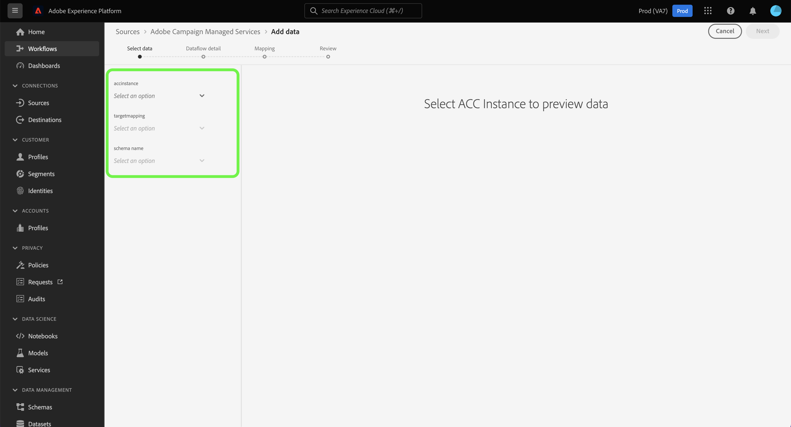

# Erstellen einer Adobe Campaign Managed Cloud Services-Quellverbindung mithilfe der Experience Platform-Benutzeroberfläche

In diesem Tutorial erfahren Sie, wie Sie eine Quellverbindung erstellen, um Ihre Adobe Campaign Managed Cloud Services-Daten an Adobe Experience Platform zu übertragen.

## Erste Schritte

Dieses Handbuch setzt ein Verständnis der folgenden Komponenten von Experience Platform voraus:

* [Quellen](../../../../home.md): Experience Platform ermöglicht die Aufnahme von Daten aus verschiedenen Quellen und bietet Ihnen die Möglichkeit, die eingehenden Daten mithilfe von Experience Platform-Services zu strukturieren, zu kennzeichnen und anzureichern.
* [[!DNL Experience Data Model (XDM)] System](../../../../../xdm/home.md): Das standardisierte Framework, mit dem Experience Platform Kundenerlebnisdaten organisiert.
   * [Grundlagen der Schemakomposition](../../../../../xdm/schema/composition.md): Machen Sie sich mit den grundlegenden Bausteinen von XDM-Schemata vertraut, einschließlich der wichtigsten Prinzipien und Best Practices bei der Schemaerstellung.
   * [Tutorial zum Schema-Editor](../../../../../xdm/tutorials/create-schema-ui.md): Erfahren Sie, wie Sie benutzerdefinierte Schemata mithilfe der Benutzeroberfläche des Schema-Editors erstellen können.
* [Sandboxes](../../../../../sandboxes/home.md): Experience Platform bietet virtuelle Sandboxes, die eine einzelne Experience Platform-Instanz in separate virtuelle Umgebungen unterteilen, damit Sie Programme für digitale Erlebnisse besser entwickeln und weiterentwickeln können.

## Adobe Campaign Managed Cloud Services mit Experience Platform verbinden

Wählen Sie in der Experience Platform-Benutzeroberfläche **[!UICONTROL Quellen]** in der linken Navigationsleiste aus, um auf den Arbeitsbereich [!UICONTROL Quellen] zuzugreifen. Der Bildschirm [!UICONTROL Katalog] zeigt eine Vielzahl von Quellen an, mit denen Sie ein Konto erstellen können.

Sie können die gewünschte Kategorie aus dem Katalog auf der linken Bildschirmseite auswählen. Sie können auch die Suchleiste verwenden, um die angezeigten Quellen einzugrenzen.

Wählen Sie unter der Kategorie **[!UICONTROL Adobe]** die Option **[!UICONTROL Adobe Campaign Managed Cloud Services]** und dann **[!UICONTROL Daten hinzufügen]** aus.

### Daten auswählen {#select-data}

>[!CONTEXTUALHELP]
>id="platform_sources_campaign_instance"
>title="Adobe Campaign-Umgebungsinstanz"
>abstract="Der Name der Adobe Campaign-Umgebung, die Sie verwenden möchten."
>text="Learn more in documentation"

>[!CONTEXTUALHELP]
>id="platform_sources_campaign_mapping"
>title="Zielgruppenzuordnung"
>abstract="Zielgruppenzuordnungen sind technische Objekte, die von Campaign zum Versand von Nachrichten verwendet werden und alle technischen Einstellungen enthalten, die für den Versand erforderlich sind (Adressen, Telefonnummern, Opt-in-Indikatoren, zusätzliche Kennungen usw.)."
>text="Learn more in documentation"

>[!CONTEXTUALHELP]
>id="platform_sources_campaign_schema"
>title="Schemaname"
>abstract="Der Name der in der Adobe Campaign-Datenbank definierten Entität."
>text="Learn more in documentation"

Der Schritt [!UICONTROL Daten auswählen] wird angezeigt und bietet Ihnen eine Schnittstelle zum Konfigurieren Ihrer [!UICONTROL Adobe Campaign-], [!UICONTROL Zielgruppen-] und [!UICONTROL Schemaname].

| Eigenschaft | Beschreibung |
| --- | --- |
| Adobe Campaign-Instanz | Der Name der von Ihnen verwendeten Adobe Campaign-Umgebungsinstanz. |
| Zielgruppenzuordnung | Die technischen Objekte, die von Campaign zum Versand von Nachrichten verwendet werden und alle technischen Einstellungen enthalten, die für den Versand erforderlich sind. |
| Schemaname | Der Name der Schemaentität, die Sie an Experience Platform senden. Zu den Optionen gehören Versandlog und Trackinglog. |

Nachdem Sie Werte für Ihre Campaign-Instanz, das Zielgruppen-Mapping und den Schemanamen angegeben haben, wird der Bildschirm aktualisiert, um eine Vorschau Ihres Schemas sowie einen Beispieldatensatz anzuzeigen. Wenn Sie fertig sind, klicken Sie auf die Schaltfläche **[!UICONTROL Weiter]**.

### Verwenden eines vorhandenen Datensatzes

Auf [!UICONTROL &#x200B; Seite „Datenflussdetails] können Sie auswählen, ob Sie einen vorhandenen Datensatz verwenden oder einen neuen Datensatz für Ihren Datenfluss konfigurieren möchten.

Um einen vorhandenen Datensatz zu verwenden, wählen Sie **[!UICONTROL Vorhandener Datensatz]**. Sie können einen vorhandenen Datensatz entweder über die Option [!UICONTROL Erweiterte Suche] oder durch Scrollen durch die Liste der vorhandenen Datensätze im Dropdown-Menü abrufen.

Wenn Sie einen Datensatz ausgewählt haben, geben Sie einen Namen für Ihren Datenfluss und eine optionale Beschreibung an.

### Verwenden eines neuen Datensatzes

Um einen neuen Datensatz zu verwenden, wählen **[!UICONTROL Neuer Datensatz]** und geben Sie dann einen Namen für den Ausgabedatensatz und eine optionale Beschreibung an. Wählen Sie als Nächstes mithilfe der Option [!UICONTROL Erweiterte Suche] oder durch Scrollen durch die Liste der vorhandenen Schemata im Dropdown-Menü ein Schema zum Zuordnen aus. Wenn Sie fertig sind, klicken Sie auf die Schaltfläche **[!UICONTROL Weiter]**.

### Aktivieren von Warnhinweisen

Sie können Warnhinweise aktivieren, um Benachrichtigungen zum Status Ihres Datenflusses zu erhalten. Wählen Sie einen Warnhinweis aus der zu abonnierenden Liste aus und erhalten Sie Benachrichtigungen zum Status Ihres Datenflusses. Weitere Informationen zu Warnhinweisen finden Sie im Handbuch zum [Abonnieren von Warnhinweisen zu Quellen über die Benutzeroberfläche](../../alerts.md).

Wenn Sie mit dem Eingeben der Details für Ihren Datenfluss fertig sind, klicken Sie auf **[!UICONTROL Weiter]**.

### Zuordnen von Datenfeldern zu einem XDM-Schema

Es erfolgt der Schritt der [!UICONTROL Zuordnung], in dem Ihnen eine Schnittstelle zum Zuordnen der Quellfelder aus Ihrem Quellschema zu den entsprechenden XDM-Zielfeldern im Zielschema bereitgestellt wird.

Experience Platform bietet intelligente Empfehlungen für automatisch zugeordnete Felder, die auf dem ausgewählten Zielschema oder Datensatz basieren. Sie können die Zuordnungsregeln manuell an Ihre Anwendungsfälle anpassen. Je nach Bedarf können Sie wahlweise Felder direkt zuordnen oder mithilfe von Datenvorbereitungsfunktionen Quelldaten transformieren, um berechnete oder anderweitig ermittelte Werte abzuleiten. Eine ausführliche Anleitung zur Verwendung der Zuordnungsschnittstelle und berechneter Felder finden Sie im [Handbuch zur Datenvorbereitungs-Benutzeroberfläche](../../../../../data-prep/ui/mapping.md).

>[!IMPORTANT]
>
>Beim Zuordnen Ihrer Quellfelder zu XDM-Zielfeldern müssen Sie sicherstellen, dass Sie Ihr designiertes primäres Identitätsfeld dem entsprechenden XDM-Zielfeld zuordnen.
>
>Für jede Zielgruppe können Sie bis zu 20 Felder hinzufügen, die Adobe Campaign zugeordnet werden sollen. Sie können diese Beschränkung ändern, indem Sie den Wert der Option `NmsCdp_Aep_Sources_Max_Columns` im Ordner Administration > Plattform > Optionen des Campaign-Explorers aktualisieren.

Nachdem Ihre Quelldaten erfolgreich zugeordnet wurden, klicken Sie auf **[!UICONTROL Weiter]**.

### Überprüfen des Datenflusses

Der Schritt **[!UICONTROL Überprüfung]** wird angezeigt, sodass Sie Ihren neuen Datenfluss überprüfen können, bevor er hergestellt wird. Die Details lassen sich wie folgt kategorisieren:

* **[!UICONTROL Verbindung]**: Zeigt den Quelltyp, den relevanten Pfad der ausgewählten Quelldatei und die Anzahl der Spalten innerhalb dieser Quelldatei an.
* **[!UICONTROL Datensatz- und Zuordnungsfelder zuweisen]**: Zeigt an, in welchen Datensatz die Quelldaten aufgenommen werden, einschließlich des Schemas, dem der Datensatz entspricht.

Nachdem Sie Ihren Datenfluss überprüft haben, klicken Sie auf **[!UICONTROL Beenden]** und gewähren Sie etwas Zeit für die Erstellung des Datenflusses.

### Überwachen der Datensatzaktivität

Nachdem Ihr Datenfluss erstellt wurde, können Sie die Daten überwachen, die über ihn aufgenommen werden, um Informationen über die erfassten Raten sowie erfolgreiche und fehlgeschlagene Batches anzuzeigen.

Um mit der Anzeige Ihrer Datensatzaktivität zu beginnen, wählen Sie **[!UICONTROL Datenflüsse]** im Quellkatalog aus.

Wählen Sie anschließend in der Liste der angezeigten Datenflüsse den Zieldatensatz aus.

Die Seite Datensatzaktivität wird angezeigt. Von hier aus können Sie Informationen zur Leistung Ihres Datenflusses sehen, einschließlich der Aufnahmerate, erfolgreicher Batches und fehlgeschlagener Batches.

Auf dieser Seite finden Sie auch eine Schnittstelle zum Aktualisieren der Metadatenbeschreibung Ihres Datenflusses, zum Aktivieren der partiellen Aufnahme und der Fehlerdiagnose sowie zum Hinzufügen neuer Daten zu Ihrem Datensatz.

>[!IMPORTANT]
>
>Alte Ereignisprotokolle können nicht mit der Adobe Campaign Managed Cloud Services-Quelle aufgestockt werden. Wenn eine Aufstockung erforderlich ist, verwenden Sie einen benutzerdefinierten Workflow oder eine benutzerdefinierte Implementierung, um Daten in Amazon S3 oder Azure Blob oder aus Amazon S3 oder Azure Blob in einen Adobe Experience Platform-Datensatz zu exportieren.

## Nächste Schritte

In diesem Tutorial haben Sie erfolgreich einen Datenfluss erstellt, um Ihre Versandlogs und Trackinglog-Daten von Campaign v8 in Experience Platform zu übertragen. Eingehende Daten können jetzt von nachgelagerten Experience Platform-Services wie [!DNL Real-Time Customer Profile] und [!DNL Data Science Workspace] verwendet werden. Weiterführende Informationen finden Sie in folgenden Dokumenten:

* [[!DNL Real-Time Customer Profile] – Übersicht](../../../../../profile/home.md)
* [[!DNL Data Science Workspace] – Übersicht](../../../../../data-science-workspace/home.md)
