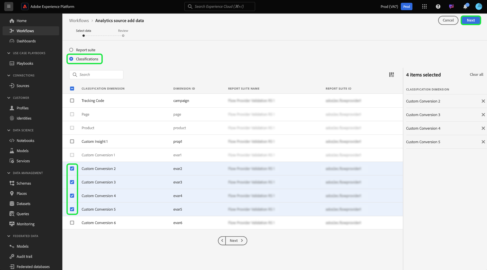

# Erstellen einer Adobe Analytics-Quellverbindung für Klassifizierungsdaten in der Benutzeroberfläche

>[!TIP]
>
>Standardmäßig werden Adobe Analytics-Klassifizierungsdaten wöchentlich aktualisiert. Die Datenaufnahme für Ihre Klassifizierungsdaten wird sieben Tage nach der ersten Einrichtung Ihres Datenflusses verarbeitet. Der erste Ladevorgang nimmt die gesamten Daten auf und die anschließende wöchentliche Aufnahme führt inkrementelle Daten aus.

In diesem Tutorial erfahren Sie, wie Sie Ihre Adobe Analytics-Klassifizierungsdaten über die Benutzeroberfläche in Adobe Experience Platform aufnehmen.

## Erste Schritte

Dieses Tutorial setzt ein Grundverständnis der folgenden Komponenten von Adobe Experience Platform voraus:

* [[!DNL Experience Data Model (XDM)] System](../../../../../xdm/home.md): Das standardisierte Framework, mit dem Experience Platform Kundenerlebnisdaten organisiert.
* [[!DNL Real-Time Customer Profile]](../../../../../profile/home.md): Bietet ein einheitliches Echtzeit-Kundenprofil, das auf aggregierten Daten aus verschiedenen Quellen basiert.
* [[!DNL Sandboxes]](../../../../../sandboxes/home.md): Experience Platform bietet virtuelle Sandboxes, die eine einzelne Platform-Instanz in separate virtuelle Umgebungen unterteilen, damit Sie Programme für digitale Erlebnisse besser entwickeln und weiterentwickeln können.

Vor der Verwendung des Analytics Classifications Source Connectors müssen Ihre Daten in die neue Klassifizierungs-Infrastruktur von Adobe Analytics migriert worden sein. Wenden Sie sich zur Bestätigung des Migrationsstatus Ihrer Daten an Ihr Adobe-Account-Team.

## Klassifizierungen auswählen

Wählen Sie in der Experience Platform-Benutzeroberfläche **[!UICONTROL Quellen]** in der linken Navigationsleiste aus, um auf den Arbeitsbereich [!UICONTROL Quellen] zuzugreifen. Sie können die gewünschte Kategorie aus dem Katalog auf der linken Bildschirmseite auswählen. Alternativ können Sie die gewünschte Quelle mithilfe der Suchoption finden.

Wählen Sie unter der Kategorie *Adobe* Anwendungen} **[!UICONTROL Adobe Analytics]** und dann **[!UICONTROL Einrichten]** aus.

>[!TIP]
>
>Quellen im Quellkatalog zeigen die Option **[!UICONTROL Einrichten]** an, wenn kein authentifiziertes Konto vorhanden ist. Nach der Authentifizierung eines Kontos ändert sich die Option in **[!UICONTROL Daten hinzufügen]**.

Wählen Sie als Nächstes [!UICONTROL Klassifizierungen] und wählen Sie dann die Klassifizierungsdatensätze aus, die Sie in den Experience Platform aufnehmen möchten.

Sie können bis zu 30 verschiedene Klassifizierungsdatensätze auswählen, die in Experience Platform integriert werden sollen. Alle von Ihnen ausgewählten Datensätze werden in der rechten Leiste angezeigt. Wenn Sie fertig sind, klicken Sie auf [!UICONTROL Weiter] um fortzufahren.

## Überprüfen der Klassifizierungen

Der Schritt **[!UICONTROL Überprüfen]** wird angezeigt, sodass Sie Ihre ausgewählten Klassifizierungsdatensätze überprüfen können, bevor sie erstellt werden. Die Details lassen sich wie folgt kategorisieren:

* **[!UICONTROL Verbindung]**: Zeigt die Quellplattform und den Status der Verbindung an.
* **[!UICONTROL Datentyp]**: Zeigt die Anzahl der ausgewählten Klassifizierungen an.
* **[!UICONTROL Planung]**: Zeigt die Häufigkeit der Synchronisierung für Klassifizierungsdaten an. **Hinweis**: Klassifizierungsdaten werden wöchentlich aktualisiert.

Nachdem Sie Ihren Datenfluss überprüft haben, klicken Sie auf **[!UICONTROL Beenden]** und gewähren Sie etwas Zeit für die Erstellung des Datenflusses.

## Nächste Schritte

In diesem Tutorial haben Sie einen Analytics Classifications Data-Connector erstellt, der Klassifizierungsdaten in Experience Platform bringt. In den folgenden Dokumenten finden Sie weitere Informationen zu [!DNL Analytics] und Klassifizierungsdaten:

* [Übersicht über den Adobe Analytics-Quell-Connector](../../../../connectors/adobe-applications/analytics.md)
* [Erstellen einer Analytics-Quellverbindung für Report Suite-Daten in der Benutzeroberfläche](./analytics.md)
* [Über Klassifizierungen](https://experienceleague.adobe.com/docs/analytics/components/classifications/c-classifications.html)
