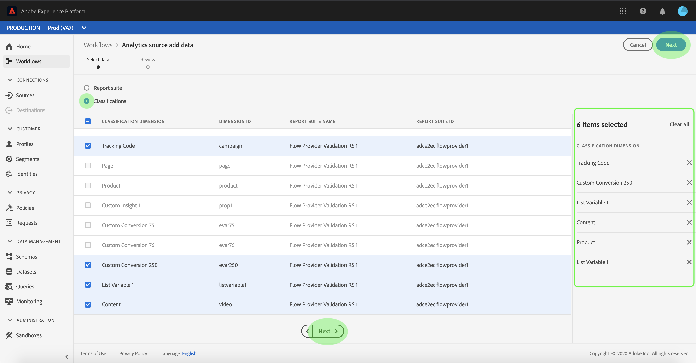

# Erstellen einer Adobe Analytics-Quellverbindung für Klassifizierungsdaten in der Benutzeroberfläche

In diesem Tutorial erfahren Sie, wie Sie eine Adobe Analytics Classifications-Datenquellenverbindung in der Benutzeroberfläche erstellen, um Classification-Daten in Adobe Experience Platform zu importieren.

## Erste Schritte

Dieses Tutorial setzt ein Grundverständnis der folgenden Komponenten von Adobe Experience Platform voraus:

* [[!DNL Experience Data Model (XDM)] System](../../../../../xdm/home.md): Das standardisierte Framework, mit dem Experience Platform Kundenerlebnisdaten organisiert.
* [[!DNL Real-Time Customer Profile]](../../../../../profile/home.md): Bietet ein einheitliches Echtzeit-Kundenprofil, das auf aggregierten Daten aus verschiedenen Quellen basiert.
* [[!DNL Sandboxes]](../../../../../sandboxes/home.md): Experience Platform bietet virtuelle Sandboxes, die eine einzelne Platform-Instanz in separate virtuelle Umgebungen unterteilen, damit Sie Programme für digitale Erlebnisse entwickeln und weiterentwickeln können.

Der Data Connector von Analytics Classifications erfordert, dass Ihre Daten in die neue migriert wurden. [!DNL Classifications] -Infrastruktur von Adobe Analytics vor der Nutzung. Wenden Sie sich zur Bestätigung des Migrationsstatus Ihrer Daten an Ihr Adobe-Kundenbetreuungsteam.

## Auswählen Ihrer Classifications

Anmelden bei [Adobe Experience Platform](https://platform.adobe.com) und wählen Sie **[!UICONTROL Quellen]** in der linken Navigationsleiste, um auf den Arbeitsbereich &quot;Quellen&quot;zuzugreifen. Die **[!UICONTROL Katalog]** zeigt verfügbare Quellen an, mit denen eingehende Verbindungen erstellt werden können. Jede Quellkarte enthält eine Option zum Konfigurieren eines neuen Kontos oder zum Hinzufügen von Daten zu einem vorhandenen Konto.

Sie können die gewünschte Kategorie aus dem Katalog auf der linken Bildschirmseite auswählen. Alternativ können Sie die gewünschte Quelle mithilfe der Suchoption finden.

Unter dem **[!UICONTROL Adobe Apps]** -Kategorie, wählen Sie die **[!UICONTROL Adobe Analytics]** und wählen Sie **[!UICONTROL Daten hinzufügen]** , um mit Analytics Classifications Data zu arbeiten.

Der Schritt **[!UICONTROL Analytics-Quelle – Daten hinzufügen]** wird angezeigt. Auswählen **[!UICONTROL Klassifizierungen]** aus der oberen Kopfzeile, um eine Liste von [!DNL Classifications] Datensätze, einschließlich Informationen zu ihrer Dimension-ID, dem Report Suite-Namen und der Report Suite-ID.

Jede Seite zeigt bis zu zehn verschiedene [!DNL Classifications] Datensätze, aus denen Sie auswählen können. Auswählen **[!UICONTROL Nächste]** unten auf der Seite nach weiteren Optionen suchen. Das Bedienfeld auf der rechten Seite zeigt die Gesamtanzahl der [!DNL Classifications] ausgewählten Datensätzen sowie deren Namen. In diesem Bedienfeld können Sie auch alle [!DNL Classifications] Datensätze, die Sie versehentlich ausgewählt haben, oder alle Auswahlen mit einer Aktion löschen.

Sie können bis zu 30 verschiedene [!DNL Classifications] Zu berücksichtigende Datensätze [!DNL Platform].

Nachdem Sie Ihre [!DNL Classifications] Datensätze auswählen **[!UICONTROL Nächste]** oben rechts auf der Seite.

## Überprüfen Sie Ihre Klassifizierungen.

Die **[!UICONTROL Überprüfen]** angezeigt, sodass Sie Ihre ausgewählte [!DNL Classifications] Datensätze vor der Erstellung. Die Details lassen sich wie folgt kategorisieren:

* **[!UICONTROL Verbindung]**: Zeigt die Quellplattform und den Status der Verbindung an.
* **[!UICONTROL Datentyp]**: Zeigt die Anzahl der ausgewählten [!DNL Classifications].
* **[!UICONTROL Planung]**: Zeigt die Häufigkeit der Synchronisierung für [!DNL Classifications] Daten.

Nachdem Sie Ihren Datenfluss überprüft haben, klicken Sie auf **[!UICONTROL Beenden]** und lassen Sie etwas Zeit für die Erstellung des Datenflusses zu.

## Überwachen des Datenflusses zu Classifications

Nachdem Ihr Datenfluss erstellt wurde, können Sie die Daten überwachen, die über ihn aufgenommen werden. Aus dem **[!UICONTROL Katalog]** Bildschirm, wählen Sie **[!UICONTROL Datenflüsse]** um eine Liste der mit Ihrem [!DNL Classifications] -Konto.

Der Bildschirm **[!UICONTROL Datenflüsse]** wird angezeigt. Auf dieser Seite finden Sie eine Liste von Datenflüssen, einschließlich Informationen zu ihrem Namen, Quelldaten und Datenfluss-Ausführungsstatus. Rechts befindet sich der **[!UICONTROL Eigenschaften]** Bedienfeld mit Metadaten zu Ihrer [!DNL Classifications] dataflow.

Wählen Sie die **[!UICONTROL Target-Datensatz]** die Sie aufrufen möchten.

Die **[!UICONTROL Datensatzaktivität]** -Seite enthält Informationen zum ausgewählten Zieldatensatz, einschließlich Details zum Batch-Status, zur Datensatz-ID und zum Schema.

>[!IMPORTANT]
>
>Das Löschen von Datensätzen ist zwar für andere Quell-Connectoren möglich, wird aber derzeit für den Analytics Classifications Data-Connector nicht unterstützt. Wenn Sie einen Datensatz versehentlich löschen, wenden Sie sich an die Kundenunterstützung von Adobe.

## Nächste Schritte

In diesem Tutorial haben Sie einen Data Connector für Analytics Classifications erstellt, der Folgendes ermöglicht: [!DNL Classifications] Daten in [!DNL Platform]. Weitere Informationen zu [!DNL Analytics] und [!DNL Classifications] data:

* [Übersicht über den Analytics Data Connector](../../../../connectors/adobe-applications/analytics.md)
* [Erstellen einer Analytics-Datenverbindung in der Benutzeroberfläche](./analytics.md)
* [Informationen über Klassifizierungen](https://experienceleague.adobe.com/docs/analytics/components/classifications/c-classifications.html?lang=de)
