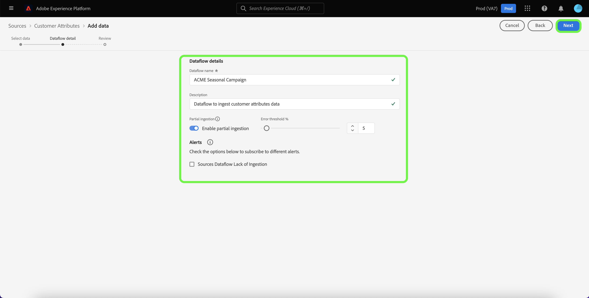

# Erstellen einer Quellverbindung für Kundenattribute in der Benutzeroberfläche

In diesem Tutorial erfahren Sie, wie Sie in der Benutzeroberfläche eine Quellverbindung erstellen, um Kundenattributprofildaten in Adobe Experience Platform zu importieren. Weitere Informationen zu Kundenattributen finden Sie unter [Übersicht über Kundenattribute](https://experienceleague.adobe.com/docs/core-services/interface/customer-attributes/attributes.html?lang=de).

>[!IMPORTANT]
>
>Die Quelle Kundenattribute unterstützt derzeit nicht die Aktivierung oder Deaktivierung von Datenflüssen.

## Erstellen einer Quellverbindung

>[!NOTE]
>
>Wenn Sie bereits eine Quellverbindung für Kundenattribut-Profildaten hergestellt haben, ist die Option zur Verbindung mit der Quelle deaktiviert.

Wählen Sie in der Platform-Benutzeroberfläche in der linken Navigationsleiste die Option **[!UICONTROL Quellen]**, um auf den Arbeitsbereich [!UICONTROL Quellen] zuzugreifen. Die [!UICONTROL Katalog] zeigt eine Vielzahl von Quellen an, mit denen Sie eine Verbindung herstellen können.

Sie können die gewünschte Kategorie aus dem Katalog auf der linken Bildschirmseite auswählen. Alternativ können Sie die gewünschte Quelle mithilfe der Suchleiste finden.

Unter dem [!UICONTROL Adobe Apps] category, select **[!UICONTROL Kundenattribute]** und wählen Sie **[!UICONTROL Daten hinzufügen]**.

### Datenquelle für Kundenattribute auswählen

Die [!UICONTROL Daten hinzufügen] -Bildschirm listet alle verfügbaren Datenquellen für Kundenattribute auf. Pro Quellverbindung mit Kundenattributen kann nur ein Datensatz ausgewählt werden.

>[!NOTE]
>
>Feldergruppen, Schemata und Datensätze werden im Rahmen der Flussbereitstellung nativ erstellt. Sie bleiben unverändert und müssen bei Bedarf manuell gelöscht werden.

Die Schemaentwicklung wird von der Quelle der Kundenattribute nicht unterstützt. Wenn die Schemaeingabe einer Datenquelle mit Kundenattributen geändert wird, würde sie mit Platform inkompatibel werden. Als Problemumgehung können Sie einen vorhandenen Datenfluss mit Kundenattributen zusammen mit dem zugehörigen Datensatz, Schema und der Feldergruppe löschen und dann einen neuen Datenfluss mit dem aktualisierten Schema und der aktualisierten Datenquelle erstellen.

>[!IMPORTANT]
>
>Sie können einen Datenfluss mit Kundenattributen zwar löschen, der entsprechende Datensatz bleibt jedoch auch nach dem Löschen des Datenflusses bestehen. Siehe Handbuch unter [Löschen eines Datensatzes](../../../../../catalog/datasets/user-guide.md) für Schritte zum manuellen Löschen eines Datensatzes.

Um eine neue Verbindung zu erstellen, wählen Sie eine Datenquelle aus der Liste aus und klicken Sie auf **[!UICONTROL Nächste]**.

### Angeben von Datenflussdetails

Die [!UICONTROL Datenflussdetails] angezeigt, sodass Sie einen Namen und eine kurze Beschreibung für Ihren Datenfluss angeben können. Während dieses Vorgangs können Sie auch Einstellungen für [!UICONTROL Fehlerdiagnose], [!UICONTROL Partielle Erfassung]und [!UICONTROL Warnhinweise].

[!UICONTROL Fehlerdiagnose] ermöglicht eine detaillierte Erstellung von Fehlermeldungen für alle fehlerhaften Datensätze, die in Ihrem Datenfluss auftreten, während [!UICONTROL Partielle Aufnahme] die Aufnahme von fehlerhaften Daten bis zu einem gewissen Schwellenwert, den Sie manuell definieren, ermöglicht. Weitere Informationen finden Sie in der [Übersicht zur partiellen Batch-Aufnahme](../../../../../ingestion/batch-ingestion/partial.md).

Sie können Warnhinweise aktivieren, um Benachrichtigungen zum Status Ihres Datenflusses zu erhalten. Wählen Sie einen Warnhinweis aus der zu abonnierenden Liste aus, um Benachrichtigungen über den Status Ihres Datenflusses zu erhalten. Weitere Informationen zu Warnhinweisen finden Sie im Handbuch zum [Abonnieren von Warnhinweisen zu Quellen über die Benutzeroberfläche](../../alerts.md).

Wenn Sie mit dem Eingeben der Details für Ihren Datenfluss fertig sind, klicken Sie auf **[!UICONTROL Weiter]**.

### Überprüfung dataflow

Der Schritt [!UICONTROL Überprüfung] wird angezeigt, sodass Sie Ihren neuen Datenfluss überprüfen können, bevor er hergestellt wird. Die Details lassen sich wie folgt kategorisieren:

* **[!UICONTROL Verbindung]**: Zeigt den Quelltyp, den relevanten Pfad der ausgewählten Quelldatei und die Anzahl der Spalten in dieser Quelldatei an.
* **[!UICONTROL Datensatz- und Zuordnungsfelder zuweisen]**: Zeigt an, in welchen Datensatz die Quelldaten aufgenommen werden, einschließlich des Schemas, dem der Datensatz entspricht.

## Nächste Schritte

Nachdem die Verbindung erstellt wurde, werden automatisch ein Zielgruppenschema und ein Datensatz erstellt, die die eingehenden Daten enthalten. Nach Abschluss der ersten Aufnahme können Kundenattributprofildaten von nachgelagerten Platform-Diensten wie [!DNL Real-Time Customer Profile] und [!DNL Segmentation Service]. Weiterführende Informationen finden Sie in folgenden Dokumenten:

* [[!DNL Real-Time Customer Profile] – Übersicht](../../../../../profile/home.md)
* [[!DNL Segmentation Service] – Übersicht](../../../../../segmentation/home.md)
