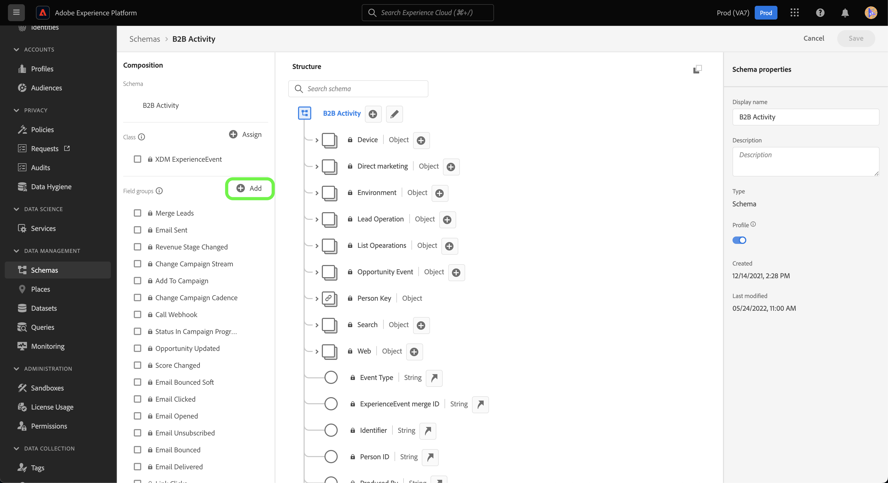

# Erstellen einer [!DNL Marketo Engage] Quellverbindung und eines Datenflusses für benutzerdefinierte Aktivitätsdaten in der Benutzeroberfläche

>[!NOTE]
>
>In diesem Tutorial erfahren Sie, wie Sie (**-Aktivitätsdaten** von [!DNL Marketo] auf Experience Platform einrichten und übertragen. Anweisungen zum Einbringen von Daten **Standardaktivität** finden Sie im [[!DNL Marketo] UI-Handbuch](./marketo.md).

Zusätzlich zu [Standardaktivitäten](../../../../connectors/adobe-applications/mapping/marketo.md#activities) können Sie auch die [!DNL Marketo] verwenden, um benutzerdefinierte Aktivitätsdaten in Adobe Experience Platform zu übertragen. In diesem Dokument wird beschrieben, wie Sie eine Quellverbindung und einen Datenfluss für benutzerdefinierte Aktivitätsdaten mithilfe der [!DNL Marketo] in der Benutzeroberfläche erstellen.

## Erste Schritte

Dieses Tutorial setzt ein Grundverständnis der folgenden Komponenten von Adobe Experience Platform voraus:

* [B2B-Namespaces und Dienstprogramm zur automatischen Schemaerstellung](../../../../connectors/adobe-applications/marketo/marketo-namespaces.md): Mit dem B2B-Namespace- und dem Dienstprogramm zur automatischen Schemaerstellung können Sie [!DNL Postman] verwenden, um automatisch Werte für Ihre B2B-Namespaces und -Schemas zu generieren. Sie müssen zuerst Ihre B2B-Namespaces und -Schemata abschließen, bevor Sie eine [!DNL Marketo] Quellverbindung und einen Datenfluss erstellen.
* [Quellen](../../../../home.md): Experience Platform ermöglicht die Aufnahme von Daten aus verschiedenen Quellen und bietet Ihnen die Möglichkeit, die eingehenden Daten mithilfe von Platform-Services zu strukturieren, zu kennzeichnen und anzureichern.
* [Experience-Datenmodell (XDM)](../../../../../xdm/home.md): Das standardisierte Framework, mit dem Experience Platform Kundenerlebnisdaten organisiert.
   * [Erstellen und Bearbeiten von Schemata in der Benutzeroberfläche](../../../../../xdm/ui/resources/schemas.md): Erfahren Sie, wie Sie in der Benutzeroberfläche Schemata erstellen und bearbeiten.
* [Identitäts-Namespaces](../../../../../identity-service/features/namespaces.md): Identitäts-Namespaces sind eine Komponente von [!DNL Identity Service], die als Indikatoren für den Kontext dienen, auf den sich eine Identität bezieht. Eine vollqualifizierte Identität umfasst einen ID-Wert und einen Namespace.
* [[!DNL Real-Time Customer Profile]](/help/profile/home.md): Bietet ein einheitliches Echtzeit-Kundenprofil, das auf aggregierten Daten aus verschiedenen Quellen basiert.
* [Sandboxes](../../../../../sandboxes/home.md): Experience Platform bietet virtuelle Sandboxes, die eine einzelne Platform-Instanz in separate virtuelle Umgebungen unterteilen, damit Sie Programme für digitale Erlebnisse entwickeln und weiterentwickeln können.

## Abrufen von Details zur benutzerdefinierten Aktivität

Um benutzerdefinierte Aktivitätsdaten von [!DNL Marketo] auf Experience Platform zu übertragen, müssen Sie als Erstes den API-Namen und den Anzeigenamen Ihrer benutzerdefinierten Aktivität abrufen.

Melden Sie sich über die [[!DNL Marketo]](https://app-sjint.marketo.com/#MM0A1)-Oberfläche bei Ihrem Konto an. Wählen Sie in der linken Navigationsleiste unter [!DNL Database Management] die Option **Benutzerdefinierte Marketo-Aktivitäten**.

Die Benutzeroberfläche wird aktualisiert und zeigt jetzt benutzerdefinierte Aktivitäten an, einschließlich Informationen zu ihren jeweiligen Anzeigenamen und API-Namen. Sie können auch die rechte Leiste verwenden, um andere benutzerdefinierte Aktivitäten in Ihrem Konto auszuwählen und anzuzeigen.


Wählen Sie **Felder** in der oberen Kopfzeile aus, um die mit Ihrer benutzerdefinierten Aktivität verknüpften Felder anzuzeigen. Auf dieser Seite können Sie die Namen, API-Namen, Beschreibungen und Datentypen der Felder in Ihrer benutzerdefinierten Aktivität anzeigen. Details zu einzelnen Feldern werden in einem späteren Schritt beim Erstellen eines Schemas verwendet.


## Feldergruppen für benutzerdefinierte Aktivitäten im Schema der B2B-Aktivitäten einrichten

Wählen Sie im Dashboard *[!UICONTROL Schemata]* der Experience Platform-Benutzeroberfläche die Option **[!UICONTROL Durchsuchen]** und wählen Sie dann **[!UICONTROL B2B-]** aus der Liste der Schemata aus.

>[!TIP]
>
>Verwenden Sie die Suchleiste, um die Navigation durch die Liste der Schemata zu beschleunigen.


### Erstellen einer neuen Feldergruppe für eine benutzerdefinierte Aktivität

Fügen Sie als Nächstes eine neue Feldergruppe zum [!DNL B2B Activity] hinzu. Diese Feldergruppe sollte mit der benutzerdefinierten Aktivität übereinstimmen, die Sie aufnehmen möchten, und den Anzeigenamen der benutzerdefinierten Aktivität verwenden, den Sie zuvor abgerufen haben.

Um eine neue Feldergruppe hinzuzufügen, wählen Sie **[!UICONTROL + Hinzufügen]** neben dem *[!UICONTROL Feldergruppen]* unter *[!UICONTROL Komposition]*.



Das *[!UICONTROL Feldergruppen hinzufügen]* wird angezeigt. Wählen Sie **[!UICONTROL Neue Feldergruppe erstellen]** und geben Sie dann denselben Anzeigenamen für die benutzerdefinierte Aktivität an, die Sie in einem früheren Schritt abgerufen haben, und geben Sie eine optionale Beschreibung für Ihre neue Feldergruppe an. Wählen Sie abschließend **[!UICONTROL Feldergruppen hinzufügen]** aus.


Nach der Erstellung wird die neue Feldergruppe für die benutzerdefinierte Aktivität im Katalog [!UICONTROL Feldergruppen] angezeigt.


### Hinzufügen eines neuen Felds zur Schemastruktur

Fügen Sie als Nächstes ein neues Feld zu Ihrem Schema hinzu. Dieses neue Feld muss auf `type: object` gesetzt werden und enthält die einzelnen Felder der benutzerdefinierten Aktivität.

Um ein neues Feld hinzuzufügen, wählen Sie das Pluszeichen (`+`) neben dem Schemanamen aus. Ein Eintrag für &quot;*[!UICONTROL Feld“ | Typ]* wird angezeigt. Konfigurieren Sie anschließend die Eigenschaften Ihres Felds mithilfe des Bedienfelds *[!UICONTROL Feldeigenschaften]*. Legen Sie den Feldnamen als API-Namen Ihrer benutzerdefinierten Aktivität fest und legen Sie den Anzeigenamen als Anzeigenamen Ihrer benutzerdefinierten Aktivität fest. Legen Sie dann den Typ als `object` fest und weisen Sie die Feldergruppe der benutzerdefinierten Aktivitätsfeldgruppe zu, die Sie im vorherigen Schritt erstellt haben. Wenn Sie fertig sind, wählen Sie **[!UICONTROL Anwenden]** aus.


Das neue Feld wird in Ihrem Schema angezeigt.


### Hinzufügen von Unterfeldern zum Objektfeld {#add-sub-fields-to-the-object-field}

Der letzte Schritt bei der Vorbereitung Ihres Schemas besteht darin, einzelne Felder in dem Feld hinzuzufügen, das Sie im vorherigen Schritt erstellt haben.


## Erstellen eines Datenflusses

Nachdem Sie Ihr Schema fertig eingerichtet haben, können Sie nun mit dem Erstellen eines Datenflusses für Ihre benutzerdefinierten Aktivitätsdaten fortfahren.

Wählen Sie in der Platform-Benutzeroberfläche die Option **[!UICONTROL Quellen]** in der linken Navigationsleiste, um auf den Arbeitsbereich [!UICONTROL Quellen] zuzugreifen. Die [!UICONTROL Katalog] zeigt eine Vielzahl von Quellen an, mit denen Sie ein Konto erstellen können.

Sie können die gewünschte Kategorie aus dem Katalog auf der linken Bildschirmseite auswählen. Alternativ können Sie die gewünschte Quelle mithilfe der Suchleiste finden.

Wählen Sie unter der Kategorie [!UICONTROL Adobe-Programme] die Option **[!UICONTROL Marketo Engage]**. Wählen Sie dann **[!UICONTROL Daten hinzufügen]**, um einen neuen [!DNL Marketo]-Datenfluss zu erstellen.


### Daten auswählen

Wählen Sie **[!UICONTROL Aktivitäten]** aus der Liste [!DNL Marketo] Datensätze aus und klicken Sie dann auf **[!UICONTROL Weiter]**.


### Datenflussdetails

Geben [ anschließend Informationen für Ihren Datenfluss ](./marketo.md#provide-dataflow-details), einschließlich Namen und Beschreibungen für Ihren Datensatz und Datenfluss, das Schema, das Sie verwenden werden, und Konfigurationen für die [!DNL Profile], Fehlerdiagnose und partielle Aufnahme.


### Zuordnung

Zuordnungen für standardmäßige Aktivitätsfelder werden automatisch ausgefüllt, aber benutzerdefinierte Aktivitätsfelder müssen den entsprechenden Zielfeldern manuell zugeordnet werden.

Um mit der Zuordnung Ihrer benutzerdefinierten Aktivitätsfelder zu beginnen, wählen Sie **[!UICONTROL Neuer Feldtyp]** und dann **[!UICONTROL Neues Feld hinzufügen]** aus.


Navigieren Sie durch die Quelldatenstruktur und suchen Sie nach dem benutzerdefinierten Aktivitätsfeld, das Sie aufnehmen möchten. Wenn Sie fertig sind, wählen **[!UICONTROL Auswählen]**.

>[!TIP]
>
>Um Verwirrung zu vermeiden und doppelte Feldnamen zu verarbeiten, werden benutzerdefinierte Aktivitätsfelder mit dem Präfix des API-Namens versehen.


Um ein Zielfeld hinzuzufügen, wählen Sie das Schemasymbol  und dann die benutzerdefinierten Aktivitätsfelder aus dem Zielschema aus.


Wiederholen Sie die Schritte, um den Rest Ihrer benutzerdefinierten Aktivitätszuordnungsfelder hinzuzufügen. Wenn Sie fertig sind, klicken Sie auf die Schaltfläche **[!UICONTROL Weiter]**.


### Überprüfung

Der Schritt *[!UICONTROL Überprüfung]* wird angezeigt, sodass Sie Ihren neuen Datenfluss überprüfen können, bevor er hergestellt wird. Die Details lassen sich wie folgt kategorisieren:

* **[!UICONTROL Verbindung]**: Zeigt den Quelltyp, den relevanten Pfad der ausgewählten Quellentität und die Anzahl der Spalten innerhalb dieser Quellentität an.
* **[!UICONTROL Datensatz- und Zuordnungsfelder zuweisen]**: Zeigt an, in welchen Datensatz die Quelldaten aufgenommen werden, einschließlich des Schemas, dem der Datensatz entspricht.

Nachdem Sie Ihren Datenfluss überprüft haben, wählen Sie **[!UICONTROL Speichern und Aufnehmen]** und gewähren Sie etwas Zeit für die Herstellung des Datenflusses.


### Hinzufügen benutzerdefinierter Aktivitäten zu einem vorhandenen Aktivitäts-Datenfluss {#add-to-existing-dataflows}

Um einem vorhandenen Datenfluss benutzerdefinierte Aktivitätsdaten hinzuzufügen, ändern Sie die Zuordnungen eines vorhandenen Aktivitäts-Datenflusses zu den benutzerdefinierten Aktivitätsdaten, die Sie aufnehmen möchten. Auf diese Weise können Sie benutzerdefinierte Aktivitäten in denselben vorhandenen Aktivitätsdatensatz aufnehmen. Weitere Informationen zum Aktualisieren der Zuordnungen eines vorhandenen Datenflusses finden Sie im Handbuch unter [Aktualisieren von Datenflüssen in der Benutzeroberfläche](../../update-dataflows.md).

### Verwenden von [!DNL Query Service] zum Filtern von Aktivitäten nach benutzerdefinierten Aktivitäten {#query-service-filter}

Sobald Ihr Datenfluss abgeschlossen ist, können Sie [Abfrage-Service](../../../../../query-service/home.md) verwenden, um Aktivitäten für Ihre benutzerdefinierten Aktivitätsdaten zu filtern.

Wenn benutzerdefinierte Aktivitäten in Platform aufgenommen werden, wird der API-Name der benutzerdefinierten Aktivität automatisch zu ihrer `eventType`. Verwenden Sie `eventType={API_NAME}`, um nach benutzerdefinierten Aktivitätsdaten zu filtern.

```sql
SELECT * FROM with_custom_activities_ds_today WHERE eventType='aepCustomActivityDemo1' 
```

Verwenden Sie die `IN`-Klausel, um mehrere benutzerdefinierte Aktivitäten zu filtern:

```sql
SELECT * FROM $datasetName WHERE eventType='{API_NAME}'
SELECT * FROM $datasetName WHERE eventType IN ('aepCustomActivityDemo1', 'aepCustomActivityDemo2')
```

Die folgende Abbildung zeigt eine Beispiel-SQL-Anweisung im [Abfrage-Editor](../../../../../query-service/ui/user-guide.md) die nach benutzerdefinierten Aktivitätsdaten filtert.


## Nächste Schritte

In diesem Tutorial haben Sie ein Platform-Schema für die [!DNL Marketo] benutzerdefinierter Aktivitätsdaten eingerichtet und einen Datenfluss erstellt, um diese Daten in Platform zu übertragen. Allgemeine Informationen zur [!DNL Marketo] finden Sie im Abschnitt [[!DNL Marketo] Quelle - Übersicht](../../../../connectors/adobe-applications/marketo/marketo.md).
