# Erstellen Sie eine [!DNL Marketo Engage] Quell-Connector in der Benutzeroberfläche

In diesem Tutorial werden Schritte zum Erstellen eines [!DNL Marketo Engage] (nachstehend &quot;genannt)[!DNL Marketo]&quot;) Quell-Connector in der Benutzeroberfläche, um B2B-Daten in Adobe Experience Platform zu importieren.

## Erste Schritte

Dieses Tutorial setzt ein Grundverständnis der folgenden Komponenten von Adobe Experience Platform voraus:

* [Quellen](../../../../home.md): Experience Platform ermöglicht die Erfassung von Daten aus verschiedenen Quellen und bietet Ihnen gleichzeitig die Möglichkeit, eingehende Daten mithilfe von Platform-Diensten zu strukturieren, zu beschriften und zu erweitern.
* [Experience-Datenmodell (XDM)](../../../../../xdm/home.md): Das standardisierte Framework, mit dem Experience Platform Kundenerlebnisdaten organisiert.
   * [Erstellen und Bearbeiten von Schemata in der Benutzeroberfläche](../../../../../xdm/ui/resources/schemas.md): Erfahren Sie, wie Sie in der Benutzeroberfläche Schemas erstellen und bearbeiten.
* [Identitäts-Namespaces](../../../../../identity-service/namespaces.md): Identitäts-Namespaces sind eine Komponente von [!DNL Identity Service] , die als Indikatoren für den Kontext dienen, auf den sich eine Identität bezieht. Eine vollqualifizierte Identität umfasst einen ID-Wert und einen Namespace.
* [[!DNL Real-time Customer Profile]](/help/profile/home.md): Bietet ein einheitliches Echtzeit-Kundenprofil, das auf aggregierten Daten aus verschiedenen Quellen basiert.
* [Sandboxes](../../../../../sandboxes/home.md): Experience Platform bietet virtuelle Sandboxes, die eine einzelne Platform-Instanz in separate virtuelle Umgebungen unterteilen, damit Sie Anwendungen für digitale Erlebnisse entwickeln und weiterentwickeln können.

### Erforderliche Anmeldedaten sammeln

Um auf Ihre [!DNL Marketo] -Konto auf Platform verwenden, müssen Sie die folgenden Werte angeben:

| Berechtigung | Beschreibung |
| ---------- | ----------- |
| `munchkinId` | Die Munchkin-ID ist die eindeutige Kennung für einen bestimmten [!DNL Marketo] -Instanz. |
| `clientId` | Die eindeutige Client-ID Ihrer [!DNL Marketo] -Instanz. |
| `clientSecret` | Das eindeutige Client-Geheimnis Ihres [!DNL Marketo] -Instanz. |

Weitere Informationen zum Erwerb dieser Werte finden Sie im Abschnitt [[!DNL Marketo] Authentifizierungshandbuch](../../../../connectors/adobe-applications/marketo/marketo-auth.md).

Nachdem Sie die erforderlichen Anmeldeinformationen gesammelt haben, können Sie die Schritte im nächsten Abschnitt ausführen.

## Verbinden Sie Ihre [!DNL Marketo] account

Wählen Sie in der Platform-Benutzeroberfläche die Option **[!UICONTROL Quellen]** über die linke Navigationsleiste, um auf die [!UICONTROL Quellen] Arbeitsbereich. Die [!UICONTROL Katalog] zeigt eine Vielzahl von Quellen an, mit denen Sie ein Konto erstellen können.

Sie können die gewünschte Kategorie aus dem Katalog auf der linken Bildschirmseite auswählen. Alternativ können Sie die gewünschte Quelle über die Suchleiste finden.

Unter dem [!UICONTROL Adobe Apps] category, select **[!UICONTROL Marketo Engage]**. Wählen Sie anschließend **[!UICONTROL Daten hinzufügen]** , um eine neue [!DNL Marketo] dataflow.

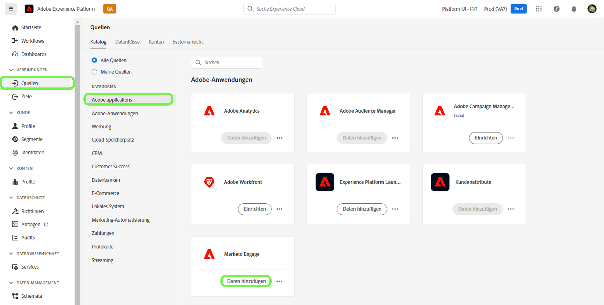

Die **[!UICONTROL Marketo Engage-Konto verbinden]** angezeigt. Auf dieser Seite können Sie entweder ein neues Konto verwenden oder auf ein vorhandenes Konto zugreifen.

### Vorhandenes Konto

Um einen Datenfluss mit einem vorhandenen Konto zu erstellen, wählen Sie **[!UICONTROL Vorhandenes Konto]** und wählen Sie dann die [!DNL Marketo] -Konto, das Sie verwenden möchten. Auswählen **[!UICONTROL Nächste]** um fortzufahren.

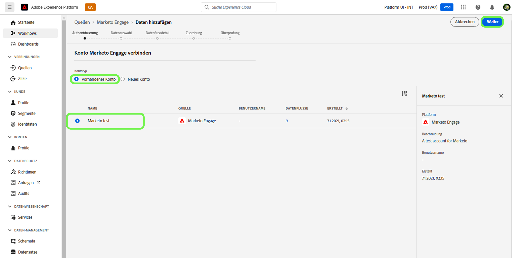

### Neues Konto

Wenn Sie ein neues Konto erstellen, wählen Sie **[!UICONTROL Neues Konto]**. Geben Sie im angezeigten Formular einen Kontonamen, eine optionale Beschreibung und Ihre [!DNL Marketo] Authentifizierungsberechtigungen. Wenn Sie fertig sind, wählen Sie **[!UICONTROL Verbindung mit Quelle herstellen]** und dann etwas Zeit für die Einrichtung der neuen Verbindung.

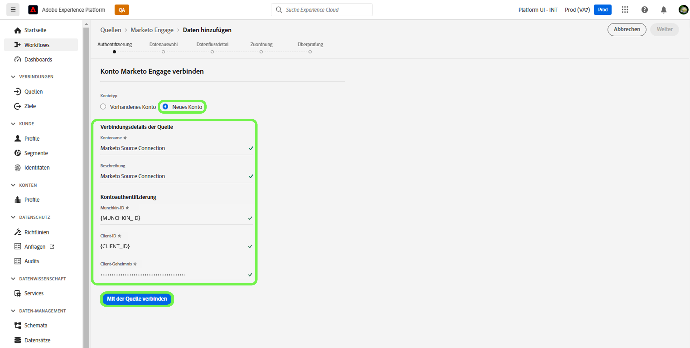

## Datensatz auswählen

Nach der Erstellung [!DNL Marketo] -Konto verwenden, bietet der nächste Schritt eine Oberfläche, über die Sie [!DNL Marketo] Datensätze.

Die linke Hälfte der Oberfläche ist ein Verzeichnisbrowser mit den 10 [!DNL Marketo] Datensätze. Eine voll funktionsfähige [!DNL Marketo] Die Quellverbindung erfordert die Aufnahme der neun verschiedenen Datensätze. Wenn Sie auch die [!DNL Marketo] Kontobasiertes Marketing (ABM) verwenden, müssen Sie außerdem einen 10. Datenfluss erstellen, um die [!UICONTROL Spezifische Konten] Datensatz.

>[!NOTE]
>
>Aus Gründen der Kürze verwendet das folgende Tutorial [!UICONTROL Chancen] Beispiel: Die unten beschriebenen Schritte gelten jedoch für jeden der 10 [!DNL Marketo] Datensätze.

Wählen Sie zuerst den Datensatz aus, den Sie erfassen möchten, und wählen Sie dann **[!UICONTROL Nächste]**.

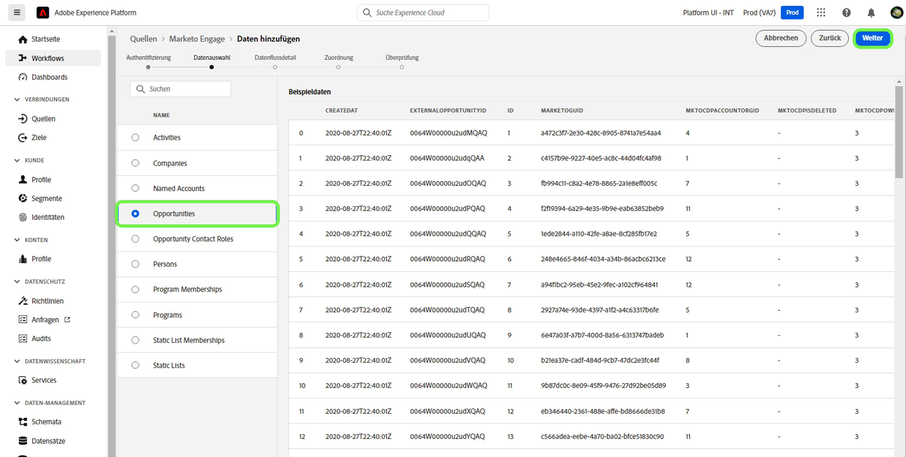

## Datenflussdetails angeben

Die [!UICONTROL Datenflussdetails] -Seite können Sie auswählen, ob Sie einen vorhandenen Datensatz oder einen neuen Datensatz verwenden möchten. Während dieses Vorgangs können Sie auch Einstellungen für [!UICONTROL Profildatensatz], [!UICONTROL Fehlerdiagnose], [!UICONTROL Partielle Erfassung]und [!UICONTROL Warnhinweise].

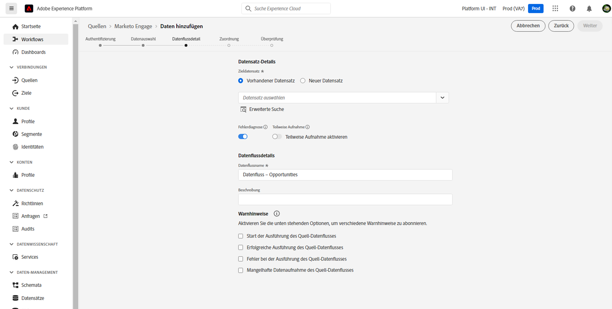

### Vorhandenen Datensatz verwenden

Um Daten in einen vorhandenen Datensatz zu erfassen, wählen Sie **[!UICONTROL Vorhandener Datensatz]**. Sie können einen vorhandenen Datensatz entweder mit der [!UICONTROL Erweiterte Suche] oder durch Scrollen durch die Liste der vorhandenen Datensätze im Dropdown-Menü. Nachdem Sie einen Datensatz ausgewählt haben, geben Sie einen Namen und eine Beschreibung für Ihren Datenfluss ein.

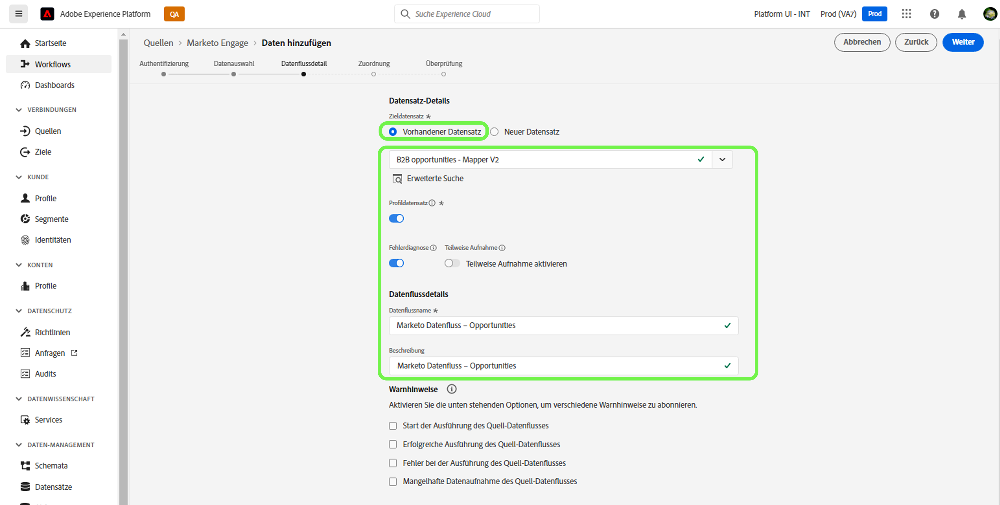

### Verwenden eines neuen Datensatzes

Um einen neuen Datensatz zu erfassen, wählen Sie **[!UICONTROL Neuer Datensatz]** und geben Sie dann einen Namen für den Ausgabedatensatz und eine optionale Beschreibung an. Wählen Sie als Nächstes ein Schema aus, das mithilfe des [!UICONTROL Erweiterte Suche] oder durch Scrollen durch die Liste der vorhandenen Schemas im Dropdown-Menü. Geben Sie nach Auswahl eines Schemas einen Namen und eine Beschreibung für Ihren Datenfluss ein.

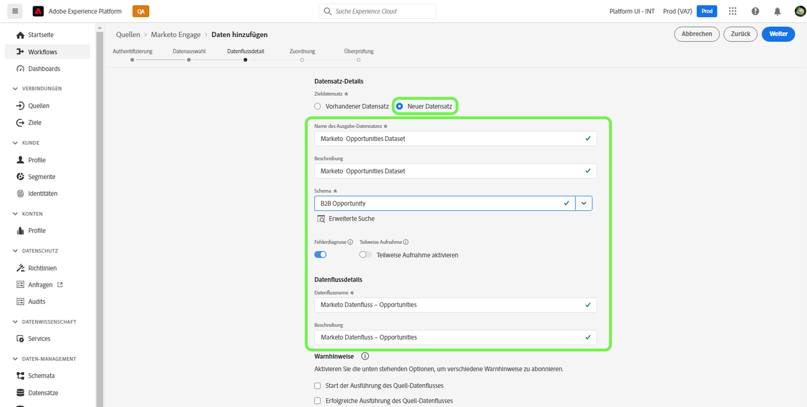

### Aktivieren [!DNL Profile] und Fehlerdiagnose

Wählen Sie als Nächstes die **[!UICONTROL Profildatensatz]** Umschalten auf die Aktivierung Ihres Datensatzes für [!DNL Profile]. Auf diese Weise können Sie eine ganzheitliche Ansicht der Attribute und Verhaltensweisen einer Entität erstellen. Daten aus allen [!DNL Profile]-aktivierte Datensätze werden in [!DNL Profile] und Änderungen werden angewendet, wenn Sie Ihren Datenfluss speichern.

[!UICONTROL Fehlerdiagnose] ermöglicht eine detaillierte Erzeugung von Fehlermeldungen für alle fehlerhaften Datensätze, die in Ihrem Datenfluss auftreten, während [!UICONTROL Partielle Erfassung] ermöglicht die Aufnahme von fehlerhaften Daten bis zu einem bestimmten Schwellenwert, den Sie manuell definieren. Siehe [partielle Batch-Erfassung - Übersicht](../../../../../ingestion/batch-ingestion/partial.md) für weitere Informationen.

>[!IMPORTANT]
>
>Die [!DNL Marketo] Connector verwendet die Batch-Erfassung, um alle historischen Datensätze zu erfassen, und verwendet die Streaming-Erfassung für Echtzeit-Aktualisierungen. Dadurch kann der Connector das Streaming fortsetzen, während er fehlerhafte Datensätze erfasst. Aktivieren Sie die **[!UICONTROL Partielle Erfassung]** ein- und legen Sie dann [!UICONTROL Fehlerschwellenwert %] auf &quot;Maximum&quot;, um zu verhindern, dass der Datenfluss fehlschlägt.

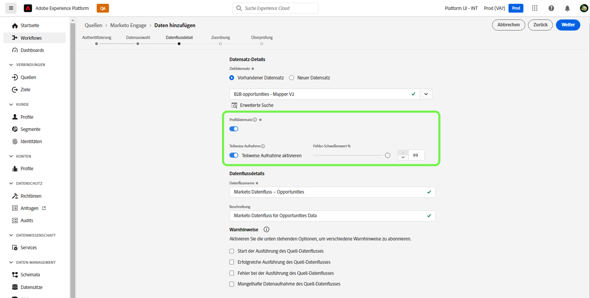

### Warnhinweise aktivieren

Sie können Warnhinweise aktivieren, um Benachrichtigungen zum Status Ihres Datenflusses zu erhalten. Wählen Sie einen Warnhinweis aus der Liste aus, um Benachrichtigungen zum Status Ihres Datenflusses zu erhalten. Weitere Informationen zu Warnungen finden Sie im Handbuch zu [Abrufen von Warnhinweisen zu Quellen über die Benutzeroberfläche](../../alerts.md).

Wenn Sie mit der Bereitstellung von Details für Ihren Datenfluss fertig sind, wählen Sie **[!UICONTROL Nächste]**.

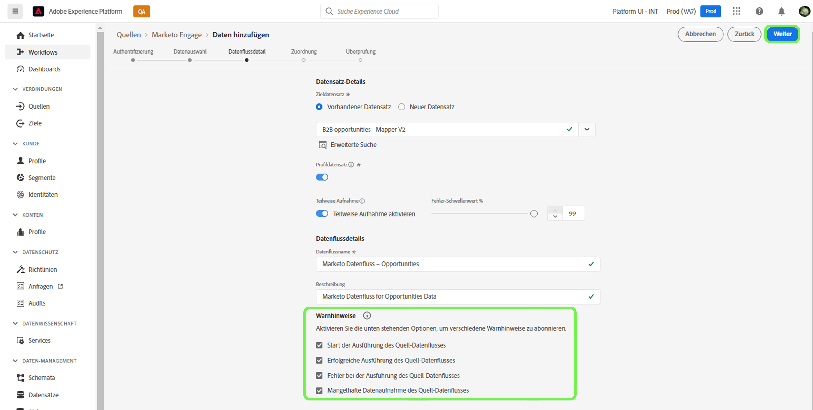

## Zuordnen [!DNL Marketo] Datensatzquellenfelder zum Targeting von XDM-Feldern

Die [!UICONTROL Zuordnung] -Schritt angezeigt werden. Sie erhalten eine Schnittstelle, über die Sie die Quellfelder aus Ihrem Quellschema den entsprechenden Ziel-XDM-Feldern im Zielschema zuordnen können.

Jeder [!DNL Marketo] -Datensatz verfügt über eigene spezifische Zuordnungsregeln, die befolgt werden müssen. Weitere Informationen zur Zuordnung finden Sie im Folgenden [!DNL Marketo] Datensätze in XDM:

* [Aktivitäten](../../../../connectors/adobe-applications/mapping/marketo.md#activities)
* [Programme](../../../../connectors/adobe-applications/mapping/marketo.md#programs)
* [Programmmitgliedschaften](../../../../connectors/adobe-applications/mapping/marketo.md#program-memberships)
* [Firmen](../../../../connectors/adobe-applications/mapping/marketo.md#companies)
* [Statische Listen](../../../../connectors/adobe-applications/mapping/marketo.md#static-lists)
* [Mitgliedschaft in statischen Listen](../../../../connectors/adobe-applications/mapping/marketo.md#static-list-memberships)
* [Spezifische Konten](../../../../connectors/adobe-applications/mapping/marketo.md#named-accounts)
* [Chancen](../../../../connectors/adobe-applications/mapping/marketo.md#opportunities)
* [Kontaktrollen bei Chancen](../../../../connectors/adobe-applications/mapping/marketo.md#opportunity-contact-roles)
* [Personen](../../../../connectors/adobe-applications/mapping/marketo.md#persons)

Je nach Bedarf können Sie Felder direkt zuordnen oder mithilfe von Datenvorbereitungsfunktionen Quelldaten transformieren, um berechnete oder berechnete Werte abzuleiten. Umfassende Schritte zur Verwendung der Zuordnungsschnittstelle finden Sie in der [Handbuch zur Datenvorbereitung-Benutzeroberfläche](../../../../../data-prep/ui/mapping.md).

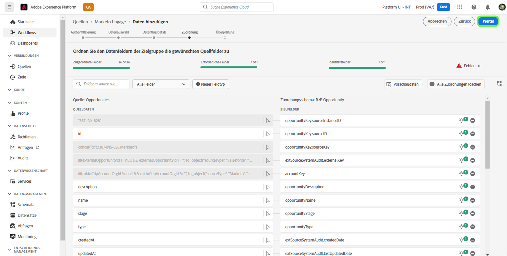

Sobald Ihre Zuordnungssätze fertig sind, wählen Sie **[!UICONTROL Nächste]** und lassen einige Momente zu, damit der neue Datenfluss erstellt wird.

## Überprüfen Sie Ihren Datenfluss.

Die **[!UICONTROL Überprüfen]** angezeigt, sodass Sie Ihren neuen Datenfluss überprüfen können, bevor er erstellt wird. Details werden in die folgenden Kategorien eingeteilt:

* **[!UICONTROL Verbindung]**: Zeigt den Quelltyp, den relevanten Pfad der ausgewählten Quellentität und die Anzahl der Spalten innerhalb dieser Quellentität an.
* **[!UICONTROL Datensatz- und Zuordnungsfelder zuweisen]**: Zeigt, in welchen Datensatz die Quelldaten aufgenommen werden, einschließlich des Schemas, dem der Datensatz entspricht.

Nachdem Sie Ihren Datenfluss überprüft haben, wählen Sie **[!UICONTROL Speichern und aufnehmen]** und lassen Sie etwas Zeit für die Erstellung des Datenflusses zu.

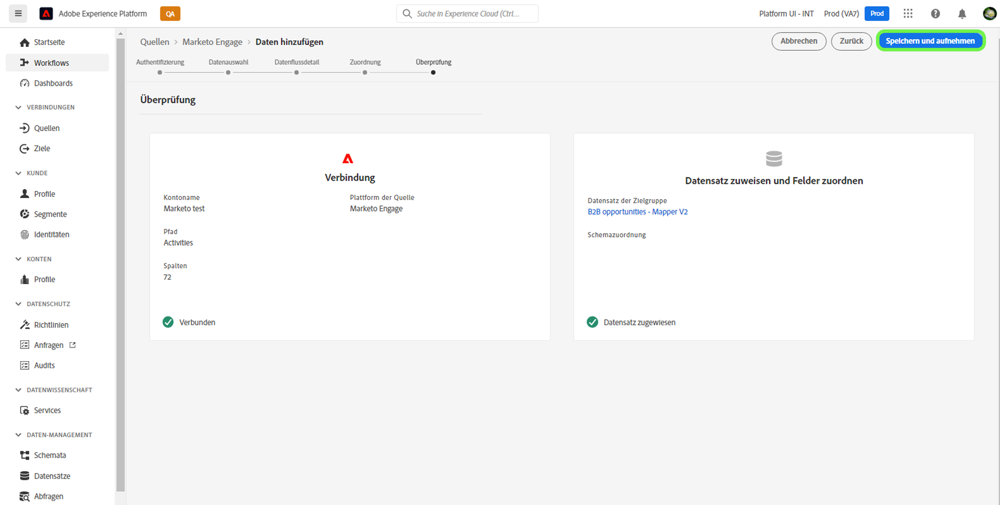

## Überwachen Ihres Datenflusses

Nachdem Ihr Datenfluss erstellt wurde, können Sie die erfassten Daten überwachen, um Informationen zu Erfassungsraten, Erfolg und Fehlern zu erhalten. Weitere Informationen zum Überwachen von Datenflüssen finden Sie im Tutorial zu [Überwachen von Datenflüssen in der Benutzeroberfläche](../../../../../dataflows/ui/monitor-sources.md).

## Attribute löschen

Benutzerdefinierte Attribute in Datensätzen können nicht rückwirkend ausgeblendet oder entfernt werden. Wenn Sie ein benutzerdefiniertes Attribut aus einem vorhandenen Datensatz ausblenden oder daraus entfernen möchten, müssen Sie einen neuen Datensatz ohne dieses benutzerdefinierte Attribut und ein neues XDM-Schema erstellen und einen neuen Datenfluss für den neuen Datensatz konfigurieren, den Sie erstellen. Sie müssen auch den ursprünglichen Datenfluss deaktivieren oder löschen, der aus dem Datensatz mit dem benutzerdefinierten Attribut besteht, das Sie ausblenden oder entfernen möchten.

## Datenfluss löschen

Sie können Datenflüsse löschen, die nicht mehr erforderlich sind oder falsch erstellt wurden, indem Sie die Variable **[!UICONTROL Löschen]** -Funktion im [!UICONTROL Datenflüsse] Arbeitsbereich. Weitere Informationen zum Löschen von Datenflüssen finden Sie im Tutorial zu [Löschen von Datenflüssen in der Benutzeroberfläche](../../delete.md).

## Nächste Schritte

In diesem Tutorial haben Sie erfolgreich einen Datenfluss erstellt, um [!DNL Marketo] Daten. Eingehende Daten können jetzt von nachgelagerten Platform-Diensten wie [!DNL Real-time Customer Profile] und [!DNL Data Science Workspace]. Weitere Informationen finden Sie in den folgenden Dokumenten:

* [[!DNL Real-time Customer Profile] – Übersicht](/help/profile/home.md)
* [[!DNL Data Science Workspace] – Übersicht](/help/data-science-workspace/home.md)
