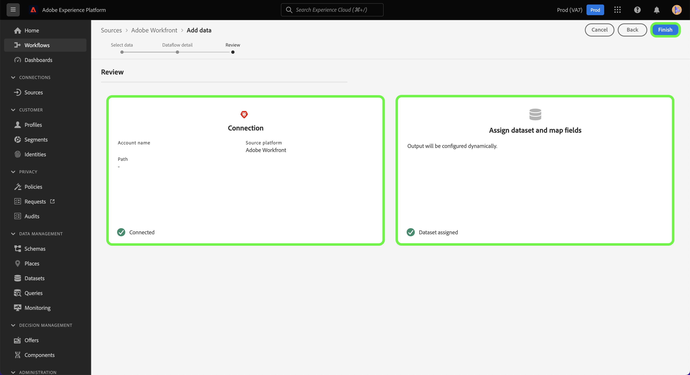

# Erstellen einer Adobe Workfront-Quellverbindung in der Benutzeroberfläche

In diesem Tutorial erfahren Sie, wie Sie eine Adobe Workfront-Quellverbindung erstellen, um Ihre Workfront-Daten mithilfe der Benutzeroberfläche an Adobe Experience Platform zu übertragen.

## Erste Schritte

>[!IMPORTANT]
>
>Sie müssen in der Adobe Admin Console als Administrator konfiguriert sein, um auf die Workfront-Quelle zugreifen zu können.

Dieses Tutorial setzt ein Grundverständnis der folgenden Komponenten von Experience Platform voraus:

* [Experience-Datenmodell (XDM)-System](../../../../../xdm/home.md): Das standardisierte Framework, mit dem Experience Platform Kundenerlebnisdaten organisiert.
* [Echtzeit-Kundenprofil](../../../../../profile/home.md): Bietet ein einheitliches Echtzeit-Kundenprofil, das auf aggregierten Daten aus verschiedenen Quellen basiert.
* [Sandboxes](../../../../../sandboxes/home.md): Experience Platform bietet virtuelle Sandboxes, die eine einzelne Platform-Instanz in separate virtuelle Umgebungen unterteilen, damit Sie Programme für digitale Erlebnisse entwickeln und weiterentwickeln können.

## Erstellen einer Workfront-Quellverbindung in der Benutzeroberfläche

Wählen Sie in der Platform-Benutzeroberfläche in der linken Navigationsleiste die Option **[!UICONTROL Quellen]**, um auf den Arbeitsbereich [!UICONTROL Quellen] zuzugreifen. Die [!UICONTROL Katalog] zeigt eine Vielzahl von Quellen an, die zum Erstellen eines Kontos verwendet werden können.

Sie können die gewünschte Kategorie aus dem Katalog auf der linken Bildschirmseite auswählen. Sie können auch die Suchleiste verwenden, um die angezeigten Quellen einzugrenzen.

Unter dem **[!UICONTROL Adobe Apps]** category, select **[!UICONTROL Adobe Workfront]** und wählen Sie **[!UICONTROL Daten hinzufügen]**.

## Auswählen von Daten

Die [!UICONTROL Daten auswählen] angezeigt. Hier müssen Sie Werte für Ihre Workfront-Subdomäne und Datalane angeben. Ihre Workfront-Subdomäne entspricht der URL, die Sie für den Zugriff auf Ihre Workfront-Instanz verwenden, z. B. `https://acme.workfront.com/`, während Ihr Datalane die zu verwendende Arbeitsumgebung darstellt.

Nachdem Sie Ihre Subdomain und Ihren Datalane hinzugefügt haben, wählen Sie **[!UICONTROL Nächste]**.

## Angeben von Datenflussdetails

Im Schritt zum Datenfluss-Detail können Sie einen Namen und eine optionale Beschreibung für Ihren Datenfluss angeben. In diesem Schritt können Sie auch Warnungen abonnieren, um Benachrichtigungen zum Status Ihres Datenflusses zu erhalten. Weitere Informationen zu Warnungen finden Sie im Tutorial zu [Warnhinweise über die Quellenbenutzeroberfläche abonnieren](../../alerts.md).

Nachdem Sie Ihre Datenflussdetails angegeben und Ihre gewünschten Warnhinweiseinstellungen konfiguriert haben, wählen Sie **[!UICONTROL Nächste]**.

## Überprüfung

Der Schritt **[!UICONTROL Überprüfung]** wird angezeigt, sodass Sie Ihren neuen Datenfluss überprüfen können, bevor er hergestellt wird. Die Details lassen sich wie folgt kategorisieren:

* **[!UICONTROL Verbindung]**: Zeigt den Quelltyp, den relevanten Pfad der ausgewählten Quelldatei und die Anzahl der Spalten in dieser Quelldatei an.
* **[!UICONTROL Datensatz- und Zuordnungsfelder zuweisen]**: Zeigt an, in welchen Datensatz die Quelldaten aufgenommen werden, einschließlich des Schemas, dem der Datensatz entspricht.

Nachdem Sie Ihren Datenfluss überprüft haben, wählen Sie **[!UICONTROL Beenden]** und lassen Sie etwas Zeit für die Erstellung des Datenflusses zu.

## Anhang

Die folgenden Abschnitte enthalten zusätzliche Informationen zur Workfront-Quelle.

### Workfront-Ereignisschema ändern

Workfront-Daten in Platform werden als Datensatzdaten aus Zeitreihen dargestellt, wobei jede Zeile in den Daten einen Zeitstempel aufweist, der anzeigt, wann das Ereignis aufgetreten ist und welche Attribute mit diesem Ereignis verbunden sind.

Während der Einrichtung wird ein Schema mit dem Namen Workfront Change Events from Flow erstellt.

| Schemafeld | Beschreibung |
| --- | --- |
| `timestamp` | Der Zeitpunkt, zu dem das ausgewählte Ereignis aufgetreten ist. Der Zeitstempel wird in der GTM-Zeitzone dargestellt. |
| `_workfront.objectType` | Der Objekttyp. Verfügbare Werte können Folgendes enthalten: `project`, `task`, `portfolio`, und andere, je nach dem Objekt, das geändert oder erstellt wurde. |
| `_workfront.objectID` | Die Kennung, die dem Objekttyp entspricht. |
| `_workfront.created` | Dieser Wert wird auf `1` , wenn das Ereignis eine Objekterstellung darstellt. |
| `_workfront.deleted` | Dieser Wert wird auf `1` , wenn das Objekt gelöscht wird. |
| `_worfkront.updated` | Dieser Wert wird auf `1` , wenn das Objekt aktualisiert wird. |
| `_workfront.completed` | Dieser Wert wird auf `1` , wenn das Objekt als abgeschlossen markiert ist. |
| `_workfront.parentObjectType` | (Optional) Der Objekttyp, der dem übergeordneten Objekt des Objekts entspricht. |
| `_workfront.parentID` | Die ID des übergeordneten Objekts. |
| `_workfront.customData` | Eine Zuordnung aller benutzerdefinierten Formularfelder und Werte, die während des Ereignisses ausgefüllt werden. |

>[!IMPORTANT]
>
>Es werden nur Attribute ausgefüllt, die sich geändert haben oder die im Rahmen eines Ereignisses erstellt wurden. Wenn Sie beispielsweise nur den Namen des Objekts ändern, werden nur folgende Felder ausgefüllt:<ul><li>`timestamp`</li><li>`_workfront.update (=1)`</li><li>`_workfront.objectType`</li><li>`_workfront.objectID`</li><li>`_workfront.objectName`</li></ul>

## Nächste Schritte

In diesem Tutorial haben Sie jetzt einen Datenfluss erstellt, um Ihre Daten von Workfront in die Experience Platform zu übertragen. Sie können jetzt Dienste wie [Query Service](../../../../../query-service/home.md) , um weitere Analysen Ihrer Daten durchzuführen. Weitere Informationen zu Workfront finden Sie im Abschnitt [Übersicht über Workfront](../../../../connectors/adobe-applications/workfront.md).