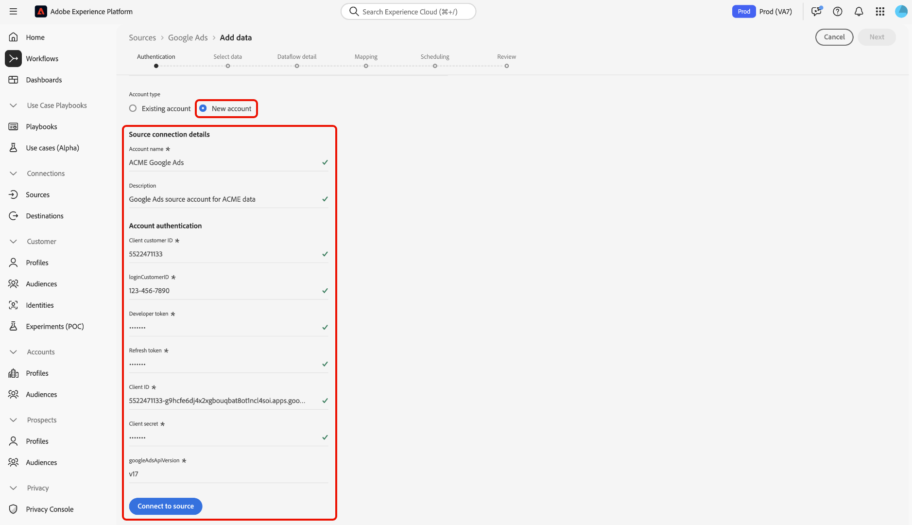

# Erstellen einer Google Ads-Quellverbindung in der Benutzeroberfläche

>[!NOTE]
>
>Die Google Ads-Quelle befindet sich in der Beta-Phase. Siehe [Quellen - Übersicht](../../../../home.md#terms-and-conditions) für weitere Informationen zur Verwendung von Beta-beschrifteten Quellen.

In diesem Tutorial werden die Schritte zum Erstellen einer Google Ads-Quellverbindung mithilfe der Adobe Experience Platform-Benutzeroberfläche beschrieben.

## Erste Schritte

Dieses Tutorial setzt ein Grundverständnis der folgenden Komponenten von Experience Platform voraus:

* [[!DNL Experience Data Model (XDM)] System](../../../../../xdm/home.md): Das standardisierte Framework, mit dem Experience Platform Kundenerlebnisdaten organisiert.
   * [Grundlagen der Schemakomposition](../../../../../xdm/schema/composition.md): Machen Sie sich mit den grundlegenden Bausteinen von XDM-Schemas vertraut, einschließlich der wichtigsten Prinzipien und Best Practices bei der Schemaerstellung.
   * [Tutorial zum Schema-Editor](../../../../../xdm/tutorials/create-schema-ui.md): Erfahren Sie, wie Sie benutzerdefinierte Schemas mithilfe der Benutzeroberfläche des Schema-Editors erstellen können.
* [[!DNL Real-Time Customer Profile]](../../../../../profile/home.md): Bietet ein einheitliches Echtzeit-Kundenprofil, das auf aggregierten Daten aus verschiedenen Quellen basiert.

Wenn Sie bereits über eine gültige Google Ads-Verbindung verfügen, können Sie den Rest dieses Dokuments überspringen und mit dem Tutorial zu [Datenfluss konfigurieren](../../dataflow/advertising.md)

### Sammeln erforderlicher Anmeldeinformationen

Um auf Ihre Google Ads-Kontoplattform zugreifen zu können, müssen Sie die folgenden Werte angeben:

| Anmeldedaten | Beschreibung |
| ---------- | ----------- |
| Client-Kunden-ID | Die Client-Kunden-ID ist die Kontonummer, die dem Google Ads-Kundenkonto entspricht, das Sie mit der Google Ads-API verwalten möchten. Diese ID folgt der Vorlage von `123-456-7890`. |
| Kunden-ID anmelden | Die Anmelde-Kunden-ID ist die Kontonummer, die Ihrem Google Ads Manager-Konto entspricht und zum Abrufen von Berichtsdaten von einem bestimmten Betriebssystemkunden verwendet wird. Weitere Informationen zur Anmelde-Kunden-ID finden Sie im Abschnitt [Dokumentation zur Google Ads API](https://developers.google.com/google-ads/api/docs/migration/login-customer-id). |
| Entwicklungstoken | Mit dem Entwicklungstoken können Sie auf die Google Ads-API zugreifen. Sie können dasselbe Entwickler-Token verwenden, um Anforderungen für alle Ihre Google Ads-Konten zu stellen. Abrufen Ihres Entwicklungstokens nach [Anmelden bei Ihrem Manager-Konto](https://ads.google.com/home/tools/manager-accounts/) und dann zur Seite &quot;API-Center&quot;navigieren. |
| Aktualisierungstoken | Das Aktualisierungs-Token ist Teil von [!DNL OAuth2] Authentifizierung. Mit diesem Token können Sie Ihre Zugriffstoken nach ihrem Ablauf neu generieren. |
| Client-ID | Die Client-ID wird zusammen mit dem Client-Geheimnis als Teil von [!DNL OAuth2] Authentifizierung. Gemeinsam ermöglicht die Client-ID und das Client-Geheimnis Ihrer Anwendung die Ausführung Ihrer Kontoverbindung, indem Sie Ihre Anwendung für Google identifizieren. |
| Client-Geheimnis | Das Client-Geheimnis wird zusammen mit der Client-ID als Teil von [!DNL OAuth2] Authentifizierung. Gemeinsam ermöglicht die Client-ID und das Client-Geheimnis Ihrer Anwendung die Ausführung Ihrer Kontoverbindung, indem Sie Ihre Anwendung für Google identifizieren. |

Lesen Sie das API-Übersichtsdokument für [Weitere Informationen zu den ersten Schritten mit Google Ads](https://developers.google.com/google-ads/api/docs/first-call/overview).

## Google Ads-Konto verbinden

Wählen Sie in der Platform-Benutzeroberfläche die Option **[!UICONTROL Quellen]** in der linken Navigationsleiste, um auf den Arbeitsbereich [!UICONTROL Quellen] zuzugreifen. Die [!UICONTROL Katalog] zeigt eine Vielzahl von Quellen an, mit denen Sie ein Konto erstellen können.

Sie können die gewünschte Kategorie aus dem Katalog auf der linken Bildschirmseite auswählen. Alternativ können Sie die gewünschte Quelle mithilfe der Suchoption finden.

Unter dem **[!UICONTROL Werbung]** category, select **[!UICONTROL Google Ads]** und wählen Sie **[!UICONTROL Daten hinzufügen]**.

.

Die **[!UICONTROL Verbindung zu Google Ads herstellen]** angezeigt. Auf dieser Seite können Sie entweder neue oder vorhandene Anmeldedaten verwenden.

### Vorhandenes Konto

Um ein vorhandenes Konto zu verbinden, wählen Sie das Google Ads-Konto aus, mit dem Sie eine Verbindung herstellen möchten, und klicken Sie dann auf **[!UICONTROL Nächste]** um fortzufahren.

.

### Neues Konto

Wenn Sie neue Anmeldeinformationen verwenden, wählen Sie **[!UICONTROL Neues Konto]** aus. Geben Sie im angezeigten Formular einen Namen, eine optionale Beschreibung und Ihre Google Ads-Anmeldedaten ein. Wenn Sie fertig sind, wählen Sie **[!UICONTROL Mit Quelle verbinden]** und warten Sie, bis die neue Verbindung hergestellt ist.

.

## Nächste Schritte

In diesem Tutorial haben Sie eine Verbindung zu Ihrem Google Ads-Konto hergestellt. Sie können jetzt mit dem nächsten Tutorial fortfahren und [einen Datenfluss konfigurieren, um Werbedaten in Platform zu importieren](../../dataflow/advertising.md).
