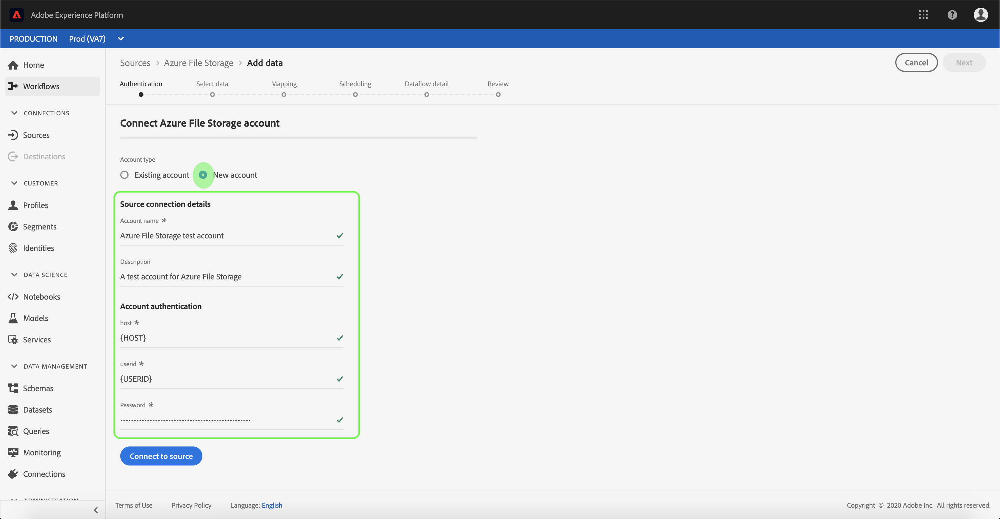

# Erstellen Sie eine [!DNL Azure File Storage] Quellverbindung in der Benutzeroberfläche

Quell-Connectoren in Adobe Experience Platform bieten die Möglichkeit, extern bezogene Daten auf geplanter Basis zu erfassen. In diesem Tutorial werden Schritte zum Authentifizieren eines [!DNL Azure File Storage] Quell-Connector mit [!DNL Platform] -Benutzeroberfläche.

## Erste Schritte

Dieses Tutorial setzt ein Grundverständnis der folgenden Komponenten von Adobe Experience Platform voraus:

- [[!DNL Experience Data Model (XDM)] System](../../../../../xdm/home.md): Das standardisierte Framework, mit dem [!DNL Experience Platform] Kundenerlebnisdaten organisiert.
   - [Grundlagen der Schemakomposition](../../../../../xdm/schema/composition.md): Machen Sie sich mit den grundlegenden Bausteinen von XDM-Schemas vertraut, einschließlich der wichtigsten Prinzipien und Best Practices bei der Schemaerstellung.
   - [Tutorial zum Schema-Editor](../../../../../xdm/tutorials/create-schema-ui.md): Erfahren Sie, wie Sie benutzerdefinierte Schemas mithilfe der Benutzeroberfläche des Schema-Editors erstellen können.
- [[!DNL Real-time Customer Profile]](../../../../../profile/home.md): Bietet ein einheitliches Echtzeit-Kundenprofil, das auf aggregierten Daten aus verschiedenen Quellen basiert.

Wenn Sie bereits über eine gültige [!DNL Azure File Storage]-Verbindung verfügen, können Sie den Rest dieses Dokuments überspringen und mit dem Tutorial zum [Konfigurieren eines Datenflusses](../../dataflow/batch/cloud-storage.md) fortfahren.

### Sammeln erforderlicher Anmeldeinformationen

Um Ihre [!DNL Azure File Storage] Quell-Connector müssen Sie Werte für die folgenden Verbindungseigenschaften angeben:

| Anmeldedaten | Beschreibung |
| ---------- | ----------- |
| `host` | Der Endpunkt der [!DNL Azure File Storage] -Instanz, auf die Sie zugreifen. |
| `userId` | Der Benutzer hat ausreichenden Zugriff auf die [!DNL Azure File Storage] -Endpunkt. |
| `password` | Die [!DNL Azure File Storage] Zugriffsschlüssel. |

Weitere Informationen zu den ersten Schritten finden Sie unter [this [!DNL Azure File Storage] Dokument](https://docs.microsoft.com/en-us/azure/storage/files/storage-how-to-use-files-windows).

## Verbinden Ihres [!DNL Azure File Storage]-Kontos

Nachdem Sie die erforderlichen Anmeldedaten erfasst haben, können Sie die folgenden Schritte ausführen, um Ihr [!DNL Azure File Storage]-Konto mit [!DNL Platform] zu verknüpfen.

Anmelden bei [Adobe Experience Platform](https://platform.adobe.com) und wählen Sie **[!UICONTROL Quellen]** über die linke Navigationsleiste, um auf die **[!UICONTROL Quellen]** Arbeitsbereich. Der Bildschirm **[!UICONTROL Katalog]** zeigt eine Vielzahl von Quellen an, mit denen Sie ein Konto erstellen können.

Sie können die gewünschte Kategorie aus dem Katalog auf der linken Bildschirmseite auswählen. Alternativ können Sie die gewünschte Quelle mithilfe der Suchoption finden.

Unter dem **[!UICONTROL Datenbanken]** category, select **[!UICONTROL Azure-Dateispeicher]**. Wenn Sie diesen Connector zum ersten Mal verwenden, wählen Sie **[!UICONTROL Konfigurieren]**. Andernfalls wählen Sie **[!UICONTROL Daten hinzufügen]** , um eine neue [!DNL Azure File Storage] Connector.

Die **[!UICONTROL Verbinden mit Azure-Dateispeicher]** angezeigt. Auf dieser Seite können Sie entweder neue oder vorhandene Anmeldedaten verwenden.

### Neues Konto

Wenn Sie neue Anmeldeinformationen verwenden, wählen Sie **[!UICONTROL Neues Konto]**. Geben Sie im angezeigten Formular einen Namen, eine optionale Beschreibung und Ihre [!DNL Azure File Storage] Anmeldedaten. Wenn Sie fertig sind, wählen Sie **[!UICONTROL Verbinden]** und dann etwas Zeit für die Einrichtung der neuen Verbindung.

### Vorhandenes Konto

Um ein vorhandenes Konto zu verbinden, wählen Sie die [!DNL Azure File Storage] Konto, mit dem Sie eine Verbindung herstellen möchten, wählen Sie **[!UICONTROL Nächste]** um fortzufahren.

## Nächste Schritte

Mithilfe dieses Tutorials haben Sie eine Verbindung zu Ihrem [!DNL Azure File Storage]-Konto hergestellt. Sie können jetzt mit dem nächsten Tutorial fortfahren und [einen Datenfluss konfigurieren, um Daten aus Ihrem Cloud-Speicher in [!DNL Platform]](../../dataflow/batch/cloud-storage.md).
