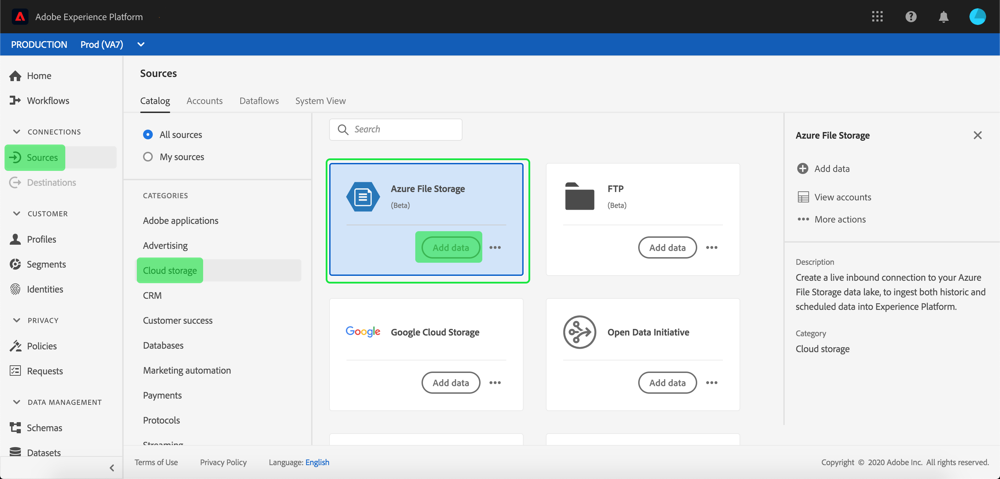

# Erstellen einer [!DNL Azure File Storage]-Quellverbindung in der Benutzeroberfläche

Source-Connectoren in Adobe Experience Platform bieten die Möglichkeit, extern bezogene Daten planmäßig zu erfassen. In diesem Tutorial werden Schritte zum Authentifizieren eines Quell-Connectors vom Typ [!DNL Azure File Storage] mithilfe der Benutzeroberfläche von [!DNL Platform] beschrieben.

## Erste Schritte

Dieses Tutorial setzt ein Grundverständnis der folgenden Komponenten von Adobe Experience Platform voraus:

- [[!DNL Experience Data Model (XDM)] System](../../../../../xdm/home.md): Das standardisierte Framework, mit dem [!DNL Experience Platform] Kundenerlebnisdaten organisiert.
   - [Grundlagen der Schemakomposition](../../../../../xdm/schema/composition.md): Machen Sie sich mit den grundlegenden Bausteinen von XDM-Schemata vertraut, einschließlich der wichtigsten Prinzipien und Best Practices bei der Schemaerstellung.
   - [Tutorial zum Schema-Editor](../../../../../xdm/tutorials/create-schema-ui.md): Erfahren Sie, wie Sie benutzerdefinierte Schemata mithilfe der Benutzeroberfläche des Schema-Editors erstellen können.
- [[!DNL Real-Time Customer Profile]](../../../../../profile/home.md): Bietet ein einheitliches Echtzeit-Kundenprofil, das auf aggregierten Daten aus verschiedenen Quellen basiert.

Wenn Sie bereits über eine gültige [!DNL Azure File Storage]-Verbindung verfügen, können Sie den Rest dieses Dokuments überspringen und mit dem Tutorial zum [Konfigurieren eines Datenflusses](../../dataflow/batch/cloud-storage.md) fortfahren.

### Sammeln erforderlicher Anmeldeinformationen

Um den Quell-Connector [!DNL Azure File Storage] zu authentifizieren, müssen Sie Werte für die folgenden Verbindungseigenschaften angeben:

| Anmeldedaten | Beschreibung |
| ---------- | ----------- |
| `host` | Der Endpunkt der [!DNL Azure File Storage] -Instanz, auf die Sie zugreifen. |
| `userId` | Der Benutzer mit ausreichendem Zugriff auf den [!DNL Azure File Storage] -Endpunkt. |
| `password` | Der Zugriffsschlüssel [!DNL Azure File Storage]. |

Weitere Informationen zu den ersten Schritten finden Sie in [diesem [!DNL Azure File Storage] Dokument](https://docs.microsoft.com/en-us/azure/storage/files/storage-how-to-use-files-windows).

## Verbinden Ihres [!DNL Azure File Storage]-Kontos

Nachdem Sie die erforderlichen Anmeldedaten erfasst haben, können Sie die folgenden Schritte ausführen, um Ihr [!DNL Azure File Storage]-Konto mit [!DNL Platform] zu verknüpfen.

Melden Sie sich bei [Adobe Experience Platform](https://platform.adobe.com) an und wählen Sie dann in der linken Navigationsleiste **[!UICONTROL Quellen]** aus, um auf den Arbeitsbereich **[!UICONTROL Quellen]** zuzugreifen. Der Bildschirm **[!UICONTROL Katalog]** zeigt eine Vielzahl von Quellen an, mit denen Sie ein Konto erstellen können.

Sie können die gewünschte Kategorie aus dem Katalog auf der linken Bildschirmseite auswählen. Alternativ können Sie die gewünschte Quelle mithilfe der Suchoption finden.

Wählen Sie unter der Kategorie **[!UICONTROL Datenbanken]** die Option **[!UICONTROL Azure File Storage]**. Wenn Sie diesen Connector zum ersten Mal verwenden, wählen Sie **[!UICONTROL Konfigurieren]** aus. Klicken Sie andernfalls auf **[!UICONTROL Daten hinzufügen]** , um einen neuen [!DNL Azure File Storage]-Connector zu erstellen.

Die Seite **[!UICONTROL Verbindung zu Azure-Dateispeicher herstellen]** wird angezeigt. Auf dieser Seite können Sie entweder neue oder vorhandene Anmeldedaten verwenden.

### Neues Konto

Wenn Sie neue Anmeldeinformationen verwenden, wählen Sie **[!UICONTROL Neues Konto]** aus. Geben Sie im angezeigten Formular einen Namen, eine optionale Beschreibung und Ihre [!DNL Azure File Storage]-Anmeldedaten ein. Wenn Sie fertig sind, wählen Sie **[!UICONTROL Verbinden]** und lassen Sie dann etwas Zeit, bis die neue Verbindung hergestellt ist.

### Vorhandenes Konto

Um ein vorhandenes Konto zu verbinden, wählen Sie das [!DNL Azure File Storage]-Konto aus, mit dem Sie eine Verbindung herstellen möchten, und klicken Sie dann auf **[!UICONTROL Weiter]** , um fortzufahren.

## Nächste Schritte

Mithilfe dieses Tutorials haben Sie eine Verbindung zu Ihrem [!DNL Azure File Storage]-Konto hergestellt. Sie können jetzt mit dem nächsten Tutorial fortfahren und einen Datenfluss konfigurieren, um Daten aus Ihrem Cloud-Speicher in  [!DNL Platform]](../../dataflow/batch/cloud-storage.md) zu übertragen.[
