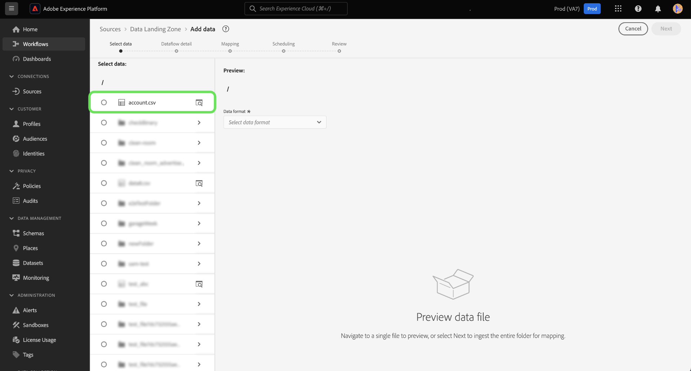

# Verbinden von [!DNL Data Landing Zone] mit Platform über die Benutzeroberfläche

[!DNL Data Landing Zone] ist eine Cloud-basierte Datenspeicheranlage für temporäre Dateispeicher, die mit Adobe Experience Platform bereitgestellt wird. Daten werden nach sieben Tagen automatisch aus dem [!DNL Data Landing Zone] gelöscht.

In diesem Tutorial werden Schritte zum Erstellen einer [!DNL Data Landing Zone]-Quellverbindung mithilfe der Platform-Benutzeroberfläche beschrieben.

## Erste Schritte

Dieses Tutorial setzt ein Grundverständnis der folgenden Komponenten von Adobe Experience Platform voraus:

* [Quellen](../../../../home.md): Experience Platform ermöglicht die Erfassung von Daten aus verschiedenen Quellen und bietet Ihnen gleichzeitig die Möglichkeit, eingehende Daten mithilfe von Platform-Diensten zu strukturieren, zu beschriften und zu erweitern.
* [Sandboxes](../../../../../sandboxes/home.md): Experience Platform bietet virtuelle Sandboxes, die eine einzelne Platform-Instanz in separate virtuelle Umgebungen unterteilen, damit Sie Anwendungen für digitale Erlebnisse entwickeln und weiterentwickeln können.

## Übernehmen Ihrer Dateien von [!DNL Data Landing Zone] in Platform

Wählen Sie in der Platform-Benutzeroberfläche **[!UICONTROL Quellen]** aus dem linken Navigationsbereich aus, um auf den Arbeitsbereich [!UICONTROL Quellen] zuzugreifen. Der Bildschirm [!UICONTROL Katalog] enthält eine Vielzahl von Quellen, mit denen Sie ein Konto erstellen können.

Sie können die gewünschte Kategorie aus dem Katalog auf der linken Bildschirmseite auswählen. Alternativ können Sie die gewünschte Quelle über die Suchleiste finden.

Wählen Sie unter der Kategorie [!UICONTROL Cloud-Speicher] die Option [!DNL Data Landing Zone] und klicken Sie dann auf **[!UICONTROL Daten hinzufügen]**.

Der Schritt [!UICONTROL Daten hinzufügen] wird angezeigt und bietet Ihnen eine Benutzeroberfläche zum Auswählen und Anzeigen einer Vorschau der Daten, die Sie an Platform übermitteln möchten.

Eine ausführliche schrittweise Anleitung zum Erstellen eines Datenflusses für eine Cloud-Speicherquelle finden Sie in der Anleitung zum Erstellen eines Cloud-Datenflusses [Erstellen eines Cloud-Datenflusses, um Daten an Platform](../../dataflow/batch/cloud-storage.md) zu übertragen.

## Abrufen und Aktualisieren Ihrer [!DNL Data Landing Zone]-Anmeldedaten

[!DNL Data Landing Zone] ist eine native Quelle, die im Lieferumfang Ihrer Adobe Experience Platform Sources-Lizenz enthalten ist. [!DNL Data Landing Zone] verwendet eine SAS-URI- und SAS-Token-basierte Authentifizierung. Sie können Ihre Authentifizierungsdaten von der Seite [!UICONTROL Quellen-Katalog] abrufen und aktualisieren.

Wählen Sie im [!UICONTROL Quellkatalog] unter der Kategorie [!UICONTROL Cloud-Speicher] die Auslassungspunkte (**...**) von der Karte **[!UICONTROL Data Landing Zone]** aus. Wählen Sie im angezeigten Dropdown-Menü **[!UICONTROL Anmeldedaten anzeigen]** aus.

Es wird ein Popup angezeigt, in dem Ihr Containername, Ihr SAS-Token, der Name des Speicherkontos und Ihr SAS-URI angezeigt werden.

Wählen Sie **[!UICONTROL Aktualisieren Sie die Anmeldeinformationen]** und warten Sie einige Sekunden, bis Ihre aktualisierten Anmeldeinformationen verarbeitet werden.

## Nächste Schritte

In diesem Tutorial haben Sie auf Ihren [!DNL Data Landing Zone]-Container zugegriffen und gelernt, Ihre Anmeldedaten abzurufen und zu aktualisieren. Sie können jetzt mit dem nächsten Tutorial zum Erstellen eines Datenflusses fortfahren, um Daten aus einem Cloud-Speicher in Platform](../../dataflow/batch/cloud-storage.md) zu übertragen.[
