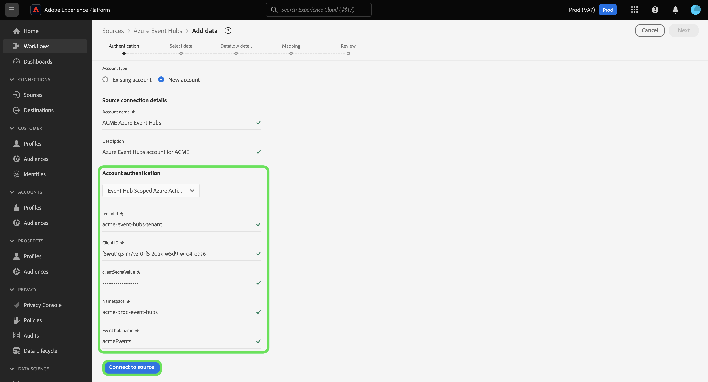

# Erstellen Sie eine [!DNL Azure Event Hubs] Quellverbindung in der Benutzeroberfläche

>[!IMPORTANT]
>
>Die [!DNL Azure Event Hubs] -Quelle ist im Quellkatalog für Benutzer verfügbar, die Real-time Customer Data Platform Ultimate erworben haben.

In diesem Tutorial erfahren Sie, wie Sie eine [!DNL Azure Event Hubs] -Konto über die Benutzeroberfläche von Adobe Experience Platform.

## Erste Schritte

Dieses Tutorial setzt ein Grundverständnis der folgenden Komponenten von Adobe Experience Platform voraus:

* [[!DNL Experience Data Model (XDM)] System](../../../../../xdm/home.md): Das standardisierte Framework, mit dem [!DNL Experience Platform] Kundenerlebnisdaten organisiert.
   * [Grundlagen der Schemakomposition](../../../../../xdm/schema/composition.md): Machen Sie sich mit den grundlegenden Bausteinen von XDM-Schemata vertraut, einschließlich der wichtigsten Prinzipien und Best Practices bei der Schemaerstellung.
   * [Tutorial zum Schema-Editor](../../../../../xdm/tutorials/create-schema-ui.md): Erfahren Sie, wie Sie benutzerdefinierte Schemata mithilfe der Benutzeroberfläche des Schema-Editors erstellen können.
* [[!DNL Real-Time Customer Profile]](../../../../../profile/home.md): Bietet ein einheitliches Echtzeit-Kundenprofil, das auf aggregierten Daten aus verschiedenen Quellen basiert.

Wenn Sie bereits über eine gültige [!DNL Event Hubs]-Verbindung verfügen, können Sie den Rest dieses Dokuments überspringen und mit dem Tutorial zum [Konfigurieren eines Datenflusses](../../dataflow/streaming/cloud-storage-streaming.md) fortfahren.

### Sammeln erforderlicher Anmeldeinformationen

Um Ihre [!DNL Event Hubs] Quell-Connector müssen Sie Werte für die folgenden Verbindungseigenschaften angeben:

>[!BEGINTABS]

>[!TAB Standardauthentifizierung]

| Anmeldedaten | Beschreibung |
| --- | --- |
| SAS-Schlüsselname | Der Name der Autorisierungsregel, der auch als SAS-Schlüsselname bezeichnet wird. |
| SAS-Schlüssel | Der Primärschlüssel der [!DNL Event Hubs] Namespace. Die `sasPolicy` dass `sasKey` muss `manage` -Berechtigungen, die für die [!DNL Event Hubs] Liste auszufüllen. |
| Namespace | Der Namespace des [!DNL Event Hubs] auf die Sie zugreifen. Ein [!DNL Event Hubs] Der Namespace stellt einen eindeutigen Scoping-Container bereit, in dem Sie einen oder mehrere [!DNL Event Hubs]. |

>[!TAB SAS-Authentifizierung]

| Anmeldedaten | Beschreibung |
| --- | --- |
| SAS-Schlüsselname | Der Name der Autorisierungsregel, der auch als SAS-Schlüsselname bezeichnet wird. |
| SAS-Schlüssel | Der Primärschlüssel der [!DNL Event Hubs] Namespace. Die `sasPolicy` dass `sasKey` muss `manage` -Berechtigungen, die für die [!DNL Event Hubs] Liste auszufüllen. |
| Namespace | Der Namespace des [!DNL Event Hubs] auf die Sie zugreifen. Ein [!DNL Event Hubs] Der Namespace stellt einen eindeutigen Scoping-Container bereit, in dem Sie einen oder mehrere [!DNL Event Hubs]. |
| Ereignis-Hub-Name | Der Name für Ihre [!DNL Event Hubs] -Quelle. |

Weitere Informationen zur Authentifizierung für freigegebene Zugriffssignaturen (SAS) [!DNL Event Hubs], lesen Sie die [[!DNL Azure] Handbuch zur Verwendung von SAS](https://docs.microsoft.com/en-us/azure/event-hubs/authenticate-shared-access-signature).

>[!TAB Ereignis-Hub Azure Active Directory Auth]

| Anmeldedaten | Beschreibung |
| --- | --- |
| Mandanten-ID | Die Mandantenkennung, von der Sie die Berechtigung anfordern möchten. Ihre Mandantenkennung kann als GUID oder als benutzerfreundlicher Name formatiert werden. **Hinweis**: Die Mandanten-ID wird im [!DNL Microsoft Azure] -Schnittstelle. |
| Client-ID | Die Ihrer App zugewiesene Anwendungs-ID. Sie können diese ID aus der [!DNL Microsoft Entra ID] Portal, in dem Sie Ihre [!DNL Azure Active Directory]. |
| Geheimer Client-Wert | Das Client-Geheimnis, das zusammen mit der Client-ID zur Authentifizierung Ihrer App verwendet wird. Sie können Ihr Client-Geheimnis aus dem [!DNL Microsoft Entra ID] Portal, in dem Sie Ihre [!DNL Azure Active Directory]. |
| Namespace | Der Namespace des [!DNL Event Hubs] auf die Sie zugreifen. Ein [!DNL Event Hubs] Der Namespace stellt einen eindeutigen Scoping-Container bereit, in dem Sie einen oder mehrere [!DNL Event Hubs]. |

Weitere Informationen unter [!DNL Azure Active Directory], lesen Sie die [Azure-Leitfaden zur Verwendung der Microsoft Entra ID](https://learn.microsoft.com/en-us/azure/healthcare-apis/register-application).

>[!TAB Ereignis-Hub Scoped Azure Active Directory Auth]

| Anmeldedaten | Beschreibung |
| --- | --- |
| Mandanten-ID | Die Mandantenkennung, von der Sie die Berechtigung anfordern möchten. Ihre Mandantenkennung kann als GUID oder als benutzerfreundlicher Name formatiert werden. **Hinweis**: Die Mandanten-ID wird im [!DNL Microsoft Azure] -Schnittstelle. |
| Client-ID | Die Ihrer App zugewiesene Anwendungs-ID. Sie können diese ID aus der [!DNL Microsoft Entra ID] Portal, in dem Sie Ihre [!DNL Azure Active Directory]. |
| Geheimer Client-Wert | Das Client-Geheimnis, das zusammen mit der Client-ID zur Authentifizierung Ihrer App verwendet wird. Sie können Ihr Client-Geheimnis aus dem [!DNL Microsoft Entra ID] Portal, in dem Sie Ihre [!DNL Azure Active Directory]. |
| Namespace | Der Namespace des [!DNL Event Hubs] auf die Sie zugreifen. Ein [!DNL Event Hubs] Der Namespace stellt einen eindeutigen Scoping-Container bereit, in dem Sie einen oder mehrere [!DNL Event Hubs]. |
| Ereignis-Hub-Name | Der Name für Ihre [!DNL Event Hubs] -Quelle. |

Weitere Informationen unter [!DNL Azure Active Directory], lesen Sie die [Azure-Leitfaden zur Verwendung der Microsoft Entra ID](https://learn.microsoft.com/en-us/azure/healthcare-apis/register-application).

>[!ENDTABS]

Nachdem Sie die erforderlichen Anmeldedaten gesammelt haben, können Sie die folgenden Schritte ausführen, um Ihre [!DNL Event Hubs] -Konto auf Experience Platform.

## Verbinden Ihres [!DNL Event Hubs]-Kontos

Wählen Sie in der Platform-Benutzeroberfläche in der linken Navigationsleiste die Option **[!UICONTROL Quellen]**, um auf den Arbeitsbereich [!UICONTROL Quellen] zuzugreifen. Die [!UICONTROL Katalog] zeigt eine Vielzahl von Quellen an, mit denen Sie ein Konto erstellen können.

Sie können die gewünschte Kategorie aus dem Katalog auf der linken Bildschirmseite auswählen. Alternativ können Sie die gewünschte Quelle mithilfe der Suchoption finden.

Unter dem [!UICONTROL Cloud-Speicher] category, select **[!UICONTROL Azure Event Hubs]** und wählen Sie **[!UICONTROL Daten hinzufügen]**.

Die **[!UICONTROL Verbindung zu Azure Event Hubs herstellen]** angezeigt. Auf dieser Seite können Sie entweder neue oder vorhandene Anmeldedaten verwenden.

### Vorhandenes Konto

Um ein vorhandenes Konto zu verwenden, wählen Sie die [!DNL Event Hubs] Konto, das Sie verwenden möchten, wählen Sie **[!UICONTROL Nächste]** um fortzufahren.

### Neues Konto

>[!TIP]
>
>Nach der Erstellung können Sie den Authentifizierungstyp eines [!DNL Event Hubs] Basisverbindung. Um den Authentifizierungstyp zu ändern, müssen Sie eine neue Basisverbindung erstellen.

Um ein neues Konto zu erstellen, wählen Sie **[!UICONTROL Neues Konto]** und geben Sie dann einen Namen und eine optionale Beschreibung für Ihre neue [!DNL Event Hubs] -Konto.

>[!BEGINTABS]

>[!TAB Standardauthentifizierung]

So erstellen Sie eine [!DNL Event Hubs] -Konto mit Standardauthentifizierung verwenden, verwenden Sie die [!UICONTROL Kontoauthentifizierung] Dropdown-Menü und wählen Sie **[!UICONTROL Standardauthentifizierung]**. Geben Sie als Nächstes Werte für Ihre [!UICONTROL SAS-Schlüsselname], [!UICONTROL SAS-Schlüssel], und [!UICONTROL Namespace].

Nachdem Sie Ihre Authentifizierungsberechtigungen eingegeben haben, wählen Sie **[!UICONTROL Verbindung mit Quelle herstellen]**.

>[!TAB SAS-Authentifizierung]

So erstellen Sie eine [!DNL Event Hubs] Konto mit SAS-Authentifizierung verwenden, verwenden Sie die [!UICONTROL Kontoauthentifizierung] Dropdown-Menü und wählen Sie **[!UICONTROL SAS-Authentifizierung]**. Geben Sie als Nächstes Werte für Ihre [!UICONTROL SAS-Schlüsselname], [!UICONTROL SAS-Schlüssel], [!UICONTROL Namespace], und [!UICONTROL Name der Ereignis-Hubs].

Nachdem Sie Ihre Authentifizierungsberechtigungen eingegeben haben, wählen Sie **[!UICONTROL Verbindung mit Quelle herstellen]**.

>[!TAB Ereignis-Hub Azure Active Directory Auth]

So erstellen Sie eine [!DNL Event Hubs] Konto mit Event Hub Azure Active Directory-Authentifizierung verwenden Sie die [!UICONTROL Kontoauthentifizierung] Dropdown-Menü und wählen Sie **[!UICONTROL Azure Active Directory für Event Hub]**. Geben Sie als Nächstes Werte für Ihre [!UICONTROL Mandanten-ID], [!UICONTROL Client-ID], [!UICONTROL Geheimer Client-Wert], und [!UICONTROL Namespace].

>[!TAB Ereignis-Hub Scoped Azure Active Directory Auth]

So erstellen Sie eine [!DNL Event Hubs] Konto mit Event Hub Scoped Azure Active Directory-Authentifizierung verwenden Sie die [!UICONTROL Kontoauthentifizierung] Dropdown-Menü und wählen Sie **[!UICONTROL Azure Active Directory für Event Hub-Scoping]**. Geben Sie als Nächstes Werte für Ihre [!UICONTROL Mandanten-ID], [!UICONTROL Client-ID], [!UICONTROL Geheimer Client-Wert], [!UICONTROL Namespace], und [!UICONTROL Ereignis-Hub-Name].

>[!ENDTABS]

## Nächste Schritte

In diesem Tutorial haben Sie Ihre [!DNL Event Hubs] -Konto auf Experience Platform. Sie können jetzt mit dem nächsten Tutorial fortfahren und [einen Datenfluss konfigurieren, um Daten aus Ihrem Cloud-Speicher in Experience Platform zu übertragen](../../dataflow/streaming/cloud-storage-streaming.md).
