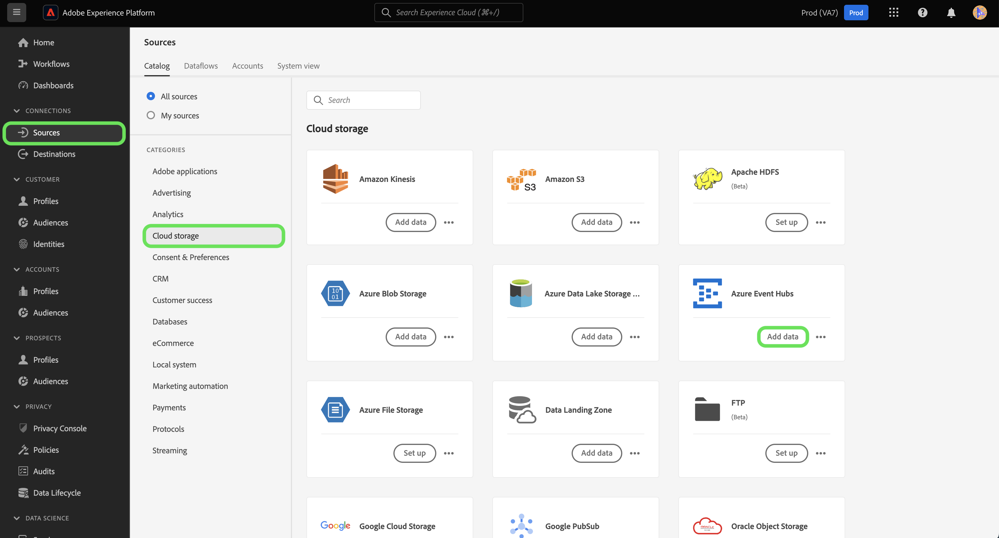

# Erstellen eines [!DNL Azure Event Hubs] Quellconnectors in der Benutzeroberfläche

>[!NOTE]
> Der [!DNL Azure Event Hubs] Anschluss befindet sich in der Betaphase. Weitere Informationen zur Verwendung von Beta-gekennzeichneten Connectors finden Sie in der Übersicht [zu den](../../../../home.md#terms-and-conditions) Quellen.

Quellschnittstellen in Adobe Experience Platform bieten die Möglichkeit, extern beschaffte Daten planmäßig zu erfassen. In diesem Lernprogramm werden Schritte zum Authentifizieren eines [!DNL Azure Event Hubs] (im Folgenden &quot;[!DNL Event Hubs]&quot;) Quell-Connectors mithilfe der [!DNL Platform] Benutzeroberfläche beschrieben.

## Erste Schritte

Dieses Lernprogramm erfordert ein Verständnis der folgenden Komponenten der Adobe Experience Platform:

- [Erlebnis-Datenmodell (XDM)-System](../../../../../xdm/home.md): Das standardisierte Framework, mit dem Kundenerlebnisdaten [!DNL Experience Platform] organisiert werden.
   - [Grundlagen der Zusammensetzung](../../../../../xdm/schema/composition.md)des Schemas: Erfahren Sie mehr über die grundlegenden Bausteine von XDM-Schemas, einschließlich der wichtigsten Grundsätze und Best Practices bei der Schema-Komposition.
   - [Schema-Editor-Lernprogramm](../../../../../xdm/tutorials/create-schema-ui.md): Erfahren Sie, wie Sie mit der Benutzeroberfläche des Schema-Editors benutzerdefinierte Schema erstellen.
- [Echtzeit-Profil](../../../../../profile/home.md): Bietet ein einheitliches, Echtzeit-Profil für Kunden, das auf aggregierten Daten aus mehreren Quellen basiert.

Wenn Sie bereits über ein [!DNL Event Hubs] Konto verfügen, können Sie den Rest dieses Dokuments überspringen und mit dem Tutorial zur [Konfiguration eines Datenflusses](../../dataflow/streaming/cloud-storage.md)fortfahren.

### Erforderliche Berechtigungen erfassen

Um den [!DNL Event Hubs] Quellanschluss zu authentifizieren, müssen Sie Werte für die folgenden Verbindungseigenschaften angeben:

| Berechtigung | Beschreibung |
| ---------- | ----------- |
| `sasKeyName` | Der Name der Autorisierungsregel, der auch als SAS-Schlüsselname bezeichnet wird. |
| `sasKey` | Die generierte Unterschrift für den gemeinsamen Zugriff. |
| `namespace` | Der Namensraum des [!DNL Event Hubs] Benutzers, auf den Sie zugreifen. |

Weitere Informationen zu diesen Werten finden Sie in [diesem Ereignis-Hubs-Dokument](https://docs.microsoft.com/en-us/azure/event-hubs/authenticate-shared-access-signature).

## Verbinden Sie Ihr [!DNL Event Hubs] Konto

Nachdem Sie die erforderlichen Anmeldeinformationen gesammelt haben, führen Sie die folgenden Schritte aus, um Ihr [!DNL Event Hubs] Konto mit [!DNL Platform]zu verknüpfen.

Melden Sie sich bei [Adobe Experience Platform](https://platform.adobe.com) an und wählen Sie dann in der linken Navigationsleiste **[!UICONTROL Quellen]** , um auf den *Quellarbeitsbereich* zuzugreifen. Auf der Registerkarte &quot; *[!UICONTROL Katalog]* &quot;werden verschiedene Quellen angezeigt, mit denen eine Verbindung hergestellt werden kann [!DNL Platform]. Jede Quelle zeigt die Anzahl der vorhandenen Konten, die ihnen zugeordnet sind.

Wählen Sie unter der Kategorie *[!UICONTROL Cloud-Datenspeicherung]* die Option **[!UICONTROL Azurblauer Ereignis-Hubs]** und klicken Sie **auf das Pluszeichen (+)** , um einen neuen Ereignis-Hubs-Connector zu erstellen.

Der Dialog *[!UICONTROL Verbindung zu Azurblauer Ereignis Hubs]* wird angezeigt. Auf dieser Seite können Sie entweder neue oder vorhandene Anmeldeinformationen verwenden.

### Neues Konto

Wenn Sie neue Anmeldeinformationen verwenden, wählen Sie &quot; **[!UICONTROL Neues Konto]**&quot;aus. Geben Sie im angezeigten Eingabedatum einen Namen, eine optionale Beschreibung und Ihre Ereignis-Hubs-Anmeldeinformationen ein. Wenn Sie fertig sind, wählen Sie &quot; **[!UICONTROL Verbinden]** &quot;und lassen Sie dann etwas Zeit, bis die neue Verbindung hergestellt ist.

### Vorhandenes Konto

Um ein bestehendes Konto zu verknüpfen, wählen Sie das Ereignis-Hubs-Konto, mit dem Sie eine Verbindung herstellen möchten, und wählen Sie dann **[!UICONTROL Weiter]** , um fortzufahren.

## Nächste Schritte

Indem Sie diesem Tutorial folgen, haben Sie Ihr Ereignis-Hubs-Konto mit [!DNL Platform]verbunden. Sie können jetzt mit dem nächsten Lernprogramm fortfahren und einen Datendurchlauf [konfigurieren, um Daten aus Ihrer Cloud-Datenspeicherung in die Platform](../../dataflow/streaming/cloud-storage.md)zu bringen.