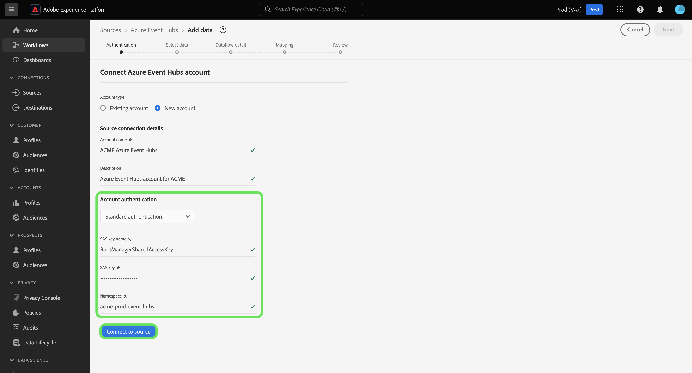

# Erstellen einer [!DNL Azure Event Hubs]-Quellverbindung über die Benutzeroberfläche

>[!IMPORTANT]
>
>Die [!DNL Azure Event Hubs] ist im Quellkatalog für Benutzende verfügbar, die Real-time Customer Data Platform Ultimate erworben haben.

Lesen Sie dieses Tutorial, um zu erfahren, wie Sie ein [!DNL Azure Event Hubs]-Konto mithilfe der Benutzeroberfläche von Adobe Experience Platform erstellen.

## Erste Schritte

Dieses Tutorial setzt ein Grundverständnis der folgenden Komponenten von Adobe Experience Platform voraus:

* [[!DNL Experience Data Model (XDM)] System](../../../../../xdm/home.md): Das standardisierte Framework, mit dem [!DNL Experience Platform] Kundenerlebnisdaten organisiert.
   * [Grundlagen der Schemakomposition](../../../../../xdm/schema/composition.md): Machen Sie sich mit den grundlegenden Bausteinen von XDM-Schemata vertraut, einschließlich der wichtigsten Prinzipien und Best Practices bei der Schemaerstellung.
   * [Tutorial zum Schema-Editor](../../../../../xdm/tutorials/create-schema-ui.md): Erfahren Sie, wie Sie benutzerdefinierte Schemata mithilfe der Benutzeroberfläche des Schema-Editors erstellen können.
* [[!DNL Real-Time Customer Profile]](../../../../../profile/home.md): Bietet ein einheitliches Echtzeit-Kundenprofil, das auf aggregierten Daten aus verschiedenen Quellen basiert.

Wenn Sie bereits über eine gültige [!DNL Event Hubs]-Verbindung verfügen, können Sie den Rest dieses Dokuments überspringen und mit dem Tutorial zum [Konfigurieren eines Datenflusses](../../dataflow/streaming/cloud-storage-streaming.md) fortfahren.

### Sammeln erforderlicher Anmeldedaten

Um Ihren [!DNL Event Hubs]-Quell-Connector zu authentifizieren, müssen Sie Werte für die folgenden Verbindungseigenschaften angeben:

>[!BEGINTABS]

>[!TAB Standardauthentifizierung]

| Anmeldedaten | Beschreibung |
| --- | --- |
| SAS-Schlüsselname | Der Name der Autorisierungsregel, die auch als SAS-Schlüsselname bezeichnet wird. |
| SAS-Schlüssel | Der Primärschlüssel des [!DNL Event Hubs] Namespace. Für die `sasPolicy`, der die `sasKey` entspricht, müssen `manage` konfiguriert sein, damit die [!DNL Event Hubs] ausgefüllt werden kann. |
| Namespace | Der Namespace der [!DNL Event Hub], auf die Sie zugreifen. Ein [!DNL Event Hub] Namespace bietet einen eindeutigen Container für die Berechnung des Umfangs, in dem Sie einen oder mehrere [!DNL Event Hubs] erstellen können. |

>[!TAB SAS-Authentifizierung]

| Anmeldedaten | Beschreibung |
| --- | --- |
| SAS-Schlüsselname | Der Name der Autorisierungsregel, die auch als SAS-Schlüsselname bezeichnet wird. |
| SAS-Schlüssel | Der Primärschlüssel des [!DNL Event Hub] Namespace. Für die `sasPolicy`, der die `sasKey` entspricht, müssen `manage` konfiguriert sein, damit die [!DNL Event Hubs] ausgefüllt werden kann. |
| Namespace | Der Namespace der [!DNL Event Hub], auf die Sie zugreifen. Ein [!DNL Event Hub] Namespace bietet einen eindeutigen Container für die Berechnung des Umfangs, in dem Sie einen oder mehrere [!DNL Event Hubs] erstellen können. |
| Name des Ereignis-Hubs | Geben Sie Ihren [!DNL Azure Event Hub] ein. Microsoft Weitere Informationen zu ](https://learn.microsoft.com/en-us/azure/event-hubs/event-hubs-create#create-an-event-hub) finden Sie in der Dokumentation zu [[!DNL Event Hub]. |

>[!TAB Event Hub Azure Active Directory-Authentifizierung]

| Anmeldedaten | Beschreibung |
| --- | --- |
| Mandanten-ID | Die Mandanten-ID, von der Sie die Berechtigung anfordern möchten. Ihre Mandanten-ID kann als GUID oder benutzerfreundlicher Name formatiert sein. **Hinweis**: Die Mandanten-ID wird in der [!DNL Microsoft Azure] als „Verzeichnis-ID“ bezeichnet. |
| Client-ID | Die Ihrer App zugewiesene Anwendungs-ID. Sie können diese ID vom [!DNL Microsoft Entra ID] abrufen, in dem Sie Ihre [!DNL Azure Active Directory] registriert haben. |
| Wert des Client-Geheimnisses | Das Client-Geheimnis, das zusammen mit der Client-ID zur Authentifizierung Ihrer App verwendet wird. Sie können Ihr Client-Geheimnis über das [!DNL Microsoft Entra ID]-Portal abrufen, in dem Sie Ihre [!DNL Azure Active Directory] registriert haben. |
| Namespace | Der Namespace der [!DNL Event Hub], auf die Sie zugreifen. Ein [!DNL Event Hub] Namespace bietet einen eindeutigen Container für die Berechnung des Umfangs, in dem Sie einen oder mehrere [!DNL Event Hubs] erstellen können. |

Weitere Informationen zu [!DNL Azure Active Directory] finden Sie im [Azure-Handbuch zur Verwendung der Microsoft Entra ID](https://learn.microsoft.com/en-us/azure/healthcare-apis/register-application).

>[!TAB Authentifizierung für Azure Active Directory im Ereignis-Hub]

| Anmeldedaten | Beschreibung |
| --- | --- |
| Mandanten-ID | Die Mandanten-ID, von der Sie die Berechtigung anfordern möchten. Ihre Mandanten-ID kann als GUID oder benutzerfreundlicher Name formatiert sein. **Hinweis**: Die Mandanten-ID wird in der [!DNL Microsoft Azure] als „Verzeichnis-ID“ bezeichnet. |
| Client-ID | Die Ihrer App zugewiesene Anwendungs-ID. Sie können diese ID vom [!DNL Microsoft Entra ID] abrufen, in dem Sie Ihre [!DNL Azure Active Directory] registriert haben. |
| Wert des Client-Geheimnisses | Das Client-Geheimnis, das zusammen mit der Client-ID zur Authentifizierung Ihrer App verwendet wird. Sie können Ihr Client-Geheimnis über das [!DNL Microsoft Entra ID]-Portal abrufen, in dem Sie Ihre [!DNL Azure Active Directory] registriert haben. |
| Namespace | Der Namespace der [!DNL Event Hub], auf die Sie zugreifen. Ein [!DNL Event Hub] Namespace bietet einen eindeutigen Container für die Berechnung des Umfangs, in dem Sie einen oder mehrere [!DNL Event Hubs] erstellen können. |
| Name des Ereignis-Hubs | Geben Sie Ihren [!DNL Azure Event Hub] ein. Microsoft Weitere Informationen zu ](https://learn.microsoft.com/en-us/azure/event-hubs/event-hubs-create#create-an-event-hub) finden Sie in der Dokumentation zu [[!DNL Event Hub]. |

Weitere Informationen zu [!DNL Azure Active Directory] finden Sie im [Azure-Handbuch zur Verwendung der Microsoft Entra ID](https://learn.microsoft.com/en-us/azure/healthcare-apis/register-application).

>[!ENDTABS]

Nachdem Sie die erforderlichen Anmeldeinformationen zusammen haben, können Sie die folgenden Schritte ausführen, um Ihr [!DNL Event Hubs]-Konto mit Experience Platform zu verknüpfen.

## Verbinden Ihres [!DNL Event Hubs]-Kontos

Wählen Sie in der Platform-Benutzeroberfläche in der linken Navigationsleiste die Option **[!UICONTROL Quellen]**, um auf den Arbeitsbereich [!UICONTROL Quellen] zuzugreifen. Der [!UICONTROL Katalog] zeigt eine Vielzahl von Quellen an, mit denen Sie ein Konto erstellen können.

Sie können die gewünschte Kategorie aus dem Katalog auf der linken Bildschirmseite auswählen. Alternativ können Sie die gewünschte Quelle mithilfe der Suchoption finden.

Wählen Sie unter der Kategorie [!UICONTROL Cloud] die Option **[!UICONTROL Azure Event Hubs]** und dann **[!UICONTROL Daten hinzufügen]**.

Das **[!UICONTROL Mit Azure Event Hubs verbinden]** wird angezeigt. Auf dieser Seite können Sie entweder neue oder vorhandene Anmeldedaten verwenden.

### Vorhandenes Konto

Um ein vorhandenes Konto zu verwenden, wählen Sie das [!DNL Event Hubs] Konto aus, das Sie verwenden möchten, und wählen Sie dann **[!UICONTROL Weiter]**, um fortzufahren.

### Neues Konto

>[!TIP]
>
>Nach der Erstellung können Sie den Authentifizierungstyp einer [!DNL Event Hubs] Basisverbindung nicht mehr ändern. Um den Authentifizierungstyp zu ändern, müssen Sie eine neue Basisverbindung erstellen.

Um ein neues Konto zu erstellen, wählen Sie **[!UICONTROL Neues Konto]** und geben Sie dann einen Namen und eine optionale Beschreibung für Ihr neues [!DNL Event Hubs]-Konto an.

>[!BEGINTABS]

>[!TAB Standardauthentifizierung]

Um ein [!DNL Event Hubs] Konto mit Standardauthentifizierung zu erstellen, verwenden Sie das Dropdown-Menü [!UICONTROL Kontoauthentifizierung] und wählen Sie dann **[!UICONTROL Standardauthentifizierung]** aus. Geben Sie anschließend Werte für Ihren [!UICONTROL SAS-Schlüsselnamen], [!UICONTROL SAS-Schlüssel] und [!UICONTROL Namespace] an.

Nachdem Sie Ihre Authentifizierungsdaten eingegeben haben, wählen Sie **[!UICONTROL Mit Quelle verbinden]** aus.

>[!TAB SAS-Authentifizierung]

Um ein [!DNL Event Hubs] Konto mit SAS-Authentifizierung zu erstellen, verwenden Sie das Dropdown-Menü [!UICONTROL Kontoauthentifizierung] und wählen Sie dann **[!UICONTROL SAS-Authentifizierung]** aus. Geben Sie als Nächstes Werte für Ihren [!UICONTROL SAS-Schlüsselnamen], [!UICONTROL SAS-Schlüssel], [!UICONTROL Namespace] und [!UICONTROL Event Hubs-Namen] an.

Nachdem Sie Ihre Authentifizierungsdaten eingegeben haben, wählen Sie **[!UICONTROL Mit Quelle verbinden]** aus.

>[!TAB Event Hub Azure Active Directory-Authentifizierung]

Um ein [!DNL Event Hubs] Konto mit Azure Active Directory-Authentifizierung für den Event Hub zu erstellen, verwenden Sie das Dropdown-Menü [!UICONTROL Kontoauthentifizierung] und wählen Sie dann **[!UICONTROL Event Hub Azure Active Directory]** aus. Geben Sie anschließend Werte für Ihre [!UICONTROL Mandanten-ID], [!UICONTROL Client-ID], [!UICONTROL Client-Geheimniswert] und [!UICONTROL Namespace] an.

>[!TAB Authentifizierung für Azure Active Directory im Ereignis-Hub]

Um ein [!DNL Event Hubs] Konto mit einer Azure Active Directory-Authentifizierung im Event Hub-Bereich zu erstellen, verwenden Sie das Dropdown-Menü [!UICONTROL Kontoauthentifizierung] und wählen Sie dann **[!UICONTROL Azure Active Directory im Event Hub-]** aus. Geben Sie anschließend Werte für Ihre [!UICONTROL Mandanten-ID], [!UICONTROL Client-ID], [!UICONTROL Client-Geheimniswert], [!UICONTROL Namespace] und [!UICONTROL Event Hub-Name] an.

>[!ENDTABS]

## Nächste Schritte

In diesem Tutorial haben Sie Ihr [!DNL Event Hubs]-Konto mit Experience Platform verbunden. Sie können jetzt mit dem nächsten Tutorial fortfahren und [einen Datenfluss konfigurieren, um Daten aus Ihrem Cloud-Speicher in Experience Platform zu übertragen](../../dataflow/streaming/cloud-storage-streaming.md).
