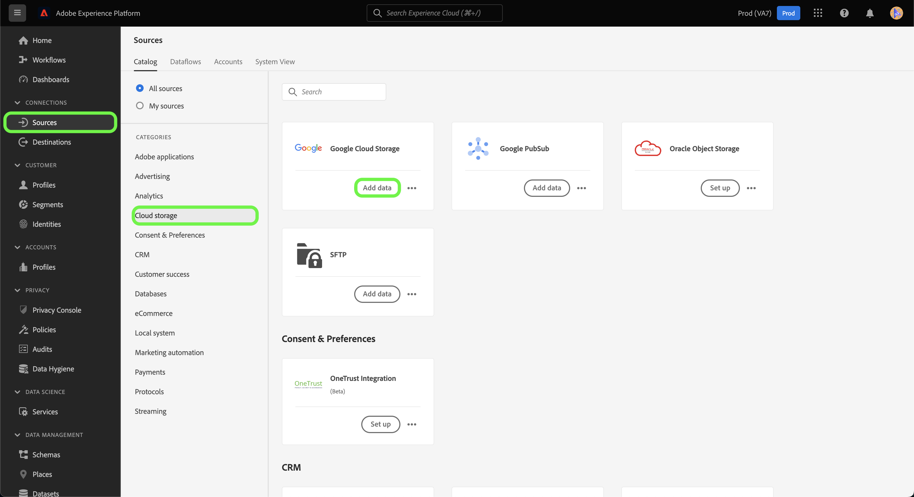

# Erstellen eines Quell-Connectors für [!DNL Google Cloud Storage] in der Benutzeroberfläche

Quell-Connectoren in Adobe Experience Platform bieten die Möglichkeit, extern bezogene Daten auf geplanter Basis zu erfassen. In diesem Tutorial werden Schritte zum Erstellen eines [!DNL Google Cloud Storage] (nachstehend &quot;GCS&quot; genannt) Quell-Connector, der die [!DNL Platform] -Benutzeroberfläche.

## Erste Schritte

Dieses Tutorial setzt ein Grundverständnis der folgenden Komponenten von Adobe Experience Platform voraus:

* [[!DNL Experience Data Model (XDM)] System](../../../../../xdm/home.md): Das standardisierte Framework, mit dem Experience Platform Kundenerlebnisdaten organisiert.
   * [Grundlagen der Schemakomposition](../../../../../xdm/schema/composition.md): Machen Sie sich mit den grundlegenden Bausteinen von XDM-Schemas vertraut, einschließlich der wichtigsten Prinzipien und Best Practices bei der Schemaerstellung.
   * [Tutorial zum Schema-Editor](../../../../../xdm/tutorials/create-schema-ui.md): Erfahren Sie, wie Sie benutzerdefinierte Schemas mithilfe der Benutzeroberfläche des Schema-Editors erstellen können.
* [[!DNL Real-time Customer Profile]](../../../../../profile/home.md): Bietet ein einheitliches Echtzeit-Kundenprofil, das auf aggregierten Daten aus verschiedenen Quellen basiert.

Wenn Sie bereits über eine gültige GCS-Verbindung verfügen, können Sie den Rest dieses Dokuments überspringen und mit dem Tutorial zu [Datenfluss konfigurieren](../../dataflow/batch/cloud-storage.md).

### Unterstützte Dateiformate

[!DNL Experience Platform] unterstützt die folgenden Dateiformate, die aus externen Speichern erfasst werden:

* Trennzeichen (DSV): Die Unterstützung für DSV-formatierte Datendateien ist derzeit auf kommagetrennte Werte beschränkt. Der Wert der Feldkopfzeilen in DSV-formatierten Dateien darf nur aus alphanumerischen Zeichen und Unterstrichen bestehen. Unterstützung für allgemeine DSV-Dateien wird in Zukunft bereitgestellt.
* JavaScript Object Notation (JSON): JSON-formatierte Datendateien müssen XDM-konform sein.
* Apache Parquet: Parquet formatierte Datendateien müssen XDM-konform sein.

### Sammeln erforderlicher Anmeldeinformationen

So greifen Sie auf Ihre GCS-Daten zu [!DNL Platform]müssen Sie die folgenden Werte angeben:

| Anmeldedaten | Beschreibung |
| ---------- | ----------- |
| Zugriffsschlüssel-ID | Eine 61-stellige alphanumerische Zeichenfolge, die zur Authentifizierung Ihrer [!DNL Google Cloud Storage] -Konto auf Platform. |
| Geheimer Zugriffsschlüssel | Eine Base-64-kodierte Zeichenfolge mit 40 Zeichen, die zum Authentifizieren Ihrer [!DNL Google Cloud Storage] -Konto auf Platform. |

Weitere Informationen zu diesen Werten finden Sie unter [HMAC-Schlüssel für Google Cloud-Speicher](https://cloud.google.com/storage/docs/authentication/hmackeys#overview) Handbuch. Anweisungen zum Generieren Ihrer eigenen Zugriffsschlüssel-ID und Ihres geheimen Zugriffsschlüssels finden Sie im Abschnitt [[!DNL Google Cloud Storage] Übersicht](../../../../connectors/cloud-storage/google-cloud-storage.md).

## Verbinden Ihres [!DNL Google Cloud Storage]-Kontos

Nachdem Sie die erforderlichen Anmeldedaten gesammelt haben, können Sie die folgenden Schritte ausführen, um Ihr GCS-Konto mit [!DNL Platform].

Anmelden bei [Adobe Experience Platform](https://platform.adobe.com) und wählen Sie **[!UICONTROL Quellen]** über die linke Navigationsleiste, um auf die **[!UICONTROL Quellen]** Arbeitsbereich. Der Bildschirm **[!UICONTROL Katalog]** zeigt eine Vielzahl von Quellen an, mit denen Sie ein Konto erstellen können.

Sie können die gewünschte Kategorie aus dem Katalog auf der linken Bildschirmseite auswählen. Alternativ können Sie die gewünschte Quelle mithilfe der Suchoption finden.

Unter dem **[!UICONTROL Datenbanken]** category, select **[!UICONTROL Google Cloud Storage]**. Wenn Sie diesen Connector zum ersten Mal verwenden, wählen Sie **[!UICONTROL Konfigurieren]**. Andernfalls wählen Sie **[!UICONTROL Daten hinzufügen]** , um einen neuen GCS-Connector zu erstellen.

Die **[!UICONTROL Verbindung zu Google Cloud Storage herstellen]** angezeigt. Auf dieser Seite können Sie entweder neue oder vorhandene Anmeldedaten verwenden.

### Neues Konto

Wenn Sie neue Anmeldeinformationen verwenden, wählen Sie **[!UICONTROL Neues Konto]**. Geben Sie im angezeigten Formular einen Namen, eine optionale Beschreibung und Ihre GCS-Anmeldeinformationen ein. Wenn Sie fertig sind, wählen Sie **[!UICONTROL Verbinden]** und dann etwas Zeit für die Einrichtung der neuen Verbindung.

### Vorhandenes Konto

Um ein vorhandenes Konto zu verbinden, wählen Sie das GCS-Konto aus, mit dem Sie eine Verbindung herstellen möchten, und klicken Sie dann auf **[!UICONTROL Nächste]** um fortzufahren.

## Nächste Schritte

In diesem Tutorial haben Sie eine Verbindung zu Ihrem GCS-Konto hergestellt. Sie können jetzt mit dem nächsten Tutorial fortfahren und [einen Datenfluss konfigurieren, um Daten aus Ihrem Cloud-Speicher in [!DNL Platform]](../../dataflow/batch/cloud-storage.md).
