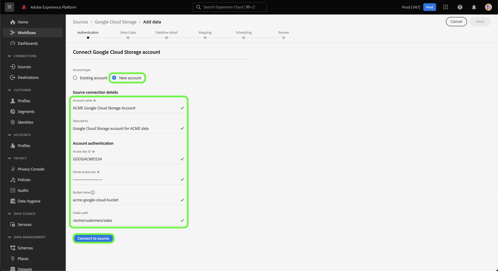

# Erstellen eines Quell-Connectors für [!DNL Google Cloud Storage] in der Benutzeroberfläche

In diesem Tutorial werden Schritte zum Erstellen eines [!DNL Google Cloud Storage] Quellverbindung über die Adobe Experience Platform-Benutzeroberfläche.

## Erste Schritte

Dieses Tutorial setzt ein Grundverständnis der folgenden Komponenten von Adobe Experience Platform voraus:

* [[!DNL Experience Data Model (XDM)] System](../../../../../xdm/home.md): Das standardisierte Framework, mit dem Experience Platform Kundenerlebnisdaten organisiert.
   * [Grundlagen der Schemakomposition](../../../../../xdm/schema/composition.md): Machen Sie sich mit den grundlegenden Bausteinen von XDM-Schemas vertraut, einschließlich der wichtigsten Prinzipien und Best Practices bei der Schemaerstellung.
   * [Tutorial zum Schema-Editor](../../../../../xdm/tutorials/create-schema-ui.md): Erfahren Sie, wie Sie benutzerdefinierte Schemas mithilfe der Benutzeroberfläche des Schema-Editors erstellen können.
* [[!DNL Real-Time Customer Profile]](../../../../../profile/home.md): Bietet ein einheitliches Echtzeit-Kundenprofil, das auf aggregierten Daten aus verschiedenen Quellen basiert.

Wenn Sie bereits über eine gültige [!DNL Google Cloud Storage]-Verbindung verfügen, können Sie den Rest dieses Dokuments überspringen und mit dem Tutorial zum [Konfigurieren eines Datenflusses](../../dataflow/batch/cloud-storage.md) fortfahren.

### Unterstützte Dateiformate

[!DNL Experience Platform] unterstützt die folgenden Dateiformate, die aus externen Speichern erfasst werden:

* Trennzeichen (DSV): Jeder einzelne Wert kann als Trennzeichen für Datendateien im DSV-Format verwendet werden.
* JavaScript Object Notation (JSON): JSON-formatierte Datendateien müssen XDM-konform sein.
* Apache Parquet: Parquet formatierte Datendateien müssen XDM-konform sein.

### Sammeln erforderlicher Anmeldeinformationen

Um auf Ihre [!DNL Google Cloud Storage] -Daten in Platform angeben, müssen Sie die folgenden Werte angeben:

| Anmeldedaten | Beschreibung |
| ---------- | ----------- |
| Zugriffsschlüssel-ID | Eine 61-stellige alphanumerische Zeichenfolge, die zur Authentifizierung Ihrer [!DNL Google Cloud Storage] -Konto auf Platform. |
| Geheimer Zugriffsschlüssel | Eine Base-64-kodierte Zeichenfolge mit 40 Zeichen, die zum Authentifizieren Ihrer [!DNL Google Cloud Storage] -Konto auf Platform. |
| Behältername | Der Name Ihres [!DNL Google Cloud Storage] Eimer. Sie müssen einen Bucket-Namen angeben, wenn Sie Zugriff auf einen bestimmten Unterordner in Ihrem Cloud-Speicher gewähren möchten. |
| Ordnerpfad | Der Pfad zu dem Ordner, auf den Sie Zugriff gewähren möchten. |

Weitere Informationen zu diesen Werten finden Sie im Handbuch [HMAC-Schlüssel für Google Cloud Storage](https://cloud.google.com/storage/docs/authentication/hmackeys#overview). Anweisungen zum Generieren Ihrer eigenen Zugriffsschlüssel-ID und Ihres geheimen Zugriffsschlüssels finden Sie im Abschnitt [[!DNL Google Cloud Storage] Übersicht](../../../../connectors/cloud-storage/google-cloud-storage.md).

Nachdem Sie die erforderlichen Anmeldeinformationen zusammen haben, können Sie die folgenden Schritte ausführen, um Ihr [!DNL Google Cloud Storage]-Konto mit Platform zu verknüpfen.

## Verbinden Ihres [!DNL Google Cloud Storage]-Kontos

Wählen Sie in der Platform-Benutzeroberfläche die Option **[!UICONTROL Quellen]** in der linken Navigationsleiste, um auf den Arbeitsbereich [!UICONTROL Quellen] zuzugreifen. Die [!UICONTROL Katalog] zeigt eine Vielzahl von Quellen an, mit denen Sie ein Konto erstellen können.

Sie können die gewünschte Kategorie aus dem Katalog auf der linken Bildschirmseite auswählen. Alternativ können Sie die gewünschte Quelle mithilfe der Suchoption finden.

Unter dem [!UICONTROL Cloud-Speicher] category, select **[!UICONTROL Google Cloud Storage]** und wählen Sie **[!UICONTROL Daten hinzufügen]**.

Die **[!UICONTROL Verbindung zu Google Cloud Storage herstellen]** angezeigt. Auf dieser Seite können Sie entweder neue oder vorhandene Anmeldedaten verwenden.

### Vorhandenes Konto

Um ein vorhandenes Konto zu verbinden, wählen Sie die [!DNL Google Cloud Storage] Konto, mit dem Sie eine Verbindung herstellen möchten, wählen Sie **[!UICONTROL Nächste]** um fortzufahren.

### Neues Konto

Wenn Sie neue Anmeldeinformationen verwenden, wählen Sie **[!UICONTROL Neues Konto]** aus. Geben Sie im angezeigten Formular einen Namen, eine optionale Beschreibung und Ihre [!DNL Google Cloud Storage] Anmeldedaten. In diesem Schritt können Sie auch die Unterordner angeben, auf die Ihr Konto Zugriff haben soll, indem Sie den Namen des Pfads zum Unterordner definieren.

Wenn Sie fertig sind, wählen Sie **[!UICONTROL Mit Quelle verbinden]** und warten Sie, bis die neue Verbindung hergestellt ist.

## Nächste Schritte

Mithilfe dieses Tutorials haben Sie eine Verbindung zu Ihrem [!DNL Google Cloud Storage]-Konto hergestellt. Sie können jetzt mit dem nächsten Tutorial fortfahren und [einen Datenfluss konfigurieren, um Daten aus Ihrem Cloud-Speicher in Platform zu übertragen](../../dataflow/batch/cloud-storage.md).
