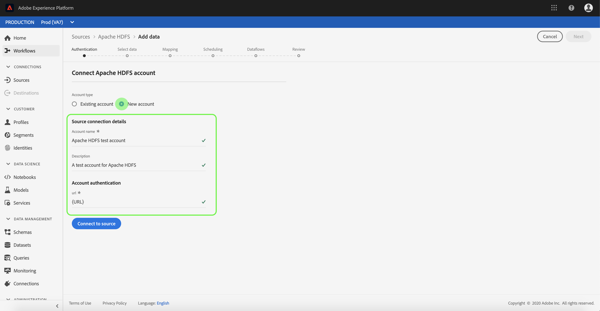

# Erstellen einer [!DNL Apache]-HDFS-Quellverbindung in der Benutzeroberfläche

>[!NOTE]
>
>Der [!DNL Apache] HDFS-Anschluss befindet sich in der Betaversion. Weitere Informationen zur Verwendung von Beta-gekennzeichneten Connectors finden Sie unter [Sources overview](../../../../home.md#terms-and-conditions).

Quellschnittstellen in [!DNL Adobe Experience Platform] bieten die Möglichkeit, extern beschaffte Daten planmäßig zu erfassen. In diesem Lernprogramm werden Schritte zum Authentifizieren eines [!DNL Apache Hadoop Distributed File System] (im Folgenden &quot;HDFS&quot; genannt) Quellconnectors mithilfe der [!DNL Platform]-Benutzeroberfläche beschrieben.

## Erste Schritte

Dieses Lernprogramm erfordert ein Verständnis der folgenden Komponenten von [!DNL Platform]:

- [[!DNL Experience Data Model (XDM)] System](../../../../../xdm/home.md): Das standardisierte Framework, mit dem Kundenerlebnisdaten  [!DNL Experience Platform] organisiert werden.
   - [Grundlagen der Schemakomposition](../../../../../xdm/schema/composition.md): Machen Sie sich mit den Grundbausteinen von XDM-Schemas sowie den zentralen Konzepten und Best Practices rund um die Erstellung von Schemas vertraut.
   - [Schema-Editor-Lernprogramm](../../../../../xdm/tutorials/create-schema-ui.md): Erfahren Sie, wie Sie mit der Benutzeroberfläche des Schema-Editors benutzerdefinierte Schema erstellen.
- [[!DNL Real-time Customer Profile]](../../../../../profile/home.md): Bietet ein einheitliches, Echtzeit-Profil für Kunden, das auf aggregierten Daten aus mehreren Quellen basiert.

Wenn Sie bereits über eine gültige HDFS-Verbindung verfügen, können Sie den Rest dieses Dokuments überspringen und mit dem Lernprogramm [Konfigurieren eines Datenflusses](../../dataflow/batch/cloud-storage.md) fortfahren.

### Erforderliche Anmeldedaten sammeln

Um den HDFS-Quellanschluss zu authentifizieren, müssen Sie Werte für die folgende Verbindungseigenschaft angeben:

| Berechtigung | Beschreibung |
| ---------- | ----------- |
| `url` | Die URL definiert Authentifizierungsparameter, die für eine anonyme Verbindung mit HDFS erforderlich sind. Weitere Informationen zum Abrufen dieses Wertes finden Sie im folgenden Dokument unter [HTTPS-Authentifizierung für HDFS](https://hadoop.apache.org/docs/r1.2.1/HttpAuthentication.html). |

## Verbinden Sie Ihr HDFS-Konto

Nachdem Sie die erforderlichen Anmeldeinformationen gesammelt haben, können Sie die folgenden Schritte ausführen, um Ihr HDFS-Konto mit [!DNL Platform] zu verknüpfen.

Melden Sie sich bei [Adobe Experience Platform](https://platform.adobe.com) an und wählen Sie dann **[!UICONTROL Quellen]** in der linken Navigationsleiste aus, um auf den Arbeitsbereich **[!UICONTROL Quellen]** zuzugreifen. Der Bildschirm **[!UICONTROL Katalog]** zeigt eine Reihe von Quellen an, für die Sie ein Konto erstellen können.

Sie können die entsprechende Kategorie im Katalog auf der linken Seite des Bildschirms auswählen. Alternativ können Sie die gewünschte Quelle mit der Suchoption finden.

Wählen Sie unter der Kategorie **[!UICONTROL Cloud-Datenspeicherung]** **[!UICONTROL Apache HDFS]**. Wenn Sie diesen Connector zum ersten Mal verwenden, wählen Sie **[!UICONTROL Konfigurieren]**. Andernfalls wählen Sie **[!UICONTROL Hinzufügen Daten]** aus, um einen neuen HDFS-Anschluss zu erstellen.

Die Seite **[!UICONTROL Mit HDFS verbinden]** wird angezeigt. Auf dieser Seite können Sie entweder neue oder vorhandene Anmeldeinformationen verwenden.

### Neues Konto

Wenn Sie neue Anmeldeinformationen verwenden, wählen Sie **[!UICONTROL Neues Konto]**. Geben Sie im eingeblendeten Eingabefeld einen Namen, eine optionale Beschreibung und Ihre HDFS-Anmeldeinformationen ein. Wenn Sie fertig sind, wählen Sie **[!UICONTROL Mit Quelle verbinden]** und lassen Sie dann etwas Zeit für die Einrichtung der neuen Verbindung zu.

### Vorhandenes Konto

Um ein vorhandenes Konto zu verbinden, wählen Sie das HDFS-Konto, mit dem Sie eine Verbindung herstellen möchten, und klicken Sie dann auf **[!UICONTROL Weiter]**, um fortzufahren.

## Nächste Schritte

Mit diesem Tutorial haben Sie eine Verbindung zu Ihrem HDFS-Konto hergestellt. Sie können nun mit dem nächsten Lernprogramm fortfahren und [einen Datenfluss konfigurieren, um Daten aus Ihrer Cloud-Datenspeicherung in [!DNL Platform]](../../dataflow/batch/cloud-storage.md) zu übertragen.
