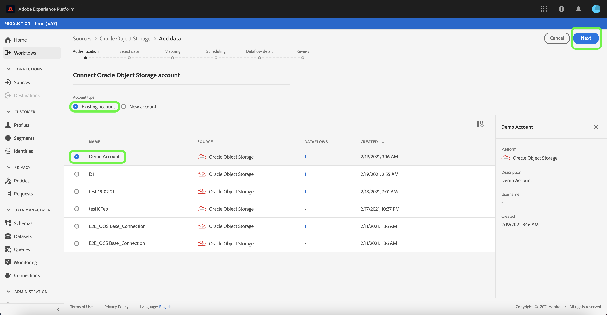

# Erstellen einer [!DNL Oracle Object Storage]-Quellverbindung in der Benutzeroberfläche

In diesem Lernprogramm werden Schritte zum Erstellen einer [!DNL Oracle Object Storage]-Quellverbindung mithilfe der Adobe Experience Platform-Benutzeroberfläche beschrieben.

## Erste Schritte

Dieses Tutorial setzt ein Grundverständnis der folgenden Komponenten von Adobe Experience Platform voraus:

* [Quellen](../../../../home.md): Experience Platform ermöglicht die Erfassung von Daten aus verschiedenen Quellen und bietet Ihnen gleichzeitig die Möglichkeit, eingehende Daten mithilfe von Plattformdiensten zu strukturieren, zu kennzeichnen und zu verbessern.
* [Sandboxes](../../../../../sandboxes/home.md): Experience Platform bietet virtuelle Sandboxes, die eine einzelne Platform-Instanz in separate virtuelle Umgebungen unterteilen, damit Sie Anwendungen für digitale Erlebnisse entwickeln und weiterentwickeln können.

### Erforderliche Anmeldedaten sammeln

Um eine Verbindung zu [!DNL Oracle Object Storage] herzustellen, müssen Sie Werte für die folgenden Verbindungseigenschaften bereitstellen:

| Berechtigung | Beschreibung |
| ---------- | ----------- |
| `serviceUrl` | Der [!DNL Oracle Object Storage]-Endpunkt, der für die Authentifizierung erforderlich ist. Das Endpunktformat lautet: `https://{OBJECT_STORAGE_NAMESPACE}.compat.objectstorage.eu-frankfurt-1.oraclecloud.com` |
| `accessKey` | Die [!DNL Oracle Object Storage]-Zugriffsschlüssel-ID, die für die Authentifizierung erforderlich ist. |
| `secretKey` | Das für die Authentifizierung erforderliche [!DNL Oracle Object Storage]-Kennwort. |
| `bucketName` | Der zulässige Behältername ist erforderlich, wenn der Benutzer eingeschränkten Zugriff hat. Der Behältername muss zwischen drei und 63 Zeichen lang sein, er muss entweder mit einem Buchstaben oder einer Zahl beginnen und enden und darf nur Kleinbuchstaben, Zahlen oder Bindestriche (`-`) enthalten. Der Behältername kann nicht wie eine IP-Adresse formatiert werden. |
| `folderPath` | Der zulässige Ordnerpfad, der erforderlich ist, wenn der Benutzer eingeschränkten Zugriff hat. |

Weitere Informationen zum Abrufen dieser Werte finden Sie im Handbuch [Oracle Object Datenspeicherung Authentication Guide](https://docs.oracle.com/en-us/iaas/Content/Identity/Concepts/usercredentials.htm#User_Credentials).

Nachdem Sie die erforderlichen Anmeldeinformationen gesammelt haben, führen Sie die folgenden Schritte aus, um ein neues Oracle Object Datenspeicherung-Konto für die Verbindung mit der Plattform zu erstellen.

## Mit Oracle-Objekt-Datenspeicherung verbinden

Wählen Sie in der Plattform-Benutzeroberfläche **[!UICONTROL Quellen]** aus der linken Navigation, um auf den Arbeitsbereich [!UICONTROL Quellen] zuzugreifen. Der Bildschirm [!UICONTROL Katalog] enthält eine Reihe von Quellen, mit denen Sie ein Konto erstellen können.

Sie können die entsprechende Kategorie im Katalog auf der linken Seite des Bildschirms auswählen. Alternativ können Sie die gewünschte Quelle über die Suchleiste finden.

Wählen Sie unter der Kategorie [!UICONTROL Cloud-Datenspeicherung] **[!UICONTROL Oracle-Objekt-Datenspeicherung]** und dann **[!UICONTROL Hinzufügen Daten]**.

### Vorhandenes Konto

Um ein vorhandenes Konto zu verwenden, wählen Sie das [!DNL Oracle Object Storage]-Konto, mit dem Sie einen neuen Datenflug erstellen möchten, und klicken Sie dann auf **[!UICONTROL Weiter]**, um fortzufahren.

### Neues Konto

Wenn Sie ein neues Konto erstellen, wählen Sie **[!UICONTROL Neues Konto]** und geben Sie dann einen Namen, eine optionale Beschreibung und Ihre [!DNL Oracle Object Storage]-Anmeldeinformationen ein. Wenn Sie fertig sind, wählen Sie **[!UICONTROL Mit Quelle verbinden]** und lassen Sie dann etwas Zeit für die Einrichtung der neuen Verbindung zu.

## Nächste Schritte

Mit diesem Tutorial haben Sie eine Verbindung zu Ihrem [!DNL Oracle Object Storage]-Konto hergestellt. Sie können nun mit dem nächsten Lernprogramm zum [Konfigurieren eines Datenflusses fortfahren, um Daten aus Ihrer Cloud-Datenspeicherung in Platform](../../dataflow/batch/cloud-storage.md) zu übertragen.
