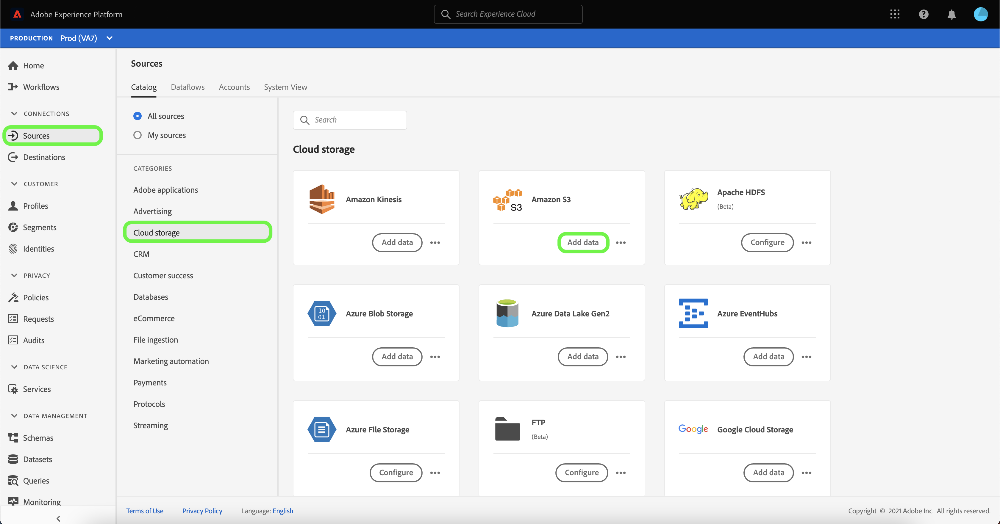
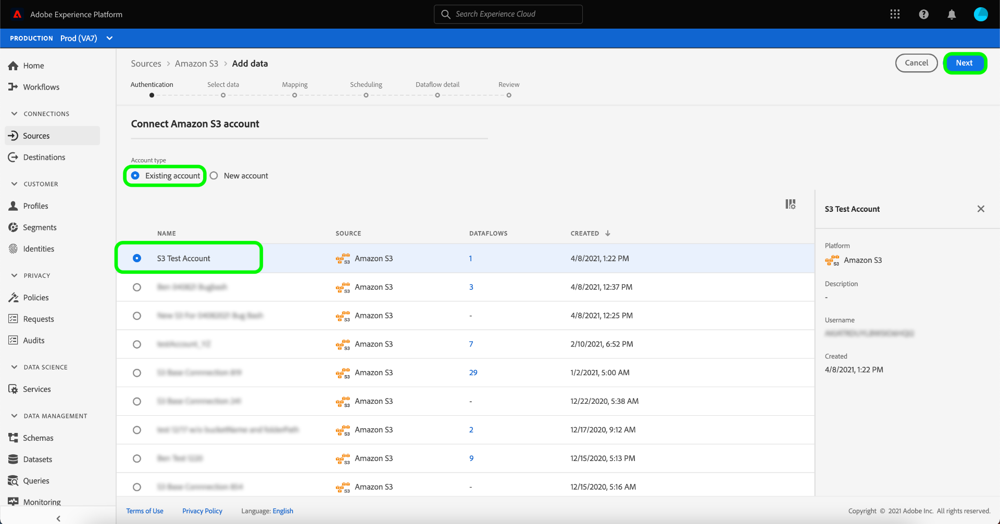

# Erstellen einer [!DNL Amazon S3]-Quellverbindung in der Benutzeroberfläche

Quell-Connectoren in Adobe Experience Platform bieten die Möglichkeit, extern bezogene Daten auf geplanter Basis zu erfassen. In diesem Tutorial werden Schritte zum Erstellen eines Quell-Connectors für [!DNL Amazon S3] (nachfolgend als &quot;[!DNL S3]&quot;bezeichnet) mithilfe der Platform-Benutzeroberfläche beschrieben.

## Erste Schritte

Dieses Tutorial setzt ein Grundverständnis der folgenden Komponenten von Adobe Experience Platform voraus:

- [[!DNL Experience Data Model (XDM)] System](../../../../../xdm/home.md): Das standardisierte Framework, mit dem Experience Platform Kundenerlebnisdaten organisiert.
   - [Grundlagen der Schemakomposition](../../../../../xdm/schema/composition.md): Machen Sie sich mit den Grundbausteinen von XDM-Schemas sowie den zentralen Konzepten und Best Practices rund um die Erstellung von Schemas vertraut.
   - [Tutorial](../../../../../xdm/tutorials/create-schema-ui.md) zum Schema Editor: Erfahren Sie, wie Sie benutzerdefinierte Schemas mithilfe der Benutzeroberfläche des Schema-Editors erstellen.
- [[!DNL Real-time Customer Profile]](../../../../../profile/home.md): Bietet ein einheitliches Echtzeit-Kundenprofil, das auf aggregierten Daten aus verschiedenen Quellen basiert.

Wenn Sie bereits über eine gültige [!DNL S3]-Verbindung verfügen, können Sie den Rest dieses Dokuments überspringen und mit dem Tutorial zum Konfigurieren eines Datenflusses [fortfahren.](../../dataflow/batch/cloud-storage.md)

### Erforderliche Anmeldedaten sammeln

Um auf den [!DNL S3]-Bucket in Platform zuzugreifen, müssen Sie gültige Werte für die folgenden Anmeldedaten angeben:

| Berechtigung | Beschreibung |
| ---------- | ----------- |
| `s3AccessKey` | Die Zugriffsschlüssel-ID für Ihren [!DNL S3] -Bucket. |
| `s3SecretKey` | Die geheime Schlüssel-ID für Ihren [!DNL S3] -Bucket. |
| `serviceUrl` | (Optional) Der benutzerdefinierte Endpunkt [!DNL S3], mit dem eine Verbindung hergestellt werden soll. Dieses Feld ist erforderlich, wenn Ihr [!DNL S3]-Behälter regionsspezifisch ist. Das Format für `serviceUrl` lautet: `https://s3.{REGION}.amazonaws.com/)`. |
| `bucketName` | Der [!DNL S3]-Bucket enthält Ihre Daten und die zugehörigen beschreibenden Metadaten. Ihr [!DNL S3] -Bucket-Name muss zwischen drei und 63 Zeichen lang sein und entweder mit einem Buchstaben oder einer Zahl beginnen und enden. Der Behältername darf nur Kleinbuchstaben, Zahlen oder Bindestriche (`-`) enthalten und kann nicht als IP-Adresse formatiert werden. |
| `folderPath` | Der Pfad zum Ordner in Ihrem [!DNL S3]-Bucket, in dem Ihre Daten gespeichert sind. Diese Berechtigung ist erforderlich, wenn der Benutzer eingeschränkten Zugriff hat. |

Weitere Informationen zu den ersten Schritten finden Sie in [diesem AWS-Dokument](https://aws.amazon.com/blogs/security/wheres-my-secret-access-key/).

## Ihr [!DNL S3]-Konto verbinden

Wählen Sie in der Platform-Benutzeroberfläche **[!UICONTROL Quellen]** aus der linken Navigationsleiste aus, um auf den Arbeitsbereich [!UICONTROL Quellen] zuzugreifen. Der Bildschirm [!UICONTROL Katalog] enthält eine Vielzahl von Quellen, für die Sie ein Konto erstellen können.

Sie können die gewünschte Kategorie aus dem Katalog auf der linken Bildschirmseite auswählen. Alternativ können Sie die gewünschte Quelle mithilfe der Suchoption finden.

Wählen Sie unter der Kategorie **[!UICONTROL Cloud-Speicher]** die Option **[!UICONTROL Amazon S3]** und klicken Sie dann auf **[!UICONTROL Daten hinzufügen]**.

Die Seite **[!UICONTROL Verbindung zu Amazon S3]** wird angezeigt. Auf dieser Seite können Sie entweder neue oder vorhandene Anmeldedaten verwenden.

### Neues Konto

Wenn Sie neue Anmeldedaten verwenden, wählen Sie **[!UICONTROL Neues Konto]** aus. Geben Sie im angezeigten Formular einen Namen, eine optionale Beschreibung und Ihre [!DNL S3]-Anmeldedaten ein. Wenn Sie fertig sind, wählen Sie **[!UICONTROL Mit Quelle verbinden]** aus und lassen Sie dann etwas Zeit für die Einrichtung der neuen Verbindung zu.

### Vorhandenes Konto

Um ein vorhandenes Konto zu verbinden, wählen Sie das [!DNL S3]-Konto aus, mit dem Sie eine Verbindung herstellen möchten, und klicken Sie dann auf **[!UICONTROL Weiter]**, um fortzufahren.

## Nächste Schritte und zusätzliche Ressourcen

In diesem Tutorial haben Sie eine Verbindung zu Ihrem [!DNL S3]-Konto hergestellt. Sie können jetzt mit dem nächsten Tutorial fortfahren und [einen Datenfluss konfigurieren, um Daten aus Ihrem Cloud-Speicher in Platform](../../dataflow/batch/cloud-storage.md) zu übertragen.
