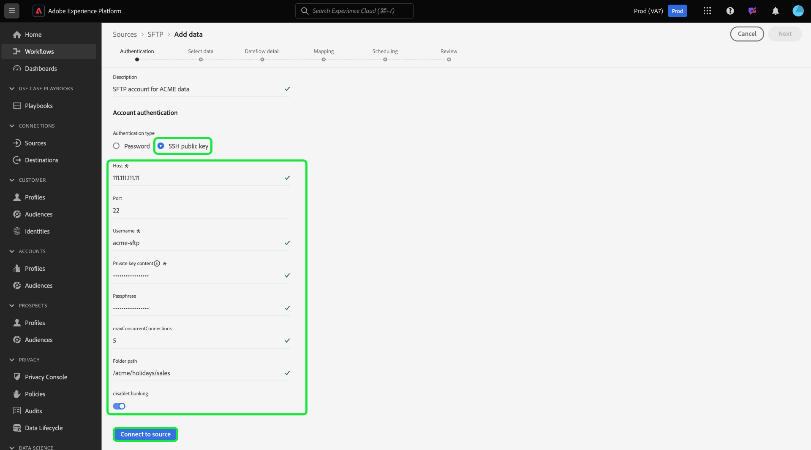

# Erstellen Sie eine [!DNL SFTP] Quellverbindung in der Benutzeroberfläche

In diesem Tutorial werden Schritte zum Erstellen eines [!DNL SFTP] Quellverbindung über die Adobe Experience Platform-Benutzeroberfläche.

## Erste Schritte

Dieses Tutorial setzt ein Grundverständnis der folgenden Komponenten von Platform voraus:

* [[!DNL Experience Data Model (XDM)] System](../../../../../xdm/home.md): Das standardisierte Framework, mit dem Experience Platform Kundenerlebnisdaten organisiert.
   * [Grundlagen der Schemakomposition](../../../../../xdm/schema/composition.md): Machen Sie sich mit den grundlegenden Bausteinen von XDM-Schemas vertraut, einschließlich der wichtigsten Prinzipien und Best Practices bei der Schemaerstellung.
   * [Tutorial zum Schema-Editor](../../../../../xdm/tutorials/create-schema-ui.md): Erfahren Sie, wie Sie benutzerdefinierte Schemas mithilfe der Benutzeroberfläche des Schema-Editors erstellen können.
* [[!DNL Real-Time Customer Profile]](../../../../../profile/home.md): Bietet ein einheitliches Echtzeit-Kundenprofil, das auf aggregierten Daten aus verschiedenen Quellen basiert.

>[!IMPORTANT]
>
>Es wird empfohlen, beim Erfassen von JSON-Objekten mit einer [!DNL SFTP] Quellverbindung. Um die Beschränkung zu umgehen, verwenden Sie ein einzelnes JSON-Objekt pro Zeile und verwenden mehrere Zeilen für die darauf folgenden Dateien.

Wenn Sie bereits über eine gültige [!DNL SFTP]-Verbindung verfügen, können Sie den Rest dieses Dokuments überspringen und mit dem Tutorial zum [Konfigurieren eines Datenflusses](../../dataflow/batch/cloud-storage.md) fortfahren.

### Sammeln erforderlicher Anmeldeinformationen

Um eine Verbindung zu [!DNL SFTP]müssen Sie Werte für die folgenden Verbindungseigenschaften angeben:

| Anmeldedaten | Beschreibung |
| ---------- | ----------- |
| `host` | Der Name oder die IP-Adresse, die mit Ihrer [!DNL SFTP] Server. |
| `port` | Die [!DNL SFTP] Serveranschluss, mit dem Sie eine Verbindung herstellen. Wenn der Wert nicht angegeben wird, wird standardmäßig `22`. |
| `username` | Der Benutzername mit Zugriff auf Ihre [!DNL SFTP] Server. |
| `password` | Das Kennwort für Ihre [!DNL SFTP] Server. |
| `privateKeyContent` | Der Base64-kodierte Inhalt mit privatem SSH-Schlüssel. Der Typ des OpenSSH-Schlüssels muss entweder als RSA oder als DSA klassifiziert werden. |
| `passPhrase` | Der Ausdruck oder das Kennwort zum Entschlüsseln des privaten Schlüssels, wenn die Schlüsseldatei oder der Schlüsselinhalt durch einen Pass-Satz geschützt ist. Wenn PrivateKeyContent kennwortgeschützt ist, muss dieser Parameter mit der Passphrase von PrivateKeyContent als Wert verwendet werden. |
| `maxConcurrentConnections` | Mit diesem Parameter können Sie eine maximale Anzahl gleichzeitiger Verbindungen festlegen, die Platform beim Herstellen einer Verbindung zu Ihrem SFTP-Server erstellt. Sie müssen festlegen, dass dieser Wert kleiner als der von SFTP festgelegte Grenzwert ist. **Hinweis**: Wenn diese Einstellung für ein vorhandenes SFTP-Konto aktiviert ist, betrifft sie nur zukünftige Datenflüsse und nicht vorhandene Datenflüsse. |

Nachdem Sie die erforderlichen Anmeldedaten gesammelt haben, können Sie die folgenden Schritte ausführen, um eine neue [!DNL SFTP] -Konto, um eine Verbindung mit Platform herzustellen.

## Verbinden Sie Ihre [!DNL SFTP] server

Wählen Sie in der Platform-Benutzeroberfläche die Option **[!UICONTROL Quellen]** in der linken Navigationsleiste, um auf den Arbeitsbereich [!UICONTROL Quellen] zuzugreifen. Die [!UICONTROL Katalog] zeigt eine Vielzahl von Quellen an, mit denen Sie ein eingehendes Konto erstellen können.

Sie können die gewünschte Kategorie aus dem Katalog auf der linken Bildschirmseite auswählen. Alternativ können Sie die gewünschte Quelle mithilfe der Suchoption finden.

Unter dem [!UICONTROL Cloud-Speicher] category, select **[!UICONTROL SFTP]** und wählen Sie **[!UICONTROL Daten hinzufügen]**.

Die **[!UICONTROL Verbindung zu SFTP herstellen]** angezeigt. Auf dieser Seite können Sie entweder neue oder vorhandene Anmeldedaten verwenden.

### Vorhandenes Konto

Um ein vorhandenes Konto zu verbinden, wählen Sie das FTP- oder SFTP-Konto aus, mit dem Sie eine Verbindung herstellen möchten, und klicken Sie dann auf **[!UICONTROL Nächste]** um fortzufahren.

### Neues Konto

Wenn Sie ein neues Konto erstellen, wählen Sie **[!UICONTROL Neues Konto]** und geben Sie dann einen Namen und eine optionale Beschreibung für Ihre neue [!DNL SFTP] -Konto.

#### Authentifizierung mit Kennwort

[!DNL SFTP] unterstützt verschiedene Authentifizierungstypen für den Zugriff. under **[!UICONTROL Kontoauthentifizierung]** select **[!UICONTROL Passwort]** und geben Sie dann die Werte für Host und Anschluss an, mit denen eine Verbindung hergestellt werden soll, zusammen mit Ihrem Benutzernamen und Kennwort an.

#### Authentifizieren mit dem öffentlichen SSH-Schlüssel

Um die öffentlichen SSH-Schlüsselanmeldeinformationen zu verwenden, wählen Sie **[!UICONTROL Öffentlichen SSH-Schlüssel]**  und geben Sie dann Ihre Host- und Port-Werte sowie Ihren privaten Schlüsselinhalt und Ihre Passphrase-Kombination an.

>[!IMPORTANT]
>
>SFTP unterstützt einen OpenSSH-Schlüssel vom Typ RSA oder DSA. Stellen Sie sicher, dass der Inhalt Ihrer Schlüsseldatei mit `"-----BEGIN [RSA/DSA] PRIVATE KEY-----"` und endet mit `"-----END [RSA/DSA] PRIVATE KEY-----"`. Wenn es sich bei der privaten Schlüsseldatei um eine PPK-Datei handelt, verwenden Sie das PuTTY-Tool, um von PPK in das OpenSSH-Format zu konvertieren.

| Anmeldedaten | Beschreibung |
| ---------- | ----------- |
| Inhalt privater Schlüssel | Der Base64-kodierte Inhalt mit privatem SSH-Schlüssel. Der Typ des OpenSSH-Schlüssels muss entweder als RSA oder als DSA klassifiziert werden. |
| Passphrase | Gibt den Ausdruck oder das Kennwort zum Entschlüsseln des privaten Schlüssels an, wenn die Schlüsseldatei oder der Schlüsselinhalt durch einen Pass-Satz geschützt ist. Wenn PrivateKeyContent kennwortgeschützt ist, muss dieser Parameter mit der Passphrase des PrivateKeyContent als Wert verwendet werden. |

## Nächste Schritte

In diesem Tutorial haben Sie eine Verbindung zu Ihrem SFTP-Konto hergestellt. Sie können jetzt mit dem nächsten Tutorial fortfahren und [einen Datenfluss konfigurieren, um Daten aus Ihrem Cloud-Speicher in Platform zu übertragen](../../dataflow/batch/cloud-storage.md).
