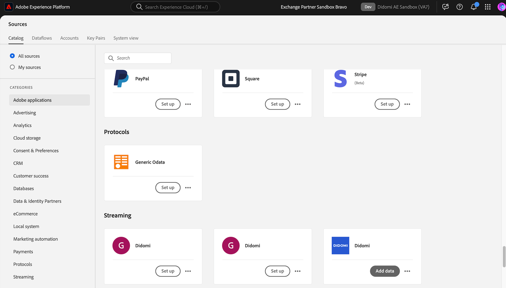
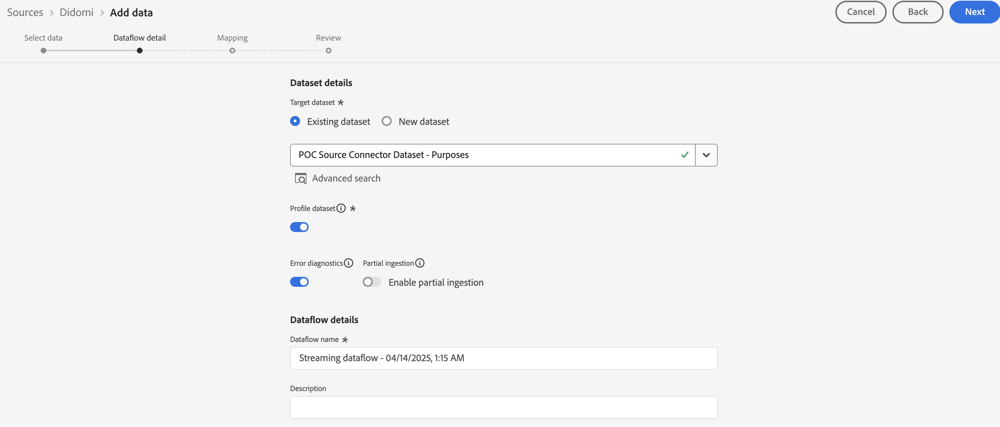

# Verbinden von [!DNL Didomi] mit Experience Platform

Lesen Sie dieses Handbuch, um zu erfahren, wie Sie Ihr [!DNL Didomi]-Konto mithilfe des Quellarbeitsbereichs in der Benutzeroberfläche mit Adobe Experience Platform verbinden.

>[!IMPORTANT]
>
>* Diese Dokumentationsseite wurde vom Team *Didomi* erstellt. Bei Fragen oder Aktualisierungsanfragen wenden Sie sich bitte direkt an *support@didomi.io*.
>* Eine schrittweise Anleitung zum Generieren der Verbindung finden Sie in der [Didomi Adobe Source Connector-Dokumentation](https://developers.didomi.io/integrations/third-party-apps/preference-management-platform-integrations/Adobe-source-connector).

## Erste Schritte

Dieses Tutorial setzt ein Grundverständnis der folgenden Komponenten von Adobe Experience Platform voraus:

* [[!DNL Experience Data Model (XDM)] System](../../../../../xdm/home.md): Das standardisierte Framework, mit dem Experience Platform Kundenerlebnisdaten organisiert.
   * [Grundlagen der Schemakomposition](../../../../../xdm/schema/composition.md): Machen Sie sich mit den grundlegenden Bausteinen von XDM-Schemata vertraut, einschließlich der wichtigsten Prinzipien und Best Practices bei der Schemaerstellung.
   * [Tutorial zum Schema-Editor](../../../../../xdm/tutorials/create-schema-ui.md): Erfahren Sie, wie Sie benutzerdefinierte Schemata mithilfe der Benutzeroberfläche des Schema-Editors erstellen können.
* [[!DNL Real-Time Customer Profile]](../../../../../profile/home.md): Bietet ein einheitliches Echtzeit-Kundenprofil, das auf aggregierten Daten aus verschiedenen Quellen basiert.

### Einrichten des [!DNL Didomi] Kontos

Bevor Sie fortfahren können, stellen Sie sicher, dass Sie die in der [[!DNL Didomi] Übersicht“ beschriebenen Schritte lesen und ausführen](../../../../connectors/consent-and-preferences/didomi.md#prerequisites) um Ihr Konto erfolgreich mit Experience Platform zu verbinden.

## Navigieren im Quellkatalog

Wählen Sie in der Experience Platform-Benutzeroberfläche **[!UICONTROL Quellen]** in der linken Navigationsleiste aus, um auf den Arbeitsbereich *[!UICONTROL Quellen]* zuzugreifen. Wählen Sie eine Kategorie aus oder verwenden Sie die Suchleiste, um Ihre Quelle zu finden.

Um eine Verbindung zu [!DNL Didomi] herzustellen, gehen Sie zur Kategorie *[!UICONTROL Datenbanken]*, wählen Sie die Quellkarte **[!UICONTROL Didomi]** aus und klicken Sie dann auf **[!UICONTROL Einrichten]**.

>[!TIP]
>
>Quellen im Quellkatalog zeigen die Option **[!UICONTROL Einrichten]** an, wenn eine bestimmte Quelle noch kein authentifiziertes Konto hat. Nachdem ein authentifiziertes Konto erstellt wurde, ändert sich diese Option in **[!UICONTROL Daten hinzufügen]**.

## Hinzufügen des Quelldatenschemas

Verwenden Sie als Nächstes die *[!UICONTROL Daten auswählen]*-Schnittstelle, um die JSON-Datei hochzuladen, die [in den erforderlichen Schritten heruntergeladen) ](../../../../connectors/consent-and-preferences/didomi.md#download-the-sample-payload-file).

Sie können die Vorschau-Benutzeroberfläche verwenden, um die Dateistruktur der Payload anzuzeigen. Wenn Sie fertig sind, klicken Sie auf die Schaltfläche **[!UICONTROL Weiter]**.

## Angeben von Datenflussdetails

Als Nächstes müssen Sie Informationen zu Ihrem Datensatz und Ihrem Datenfluss angeben.

### Datensatz-Details

Ein Datensatz ist ein Konstrukt zur Datenspeicherung und -verwaltung, in dem Daten (in der Regel) in einer Tabelle erfasst werden, die ein Schema (Spalten) und Felder (Zeilen) beinhaltet. Daten, die erfolgreich in Experience Platform aufgenommen werden, bleiben als Datensätze im Data Lake erhalten.

In diesem Schritt können Sie entweder einen vorhandenen Datensatz verwenden oder einen neuen Datensatz erstellen.

>[!NOTE]
>
>Unabhängig davon, ob Sie einen vorhandenen Datensatz verwenden oder einen neuen Datensatz erstellen, müssen Sie sicherstellen, dass Ihr Datensatz **für die Profilaufnahme aktiviert** ist.

+++Wählen Sie Schritte aus, um die Profilaufnahme, Fehlerdiagnose und partielle Aufnahme zu aktivieren.

Wenn Ihr Datensatz für das Echtzeit-Kundenprofil aktiviert ist, können Sie in diesem Schritt **[!UICONTROL Profildatensatz]** umschalten, um Ihre Daten für die Profilaufnahme zu aktivieren. Sie können diesen Schritt auch verwenden, um **[!UICONTROL Fehlerdiagnose]** und **[!UICONTROL Partielle Aufnahme]** zu aktivieren.

* **[!UICONTROL Fehlerdiagnose]**: Wählen Sie **[!UICONTROL Fehlerdiagnose]** aus, um die Quelle anzuweisen, Fehlerdiagnosen zu erstellen, auf die Sie später bei der Überwachung Ihrer Datensatzaktivität und des Datenflussstatus verweisen können.
* **[!UICONTROL Partielle Aufnahme]** Bei der partiellen Batch-Aufnahme werden Daten mit Fehlern bis zu einem bestimmten konfigurierbaren Schwellenwert aufgenommen. Mit dieser Funktion können Sie alle Ihre korrekten Daten erfolgreich in Experience Platform aufnehmen, während alle Ihre falschen Daten separat mit Informationen darüber, warum sie ungültig sind, in Batches erfasst werden.

+++

### Datenflussdetails

Nachdem Ihr Datensatz konfiguriert wurde, müssen Sie Details zu Ihrem Datenfluss angeben, einschließlich eines Namens, einer optionalen Beschreibung und Warnhinweiskonfigurationen.

| Datenflusskonfigurationen | Beschreibung |
| --- | --- |
| Datenflussname | Der Name des Datenflusses.  Standardmäßig wird dabei der Name der zu importierenden Datei verwendet. |
| Beschreibung | (Optional) Eine kurze Beschreibung Ihres Datenflusses. |
| Warnhinweise | Experience Platform kann ereignisbasierte Warnhinweise erstellen, die Benutzende abonnieren können. Diese Optionen ermöglichen den gesamten laufenden Datenfluss zu diesen Triggern.  Weitere Informationen finden Sie unter [Warnhinweise - Übersicht](../../alerts.md) <ul><li>**Start der Ausführung des Quelldatenflusses**: Wählen Sie diesen Warnhinweis aus, um eine Benachrichtigung zu erhalten, wenn die Ausführung des Datenflusses beginnt.</li><li>**Erfolgreiche Ausführung des Quelldatenflusses**: Wählen Sie diesen Warnhinweis aus, um eine Benachrichtigung zu erhalten, wenn Ihr Datenfluss fehlerfrei endet.</li><li>**Fehler bei der Ausführung des Datenflusses an Quellen**: Wählen Sie diesen Warnhinweis aus, um eine Benachrichtigung zu erhalten, wenn die Ausführung des Datenflusses mit Fehlern endet.</li></ul> |

{style="table-layout:auto"}

## Zuordnung

Verwenden Sie die Zuordnungsschnittstelle, um Ihre Quelldaten den entsprechenden Schemafeldern zuzuordnen, bevor Sie Daten in Experience Platform aufnehmen.  Weitere Informationen finden Sie im [Zuordnungshandbuch in der Benutzeroberfläche](../../../../../data-prep/ui/mapping.md)

Die Zuordnung wird speziell verwendet, um **zweckbezogene Daten** von [!DNL Didomi] in den Experience Platform-Datensatz zu übertragen. Diese Zwecke stellen die Einverständnisentscheidungen des Benutzers dar (z. B. für Analysen, Personalisierung, Werbung usw.) und sind die einzigen akzeptierten Zuordnungsfelder in dieser Integration.

Verwenden Sie die [Beispiel-Webhook-Payload heruntergeladen](../../../../connectors/consent-and-preferences/didomi.md#download-the-sample-payload-file) aus den Einstellungen des [!DNL Didomi]-Webhooks, um jeden [!DNL Didomi] den entsprechenden Feldern in Ihrem Adobe-Datensatz zuzuordnen.

Wenn Sie fertig sind, klicken Sie auf die Schaltfläche **[!UICONTROL Weiter]**.

## Überprüfung

Der Schritt *[!UICONTROL Überprüfen]* wird angezeigt, in dem Sie die Details Ihres Datenflusses überprüfen können, bevor er erstellt wird. Details werden in den folgenden Kategorien gruppiert:

* **[!UICONTROL Verbindung]**: Zeigt den Kontonamen, die Quellplattform und den Quellnamen an.
* **[!UICONTROL Datensatz- und Zuordnungsfelder zuweisen]**: Zeigt den Zieldatensatz und das Schema an, zu dem der Datensatz gehört.

Nachdem Sie bestätigt haben, dass die Details korrekt sind, wählen Sie **[!UICONTROL Beenden]**.

## Abrufen der Streaming-Endpunkt-URL

Bei der Erstellung der Verbindung wird die Seite mit den Quelldetails angezeigt. Auf dieser Seite werden Details zu Ihrer neu erstellten Verbindung angezeigt, einschließlich zuvor ausgeführter Datenflüsse, ID und Streaming-Endpunkt-URL.

## Beenden der Konfiguration auf Adobe

Navigieren Sie nach der Erstellung Ihres Datenflusses zum Katalog *[!UICONTROL Quellen]* und wählen Sie dann **[!UICONTROL Datenflüsse]** aus. Verwenden Sie das Datenflussverzeichnis, um Ihren [!DNL Didomi] Datenfluss zu finden und auf die Schnittstelle *[!UICONTROL Datenflussaktivität]* zuzugreifen. Verwenden Sie anschließend das *[!UICONTROL Eigenschaften]*-Bedienfeld in der rechten Leiste und rufen Sie Werte für Folgendes ab:

* [!UICONTROL Streaming-Endpunkt]
* [!UICONTROL Datenfluss-ID]

In der Experience Platform-Benutzeroberfläche:

1. Überprüfen Sie nach Abschluss der Konfiguration die Konfigurationsparameter, die bei der ersten Webhook-Einrichtung fehlten.
2. Sobald diese Werte verfügbar sind, kehren Sie zu Didomi zurück und aktualisieren Sie die Webhook-Konfiguration.

## Aktualisieren der Webhook-Konfiguration

Navigieren Sie nach Abschluss der Konfiguration zurück zur [!DNL Didomi] Console und aktualisieren Sie Ihre Webhook-Konfiguration mit Ihrer **Streaming-Endpunkt-URL** und **Datenfluss-ID**.

Sobald dies abgeschlossen ist, beginnen [!DNL Didomi] mit dem Versand der Einverständnisverwaltungs- und Präferenzverwaltungs-Ereignisse über die Integration, und die Daten werden in Ihrem Adobe-Datensatz gespeichert.

## Nächste Schritte

In diesem Tutorial haben Sie erfolgreich einen Datenfluss erstellt, um Batch-Daten aus Ihrer [!DNL Didomi] in Experience Platform zu übertragen. Weitere Ressourcen finden Sie in der unten beschriebenen Dokumentation.

### Überwachen Ihres Datenflusses

Nachdem Ihr Datenfluss erstellt wurde, können Sie die Daten überwachen, die über ihn aufgenommen werden, um Informationen zu Aufnahmegeschwindigkeiten, Erfolg und Fehlern anzuzeigen. Weitere Informationen zum Überwachen von Datenflüssen finden Sie im Tutorial [Überwachen von Konten und Datenflüssen in der Benutzeroberfläche](../../../../../dataflows/ui/monitor-sources.md).

### Aktualisieren des Datenflusses

Um Konfigurationen für die Planung, Zuordnung und allgemeine Informationen Ihrer Datenflüsse zu aktualisieren, besuchen Sie das Tutorial [Aktualisieren von Quelldatenflüssen in der Benutzeroberfläche](../../update-dataflows.md).

### Löschen des Datenflusses

Datenflüsse, die nicht mehr erforderlich sind oder nicht korrekt erstellt wurden, können Sie löschen, indem Sie dazu die Funktion **[!UICONTROL Löschen]** im Arbeitsbereich **[!UICONTROL Datenflüsse]** verwenden. Weitere Informationen zum Löschen von Datenflüssen finden Sie im Tutorial [Löschen von Datenflüssen in der Benutzeroberfläche](../../delete.md).