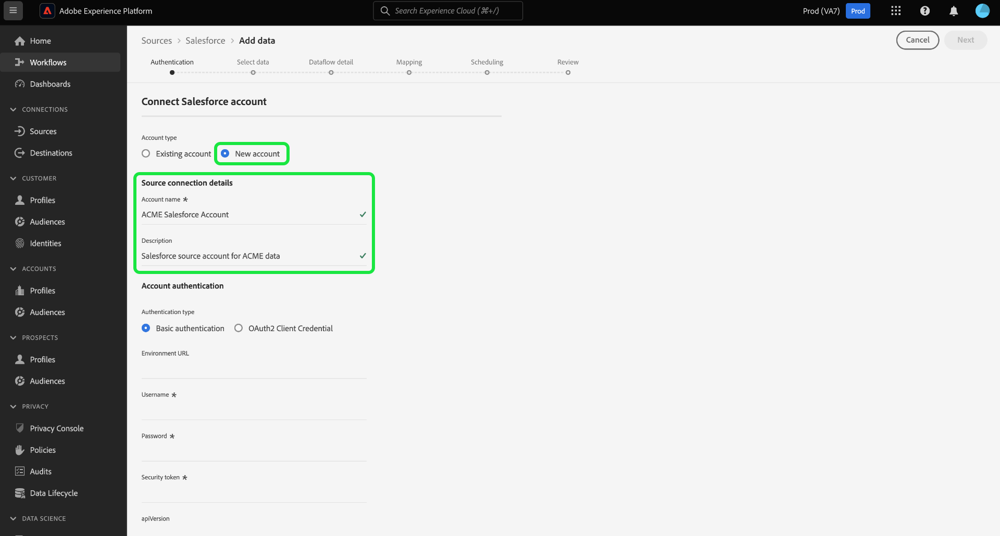

# Erstellen eines Quell-Connectors für [!DNL Salesforce] in der Benutzeroberfläche

Quell-Connectoren in Adobe Experience Platform bieten die Möglichkeit, CRM-Daten aus externen Quellen nach einem bestimmten Zeitplan aufzunehmen. In diesem Tutorial finden Sie die Schritte zum Erstellen eines [!DNL Salesforce]-Quell-Connectors mithilfe der [!DNL Platform]-Benutzeroberfläche.

## Erste Schritte

Dieses Tutorial setzt ein Grundverständnis der folgenden Komponenten von Adobe Experience Platform voraus:

* [[!DNL Experience Data Model (XDM)] System](../../../../../xdm/home.md): Das standardisierte Framework, mit dem [!DNL Experience Platform] Kundenerlebnisdaten organisiert.
   * [Grundlagen der Schemakomposition](../../../../../xdm/schema/composition.md): Machen Sie sich mit den grundlegenden Bausteinen von XDM-Schemas vertraut, einschließlich der wichtigsten Prinzipien und Best Practices bei der Schemaerstellung.
   * [Tutorial zum Schema-Editor](../../../../../xdm/tutorials/create-schema-ui.md): Erfahren Sie, wie Sie benutzerdefinierte Schemas mithilfe der Benutzeroberfläche des Schema-Editors erstellen können.
* [[!DNL Real-Time Customer Profile]](../../../../../profile/home.md): Bietet ein einheitliches Echtzeit-Kundenprofil, das auf aggregierten Daten aus verschiedenen Quellen basiert.

Wenn Sie bereits über ein gültiges [!DNL Salesforce]-Konto verfügen, können Sie den Rest dieses Dokuments überspringen und mit dem Tutorial zum [Konfigurieren eines Datenflusses](../../dataflow/crm.md) fortfahren.

### Sammeln erforderlicher Anmeldeinformationen

| Anmeldedaten | Beschreibung |
| ---------- | ----------- |
| `environmentUrl` | Die URL der [!DNL Salesforce] Quellinstanz. |
| `username` | Der Benutzername für die [!DNL Salesforce] Benutzerkonto. |
| `password` | Das Kennwort für die [!DNL Salesforce] Benutzerkonto. |
| `securityToken` | Das Sicherheits-Token für [!DNL Salesforce] Benutzerkonto. |

Weitere Informationen zu den ersten Schritten finden Sie unter [Dieses Salesforce-Dokument](https://developer.salesforce.com/docs/atlas.en-us.api_rest.meta/api_rest/intro_understanding_authentication.htm).

## Verbinden Ihres [!DNL Salesforce]-Kontos

Nachdem Sie die erforderlichen Anmeldedaten erfasst haben, können Sie die folgenden Schritte ausführen, um Ihr [!DNL Salesforce]-Konto mit [!DNL Platform] zu verknüpfen.

Anmelden bei [Adobe Experience Platform](https://platform.adobe.com) und wählen Sie **[!UICONTROL Quellen]** über die linke Navigationsleiste, um auf die **[!UICONTROL Quellen]** Arbeitsbereich. Der Bildschirm **[!UICONTROL Katalog]** zeigt eine Vielzahl von Quellen an, mit denen Sie ein Konto erstellen können.

Sie können die gewünschte Kategorie aus dem Katalog auf der linken Bildschirmseite auswählen. Alternativ können Sie die gewünschte Quelle mithilfe der Suchoption finden.

Unter dem **[!UICONTROL Datenbanken]** category, select **[!UICONTROL Salesforce]**. Wenn Sie diesen Connector zum ersten Mal verwenden, wählen Sie **[!UICONTROL Konfigurieren]**. Andernfalls wählen Sie **[!UICONTROL Daten hinzufügen]** , um einen neuen Salesforce-Connector zu erstellen.

Die **[!UICONTROL Mit Salesforce verbinden]** angezeigt. Auf dieser Seite können Sie entweder neue oder vorhandene Anmeldedaten verwenden.

### Neues Konto

Wenn Sie neue Anmeldeinformationen verwenden, wählen Sie **[!UICONTROL Neues Konto]** aus. Geben Sie im angezeigten Formular einen Namen, eine optionale Beschreibung und Ihre [!DNL Salesforce] Anmeldedaten. Wenn Sie fertig sind, wählen Sie **[!UICONTROL Verbinden]** und dann etwas Zeit für die Einrichtung der neuen Verbindung.

### Vorhandenes Konto

Um ein vorhandenes Konto zu verbinden, wählen Sie die [!DNL Salesforce] Konto, mit dem Sie eine Verbindung herstellen möchten, wählen Sie **[!UICONTROL Nächste]** in der oberen rechten Ecke, um fortzufahren.

## Nächste Schritte

Mithilfe dieses Tutorials haben Sie eine Verbindung zu Ihrem [!DNL Salesforce]-Konto hergestellt. Sie können jetzt mit dem nächsten Tutorial fortfahren und einen [Datenfluss konfigurieren, um Daten in zu importieren [!DNL Platform]](../../dataflow/crm.md).
