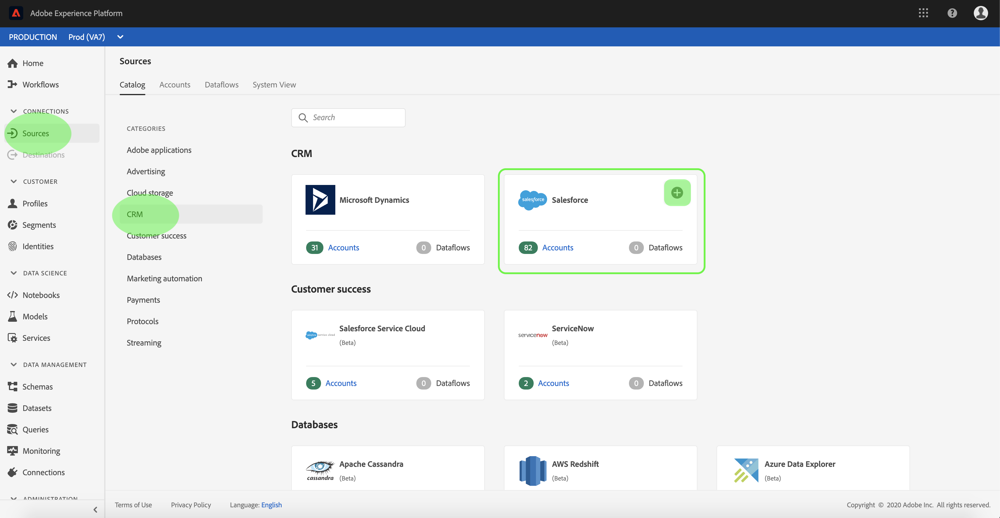
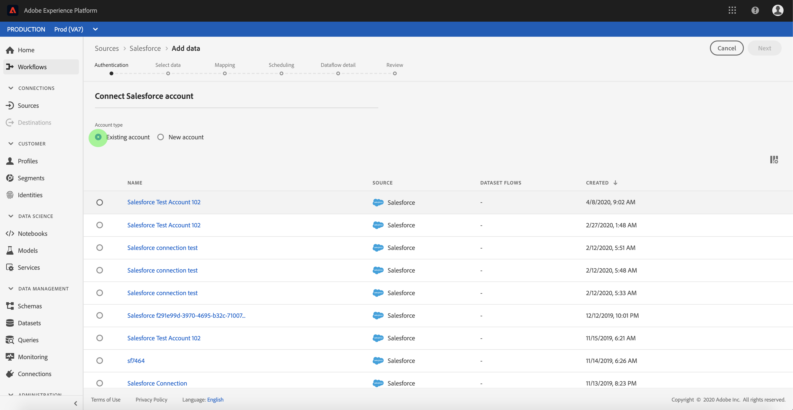
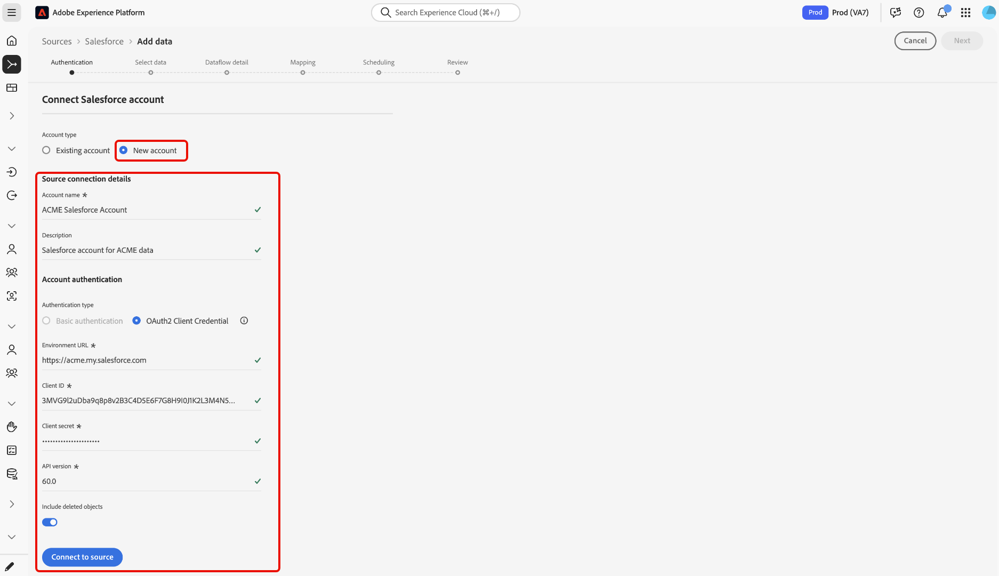

# Verbinden Ihres [!DNL Salesforce]-Kontos mit Experience Platform über die Benutzeroberfläche

Lesen Sie dieses Handbuch, um zu erfahren, wie Sie Ihr [!DNL Salesforce]-Konto verbinden und Ihre CRM-Daten über die Benutzeroberfläche von Experience Platform in Adobe Experience Platform importieren.

## Erste Schritte

Dieses Tutorial setzt ein Grundverständnis der folgenden Komponenten von Experience Platform voraus:

* [[!DNL Experience Data Model (XDM)] System](../../../../../xdm/home.md): Das standardisierte Framework, mit dem Experience Platform Kundenerlebnisdaten organisiert.
   * [Grundlagen der Schemakomposition](../../../../../xdm/schema/composition.md): Machen Sie sich mit den grundlegenden Bausteinen von XDM-Schemata vertraut, einschließlich der wichtigsten Prinzipien und Best Practices bei der Schemaerstellung.
   * [Tutorial zum Schema-Editor](../../../../../xdm/tutorials/create-schema-ui.md): Erfahren Sie, wie Sie benutzerdefinierte Schemata mithilfe der Benutzeroberfläche des Schema-Editors erstellen können.
* [[!DNL Real-Time Customer Profile]](../../../../../profile/home.md): Bietet ein einheitliches Echtzeit-Kundenprofil, das auf aggregierten Daten aus verschiedenen Quellen basiert.

Wenn Sie bereits über ein authentifiziertes [!DNL Salesforce]-Konto verfügen, können Sie den Rest dieses Dokuments überspringen und mit dem Tutorial zum [ eines Datenflusses für CRM-Daten ](../../dataflow/crm.md).

### Sammeln erforderlicher Anmeldedaten {#gather-required-credentials}

Die [!DNL Salesforce]-Quelle unterstützt die Authentifizierung über OAuth2-Client-Anmeldeinformationen.

| Anmeldedaten | Beschreibung |
| --- | --- |
| Umgebungs-URL | Die URL der [!DNL Salesforce] Quellinstanz. Das Format für die Umgebungs-URL ist `https://[domain].my.salesforce.com`. |
| Client-ID | Die Client-ID wird im Rahmen der OAuth2-Authentifizierung zusammen mit dem Client-Geheimnis verwendet. Zusammen ermöglichen die Client-ID und das Client-Geheimnis, dass Ihre Anwendung im Namen Ihres Kontos betrieben wird, indem Sie Ihre Anwendung für die [!DNL Salesforce] identifizieren. |
| Client-Geheimnis | Das Client-Geheimnis wird zusammen mit der Client-ID als Teil der OAuth2-Authentifizierung verwendet. Zusammen ermöglichen die Client-ID und das Client-Geheimnis, dass Ihre Anwendung im Namen Ihres Kontos betrieben wird, indem Sie Ihre Anwendung für die [!DNL Salesforce] identifizieren. |
| API-Version | Die REST-API-Version der von Ihnen verwendeten [!DNL Salesforce]. Der Wert für die API-Version muss mit einer Dezimalzahl formatiert sein. Wenn Sie beispielsweise die API-Version `52` verwenden, müssen Sie den Wert als `52.0` eingeben. Wenn dieses Feld leer gelassen wird, verwendet Experience Platform automatisch die neueste verfügbare Version. |
| Gelöschte Objekte einschließen | Ein boolescher Wert, der bestimmt, ob vorläufig gelöschte Datensätze einbezogen werden sollen. Wenn dieser Wert auf „true“ festgelegt ist, können vorläufig gelöschte Datensätze in die [!DNL Salesforce]-Abfrage aufgenommen und aus Ihrem -Konto in Experience Platform aufgenommen werden. Wenn Sie Ihre Konfiguration nicht angeben, wird dieser Wert standardmäßig auf `false` festgelegt. |

Weitere Informationen zur Verwendung von OAuth für [!DNL Salesforce] finden Sie im [[!DNL Salesforce] Handbuch zu OAuth-Autorisierungsflüssen](https://help.salesforce.com/s/articleView?id=sf.remoteaccess_oauth_flows.htm&type=5).

## Verbinden Ihres [!DNL Salesforce]-Kontos

Navigieren Sie in der Experience Platform-Benutzeroberfläche im linken Menü zu **[!UICONTROL Sources]** , um den [!UICONTROL Sources]-Arbeitsbereich zu öffnen. Verwenden Sie den Katalog auf der linken Seite, um Kategorien zu durchsuchen, oder verwenden Sie die Suchleiste, um schnell die Quelle zu finden, die Sie verbinden möchten.

Wählen Sie **[!DNL Salesforce]** unter der Kategorie *[!UICONTROL CRM]* und dann **[!UICONTROL Add data]** aus.

>[!TIP]
>
>Im Quellkatalog wird **[!UICONTROL Set up]** angezeigt, ob kein Konto verbunden ist, oder **[!UICONTROL Add data]**, ob ein Konto bereits authentifiziert ist.

Die Seite **[!UICONTROL Connect to Salesforce]** wird angezeigt. Auf dieser Seite können Sie entweder neue oder vorhandene Anmeldedaten verwenden.

### Vorhandenes Konto verwenden

Um ein vorhandenes Konto zu verwenden, wählen Sie **[!UICONTROL Existing account]** und dann das Konto, das Sie verwenden möchten, aus der angezeigten Liste aus. Wenn Sie fertig sind, wählen Sie **[!UICONTROL Next]** aus, um fortzufahren.

### Neues Konto erstellen

Um ein neues Konto zu erstellen, wählen Sie **[!UICONTROL New account]** aus und geben Sie einen Namen und eine Beschreibung für Ihr neues [!DNL Salesforce] Konto an.

Wählen Sie für Client-Anmeldeinformationen für OAuth 2 die Option **[!UICONTROL OAuth2 Client Credential]** aus und geben Sie dann Werte für die folgenden Anmeldeinformationen an:

* Umgebungs-URL
* Client-ID
* Client-Geheimnis
* API-Version
* Objekte einschließen/löschen

Wenn Sie fertig sind, wählen Sie **[!UICONTROL Connect to source]** aus.

### Vorschau der Beispieldaten überspringen {#skip-preview-of-sample-data}

Während des Datenauswahlschritts kann es bei der Aufnahme großer Datentabellen oder -dateien zu einer Zeitüberschreitung kommen. Sie können die Datenvorschau überspringen, um die Zeitüberschreitung zu umgehen, und Ihr Schema dennoch anzeigen, wenn auch ohne Beispieldaten. Um die Datenvorschau zu überspringen, aktivieren Sie den Umschalter **[!UICONTROL Skip previewing sample data]** .

Der Rest des Workflows bleibt unverändert. Der einzige Nachteil besteht darin, dass das Überspringen der Datenvorschau verhindert, dass berechnete und erforderliche Felder während des Zuordnungsschritts automatisch validiert werden. Diese Felder müssen dann während der Zuordnung manuell validiert werden.

## Nächste Schritte

Mithilfe dieses Tutorials haben Sie eine Verbindung zu Ihrem [!DNL Salesforce]-Konto hergestellt. Sie können jetzt mit dem nächsten Tutorial fortfahren und [einen Datenfluss konfigurieren, um Daten in zu importieren [!DNL Experience Platform]](../../dataflow/crm.md).
