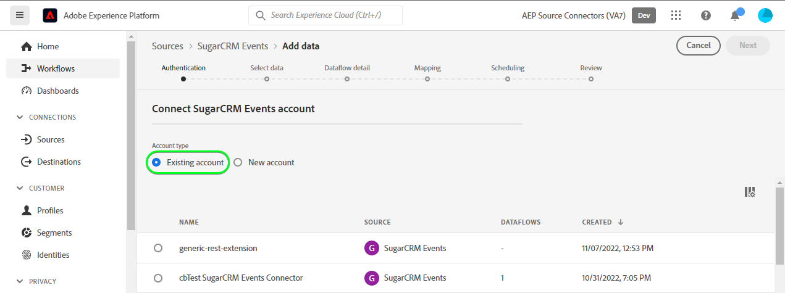

# Erstellen eines Quell-Connectors für [!DNL SugarCRM Events] in der Benutzeroberfläche

In diesem Tutorial finden Sie die Schritte zum Erstellen einer [!DNL SugarCRM Events]-Quellverbindung mithilfe der Benutzeroberfläche von Adobe Experience Platform.

## Erste Schritte

Dieses Tutorial setzt ein Grundverständnis der folgenden Komponenten von Experience Platform voraus:

* [[!DNL Experience Data Model (XDM)] System](../../../../../xdm/home.md): Das standardisierte Framework, mit dem [!DNL Experience Platform] Kundenerlebnisdaten organisiert.
   * [Grundlagen der Schemakomposition](../../../../../xdm/schema/composition.md): Machen Sie sich mit den grundlegenden Bausteinen von XDM-Schemata vertraut, einschließlich der wichtigsten Prinzipien und Best Practices bei der Schemaerstellung.
   * [Tutorial zum Schema-Editor](../../../../../xdm/tutorials/create-schema-ui.md): Erfahren Sie, wie Sie benutzerdefinierte Schemata mithilfe der Benutzeroberfläche des Schema-Editors erstellen können.
* [[!DNL Real-Time Customer Profile]](../../../../../profile/home.md): Bietet ein einheitliches Echtzeit-Kundenprofil, das auf aggregierten Daten aus verschiedenen Quellen basiert.

Wenn Sie bereits über ein gültiges [!DNL SugarCRM]-Konto verfügen, können Sie den Rest dieses Dokuments überspringen und mit dem Tutorial zum [Konfigurieren eines Datenflusses](../../dataflow/crm.md) fortfahren.

### Sammeln erforderlicher Anmeldedaten

Um [!DNL SugarCRM Events] mit Experience Platform zu verbinden, müssen Sie Werte für die folgenden Verbindungseigenschaften angeben:

| Anmeldedaten | Beschreibung | Beispiel |
| --- | --- | --- |
| `Host` | Der SugarCRM-API-Endpunkt, mit dem sich die Quelle verbindet. | `developer.salesfusion.com` |
| `Username` | Benutzername Ihres SugarCRM-Entwicklerkontos. | `abc.def@example.com@sugarmarketdemo000.com` |
| `Password` | Ihr SugarCRM-Entwicklerkonto-Passwort. | `123456789` |

### Erstellen eines Experience Platform-Schemas für [!DNL SugarCRM]

Bevor Sie eine [!DNL SugarCRM] Quellverbindung erstellen, müssen Sie auch sicherstellen, dass Sie zunächst ein Experience Platform-Schema erstellen, das für Ihre Quelle verwendet werden soll. Eine ausführliche Anleitung zum Erstellen [ Schemas finden Sie ](../../../../../xdm/schema/composition.md) Tutorial zum Erstellen eines Experience Platform-Schemas .

Screenshot der 

>[!WARNING]
>
>Stellen Sie beim Zuordnen des Schemas sicher, dass Sie auch die erforderlichen `event_id`- und `timestamp` für Experience Platform zuordnen.

## Verbinden Ihres [!DNL SugarCRM Events]-Kontos

Wählen Sie in der Experience Platform-Benutzeroberfläche **[!UICONTROL Quellen]** in der linken Navigationsleiste aus, um auf den Arbeitsbereich [!UICONTROL Quellen] zuzugreifen. Die [!UICONTROL Katalog] zeigt eine Vielzahl von Quellen an, mit denen Sie ein Konto erstellen können.

Sie können die gewünschte Kategorie aus dem Katalog auf der linken Bildschirmseite auswählen. Alternativ können Sie die gewünschte Quelle mithilfe der Suchoption finden.

Wählen Sie unter *CRM*-Kategorie **[!UICONTROL SugarCRM-Ereignisse]** und klicken Sie dann auf **[!UICONTROL Daten hinzufügen]**.

Die **[!UICONTROL Verbinden eines SugarCRM-]**-Kontos“ wird angezeigt. Auf dieser Seite können Sie entweder neue oder vorhandene Anmeldedaten verwenden.

### Vorhandenes Konto

Um ein vorhandenes Konto zu verwenden, wählen Sie das [!DNL SugarCRM Events]-Konto, mit dem Sie einen neuen Datenfluss erstellen möchten, und klicken Sie dann auf **[!UICONTROL Weiter]**, um fortzufahren.

### Neues Konto

Wenn Sie ein neues Konto erstellen, wählen Sie **[!UICONTROL Neues Konto]** und geben Sie dann einen Namen, eine optionale Beschreibung und Ihre -Anmeldeinformationen an. Wenn Sie fertig sind, wählen Sie **[!UICONTROL Mit Quelle verbinden]** und warten Sie, bis die neue Verbindung hergestellt ist.

## Nächste Schritte

Mithilfe dieses Tutorials haben Sie eine Verbindung zu Ihrem [!DNL SugarCRM Events]-Konto hergestellt. Sie können jetzt mit dem nächsten Tutorial fortfahren und [einen Datenfluss konfigurieren, um Daten in Experience Platform zu importieren](../../dataflow/crm.md).

## Zusätzliche Ressourcen

Die folgenden Abschnitte enthalten zusätzliche Ressourcen, auf die Sie bei Verwendung der [!DNL SugarCRM] verweisen können.

### Leitlinien {#guardrails}

Die [!DNL SugarCRM] API-Einschränkungsraten sind 90 Aufrufe pro Minute oder 2.000 Aufrufe pro Tag, je nachdem, was zuerst eintritt. Diese Einschränkung wurde jedoch umgangen, indem der Verbindungsspezifikation ein Parameter hinzugefügt wurde, der die Anfragezeit verzögert, sodass das Ratenlimit nie erreicht wird.

### Validierung {#validation}

Um zu überprüfen, ob Sie die Quelle richtig eingerichtet haben und [!DNL SugarCRM Events] Daten aufgenommen werden, führen Sie die folgenden Schritte aus:

* Wählen Sie in der Benutzeroberfläche von Experience Platform **[!UICONTROL Datenflüsse anzeigen]** neben dem [!DNL SugarCRM Events] im Quellkatalog aus. Wählen Sie als Nächstes **[!UICONTROL Vorschau des Datensatzes]** aus, um die aufgenommenen Daten zu überprüfen.

* Je nach Objekttyp, mit dem Sie arbeiten, können Sie die aggregierten Daten mit den Zahlen vergleichen, die auf der Seite &quot;[!DNL SugarMarket]-Ereignisse“ unten sichtbar sind:

>[!NOTE]
>
>Die [!DNL SugarMarket] Seiten enthalten nicht die Anzahl der gelöschten Objekte. Daten, die über diese Quelle abgerufen werden, enthalten jedoch auch die gelöschte Anzahl. Diese werden mit einer gelöschten Markierung markiert.
